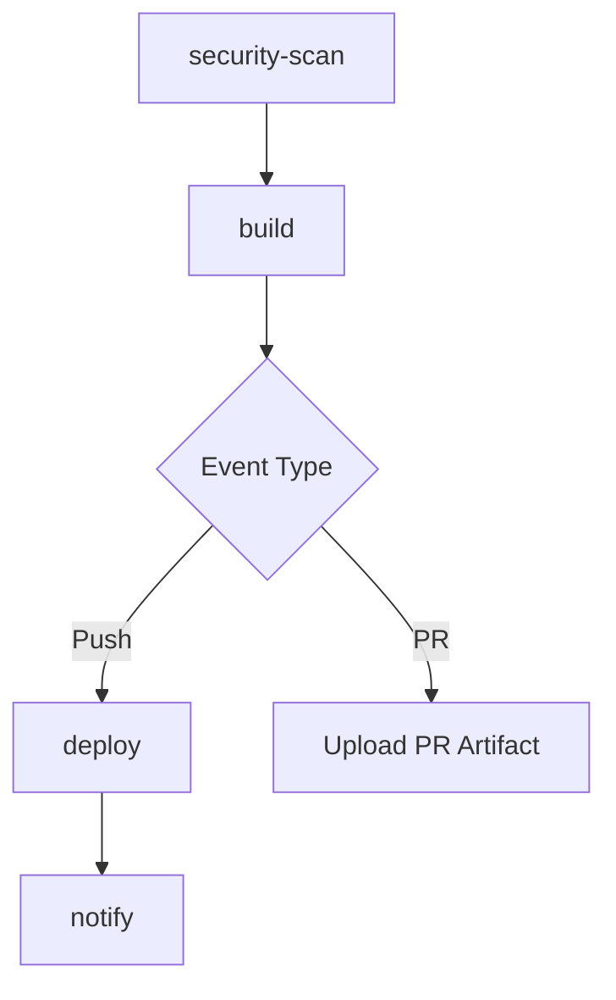

# GitHub Actions Workflows

This directory contains GitHub Actions workflows for CI/CD automation.

## Workflows

### deploy-docs.yml

Builds and deploys VitePress documentation to GitHub Pages with comprehensive quality checks and optional notifications.

#### Features

1. **Security Scanning**
   - Runs `npm audit` on documentation dependencies
   - Reports vulnerabilities as warnings
   - Continues build even if vulnerabilities found

2. **Build Caching**
   - Caches VitePress build artifacts (`.vitepress/.temp`, `.vitepress/cache`)
   - Speeds up subsequent builds
   - Cache key based on markdown and config file hashes

3. **Link Checking**
   - Validates all internal links in documentation
   - Runs `broken-link-checker` against built site
   - Reports broken links as warnings without failing build

4. **PR Preview Support**
   - Builds documentation for pull requests
   - Uploads PR build as artifact (`pr-preview-{number}`)
   - Artifacts retained for 7 days

5. **Deployment Notifications** (Optional)
   - Sends Slack notifications on deployment success/failure
   - Includes repository, branch, commit, and deployment URL
   - Gracefully skips if not configured

6. **Build Verification**
   - Validates build output directory exists
   - Checks for index.html presence
   - Fails early if build incomplete

#### Triggers

- **Push**: Triggered on `main` and `Feb2026` branches when:
  - Files in `docs/**` change
  - `docs/package.json` changes
  - Workflow file changes
  - `CHANGELOG.md` changes

- **Pull Request**: Triggered on PRs to `main` when:
  - Files in `docs/**` change
  - `docs/package.json` changes

- **Manual**: Can be triggered manually via `workflow_dispatch`

#### Configuration

##### Optional: Slack Notifications

To enable Slack notifications:

1. Create a Slack incoming webhook:
   - Go to your Slack workspace settings
   - Navigate to **Apps & Integrations**
   - Search for and add **Incoming Webhooks**
   - Create a webhook URL for your desired channel

2. Add the webhook to GitHub secrets:
   - Go to repository **Settings** → **Secrets and variables** → **Actions**
   - Click **New repository secret**
   - Name: `SLACK_WEBHOOK_URL`
   - Value: Your Slack webhook URL (format: `https://hooks.slack.com/services/YOUR_WORKSPACE_ID/YOUR_CHANNEL_ID/YOUR_TOKEN`)

If the secret is not configured, the notification step will display a message and continue gracefully.

##### Branch Management

The workflow currently deploys from two branches:
- `main` - Primary stable branch
- `Feb2026` - Feature preview branch for February 2026 release

Remove `Feb2026` from the workflow once the feature branch is merged.

#### Workflow Jobs

1. **security-scan**
   - Audits npm dependencies
   - Reports vulnerabilities
   - Does not block build

2. **build**
   - Checks out repository with full history
   - Caches VitePress build artifacts
   - Installs dependencies
   - Builds documentation
   - Verifies build output
   - Checks for broken links
   - Uploads artifacts (Pages or PR preview)

3. **deploy** (Push events only)
   - Deploys to GitHub Pages
   - Outputs deployment URL

4. **notify** (Push events only)
   - Sends deployment notification (if configured)
   - Runs regardless of deploy status

#### Permissions

- `contents: read` - Read repository files
- `pages: write` - Deploy to GitHub Pages
- `id-token: write` - OIDC token for Pages deployment

#### Performance Optimizations

- **npm caching**: Automatic via `actions/setup-node@v4`
- **VitePress caching**: Custom cache for build artifacts
- **Shallow clone**: Disabled (`fetch-depth: 0`) for lastUpdated feature

#### Troubleshooting

**Build fails with "Build output directory not found"**
- Check that `npm run docs:build` succeeds locally
- Verify `docs/.vitepress/dist` is created by build script

**Broken links detected**
- Review build logs for specific broken links
- This is a warning only and won't fail the build
- Fix links in source markdown files

**Slack notification not working**
- Verify `SLACK_WEBHOOK_URL` secret is configured
- Test webhook URL with curl: `curl -X POST -d '{"text":"test"}' YOUR_WEBHOOK_URL`
- Check Slack app permissions

**PR preview not accessible**
- Download artifact from workflow run: **Actions** → Select run → **Artifacts** section
- Extract and open `index.html` locally

### cross-platform-tests.yml

Runs test suite across multiple operating systems and Node.js versions.

#### Matrix Strategy

- **Operating Systems**: Ubuntu, Windows, macOS
- **Node.js Versions**: 20.x, 22.x, 24.x

See workflow file for complete configuration.

## Best Practices

1. **Keep workflows DRY**: Use reusable workflows for common patterns
2. **Use caching**: Speed up builds with dependency and build caching
3. **Fail gracefully**: Use `continue-on-error` for non-critical steps
4. **Secure secrets**: Never echo secrets in logs, use GitHub secrets
5. **Test locally**: Validate workflow changes with act or local testing
6. **Monitor costs**: Review Actions usage in repository Insights

## References

- [GitHub Actions Documentation](https://docs.github.com/en/actions)
- [VitePress Deployment Guide](https://vitepress.dev/guide/deploy)
- [GitHub Pages Deployment Action](https://github.com/actions/deploy-pages)
