# SAP HANA CLI Command Structure Reference

This document provides visual diagrams and quick reference guides for the most commonly used hana-cli commands. Each command diagram shows the command structure, parameters, and typical usage patterns.

## Table of Contents

- [Connection Commands](#connection-commands)
- [Data Operations](#data-operations)
- [Database Inspection](#database-inspection)
- [HDI Container Management](#hdi-container-management)
- [Backup & Recovery](#backup--recovery)
- [Performance Analysis](#performance-analysis)
- [Mass Operations](#mass-operations)
- [Cloud Integration](#cloud-integration)

---

## Connection Commands

### connect

**Purpose**: Establish and save connection to SAP HANA database

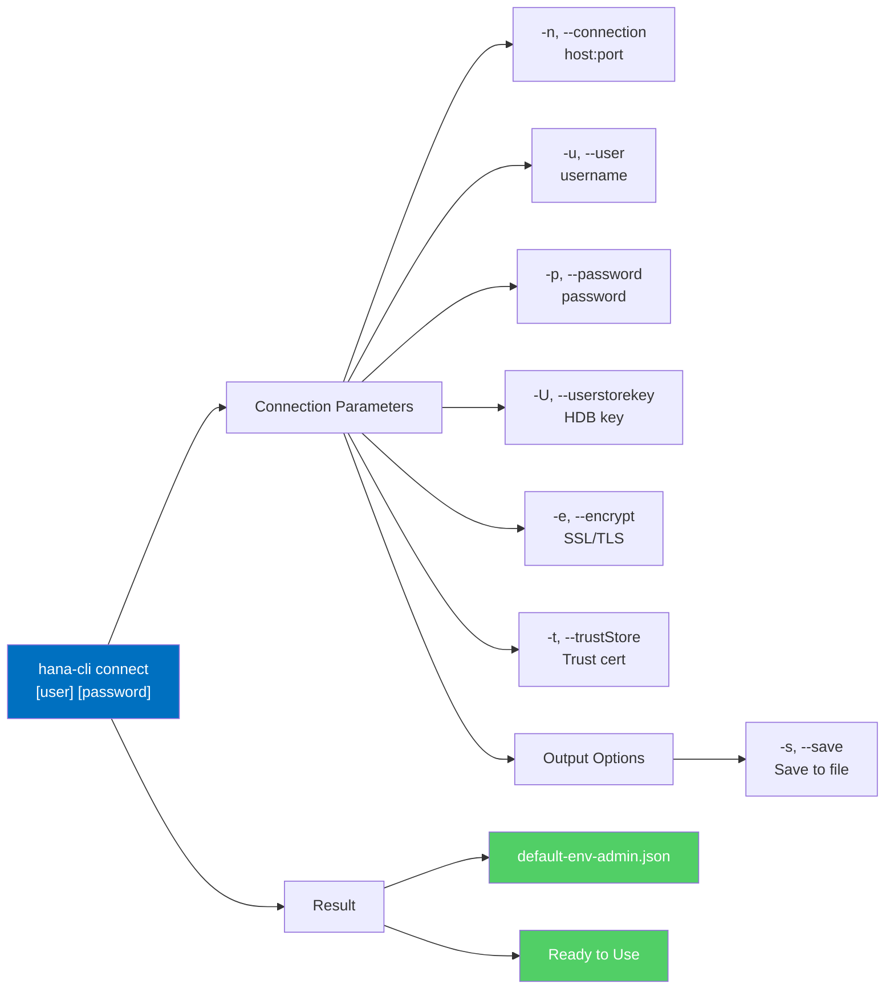

**Connection Quick Examples**:

```bash
# Interactive connection (prompts for details)
hana-cli connect

# Direct connection with credentials
hana-cli connect -n localhost:30013 -u DBUSER -p mypassword -s

# Using HDB Userstore key
hana-cli connect -U MYHDBKEY -s
```

**Aliases**: `c`, `login`

---

### copy2DefaultEnv

**Purpose**: Convert .env file to default-env.json format


---

## Data Operations

### export

**Purpose**: Export data from tables/views to file

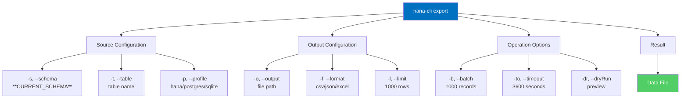

**Export Quick Examples**:

```bash
# Export table to CSV (default)
hana-cli export -t CUSTOMERS -s SALES

# Export to JSON with limit
hana-cli export -t PRODUCTS -f json -l 500 -o products.json

# Dry-run preview without saving
hana-cli export -t ORDERS -f csv --preview

# Export from specific profile
hana-cli export -t TABLE -p production
```

**Aliases**: `exp`, `exportData`

---

### import

**Purpose**: Import data from file into table

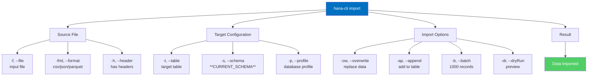

**Import Quick Examples**:

```bash
# Import CSV file with headers
hana-cli import -f users.csv -t USERS -h

# Import JSON and append to existing data
hana-cli import -f orders.json -t ORDERS -ap

# Import with dry-run preview
hana-cli import -f data.csv -t MYTABLE --preview

# Import specific number of records
hana-cli import -f large.csv -t TABLE -l 1000
```

**Aliases**: `imp`, `importData`

---

### tableCopy

**Purpose**: Copy table structure or data between tables/schemas

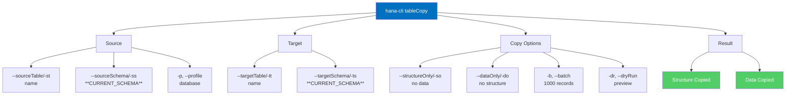

**Table Copy Quick Examples**:

```bash
# Copy structure only (no data)
hana-cli tableCopy --sourceTable ORDERS --targetTable ORDERS_ARCHIVE -so

# Copy data only to existing table
hana-cli tableCopy --sourceTable TABLE1 --targetTable TABLE2 -do

# Copy between schemas
hana-cli tableCopy -st PROD.CUSTOMERS -tt DEV.CUSTOMERS

# Copy with preview
hana-cli tableCopy --sourceTable ORDERS --targetTable ORDERS_BKP --preview
```

**Aliases**: `tc`, `copyTable`

---

### dataSync

**Purpose**: Synchronize data between source and target

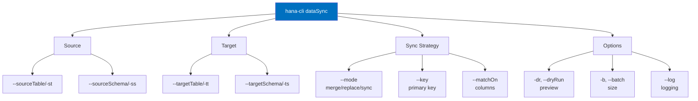

---

## Database Inspection

### tables

**Purpose**: List tables in current or specified schema

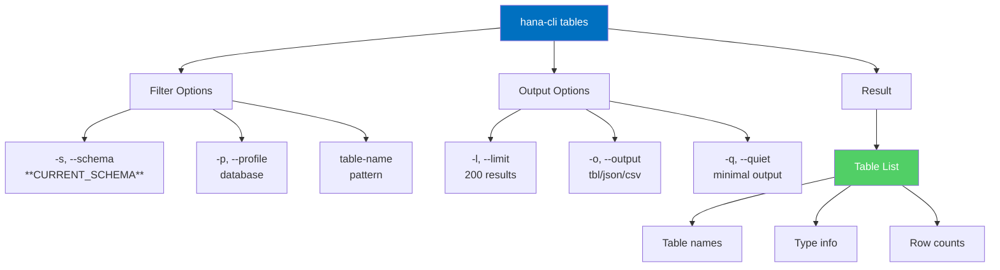

**Quick Examples**:

```bash
# List all tables in current schema
hana-cli tables

# List tables in specific schema
hana-cli tables -s PRODUCTION

# List with limit and JSON output
hana-cli tables -l 50 -o json

# Search for specific pattern
hana-cli tables CUST*
```

**Aliases**: `t`, `tbl`, `listTables`

---

### inspectTable

**Purpose**: Detailed inspection of table structure and metadata

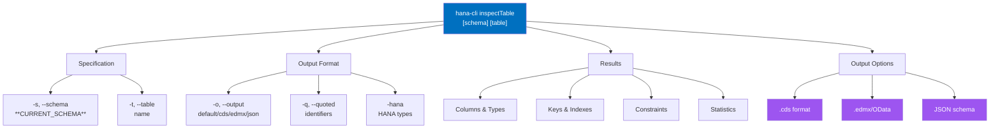

**Quick Examples**:

```bash
# Inspect table (default output)
hana-cli inspectTable -s MYSCHEMA -t CUSTOMERS

# Get as CDS entity
hana-cli inspectTable MYSCHEMA CUSTOMERS -o cds

# Get as OData/EDMX
hana-cli inspectTable MYSCHEMA CUSTOMERS -o edmx

# Get as JSON schema
hana-cli inspectTable -t ORDERS -o json
```

**Aliases**: `it`, `inspectTable`, `table`

---

### views

**Purpose**: List views in schema

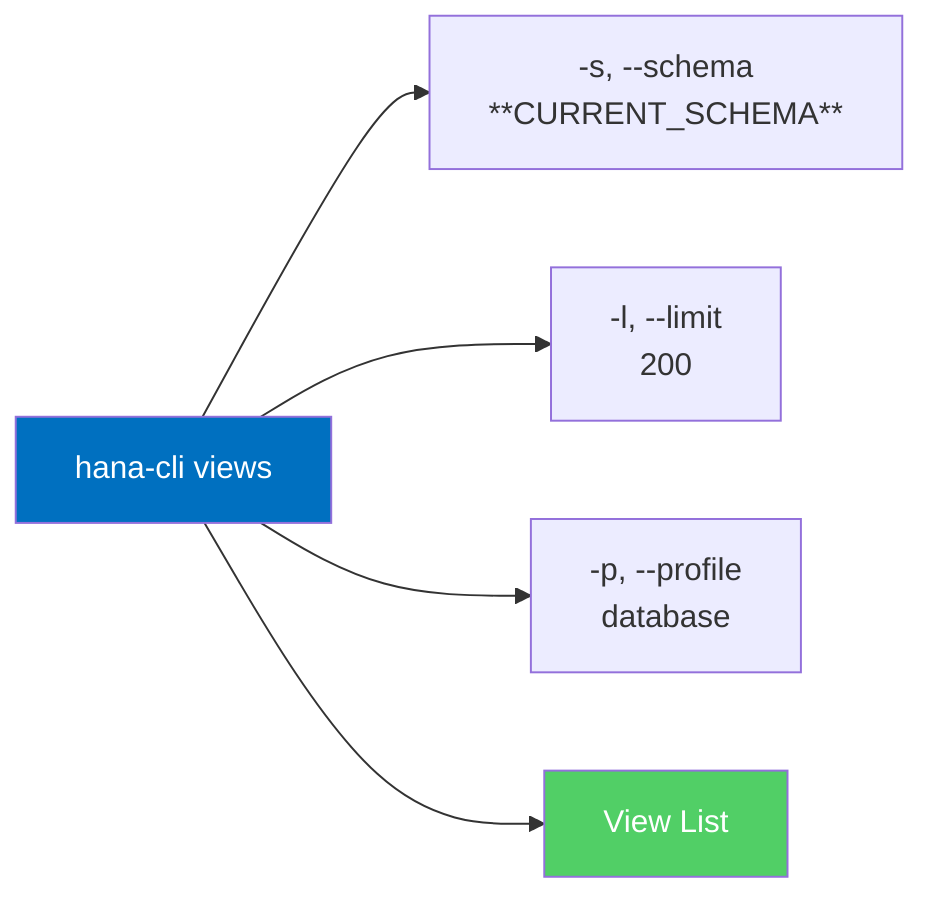

**Aliases**: `v`, `listViews`

---

### procedures

**Purpose**: List stored procedures in schema

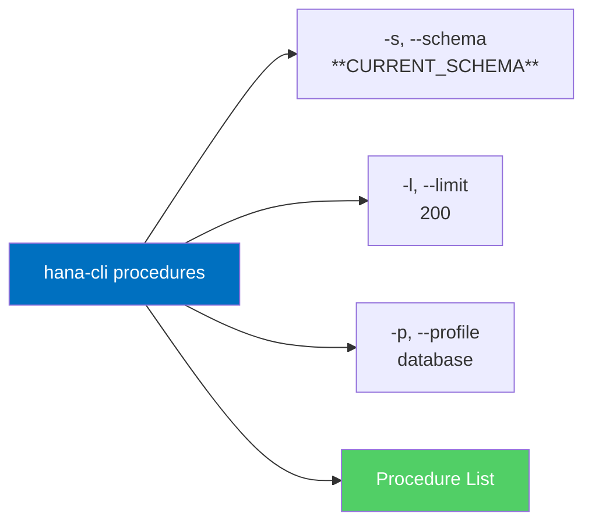

**Aliases**: `proc`, `sp`, `listProcedures`

---

## HDI Container Management

### containers

**Purpose**: List HDI containers

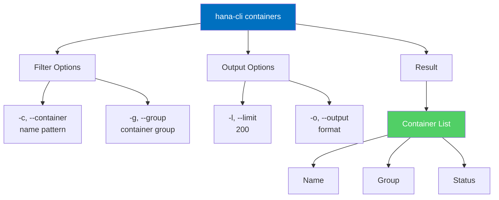

**Quick Examples**:

```bash
# List all containers
hana-cli containers

# List specific container group
hana-cli containers -g MYGROUP

# Search with pattern
hana-cli containers -c "DEV*"
```

**Aliases**: `cont`, `listContainers`

---

### createContainer

**Purpose**: Create new HDI container

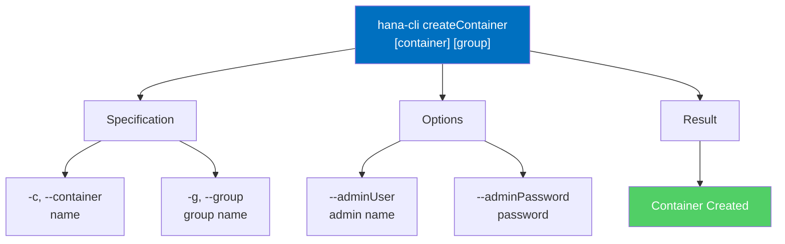

**Quick Examples**:

```bash
# Create container in default group
hana-cli createContainer MYCONTAINER

# Create with specific group
hana-cli createContainer MYCONTAINER -g MYGROUP

# Create with admin user
hana-cli createContainer HC01 -g APPS --adminUser ADMIN
```

**Aliases**: `cc`, `createHDI`

---

## Backup & Recovery

### backup

**Purpose**: Create backups of tables, schemas, or databases

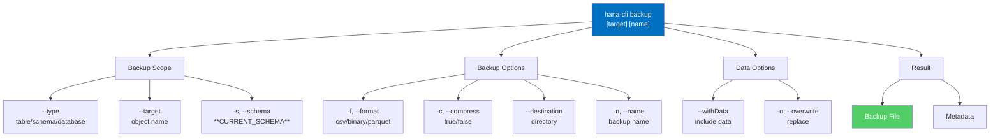

**Quick Examples**:

```bash
# Backup a table
hana-cli backup -t CUSTOMERS -s SALES

# Backup entire schema
hana-cli backup PRODUCTION --type schema

# Backup with compression
hana-cli backup -t TABLE -f csv -c true -d ./backups

# Backup without data
hana-cli backup MYSCHEMA --type schema --withData false
```

**Aliases**: `bkp`, `createBackup`

---

### restore

**Purpose**: Restore from backup

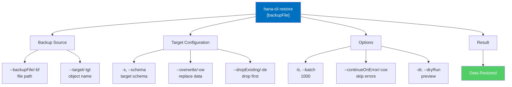

**Quick Examples**:

```bash
# Restore from backup file
hana-cli restore --backupFile customers.csv -t CUSTOMERS

# Restore with overwrite
hana-cli restore --backupFile ./backups/data.csv -t TABLE -ow

# Restore to different schema
hana-cli restore --backupFile backup.csv -t TABLE -s ALTERNATIVE_SCHEMA

# Dry-run restore
hana-cli restore --backupFile data.csv -t TABLE --preview
```

**Aliases**: `rst`, `restoreBackup`

---

## Performance Analysis

### queryPlan

**Purpose**: Visualize SQL query execution plan

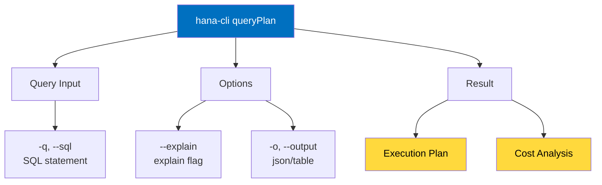

**Quick Examples**:

```bash
# Analyze query execution plan
hana-cli queryPlan -q "SELECT * FROM CUSTOMERS WHERE ID = 1"

# Get JSON output
hana-cli queryPlan --sql "SELECT * FROM ORDERS" -o json
```

---

### alerts

**Purpose**: View database alerts and warnings

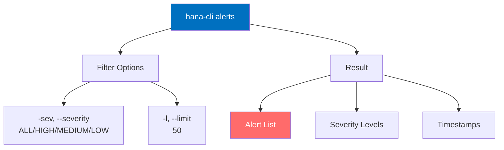

**Quick Examples**:

```bash
# List all alerts
hana-cli alerts

# Show only high severity
hana-cli alerts -sev HIGH

# Limit to 20 results
hana-cli alerts -l 20
```

**Aliases**: `alrt`, `alert`

---

### tableHotspots

**Purpose**: Identify frequently accessed tables

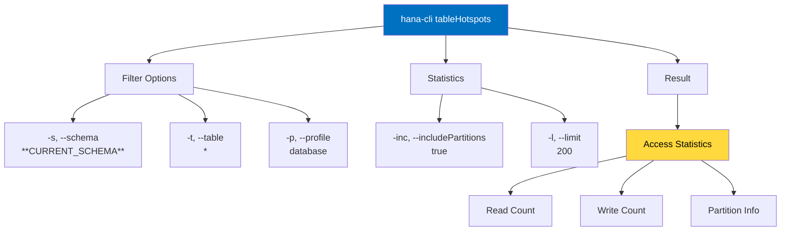

---

## Mass Operations

### massConvert

**Purpose**: Bulk convert tables to different formats

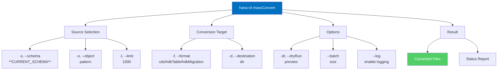

**Quick Examples**:

```bash
# Convert tables to CDS format (preview)
hana-cli massConvert -s MYSCHEMA -f cds --preview

# Convert to HDBTable format
hana-cli massConvert -s PRODUCTION -f hdbTable -d ./artifacts

# Convert specific tables by pattern
hana-cli massConvert -o "CUST*" -f cds
```

**Aliases**: `mc`, `massConvertUI`

---

### massGrant

**Purpose**: Grant permissions on multiple objects

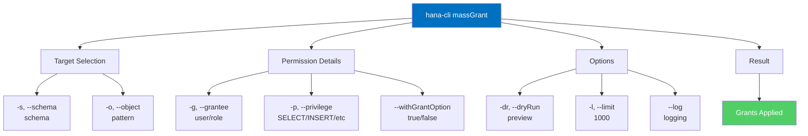

**Quick Examples**:

```bash
# Grant SELECT to user (preview)
hana-cli massGrant -s MYSCHEMA -o CUST* -g DEVELOPER -p SELECT --preview

# Grant with grant option enabled
hana-cli massGrant -s SCHEMA -g ADMIN -p "SELECT,INSERT" --withGrantOption

# Apply grants with logging
hana-cli massGrant -o "TABLE*" -g USERS -p SELECT --log
```

**Aliases**: `mg`, `massPermission`

---

### massDelete

**Purpose**: Delete rows from multiple tables

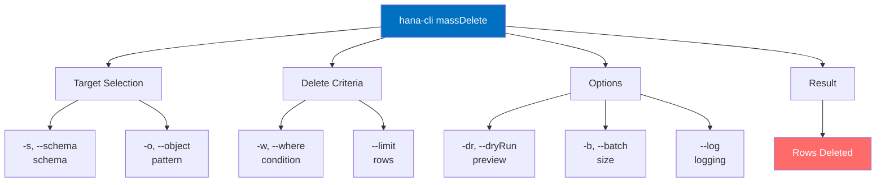

**Quick Examples**:

```bash
# Delete old records (preview)
hana-cli massDelete -o "ARCHIVE_*" -w "CREATE_DATE < '2023-01-01'" --preview

# Delete with batch processing
hana-cli massDelete -s STAGING -o TEMP* -b 500
```

**Aliases**: `md`, `massRemove`

---

## Cloud Integration

### btp

**Purpose**: Set BTP target for commands

```mermaid
graph TB
    A["hana-cli btp"] --> B["Target Level"]
    B --> B1["Global Account"]
    B --> B2["Directory"]
    B --> B3["Subaccount"]
    
    A --> C["Configuration"]
    C --> C1["--subaccount/-sa<br/>account ID"]
    C --> C2["--directory<br/>directory ID"]
    
    A --> D["Result"]
    D --> E["BTP Context Set"]
    D --> F["Ready for BTP Commands"]
    
    style A fill:#0070C0,color:#fff
    style E fill:#51CF66,color:#fff
    style F fill:#51CF66,color:#fff
```

**Quick Examples**:

```bash
# Set subaccount target
hana-cli btp --subaccount myaccount

# Set directory target
hana-cli btp --directory mydirectory

# Show current BTP context
hana-cli btpInfo
```

**Aliases**: None

---

### activateHDI

**Purpose**: Activate HDI service in tenant

```mermaid
graph LR
    A["hana-cli activateHDI"] --> B["-t, --tenant<br/>tenant ID"]
    A --> C["Note: Must run in SYSTEMDB"]
    B --> D["HDI Activated"]
    
    style A fill:#0070C0,color:#fff
    style D fill:#51CF66,color:#fff
```

**Aliases**: `ahdi`, `ah`

---

## Command Pattern Reference

### List Commands Pattern

All list commands follow this standard pattern:

```mermaid
graph LR
    A["hana-cli [command]"] --> B["Filters"]
    B --> B1["-s, --schema<br/>**CURRENT_SCHEMA**"]
    B --> B2["-p, --profile<br/>database profile"]
    B --> B3["pattern<br/>optional pattern"]
    
    A --> C["Output"]
    C --> C1["-l, --limit<br/>200 (default)"]
    C --> C2["-o, --output<br/>tbl/json/csv"]
    C --> C3["--quiet<br/>minimal"]
    
    A --> D["Result"]
    D --> E["Filtered List"]
    
    style A fill:#0070C0,color:#fff
    style E fill:#51CF66,color:#fff
```

**Applies to**: `tables`, `views`, `procedures`, `functions`, `indexes`, `schemas`, `users`, `roles`, `sequences`, `synonyms`, `partitions`, `columnStats`, `spatialData`, `ftIndexes`, `graphWorkspaces`, `tableHotspots`, `tableGroups`, `calcViewAnalyzer`

---

### Data Operation Pattern

All data operations follow this standard pattern:

```mermaid
graph TD
    A["hana-cli [operation]"] --> B["Source/Target"]
    B --> B1["--source*<br/>source location"]
    B --> B2["--target*<br/>target location"]
    
    A --> C["Data Configuration"]
    C --> C1["-f, --format<br/>format type"]
    C --> C2["-l, --limit<br/>row limit"]
    C --> C3["-b, --batch<br/>batch size"]
    
    A --> D["Safety Options"]
    D --> D1["-dr, --dryRun<br/>preview"]
    D --> D2["--timeout<br/>3600 sec"]
    D --> D3["-p, --profile<br/>database"]
    
    A --> E["Result"]
    E --> E1["Operation Completed"]
    
    style A fill:#0070C0,color:#fff
    style E1 fill:#51CF66,color:#fff
```

**Applies to**: `export`, `import`, `dataSync`, `compareData`, `compareSchema`, `tableCopy`, `dataProfile`, `dataDiff`, `duplicateDetection`

---

### Parameter Inheritance Hierarchy

```mermaid
graph TD
    A["Global Parameters"] --> A1["-a, --admin"]
    A --> A2["--conn<br/>connection file"]
    A --> A3["-d, --debug"]
    A --> A4["--quiet"]
    
    A --> B["Standard Parameters"]
    B --> B1["-s, --schema"]
    B --> B2["-l, --limit"]
    B --> B3["-o, --output"]
    B --> B4["-p, --profile"]
    
    A --> C["Command-Specific"]
    C --> C1["Various parameters"]
    C --> C2["Depends on command"]
    
    A1 -->|applies to all| D["Any Command"]
    B1 -->|applies to many| D
    C1 -->|applies to specific| D
    
    style A fill:#0070C0,color:#fff
    style B fill:#9D55F0,color:#fff
    style C fill:#FF6B6B,color:#fff
```

---

## Quick Command Selection Guide

```mermaid
graph TD
    A["What do you want to do?"] --> B{Command Type}
    
    B -->|List Objects| C["tables, views, procedures<br/>functions, indexes, schemas<br/>users, roles, sequences<br/>synonyms, partitions"]
    
    B -->|Inspect Objects| D["inspectTable, inspectView<br/>inspectProcedure<br/>inspectFunction<br/>inspectIndex"]
    
    B -->|Data Operations| E["export, import<br/>tableCopy, dataSync<br/>compareData"]
    
    B -->|Performance Analysis| F["queryPlan, tableHotspots<br/>alerts, blocking, longRunning<br/>expensiveStatements"]
    
    B -->|Mass Operations| G["massConvert, massGrant<br/>massDelete, massUpdate<br/>massExport"]
    
    B -->|Backup/Recovery| H["backup, backupList<br/>backupStatus, restore"]
    
    B -->|Cloud Integration| I["btp, btpInfo<br/>activateHDI<br/>containers, hdi"]
    
    B -->|Connection| J["connect, copy2DefaultEnv<br/>copy2Env, serviceKey"]
    
    C --> K["See table/view<br/>names & count"]
    D --> L["See structure<br/>columns, types<br/>keys, indexes"]
    E --> M["Move/copy<br/>data between<br/>locations"]
    F --> N["Find<br/>performance<br/>issues"]
    G --> O["Apply<br/>operations to<br/>multiple objects"]
    H --> P["Backup and<br/>recovery<br/>operations"]
    I --> Q["Cloud & BTP<br/>operations"]
    J --> R["Setup & manage<br/>connections"]
    
    style A fill:#0070C0,color:#fff
    style B fill:#FF6B6B,color:#fff
    style C fill:#51CF66,color:#fff
    style D fill:#51CF66,color:#fff
    style E fill:#51CF66,color:#fff
    style F fill:#51CF66,color:#fff
    style G fill:#51CF66,color:#fff
    style H fill:#51CF66,color:#fff
    style I fill:#51CF66,color:#fff
    style J fill:#51CF66,color:#fff
```

---

## Parameter Quick Reference

### Common Parameters Used Across Commands

| Parameter | Alias | Type | Default | Description |
| --------- | ----- | ------ | --------- | ----------- |
| `--admin` | `-a` | boolean | false | Use admin credentials |
| `--conn` | — | string | — | Connection file override |
| `--schema` | `-s` | string | `**CURRENT_SCHEMA**` | Target schema |
| `--profile` | `-p` | string | — | Database profile |
| `--limit` | `-l` | number | 200 (lists) / 1000 (data) | Limit results |
| `--output` | `-o` | string | tbl | Output format |
| `--dryRun` | `-dr`, `--preview` | boolean | false | Preview without executing |
| `--format` | `-f` | string | csv | Output/input format |
| `--batchSize` | `-b`, `--batch` | number | 1000 | Records per batch |
| `--timeout` | `-to` | number | 3600 | Operation timeout (sec) |
| `--debug` | `-d` | boolean | false | Debug output |
| `--quiet` | `--disableVerbose` | boolean | false | Minimal output |

---

## Getting More Information

For detailed documentation on any command, use:

```bash
# Show help for specific command
hana-cli [command] --help
hana-cli [command] -h

# Show overall help
hana-cli --help
hana-cli help

# See all available commands
hana-cli
```

---

## Links to Related Documentation

- [Main README](README.md) - Overview and features
- [Utils Documentation](utils/README.md) - Internal utilities
- [Routes Documentation](routes/README.md) - HTTP API endpoints
- [Swagger/OpenAPI](http://localhost:3010/api-docs) - Interactive API docs
- [Web Applications](app/README.md) - Web UI documentation
