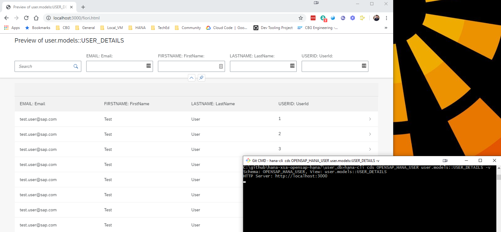

# SAP HANA Developer Command Line Interface

[](https://api.reuse.software/info/github.com/SAP-samples/hana-developer-cli-tool-example)
[](https://badges.pufler.dev)
[](https://badges.pufler.dev)

[](https://badges.pufler.dev)

The [change log](CHANGELOG.md) describes notable changes in this package.

## Description

This sample is intended to shown how one could build a developer-centric SAP HANA command line tool, particularly designed to be used when performing local SAP HANA development in non-SAP tooling (like VSCode). It utilizes the default-env.json that is often used in local development for connectivity to a remote SAP HANA DB (although it can of course be used with a local SAP HANA, express edition instance as well). There is no intention to replacing the hdbsql tool as a generic SQL console. Instead this sample will focus on simplifying and grouping common and complex commands that otherwise might a lot of separate scripts.

Introduction Video: [https://youtu.be/dvVQfi9Qgog](https://youtu.be/dvVQfi9Qgog)

However the tool isn't limited to only local development. It also works well when developing in the cloud. The hana-cli tool can also run well from a cloud shell in the SAP Business Application Studio, Google Cloud Shell, AWS Cloud9, etc. We can also run against a SAP HANA service for SAP BTP or SAP HANA Cloud instance. This demonstrates that the tool can run just about anywhere you can get a command line that has access to the Node.js Runtime.  We can also connect to a remote HANA instance even if it isn't running in the same cloud environment in which we are performing our development tasks.

Running in Cloud Shells Video: [https://youtu.be/L7QyVLvAIIQ](https://youtu.be/L7QyVLvAIIQ)

## Requirements / Download and Installation

If you would rather just access the tool directly, it is now available in npm as well. You can install via:

```shell
npm install -g hana-cli
```

Otherwise you can also run it from the sources as described here:

* Install Node.js version 12.x or 14.x on your development machine [https://nodejs.org/en/download/](https://nodejs.org/en/download/)

* @sap Node.js packages have moved from https://npm.sap.com to the default registry https://registry.npmjs.org. As future versions of @sap modules are going to be published only there, please make sure to adjust your registry with:

```shell
npm config delete @sap:registry
```

* Clone the repository from [https://github.com/SAP-samples/hana-developer-cli-tool-example](https://github.com/SAP-samples/hana-developer-cli-tool-example)

```shell
git clone https://github.com/SAP-samples/hana-developer-cli-tool-example
```

* Run NPM install from the root of the hana-developer-cli-tool-example project you just cloned to download dependencies

```shell
npm install
```

* Run NPM link from the cloned project root to make the hana-cli command available from everywhere [https://docs.npmjs.com/cli/link](https://docs.npmjs.com/cli/link)

```shell
npm link
```

[](https://asciinema.org/a/301560)

## Security

This application primarily uses the default-env.json that is often used in local development for connectivity to a remote HANA DB (although it can of course be used with a local SAP HANA, express edition instance as well). For more details on how the default-env.json works, see the readme.md of the @sap/xsenv package or the @sap/hdi-deploy package.

The tool doesn't simply look for a default-env.json file in the current directory however. There are numerous options and places it will look for the connection parameters. Here is the order in which it checks:

  - First we look for the Admin option and use a default-env-admin.json - this overrides all other parameters
  - If no admin option or if there was an admin option but no default-env-admin.json could be found in this directory or 5 parent directories then look for a .env file in this directory or up to 5 parent directories
  - No .env file found or it doesn't contain a VCAP_SERVICES section, then check to see if the --conn parameter was specified. If so check for that file in the current directory or up to 5 parent directories
  - If the file specified via the --conn parameter wasn't found locally then check for it in the ${homedir}/.hana-cli/ folder
  - If no specific configuration file was was found then look for a file named default-env.json in the current directory or up to 5 parent directories
  - Last resort if nothing has been found up to this point - look for a file named default.json in the ${homedir}/.hana-cli/ folder

## Examples

A lot of the functionality of this tool revolves around typical tasks you face while doing HANA database development.
For example you might want to get a list of all views in your current schema/container:

```shell
C:\github\hana-xsa-opensap-hana7\user_db>hana-cli views
Schema: OPENSAP_HANA_USER, View: *
SCHEMA_NAME        VIEW_NAME                                    VIEW_OID  COMMENTS
-----------------  -------------------------------------------  --------  ------------
OPENSAP_HANA_USER  user.models::USER_DETAILS                    171133    USER_DETAILS
OPENSAP_HANA_USER  user.models::USER_DETAILS/hier/USER_DETAILS  171139    null
```

Then perhaps you want to inspect a view to see the columns and their data types:

```shell
C:\github\hana-xsa-opensap-hana7\user_db>hana-cli view * user.models::USER_DETAILS
Schema: %, View: user.models::USER_DETAILS
{ SCHEMA_NAME: 'OPENSAP_HANA_USER',
  VIEW_NAME: 'user.models::USER_DETAILS',
  VIEW_OID: 171133,
  COMMENTS: 'USER_DETAILS',
  IS_COLUMN_VIEW: 'TRUE',
  VIEW_TYPE: 'CALC',
  HAS_STRUCTURED_PRIVILEGE_CHECK: 'TRUE',
  HAS_PARAMETERS: 'TRUE',
  HAS_CACHE: 'NONE',
  CREATE_TIME: '2019-07-30 13:14:15.594000000' }


SCHEMA_NAME        VIEW_NAME                  VIEW_OID  COLUMN_NAME  POSITION  DATA_TYPE_NAME  OFFSET  LENGTH  SCALE  IS_NULLABLE  DEFAULT_VALUE  CS_DATA_TYPE_NAME  COLUMN_ID  COMMENTS
-----------------  -------------------------  --------  -----------  --------  --------------  ------  ------  -----  -----------  -------------  -----------------  ---------  ---------
OPENSAP_HANA_USER  user.models::USER_DETAILS  171133    EMAIL        1         NVARCHAR        0       255     null   TRUE         null           STRING             171135     Email
OPENSAP_HANA_USER  user.models::USER_DETAILS  171133    FIRSTNAME    2         NVARCHAR        0       40      null   TRUE         null           STRING             171136     FirstName
OPENSAP_HANA_USER  user.models::USER_DETAILS  171133    LASTNAME     3         NVARCHAR        0       40      null   TRUE         null           STRING             171137     LastName
OPENSAP_HANA_USER  user.models::USER_DETAILS  171133    USERID       4         INTEGER         0       10      0      TRUE         null           INT                171138     UserId
```

But there are multiple output options for inspection. Perhaps you are using Cloud Application Programming Model and need to create a proxy entity in CDS for a view. This tool will read the catalog metadata and convert it to CDS:

```shell
C:\github\hana-xsa-opensap-hana7\user_db>hana-cli view OPENSAP_HANA_USER user.models::USER_DETAILS -o cds
Schema: OPENSAP_HANA_USER, View: user.models::USER_DETAILS
@cds.persistence.exists
Entity user_modelsUSER_DETAILS {
 key    "EMAIL": String(255) null  @title: 'EMAIL: Email' ;
key     "FIRSTNAME": String(40) null  @title: 'FIRSTNAME: FirstName' ;
key     "LASTNAME": String(40) null  @title: 'LASTNAME: LastName' ;
key     "USERID": Integer null  @title: 'USERID: UserId' ;
}
```

Or maybe you are service enabling this view and you want to see it converted to EDMX:

```shell
C:\github\hana-xsa-opensap-hana7\user_db>hana-cli view OPENSAP_HANA_USER user.models::USER_DETAILS -o edmx
Schema: OPENSAP_HANA_USER, View: user.models::USER_DETAILS
<?xml version="1.0" encoding="utf-8"?>
<edmx:Edmx Version="1.0" xmlns:edmx="http://schemas.microsoft.com/ado/2007/06/edmx" xmlns:m="http://schemas.microsoft.com/ado/2007/08/dataservices/metadata" xmlns:sap="http://www.sap.com/Protocols/SAPData">
  <edmx:Reference Uri="https://wiki.scn.sap.com/wiki/download/attachments/448470974/Common.xml?api=v2" xmlns:edmx="http://docs.oasis-open.org/odata/ns/edmx">
    <edmx:Include Alias="Common" Namespace="com.sap.vocabularies.Common.v1"/>
  </edmx:Reference>
  <edmx:DataServices m:DataServiceVersion="2.0">
    <Schema Namespace="HanaCli" xmlns="http://schemas.microsoft.com/ado/2008/09/edm">
      <EntityContainer Name="EntityContainer" m:IsDefaultEntityContainer="true">
        <EntitySet Name="user_modelsUSER_DETAILS" EntityType="HanaCli.user_modelsUSER_DETAILS"/>
      </EntityContainer>
      <EntityType Name="user_modelsUSER_DETAILS">
        <Key>
          <PropertyRef Name="EMAIL"/>
          <PropertyRef Name="FIRSTNAME"/>
          <PropertyRef Name="LASTNAME"/>
          <PropertyRef Name="USERID"/>
        </Key>
        <Property Name="EMAIL" Type="Edm.String" MaxLength="255"/>
        <Property Name="FIRSTNAME" Type="Edm.String" MaxLength="40"/>
        <Property Name="LASTNAME" Type="Edm.String" MaxLength="40"/>
        <Property Name="USERID" Type="Edm.Int32"/>
      </EntityType>
      <Annotations Target="HanaCli.user_modelsUSER_DETAILS/EMAIL" xmlns="http://docs.oasis-open.org/odata/ns/edm">
        <Annotation Term="Common.Label" String="EMAIL: Email"/>
      </Annotations>
      <Annotations Target="HanaCli.user_modelsUSER_DETAILS/FIRSTNAME" xmlns="http://docs.oasis-open.org/odata/ns/edm">
        <Annotation Term="Common.Label" String="FIRSTNAME: FirstName"/>
      </Annotations>
      <Annotations Target="HanaCli.user_modelsUSER_DETAILS/LASTNAME" xmlns="http://docs.oasis-open.org/odata/ns/edm">
        <Annotation Term="Common.Label" String="LASTNAME: LastName"/>
      </Annotations>
      <Annotations Target="HanaCli.user_modelsUSER_DETAILS/USERID" xmlns="http://docs.oasis-open.org/odata/ns/edm">
        <Annotation Term="Common.Label" String="USERID: UserId"/>
      </Annotations>
    </Schema>
  </edmx:DataServices>
</edmx:Edmx>
```

This tool will even create a temporary OData V4 service for any existing table, view or Calculation View and launch a test Fiori Ui locally.


## Commands

### activateHDI

```shell
hana-cli activateHDI [tenant]
[aliases: ahdi, ah]
Activate the HDI service in a particluar SAP HANA Tenant (Must be ran in the
SYSTEMDB)

Connection Parameters:
  -a, --admin, --Admin  Connect via admin (default-env-admin.json)
                                                      [boolean] [default: false]
      --conn            Connection Filename to override default-env.json

Troubleshooting:
      --disableVerbose, --quiet  Disable Verbose output - removes all extra
                                 output that is only helpful to human readable
                                 interface. Useful for scripting commands.
                                                      [boolean] [default: false]
      --debug, --Debug           Debug hana-cli itself by adding output of LOTS
                                 of intermediate details
                                                      [boolean] [default: false]

Options:
  -t, --tenant, --Tenant  SAP HANA Tenant                               [string]
```

### adminHDI

```shell
hana-cli adminHDI [user] [password]
[aliases: adHDI, adhdi]
Create an Admin User for HDI

Connection Parameters:
  -a, --admin, --Admin  Connect via admin (default-env-admin.json)
                                                      [boolean] [default: false]
      --conn            Connection Filename to override default-env.json

Troubleshooting:
      --disableVerbose, --quiet  Disable Verbose output - removes all extra
                                 output that is only helpful to human readable
                                 interface. Useful for scripting commands.
                                                      [boolean] [default: false]
      --debug, --Debug           Debug hana-cli itself by adding output of LOTS
                                 of intermediate details
                                                      [boolean] [default: false]

Options:
  -u, --user, --User          User
  -p, --password, --Password  Password
```

### adminHDIGroup

```shell
hana-cli adminHDIGroup [user] [group]
[aliases: adHDIG, adhdig]
Add a User as an HDI Group Admin

Connection Parameters:
  -a, --admin, --Admin  Connect via admin (default-env-admin.json)
                                                      [boolean] [default: false]
      --conn            Connection Filename to override default-env.json

Troubleshooting:
      --disableVerbose, --quiet  Disable Verbose output - removes all extra
                                 output that is only helpful to human readable
                                 interface. Useful for scripting commands.
                                                      [boolean] [default: false]
      --debug, --Debug           Debug hana-cli itself by adding output of LOTS
                                 of intermediate details
                                                      [boolean] [default: false]

Options:
  -u, --user, --User    User
  -g, --group, --Group  HDI Group       [string] [default: "SYS_XS_HANA_BROKER"]
```

### callProcedure

```shell
hana-cli callProcedure [schema] [procedure]
[aliases: cp, callprocedure, callProc, callproc, callSP, callsp]
Call a stored procedure and display the results

Connection Parameters:
  -a, --admin, --Admin  Connect via admin (default-env-admin.json)
                                                      [boolean] [default: false]
      --conn            Connection Filename to override default-env.json

Troubleshooting:
      --disableVerbose, --quiet  Disable Verbose output - removes all extra
                                 output that is only helpful to human readable
                                 interface. Useful for scripting commands.
                                                      [boolean] [default: false]
      --debug, --Debug           Debug hana-cli itself by adding output of LOTS
                                 of intermediate details
                                                      [boolean] [default: false]

Options:
  -p, --procedure, --Procedure, --sp  Stored Procedure                  [string]
  -s, --schema, --Schema              schema
                                        [string] [default: "**CURRENT_SCHEMA**"]
```


### certificates

```shell
hana-cli certificates
[aliases: cert, certs]
List System Certificates

Connection Parameters:
  -a, --admin, --Admin  Connect via admin (default-env-admin.json)
                                                      [boolean] [default: false]
      --conn            Connection Filename to override default-env.json

Troubleshooting:
      --disableVerbose, --quiet  Disable Verbose output - removes all extra
                                 output that is only helpful to human readable
                                 interface. Useful for scripting commands.
                                                      [boolean] [default: false]
      --debug, --Debug           Debug hana-cli itself by adding output of LOTS
                                 of intermediate details
                                                      [boolean] [default: false]
```


### cds

```shell
hana-cli cds [schema] [table]
[aliases: cdsPreview]
Display a DB object via CDS

Connection Parameters:
  -a, --admin, --Admin  Connect via admin (default-env-admin.json)
                                                      [boolean] [default: false]
      --conn            Connection Filename to override default-env.json

Troubleshooting:
      --disableVerbose, --quiet  Disable Verbose output - removes all extra
                                 output that is only helpful to human readable
                                 interface. Useful for scripting commands.
                                                      [boolean] [default: false]
      --debug, --Debug           Debug hana-cli itself by adding output of LOTS
                                 of intermediate details
                                                      [boolean] [default: false]

Options:
  -t, --table, --Table        Database Table                            [string]
  -s, --schema, --Schema      schema    [string] [default: "**CURRENT_SCHEMA**"]
  -v, --view, --View          CDS processing for View instead of Table
                                                      [boolean] [default: false]
      --useHanaTypes, --hana  Use SAP HANA-Specific Data Types See (https://cap.
                              cloud.sap/docs/cds/cdl#predefined-types)
                                                      [boolean] [default: false]
  -p, --port                  Port to run HTTP server for CDS preview
                                                                [default: false]                                                      
```

### changelog

```shell
hana-cli changelog
[aliases: chg]
Open Change Log in browser

Troubleshooting:
  --disableVerbose, --quiet  Disable Verbose output - removes all extra output
                             that is only helpful to human readable interface.
                             Useful for scripting commands.
                                                      [boolean] [default: false]
  --debug, --Debug           Debug hana-cli itself by adding output of LOTS of
                             intermediate details     [boolean] [default: false]
```

### changes

```shell
hana-cli changes
[aliases: chg]
Display Change Log in CLI
```

### completion

```shell
hana-cli completion
generate completion script for bash shell
```

### connect

```shell
hana-cli connect [user] [password]
[aliases: c, login]
Connects to an SAP HANA DB and writes connection information to a
default-env-admin.json

Troubleshooting:
      --disableVerbose, --quiet  Disable Verbose output - removes all extra
                                 output that is only helpful to human readable
                                 interface. Useful for scripting commands.
                                                      [boolean] [default: false]
      --debug, --Debug           Debug hana-cli itself by adding output of LOTS
                                 of intermediate details
                                                      [boolean] [default: false]

Options:
  -n, --connection                          Connection String  <host>[:<port>]
  -u, --user, --User                        User
  -p, --password, --Password                Password
  -U, --userstorekey, --UserStoreKey        Optional: HDB User Store Key -
                                            Overrides all other Connection
                                            Parameters
  -s, --save, --Save                        Save Credentials to
                                            default-env-admin.json
                                                       [boolean] [default: true]
  -e, --encrypt, --Encrypt, --ssl           Encrypt connections (required for
                                            SAP HANA service for SAP BTP or SAP
                                            HANA Cloud)                [boolean]
  -t, --trustStore, --Trust, --trust,       SSL Trust Store
  --truststore                                                     
```


### containers

```shell
hana-cli containers [containerGroup] [container]
[aliases: cont, listContainers, listcontainers]
List all HDI Containers

Connection Parameters:
  -a, --admin, --Admin  Connect via admin (default-env-admin.json)
                                                      [boolean] [default: false]
      --conn            Connection Filename to override default-env.json

Troubleshooting:
      --disableVerbose, --quiet  Disable Verbose output - removes all extra
                                 output that is only helpful to human readable
                                 interface. Useful for scripting commands.
                                                      [boolean] [default: false]
      --debug, --Debug           Debug hana-cli itself by adding output of LOTS
                                 of intermediate details
                                                      [boolean] [default: false]

Options:
  -c, --container, --Container              Container Name
                                                         [string] [default: "*"]
  -g, --containerGroup, --Group, --group,   Container Group
  --containergroup                                       [string] [default: "*"]
  -l, --limit                               Limit results[number] [default: 200]
```

### copy2DefaultEnv

```shell
hana-cli copy2DefaultEnv
[aliases: copyDefaultEnv, copyDefault-Env, copy2defaultenv, copydefaultenv,
                                                                copydefault-env]
Copy .env contents to default-env.json and reformat

Troubleshooting:
  --disableVerbose, --quiet  Disable Verbose output - removes all extra output
                             that is only helpful to human readable interface.
                             Useful for scripting commands.
                                                      [boolean] [default: false]
  --debug, --Debug           Debug hana-cli itself by adding output of LOTS of
                             intermediate details     [boolean] [default: false]
```

### copy2Env

```shell
hana-cli copy2Env
[aliases: copyEnv, copyenv, copy2env]
Copy default-env.json contents to .env and reformat

Connection Parameters:
  -a, --admin, --Admin  Connect via admin (default-env-admin.json)
                                                      [boolean] [default: false]
      --conn            Connection Filename to override default-env.json

Troubleshooting:
      --disableVerbose, --quiet  Disable Verbose output - removes all extra
                                 output that is only helpful to human readable
                                 interface. Useful for scripting commands.
                                                      [boolean] [default: false]
      --debug, --Debug           Debug hana-cli itself by adding output of LOTS
                                 of intermediate details
                                                      [boolean] [default: false]
```

### copy2Secrets

```shell
hana-cli copy2Secrets
[aliases: secrets, make:secrets]
make secrets for Kubernetes deployment
(https://www.npmjs.com/package/@sap/xsenv#usage-in-kubernetes)

Troubleshooting:
  --disableVerbose, --quiet  Disable Verbose output - removes all extra output
                             that is only helpful to human readable interface.
                             Useful for scripting commands.
                                                      [boolean] [default: false]
  --debug, --Debug           Debug hana-cli itself by adding output of LOTS of
                             intermediate details     [boolean] [default: false]

Options:
  --envJson, --from-file        JSON file containing VCAP_SERVICES variable
                                          [string] [default: "default-env.json"]
  --secretsFolder, --to-folder  Folder name for storing secrets
                                                   [string] [default: "secrets"]
  --filter                      List of service instances to process    [string]
```

### createContainer

```shell
hana-cli createContainer [container]
[aliases: cc, cCont]
Create an HDI Container and populate connection details into default-env.json

Connection Parameters:
  -a, --admin, --Admin  Connect via admin (default-env-admin.json)
                                                      [boolean] [default: false]
      --conn            Connection Filename to override default-env.json

Troubleshooting:
      --disableVerbose, --quiet  Disable Verbose output - removes all extra
                                 output that is only helpful to human readable
                                 interface. Useful for scripting commands.
                                                      [boolean] [default: false]
      --debug, --Debug           Debug hana-cli itself by adding output of LOTS
                                 of intermediate details
                                                      [boolean] [default: false]

Options:
  -c, --container, --Container     Container Name                       [string]
  -s, --save, --Save               Save Credentials to default-env.json
                                                       [boolean] [default: true]
  -e, --encrypt, --Encrypt, --ssl  Encrypt connections (required for SAP HANA
                                   service for SAP BTP or SAP HANA Cloud)
                                                      [boolean] [default: false]
```


### createContainerUsers

```shell
hana-cli createContainerUsers [container]
[aliases: ccu, cContU]
Create new HDI Container technical users for an existing container and populates
connection details into default-env.json

Connection Parameters:
  -a, --admin, --Admin  Connect via admin (default-env-admin.json)
                                                      [boolean] [default: false]
      --conn            Connection Filename to override default-env.json

Troubleshooting:
      --disableVerbose, --quiet  Disable Verbose output - removes all extra
                                 output that is only helpful to human readable
                                 interface. Useful for scripting commands.
                                                      [boolean] [default: false]
      --debug, --Debug           Debug hana-cli itself by adding output of LOTS
                                 of intermediate details
                                                      [boolean] [default: false]

Options:
  -c, --container, --Container     Container Name                       [string]
  -s, --save, --Save               Save Credentials to default-env.json
                                                       [boolean] [default: true]
  -e, --encrypt, --Encrypt, --ssl  Encrypt connections (required for SAP HANA
                                   service for SAP BTP or SAP HANA Cloud)
                                                      [boolean] [default: false]
```

### createJWT

```shell
hana-cli createJWT [name]
[aliases: cJWT, cjwt, cJwt]
Create JWT Token and Import Certificate (To obtain the certificate and issuer
used in the SQL you need to use the xsuaa service key credentials.url element
which should look like this:
https://<subdomain>.authentication.<region>.hana.ondemand.com then add
/sap/trust/jwt path to it in a browser)

Connection Parameters:
  -a, --admin, --Admin  Connect via admin (default-env-admin.json)
                                                      [boolean] [default: false]
      --conn            Connection Filename to override default-env.json

Troubleshooting:
      --disableVerbose, --quiet  Disable Verbose output - removes all extra
                                 output that is only helpful to human readable
                                 interface. Useful for scripting commands.
                                                      [boolean] [default: false]
      --debug, --Debug           Debug hana-cli itself by adding output of LOTS
                                 of intermediate details
                                                      [boolean] [default: false]

Options:
  -c, --name, --Name                JWT Provider Name (Any descriptive Value)
                                                                        [string]
  -c, --certificate, --Certificate  certificate                         [string]
  -i, --issuer, --Issuer            Certificate Issuer                  [string]
```

### createModule

```shell
hana-cli createModule
[aliases: createDB, createDBModule]
Create DB Module

Troubleshooting:
      --disableVerbose, --quiet  Disable Verbose output - removes all extra
                                 output that is only helpful to human readable
                                 interface. Useful for scripting commands.
                                                      [boolean] [default: false]
      --debug, --Debug           Debug hana-cli itself by adding output of LOTS
                                 of intermediate details
                                                      [boolean] [default: false]

Options:
  -f, --folder, --Folder                    DB Module Folder Name
                                                        [string] [default: "db"]
      --hanaCloud, --hc, --hana-cloud,      Build Module for SAP HANA Cloud?
      --hanacloud                                      [boolean] [default: true]
```

### createXSAAdmin

```shell
hana-cli createXSAAdmin [user] [password]
[aliases: cXSAAdmin, cXSAA, cxsaadmin, cxsaa]
Create an SAP HANA DB User which is also an XSA Admin

Connection Parameters:
  -a, --admin, --Admin  Connect via admin (default-env-admin.json)
                                                      [boolean] [default: false]
      --conn            Connection Filename to override default-env.json

Troubleshooting:
      --disableVerbose, --quiet  Disable Verbose output - removes all extra
                                 output that is only helpful to human readable
                                 interface. Useful for scripting commands.
                                                      [boolean] [default: false]
      --debug, --Debug           Debug hana-cli itself by adding output of LOTS
                                 of intermediate details
                                                      [boolean] [default: false]

Options:
  -u, --user, --User          User
  -p, --password, --Password  Passwordd
```


### dataTypes

```shell
hana-cli dataTypes
[aliases: dt, datatypes, dataType, datatype]
List of HANA Data Types and their technical details

Connection Parameters:
  -a, --admin, --Admin  Connect via admin (default-env-admin.json)
                                                      [boolean] [default: false]
      --conn            Connection Filename to override default-env.json

Troubleshooting:
      --disableVerbose, --quiet  Disable Verbose output - removes all extra
                                 output that is only helpful to human readable
                                 interface. Useful for scripting commands.
                                                      [boolean] [default: false]
      --debug, --Debug           Debug hana-cli itself by adding output of LOTS
                                 of intermediate details
                                                      [boolean] [default: false]
```


### dataVolumes

```shell
hana-cli dataVolumes
[aliases: dv, datavolumes]
Details about the HANA Data Volumes

Connection Parameters:
  -a, --admin, --Admin  Connect via admin (default-env-admin.json)
                                                      [boolean] [default: false]
      --conn            Connection Filename to override default-env.json

Troubleshooting:
      --disableVerbose, --quiet  Disable Verbose output - removes all extra
                                 output that is only helpful to human readable
                                 interface. Useful for scripting commands.
                                                      [boolean] [default: false]
      --debug, --Debug           Debug hana-cli itself by adding output of LOTS
                                 of intermediate details
                                                      [boolean] [default: false]
```


### disks

```shell
hana-cli disks
[aliases: di, Disks]
Details about disk devices used by HANA

Connection Parameters:
  -a, --admin, --Admin  Connect via admin (default-env-admin.json)
                                                      [boolean] [default: false]
      --conn            Connection Filename to override default-env.json

Troubleshooting:
      --disableVerbose, --quiet  Disable Verbose output - removes all extra
                                 output that is only helpful to human readable
                                 interface. Useful for scripting commands.
                                                      [boolean] [default: false]
      --debug, --Debug           Debug hana-cli itself by adding output of LOTS
                                 of intermediate details
                                                      [boolean] [default: false]
```


### dropContainer

```shell
hana-cli dropContainer [container]
[aliases: dc, dropC]
Drop HDI container and clean up HDI Container users

Connection Parameters:
  -a, --admin, --Admin  Connect via admin (default-env-admin.json)
                                                      [boolean] [default: false]
      --conn            Connection Filename to override default-env.json

Troubleshooting:
      --disableVerbose, --quiet  Disable Verbose output - removes all extra
                                 output that is only helpful to human readable
                                 interface. Useful for scripting commands.
                                                      [boolean] [default: false]
      --debug, --Debug           Debug hana-cli itself by adding output of LOTS
                                 of intermediate details
                                                      [boolean] [default: false]

Options:
  -c, --container, --Container  Container Name                          [string]
```

### features

```shell
hana-cli features
[aliases: fe, Features]
SAP HANA Features and Version

Connection Parameters:
  -a, --admin, --Admin  Connect via admin (default-env-admin.json)
                                                      [boolean] [default: false]
      --conn            Connection Filename to override default-env.json

Troubleshooting:
      --disableVerbose, --quiet  Disable Verbose output - removes all extra
                                 output that is only helpful to human readable
                                 interface. Useful for scripting commands.
                                                      [boolean] [default: false]
      --debug, --Debug           Debug hana-cli itself by adding output of LOTS
                                 of intermediate details
                                                      [boolean] [default: false]
```


### featureUsage

```shell
hana-cli featureUsage
[aliases: fu, FeaturesUsage]
Usage Statistics by Feature

Connection Parameters:
  -a, --admin, --Admin  Connect via admin (default-env-admin.json)
                                                      [boolean] [default: false]
      --conn            Connection Filename to override default-env.json

Troubleshooting:
      --disableVerbose, --quiet  Disable Verbose output - removes all extra
                                 output that is only helpful to human readable
                                 interface. Useful for scripting commands.
                                                      [boolean] [default: false]
      --debug, --Debug           Debug hana-cli itself by adding output of LOTS
                                 of intermediate details
                                                      [boolean] [default: false]
```


### functions

```shell
hana-cli functions [schema] [function]
[aliases: f, listFuncs, ListFunc, listfuncs, Listfunc, listFunctions,
                                                                  listfunctions]
Get a list of all functions

Connection Parameters:
  -a, --admin, --Admin  Connect via admin (default-env-admin.json)
                                                      [boolean] [default: false]
      --conn            Connection Filename to override default-env.json

Troubleshooting:
      --disableVerbose, --quiet  Disable Verbose output - removes all extra
                                 output that is only helpful to human readable
                                 interface. Useful for scripting commands.
                                                      [boolean] [default: false]
      --debug, --Debug           Debug hana-cli itself by adding output of LOTS
                                 of intermediate details
                                                      [boolean] [default: false]

Options:
  -f, --function, --Function  Function                   [string] [default: "*"]
  -s, --schema, --Schema      schema    [string] [default: "**CURRENT_SCHEMA**"]
  -l, --limit                 Limit results              [number] [default: 200]
```


### hdi

```shell
hana-cli hdi
[aliases: hdiInstances, hdiinstances, hdiServices, listhdi, hdiservices, hdis]
List all SAP HANA Cloud HDI service instances in your target Space

Troubleshooting:
  --disableVerbose, --quiet  Disable Verbose output - removes all extra output
                             that is only helpful to human readable interface.
                             Useful for scripting commands.
                                                      [boolean] [default: false]
  --debug, --Debug           Debug hana-cli itself by adding output of LOTS of
                             intermediate details     [boolean] [default: false]
Options:
  -c, --cf, --cmd  Cloud Foundry?                      [boolean] [default: true]                             
```


### hc

```shell
hana-cli hc [name]
[aliases: hcInstances, instances, listHC, listhc, hcinstances]
List all SAP HANA Cloud instances in your target Space

Troubleshooting:
      --disableVerbose, --quiet  Disable Verbose output - removes all extra
                                 output that is only helpful to human readable
                                 interface. Useful for scripting commands.
                                                      [boolean] [default: false]
      --debug, --Debug           Debug hana-cli itself by adding output of LOTS
                                 of intermediate details
                                                      [boolean] [default: false]

Options:
  -n, --name  SAP HANA Cloud Instance name     [string] [default: "**default**"]
```


### hcStart

```shell
hana-cli hcStart [name]
[aliases: hcstart, hc_start, start]
Start SAP HANA Cloud instance

Troubleshooting:
      --disableVerbose, --quiet  Disable Verbose output - removes all extra
                                 output that is only helpful to human readable
                                 interface. Useful for scripting commands.
                                                      [boolean] [default: false]
      --debug, --Debug           Debug hana-cli itself by adding output of LOTS
                                 of intermediate details
                                                      [boolean] [default: false]

Options:
  -n, --name  SAP HANA Cloud Instance name     [string] [default: "**default**"]
```

### hcStop

```shell
hana-cli hcStop [name]
[aliases: hcstop, hc_stop, stop]
Stop SAP HANA Cloud instance

Troubleshooting:
      --disableVerbose, --quiet  Disable Verbose output - removes all extra
                                 output that is only helpful to human readable
                                 interface. Useful for scripting commands.
                                                      [boolean] [default: false]
      --debug, --Debug           Debug hana-cli itself by adding output of LOTS
                                 of intermediate details
                                                      [boolean] [default: false]

Options:
  -n, --name  SAP HANA Cloud Instance name     [string] [default: "**default**"]
```

### hdbsql

```shell
hana-cli hdbsql

Launch the hdbsql tool (if installed separately) using the locally persisted
credentials default-env*.json

Connection Parameters:
  -a, --admin, --Admin  Connect via admin (default-env-admin.json)
                                                      [boolean] [default: false]
      --conn            Connection Filename to override default-env.json

Troubleshooting:
      --disableVerbose, --quiet  Disable Verbose output - removes all extra
                                 output that is only helpful to human readable
                                 interface. Useful for scripting commands.
                                                      [boolean] [default: false]
      --debug, --Debug           Debug hana-cli itself by adding output of LOTS
                                 of intermediate details
                                                      [boolean] [default: false]
```


### help

```shell
hana-cli help
List all Commands and their Aliases
```

### hostInformation

```shell
hana-cli hostInformation
[aliases: hi, HostInformation, hostInfo, hostinfo]
Host technical details

Connection Parameters:
  -a, --admin, --Admin  Connect via admin (default-env-admin.json)
                                                      [boolean] [default: false]
      --conn            Connection Filename to override default-env.json

Troubleshooting:
      --disableVerbose, --quiet  Disable Verbose output - removes all extra
                                 output that is only helpful to human readable
                                 interface. Useful for scripting commands.
                                                      [boolean] [default: false]
      --debug, --Debug           Debug hana-cli itself by adding output of LOTS
                                 of intermediate details
                                                      [boolean] [default: false]
```


### indexes

```shell
hana-cli indexes [schema] [indexes]
[aliases: ind, listIndexes, ListInd, listind, Listind, listfindexes]
Get a list of indexes

Connection Parameters:
  -a, --admin, --Admin  Connect via admin (default-env-admin.json)
                                                      [boolean] [default: false]
      --conn            Connection Filename to override default-env.json

Troubleshooting:
      --disableVerbose, --quiet  Disable Verbose output - removes all extra
                                 output that is only helpful to human readable
                                 interface. Useful for scripting commands.
                                                      [boolean] [default: false]
      --debug, --Debug           Debug hana-cli itself by adding output of LOTS
                                 of intermediate details
                                                      [boolean] [default: false]

Options:
  -i, --indexes, --Indexes  Function                     [string] [default: "*"]
  -s, --schema, --Schema    schema      [string] [default: "**CURRENT_SCHEMA**"]
  -l, --limit               Limit results                [number] [default: 200]
```


### iniContents

```shell
hana-cli iniContents [file] [section]
[aliases: if, inifiles, ini]
Contents of INI Configuration (filtered by File Name)

Connection Parameters:
  -a, --admin, --Admin  Connect via admin (default-env-admin.json)
                                                      [boolean] [default: false]
      --conn            Connection Filename to override default-env.json

Troubleshooting:
      --disableVerbose, --quiet  Disable Verbose output - removes all extra
                                 output that is only helpful to human readable
                                 interface. Useful for scripting commands.
                                                      [boolean] [default: false]
      --debug, --Debug           Debug hana-cli itself by adding output of LOTS
                                 of intermediate details
                                                      [boolean] [default: false]

Options:
  -f, --file, --File        File Name                    [string] [default: "*"]
  -s, --section, --Section  Section                      [string] [default: "*"]
  -l, --limit               Limit results                [number] [default: 200]
```


### iniFiles

```shell
hana-cli iniFiles
[aliases: if, inifiles, ini]
List of INI Configuration Files for SAP HANA

Connection Parameters:
  -a, --admin, --Admin  Connect via admin (default-env-admin.json)
                                                      [boolean] [default: false]
      --conn            Connection Filename to override default-env.json

Troubleshooting:
      --disableVerbose, --quiet  Disable Verbose output - removes all extra
                                 output that is only helpful to human readable
                                 interface. Useful for scripting commands.
                                                      [boolean] [default: false]
      --debug, --Debug           Debug hana-cli itself by adding output of LOTS
                                 of intermediate details
                                                      [boolean] [default: false]
```


### inspectFunction

```shell
hana-cli inspectFunction [schema] [function]
[aliases: if, function, insFunc, inspectfunction]
Return metadata about a Function

Connection Parameters:
  -a, --admin, --Admin  Connect via admin (default-env-admin.json)
                                                      [boolean] [default: false]
      --conn            Connection Filename to override default-env.json

Troubleshooting:
      --disableVerbose, --quiet  Disable Verbose output - removes all extra
                                 output that is only helpful to human readable
                                 interface. Useful for scripting commands.
                                                      [boolean] [default: false]
      --debug, --Debug           Debug hana-cli itself by adding output of LOTS
                                 of intermediate details
                                                      [boolean] [default: false]

Options:
  -f, --function, --Function  Function                                  [string]
  -s, --schema, --Schema      schema    [string] [default: "**CURRENT_SCHEMA**"]
  -o, --output, --Output      Output Format for inspection
                               [string] [choices: "tbl", "sql"] [default: "tbl"]
```


### inspectIndex

```shell
hana-cli inspectIndex [schema] [index]
[aliases: ii, index, insIndex, inspectindex]
Return metadata about an Index

Connection Parameters:
  -a, --admin, --Admin  Connect via admin (default-env-admin.json)
                                                      [boolean] [default: false]
      --conn            Connection Filename to override default-env.json

Troubleshooting:
      --disableVerbose, --quiet  Disable Verbose output - removes all extra
                                 output that is only helpful to human readable
                                 interface. Useful for scripting commands.
                                                      [boolean] [default: false]
      --debug, --Debug           Debug hana-cli itself by adding output of LOTS
                                 of intermediate details
                                                      [boolean] [default: false]

Options:
  -i, --index, --Index    DB Table Index                                [string]
  -s, --schema, --Schema  schema        [string] [default: "**CURRENT_SCHEMA**"]
```


### inspectJWT

```shell
hana-cli inspectJWT
[aliases: jwt, ijwt, iJWT, iJwt]
Inspect JWT Token Configuration

Connection Parameters:
  -a, --admin, --Admin  Connect via admin (default-env-admin.json)
                                                      [boolean] [default: false]
      --conn            Connection Filename to override default-env.json

Troubleshooting:
      --disableVerbose, --quiet  Disable Verbose output - removes all extra
                                 output that is only helpful to human readable
                                 interface. Useful for scripting commands.
                                                      [boolean] [default: false]
      --debug, --Debug           Debug hana-cli itself by adding output of LOTS
                                 of intermediate details
                                                      [boolean] [default: false]
```

### inspectLibMember

```shell
hana-cli inspectLibMember [schema] [library] [libraryMem]
[aliases: ilm, libraryMember, librarymember, insLibMem, inspectlibrarymember]
Return metata about a Library Member

Connection Parameters:
  -a, --admin, --Admin  Connect via admin (default-env-admin.json)
                                                      [boolean] [default: false]
      --conn            Connection Filename to override default-env.json

Troubleshooting:
      --disableVerbose, --quiet  Disable Verbose output - removes all extra
                                 output that is only helpful to human readable
                                 interface. Useful for scripting commands.
                                                      [boolean] [default: false]
      --debug, --Debug           Debug hana-cli itself by adding output of LOTS
                                 of intermediate details
                                                      [boolean] [default: false]

Options:
      --library, --lib, --Library           Library                     [string]
  -m, --libraryMem, --libMem,               Library Member
  --LibraryMember                                                       [string]
  -s, --schema, --Schema                    schema
                                        [string] [default: "**CURRENT_SCHEMA**"]
  -o, --output, --Output                    Output Format for inspection
                               [string] [choices: "tbl", "sql"] [default: "tbl"]
```


### inspectLibrary

```shell
hana-cli inspectLibrary [schema] [library]
[aliases: il, library, insLib, inspectlibrary]
Return metadata about a Library

Connection Parameters:
  -a, --admin, --Admin  Connect via admin (default-env-admin.json)
                                                      [boolean] [default: false]
      --conn            Connection Filename to override default-env.json

Troubleshooting:
      --disableVerbose, --quiet  Disable Verbose output - removes all extra
                                 output that is only helpful to human readable
                                 interface. Useful for scripting commands.
                                                      [boolean] [default: false]
      --debug, --Debug           Debug hana-cli itself by adding output of LOTS
                                 of intermediate details
                                                      [boolean] [default: false]

Options:
      --library, --lib, --Library  Library                              [string]
  -s, --schema, --Schema           schema
                                        [string] [default: "**CURRENT_SCHEMA**"]
  -o, --output, --Output           Output Format for inspection
                               [string] [choices: "tbl", "sql"] [default: "tbl"]
```


### inspectProcedure

```shell
hana-cli inspectProcedure [schema] [procedure]
 [aliases: ip, procedure, insProc, inspectprocedure, inspectsp]
Return metadata about a Stored Procedure

Connection Parameters:
  -a, --admin, --Admin  Connect via admin (default-env-admin.json)
                                                      [boolean] [default: false]
      --conn            Connection Filename to override default-env.json

Troubleshooting:
      --disableVerbose, --quiet  Disable Verbose output - removes all extra
                                 output that is only helpful to human readable
                                 interface. Useful for scripting commands.
                                                      [boolean] [default: false]
      --debug, --Debug           Debug hana-cli itself by adding output of LOTS
                                 of intermediate details
                                                      [boolean] [default: false]

Options:
  -p, --procedure, --Procedure, --sp  Stored Procedure                  [string]
  -s, --schema, --Schema              schema
                                        [string] [default: "**CURRENT_SCHEMA**"]
  -o, --output, --Output              Output Format for inspection
                               [string] [choices: "tbl", "sql"] [default: "tbl"]
```


### inspectTable

```shell
hana-cli inspectTable [schema] [table]
[aliases: it, table, insTbl, inspecttable, inspectable]
Return metadata about a DB table

Connection Parameters:
  -a, --admin, --Admin  Connect via admin (default-env-admin.json)
                                                      [boolean] [default: false]
      --conn            Connection Filename to override default-env.json

Troubleshooting:
      --disableVerbose, --quiet  Disable Verbose output - removes all extra
                                 output that is only helpful to human readable
                                 interface. Useful for scripting commands.
                                                      [boolean] [default: false]
      --debug, --Debug           Debug hana-cli itself by adding output of LOTS
                                 of intermediate details
                                                      [boolean] [default: false]

Options:
  -t, --table, --Table        Database Table                            [string]
  -s, --schema, --Schema      schema    [string] [default: "**CURRENT_SCHEMA**"]
  -o, --output, --Output      Output Format for inspection
        [string] [choices: "tbl", "sql", "sqlite", "cds", "json", "yaml", "cdl",
     "annos", "edm", "edmx", "swgr", "openapi", "hdbtable", "hdbmigrationtable",
                                             "hdbcds", "jsdoc"] [default: "tbl"]
      --useHanaTypes, --hana  Use SAP HANA-Specific Data Types See (https://cap.
                              cloud.sap/docs/cds/cdl#predefined-types)
                                                      [boolean] [default: false]
```


### inspectTrigger

```shell
hana-cli inspectTrigger [schema] [trigger]
[aliases: itrig, trigger, insTrig, inspecttrigger, inspectrigger]
Return metadata about a Trigger

Connection Parameters:
  -a, --admin, --Admin  Connect via admin (default-env-admin.json)
                                                      [boolean] [default: false]
      --conn            Connection Filename to override default-env.json

Troubleshooting:
      --disableVerbose, --quiet  Disable Verbose output - removes all extra
                                 output that is only helpful to human readable
                                 interface. Useful for scripting commands.
                                                      [boolean] [default: false]
      --debug, --Debug           Debug hana-cli itself by adding output of LOTS
                                 of intermediate details
                                                      [boolean] [default: false]

Options:
  -t, --trigger, --Trigger  Sequence                     [string] [default: "*"]
  -s, --schema, --Schema    schema      [string] [default: "**CURRENT_SCHEMA**"]
  -o, --output, --Output    Output Format for inspection
                               [string] [choices: "tbl", "sql"] [default: "tbl"]
```

### inspectUser

```shell
hana-cli inspectUser [user]
[aliases: iu, user, insUser, inspectuser]
Return metadata about a User

Connection Parameters:
  -a, --admin, --Admin  Connect via admin (default-env-admin.json)
                                                      [boolean] [default: false]
      --conn            Connection Filename to override default-env.json

Troubleshooting:
      --disableVerbose, --quiet  Disable Verbose output - removes all extra
                                 output that is only helpful to human readable
                                 interface. Useful for scripting commands.
                                                      [boolean] [default: false]
      --debug, --Debug           Debug hana-cli itself by adding output of LOTS
                                 of intermediate details
                                                      [boolean] [default: false]

Options:
  -u, --user, --User  User                                              [string]
```


### inspectView

```shell
hana-cli inspectView [schema] [view]
[aliases: iv, view, insVew, inspectview]
Return metadata about a DB view

Connection Parameters:
  -a, --admin, --Admin  Connect via admin (default-env-admin.json)
                                                      [boolean] [default: false]
      --conn            Connection Filename to override default-env.json

Troubleshooting:
      --disableVerbose, --quiet  Disable Verbose output - removes all extra
                                 output that is only helpful to human readable
                                 interface. Useful for scripting commands.
                                                      [boolean] [default: false]
      --debug, --Debug           Debug hana-cli itself by adding output of LOTS
                                 of intermediate details
                                                      [boolean] [default: false]

Options:
  -v, --view, --View          Database View                             [string]
  -s, --schema, --Schema      schema    [string] [default: "**CURRENT_SCHEMA**"]
  -o, --output, --Output      Output Format for inspection
        [string] [choices: "tbl", "sql", "sqlite", "cds", "json", "yaml", "cdl",
       "annos", "edm", "edmx", "swgr", "openapi", "hdbview", "hdbcds"] [default:
                                                                          "tbl"]
      --useHanaTypes, --hana  Use SAP HANA-Specific Data Types See (https://cap.
                              cloud.sap/docs/cds/cdl#predefined-types)
                                                      [boolean] [default: false]
```

### libraries

```shell
hana-cli libraries [schema] [library]
[aliases: l, listLibs, ListLibs, listlibs, ListLib, listLibraries,
                                                                  listlibraries]
Get a list of all libraries

Connection Parameters:
  -a, --admin, --Admin  Connect via admin (default-env-admin.json)
                                                      [boolean] [default: false]
      --conn            Connection Filename to override default-env.json

Troubleshooting:
      --disableVerbose, --quiet  Disable Verbose output - removes all extra
                                 output that is only helpful to human readable
                                 interface. Useful for scripting commands.
                                                      [boolean] [default: false]
      --debug, --Debug           Debug hana-cli itself by adding output of LOTS
                                 of intermediate details
                                                      [boolean] [default: false]

Options:
      --library, --lib, --Library  Library               [string] [default: "*"]
  -s, --schema, --Schema           schema
                                        [string] [default: "**CURRENT_SCHEMA**"]
  -l, --limit                      Limit results         [number] [default: 200]
```


### massConvert

```shell
hana-cli massConvert [schema] [table]

Convert a group of tables to CDS or HDBTable format

Connection Parameters:
  -a, --admin, --Admin  Connect via admin (default-env-admin.json)
                                                      [boolean] [default: false]
      --conn            Connection Filename to override default-env.json

Troubleshooting:
      --disableVerbose, --quiet  Disable Verbose output - removes all extra
                                 output that is only helpful to human readable
                                 interface. Useful for scripting commands.
                                                      [boolean] [default: false]
      --debug, --Debug           Debug hana-cli itself by adding output of LOTS
                                 of intermediate details
                                                      [boolean] [default: false]

Options:
  -t, --table, --Table                     Database Table[string] [default: "*"]
  -s, --schema, --Schema                   schema
                                        [string] [default: "**CURRENT_SCHEMA**"]
  -l, --limit                              Limit results [number] [default: 200]
  -f, --folder, --Folder                   DB Module Folder Name
                                                        [string] [default: "./"]
  -n, --filename, --Filename               File name                    [string]
  -o, --output, --Output                   Output Format for inspection
     [string] [choices: "hdbtable", "cds", "hdbmigrationtable"] [default: "cds"]
      --useHanaTypes, --hana               Use SAP HANA-Specific Data Types See
                                           (https://cap.cloud.sap/docs/cds/cdl#p
                                           redefined-types)
                                                      [boolean] [default: false]
      --useCatalogPure, --catalog, --pure  Use "Pure" catalog definitions in a
                                           massConvert. Will include additional
                                           metadata such as Associations and
                                           Merge settings but will also include
                                           some references that are incompatible
                                           with HDI   [boolean] [default: false]
      --namespace, --ns                    CDS namespace  [string] [default: ""]
      --synonyms                           Filename to store sysnonyms
                                                          [string] [default: ""]
      --keepPath                           Keep table/view path (with dots)
                                                      [boolean] [default: false]
      --noColons                           Replace :: in table/view path with
                                           dot        [boolean] [default: false]
```

### massRename

```shell
hana-cli massRename
[aliases: mr, massrename, massRN, massrn]
Mass Rename fields based upon a CDS-based massExport file

Connection Parameters:
  -a, --admin, --Admin  Connect via admin (default-env-admin.json)
                                                      [boolean] [default: false]
      --conn            Connection Filename to override default-env.json

Troubleshooting:
      --disableVerbose, --quiet  Disable Verbose output - removes all extra
                                 output that is only helpful to human readable
                                 interface. Useful for scripting commands.
                                                      [boolean] [default: false]
      --debug, --Debug           Debug hana-cli itself by adding output of LOTS
                                 of intermediate details
                                                      [boolean] [default: false]
```

### massUsers

```shell
hana-cli massUsers [user] [password]
[aliases: massUser, mUsers, mUser, mu]
Mass Create 50 Developer Users (for workshops)

Connection Parameters:
  -a, --admin, --Admin  Connect via admin (default-env-admin.json)
                                                      [boolean] [default: false]
      --conn            Connection Filename to override default-env.json

Troubleshooting:
      --disableVerbose, --quiet  Disable Verbose output - removes all extra
                                 output that is only helpful to human readable
                                 interface. Useful for scripting commands.
                                                      [boolean] [default: false]
      --debug, --Debug           Debug hana-cli itself by adding output of LOTS
                                 of intermediate details
                                                      [boolean] [default: false]

Options:
  -u, --user, --User          User
  -p, --password, --Password  Password
```

### matrix

```shell
hana-cli matrix

Blue or Red Pill?
```

### objects

```shell
hana-cli objects [schema] [object]
[aliases: o, listObjects, listobjects]
Search across all object types

Connection Parameters:
  -a, --admin, --Admin  Connect via admin (default-env-admin.json)
                                                      [boolean] [default: false]
      --conn            Connection Filename to override default-env.json

Troubleshooting:
      --disableVerbose, --quiet  Disable Verbose output - removes all extra
                                 output that is only helpful to human readable
                                 interface. Useful for scripting commands.
                                                      [boolean] [default: false]
      --debug, --Debug           Debug hana-cli itself by adding output of LOTS
                                 of intermediate details
                                                      [boolean] [default: false]

Options:
  -o, --object, --Object  DB Object                      [string] [default: "*"]
  -s, --schema, --Schema  schema        [string] [default: "**CURRENT_SCHEMA**"]
  -l, --limit             Limit results                  [number] [default: 200]
```


### openDBX

```shell
hana-cli opendbx
[aliases: open, openDBX, opendb, openDBExplorer, opendbexplorer]
Open DB Explorer

Connection Parameters:
  -a, --admin, --Admin  Connect via admin (default-env-admin.json)
                                                      [boolean] [default: false]
      --conn            Connection Filename to override default-env.json

Troubleshooting:
      --disableVerbose, --quiet  Disable Verbose output - removes all extra
                                 output that is only helpful to human readable
                                 interface. Useful for scripting commands.
                                                      [boolean] [default: false]
      --debug, --Debug           Debug hana-cli itself by adding output of LOTS
                                 of intermediate details
                                                      [boolean] [default: false]
```

### ports

```shell
hana-cli ports

Display port assignments for internal SAP HANA services

Connection Parameters:
  -a, --admin, --Admin  Connect via admin (default-env-admin.json)
                                                      [boolean] [default: false]
      --conn            Connection Filename to override default-env.json

Troubleshooting:
      --disableVerbose, --quiet  Disable Verbose output - removes all extra
                                 output that is only helpful to human readable
                                 interface. Useful for scripting commands.
                                                      [boolean] [default: false]
      --debug, --Debug           Debug hana-cli itself by adding output of LOTS
                                 of intermediate details
                                                      [boolean] [default: false]
```

### privilegeError

```shell
hana-cli privilegeError [guid]
[aliases: pe, privilegeerror, privilegerror,
                                          getInsuffficientPrivilegeErrorDetails]
Get Insufficient Privilege Error Details

Connection Parameters:
  -a, --admin, --Admin  Connect via admin (default-env-admin.json)
                                                      [boolean] [default: false]
      --conn            Connection Filename to override default-env.json

Troubleshooting:
      --disableVerbose, --quiet  Disable Verbose output - removes all extra
                                 output that is only helpful to human readable
                                 interface. Useful for scripting commands.
                                                      [boolean] [default: false]
      --debug, --Debug           Debug hana-cli itself by adding output of LOTS
                                 of intermediate details
                                                      [boolean] [default: false]

Options:
  -g, --guid, --error  GUID from original error message                 [string]
```


### procedures

```shell
hana-cli procedures [schema] [procedure]
[aliases: p, listProcs, ListProc, listprocs, Listproc, listProcedures,
                                                                 listprocedures]
Get a list of all stored procedures

Connection Parameters:
  -a, --admin, --Admin  Connect via admin (default-env-admin.json)
                                                      [boolean] [default: false]
      --conn            Connection Filename to override default-env.json

Troubleshooting:
      --disableVerbose, --quiet  Disable Verbose output - removes all extra
                                 output that is only helpful to human readable
                                 interface. Useful for scripting commands.
                                                      [boolean] [default: false]
      --debug, --Debug           Debug hana-cli itself by adding output of LOTS
                                 of intermediate details
                                                      [boolean] [default: false]

Options:
  -p, --procedure, --Procedure  Stored Procedure         [string] [default: "*"]
  -s, --schema, --Schema        schema  [string] [default: "**CURRENT_SCHEMA**"]
  -l, --limit                   Limit results            [number] [default: 200]
```


### querySimple

```shell
hana-cli querySimple
[aliases: qs, querysimple]
Execute single SQL command and output results

Connection Parameters:
  -a, --admin, --Admin  Connect via admin (default-env-admin.json)
                                                      [boolean] [default: false]
      --conn            Connection Filename to override default-env.json

Troubleshooting:
      --disableVerbose, --quiet  Disable Verbose output - removes all extra
                                 output that is only helpful to human readable
                                 interface. Useful for scripting commands.
                                                      [boolean] [default: false]
      --debug, --Debug           Debug hana-cli itself by adding output of LOTS
                                 of intermediate details
                                                      [boolean] [default: false]

Options:
  -q, --query, --Query        SQL Statement                             [string]
  -f, --folder, --Folder      DB Module Folder Name     [string] [default: "./"]
  -n, --filename, --Filename  File name                                 [string]
  -o, --output, --Output      Output Type for Query Results
                 [string] [choices: "table", "json", "excel"] [default: "table"]
```


### readMe

```shell
hana-cli readMe
Display Read Me in CLI
```

### readme

```shell
hana-cli readme
[aliases: openreadme, openReadme, openReadMe, openHelp, openhelp]
Open Readme Documentation in browser
```


### reclaim

```shell
hana-cli reclaim
[aliases: re]
Reclaim LOB, Log, and Data Volume space

Connection Parameters:
  -a, --admin, --Admin  Connect via admin (default-env-admin.json)
                                                      [boolean] [default: false]
      --conn            Connection Filename to override default-env.json

Troubleshooting:
      --disableVerbose, --quiet  Disable Verbose output - removes all extra
                                 output that is only helpful to human readable
                                 interface. Useful for scripting commands.
                                                      [boolean] [default: false]
      --debug, --Debug           Debug hana-cli itself by adding output of LOTS
                                 of intermediate details
                                                      [boolean] [default: false]
```

### rick

```shell
hana-cli rick

For expert users only
```

### roles

```shell
hana-cli roles [schema] [role]
[aliases: tc, traceContents, traceContent, tracecontent]
Get a list of roles

Connection Parameters:
  -a, --admin, --Admin  Connect via admin (default-env-admin.json)
                                                      [boolean] [default: false]
      --conn            Connection Filename to override default-env.json

Troubleshooting:
      --disableVerbose, --quiet  Disable Verbose output - removes all extra
                                 output that is only helpful to human readable
                                 interface. Useful for scripting commands.
                                                      [boolean] [default: false]
      --debug, --Debug           Debug hana-cli itself by adding output of LOTS
                                 of intermediate details
                                                      [boolean] [default: false]

Options:
  -r, --role, --Role      Database Role                  [string] [default: "*"]
  -s, --schema, --Schema  schema        [string] [default: "**CURRENT_SCHEMA**"]
  -l, --limit             Limit results                  [number] [default: 200]
```


### sbss
```shell
hana-cli sbss                             List all SAP HANA Cloud SBSS service
                                           instances in your target Space
[aliases: sbssInstances, sbssinstances, sbssServices, listsbss, sbssservices,
                                                                       sbsss]
Troubleshooting:
      --disableVerbose, --quiet  Disable Verbose output - removes all extra
                                 output that is only helpful to human readable
                                 interface. Useful for scripting commands.
                                                      [boolean] [default: false]
      --debug, --Debug           Debug hana-cli itself by adding output of LOTS
                                 of intermediate details
                                                      [boolean] [default: false]

Options:
  -c, --cf, --cmd  Cloud Foundry?                      [boolean] [default: true]                                                                       
```

### schemas

```shell
hana-cli schemas [schema]
[aliases: sch, getSchemas, listSchemas]
Get a list of all schemas

Connection Parameters:
  -a, --admin, --Admin  Connect via admin (default-env-admin.json)
                                                      [boolean] [default: false]
      --conn            Connection Filename to override default-env.json

Troubleshooting:
      --disableVerbose, --quiet  Disable Verbose output - removes all extra
                                 output that is only helpful to human readable
                                 interface. Useful for scripting commands.
                                                      [boolean] [default: false]
      --debug, --Debug           Debug hana-cli itself by adding output of LOTS
                                 of intermediate details
                                                      [boolean] [default: false]

Options:
  -s, --schema, --schemas        schema                  [string] [default: "*"]
  -l, --limit                    Limit results           [number] [default: 200]
      --all, --al, --allSchemas  Show all schemas regardless of permissions
                                                      [boolean] [default: false]
```


### schemaInstances

```shell
hana-cli schemaInstances                  List all SAP HANA Cloud Schema
                                            service instances in your target
                                            Space
         [aliases: schemainstances, schemaServices, listschemas, schemaservices]
Troubleshooting:
      --disableVerbose, --quiet  Disable Verbose output - removes all extra
                                 output that is only helpful to human readable
                                 interface. Useful for scripting commands.
                                                      [boolean] [default: false]
      --debug, --Debug           Debug hana-cli itself by adding output of LOTS
                                 of intermediate details
                                                      [boolean] [default: false]

Options:
  -c, --cf, --cmd  Cloud Foundry?                      [boolean] [default: true]         
```

### securestore

```shell
hana-cli securestore                      List all SAP HANA Cloud SecureStore
                                            service instances in your target
                                            Space
      [aliases: secureStoreInstances, securestoreinstances, secureStoreServices,
                             listSecureStore, securestoreservices, securestores]
Troubleshooting:
      --disableVerbose, --quiet  Disable Verbose output - removes all extra
                                 output that is only helpful to human readable
                                 interface. Useful for scripting commands.
                                                      [boolean] [default: false]
      --debug, --Debug           Debug hana-cli itself by adding output of LOTS
                                 of intermediate details
                                                      [boolean] [default: false]

Options:
  -c, --cf, --cmd  Cloud Foundry?                      [boolean] [default: true]                             
```

### serviceKey

```shell
hana-cli serviceKey [instance] [key]
[aliases: key, servicekey, service-key]
Connect and write default-env.json via service key

Troubleshooting:
      --disableVerbose, --quiet  Disable Verbose output - removes all extra
                                 output that is only helpful to human readable
                                 interface. Useful for scripting commands.
                                                      [boolean] [default: false]
      --debug, --Debug           Debug hana-cli itself by adding output of LOTS
                                 of intermediate details
                                                      [boolean] [default: false]

Options:
  -i, --instance, --Instance                CF/XS Service Instance Name
  -e, --encrypt, --Encrypt, --ssl           Encrypt connections (required for
                                            SAP HANA service for SAP BTP or SAP
                                            HANA Cloud)[boolean] [default: true]
  -v, --validate, --Validate,               Validate Certificate
  --validateCertificate                               [boolean] [default: false]
  -c, --cf, --cmd                           Cloud Foundry?
                                                       [boolean] [default: true]
  -s, --save, --Save                        Save Credentials to default-env.json
                                                       [boolean] [default: true]
```

### sequences

```shell
hana-cli sequences [schema] [sequence]
[aliases: seq, listSeqs, ListSeqs, listseqs, Listseq, listSequences]
Get a list of all squences

Connection Parameters:
  -a, --admin, --Admin  Connect via admin (default-env-admin.json)
                                                      [boolean] [default: false]
      --conn            Connection Filename to override default-env.json

Troubleshooting:
      --disableVerbose, --quiet  Disable Verbose output - removes all extra
                                 output that is only helpful to human readable
                                 interface. Useful for scripting commands.
                                                      [boolean] [default: false]
      --debug, --Debug           Debug hana-cli itself by adding output of LOTS
                                 of intermediate details
                                                      [boolean] [default: false]

Options:
      --sequence, --seq, --Sequence  Sequence            [string] [default: "*"]
  -s, --schema, --Schema             schema
                                        [string] [default: "**CURRENT_SCHEMA**"]
  -l, --limit                        Limit results       [number] [default: 200]
```

### status

```shell
hana-cli status
[aliases: s, whoami]
Get Connection Status

Connection Parameters:
  -a, --admin, --Admin  Connect via admin (default-env-admin.json)
                                                      [boolean] [default: false]
      --conn            Connection Filename to override default-env.json

Troubleshooting:
      --disableVerbose, --quiet  Disable Verbose output - removes all extra
                                 output that is only helpful to human readable
                                 interface. Useful for scripting commands.
                                                      [boolean] [default: false]
      --debug, --Debug           Debug hana-cli itself by adding output of LOTS
                                 of intermediate details
                                                      [boolean] [default: false]

Options:
  -p, --priv, --privileges  Includes Privileges in Output (will be long)
                                                      [boolean] [default: false]
```


### synonyms

```shell
hana-cli synonyms [schema] [synonym] [target]
[aliases: syn, listSynonyms, listsynonyms]
List of all synonyms

Connection Parameters:
  -a, --admin, --Admin  Connect via admin (default-env-admin.json)
                                                      [boolean] [default: false]
      --conn            Connection Filename to override default-env.json

Troubleshooting:
      --disableVerbose, --quiet  Disable Verbose output - removes all extra
                                 output that is only helpful to human readable
                                 interface. Useful for scripting commands.
                                                      [boolean] [default: false]
      --debug, --Debug           Debug hana-cli itself by adding output of LOTS
                                 of intermediate details
                                                      [boolean] [default: false]

Options:
      --synonym, --syn, --Synonym  Database Synonym      [string] [default: "*"]
  -t, --target, --Target           Target object         [string] [default: "*"]
  -s, --schema, --Schema           schema
                                        [string] [default: "**CURRENT_SCHEMA**"]
  -l, --limit                      Limit results         [number] [default: 200]
```

### systemInfo

```shell
hana-cli systemInfo
[aliases: sys, sysinfo, sysInfo, systeminfo]
General System Details

Connection Parameters:
  -a, --admin, --Admin  Connect via admin (default-env-admin.json)
                                                      [boolean] [default: false]
      --conn            Connection Filename to override default-env.json

Troubleshooting:
      --disableVerbose, --quiet  Disable Verbose output - removes all extra
                                 output that is only helpful to human readable
                                 interface. Useful for scripting commands.
                                                      [boolean] [default: false]
      --debug, --Debug           Debug hana-cli itself by adding output of LOTS
                                 of intermediate details
                                                      [boolean] [default: false]
```


### tables

```shell
hana-cli tables [schema] [table]
[aliases: t, listTables, listtables]
Get a list of all tables

Connection Parameters:
  -a, --admin, --Admin  Connect via admin (default-env-admin.json)
                                                      [boolean] [default: false]
      --conn            Connection Filename to override default-env.json

Troubleshooting:
      --disableVerbose, --quiet  Disable Verbose output - removes all extra
                                 output that is only helpful to human readable
                                 interface. Useful for scripting commands.
                                                      [boolean] [default: false]
      --debug, --Debug           Debug hana-cli itself by adding output of LOTS
                                 of intermediate details
                                                      [boolean] [default: false]

Options:
  -t, --table, --Table    Database Table                 [string] [default: "*"]
  -s, --schema, --Schema  schema        [string] [default: "**CURRENT_SCHEMA**"]
  -l, --limit             Limit results                  [number] [default: 200]
```


### traces

```shell
hana-cli traces
[aliases: tf, Traces]
List all trace files

Connection Parameters:
  -a, --admin, --Admin  Connect via admin (default-env-admin.json)
                                                      [boolean] [default: false]
      --conn            Connection Filename to override default-env.json

Troubleshooting:
      --disableVerbose, --quiet  Disable Verbose output - removes all extra
                                 output that is only helpful to human readable
                                 interface. Useful for scripting commands.
                                                      [boolean] [default: false]
      --debug, --Debug           Debug hana-cli itself by adding output of LOTS
                                 of intermediate details
                                                      [boolean] [default: false]
```

### traceContents

```shell
hana-cli traceContents [host] [file]
[aliases: tc, traceContents, traceContent, tracecontent]
Contents of a selected trace file - Reading from the end of the file backwards

Connection Parameters:
  -a, --admin, --Admin  Connect via admin (default-env-admin.json)
                                                      [boolean] [default: false]
      --conn            Connection Filename to override default-env.json

Troubleshooting:
      --disableVerbose, --quiet  Disable Verbose output - removes all extra
                                 output that is only helpful to human readable
                                 interface. Useful for scripting commands.
                                                      [boolean] [default: false]
      --debug, --Debug           Debug hana-cli itself by adding output of LOTS
                                 of intermediate details
                                                      [boolean] [default: false]

Options:
      --host, --ho, --Host  Hostname                                    [string]
  -f, --file, --File        File Name                                   [string]
  -l, --limit               Limit results               [number] [default: 2000]
```


### triggers

```shell
hana-cli triggers [schema] [trigger] [target]
[aliases: trig, listTriggers, ListTrigs, listtrigs, Listtrig, listrig]
List of all triggers

Connection Parameters:
  -a, --admin, --Admin  Connect via admin (default-env-admin.json)
                                                      [boolean] [default: false]
      --conn            Connection Filename to override default-env.json

Troubleshooting:
      --disableVerbose, --quiet  Disable Verbose output - removes all extra
                                 output that is only helpful to human readable
                                 interface. Useful for scripting commands.
                                                      [boolean] [default: false]
      --debug, --Debug           Debug hana-cli itself by adding output of LOTS
                                 of intermediate details
                                                      [boolean] [default: false]

Options:
  -t, --trigger, --Trigger      Sequence                 [string] [default: "*"]
      --target, --to, --Target  Target object            [string] [default: "*"]
  -s, --schema, --Schema        schema  [string] [default: "**CURRENT_SCHEMA**"]
  -l, --limit                   Limit results            [number] [default: 200]
```

### ups

```shell
hana-cli ups
[aliases: upsInstances, upsinstances, upServices, listups, upsservices]
List all Cloud Foundry user provided service instances in your target Space

Troubleshooting:
  --disableVerbose, --quiet  Disable Verbose output - removes all extra output
                             that is only helpful to human readable interface.
                             Useful for scripting commands.
                                                      [boolean] [default: false]
  --debug, --Debug           Debug hana-cli itself by adding output of LOTS of
                             intermediate details     [boolean] [default: false]
Options:
  -c, --cf, --cmd  Cloud Foundry?                      [boolean] [default: true]                             
```

### users

```shell
hana-cli users [user]
[aliases: u, listUsers, listusers]
Get a list of all users

Connection Parameters:
  -a, --admin, --Admin  Connect via admin (default-env-admin.json)
                                                      [boolean] [default: false]
      --conn            Connection Filename to override default-env.json

Troubleshooting:
      --disableVerbose, --quiet  Disable Verbose output - removes all extra
                                 output that is only helpful to human readable
                                 interface. Useful for scripting commands.
                                                      [boolean] [default: false]
      --debug, --Debug           Debug hana-cli itself by adding output of LOTS
                                 of intermediate details
                                                      [boolean] [default: false]

Options:
  -u, --user, --User  User                               [string] [default: "*"]
  -l, --limit         Limit results                      [number] [default: 200]
```


### version

```shell
hana-cli version
[aliases: ver]
Version details

Troubleshooting:
  --disableVerbose, --quiet  Disable Verbose output - removes all extra output
                             that is only helpful to human readable interface.
                             Useful for scripting commands.
                                                      [boolean] [default: false]
  --debug, --Debug           Debug hana-cli itself by adding output of LOTS of
                             intermediate details     [boolean] [default: false]
```


### views

```shell
hana-cli views [schema] [view]
[aliases: v, listViews, listviews]
Get a list of all views

Connection Parameters:
  -a, --admin, --Admin  Connect via admin (default-env-admin.json)
                                                      [boolean] [default: false]
      --conn            Connection Filename to override default-env.json

Troubleshooting:
      --disableVerbose, --quiet  Disable Verbose output - removes all extra
                                 output that is only helpful to human readable
                                 interface. Useful for scripting commands.
                                                      [boolean] [default: false]
      --debug, --Debug           Debug hana-cli itself by adding output of LOTS
                                 of intermediate details
                                                      [boolean] [default: false]

Options:
  -v, --view, --View      Database View                  [string] [default: "*"]
  -s, --schema, --Schema  schema        [string] [default: "**CURRENT_SCHEMA**"]
  -l, --limit             Limit results                  [number] [default: 200]
```

## How to obtain support

This project is provided "as-is": there is no guarantee that raised issues will be answered or addressed in future releases.

## License

Copyright (c) 2020 SAP SE or an SAP affiliate company. All rights reserved.
This project is licensed under the Apache Software License, v. 2 except as noted otherwise in the [LICENSE](LICENSES/Apache-2.0.txt) file.
