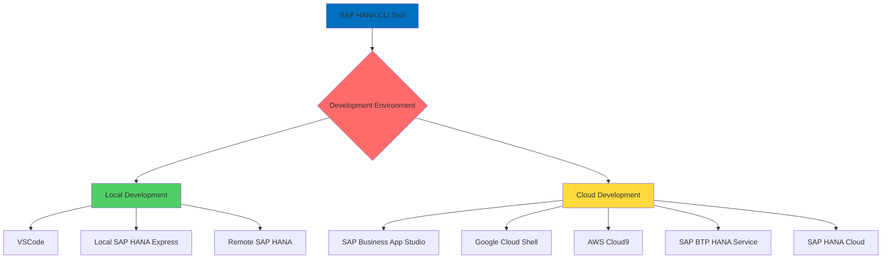
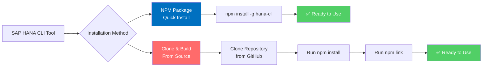
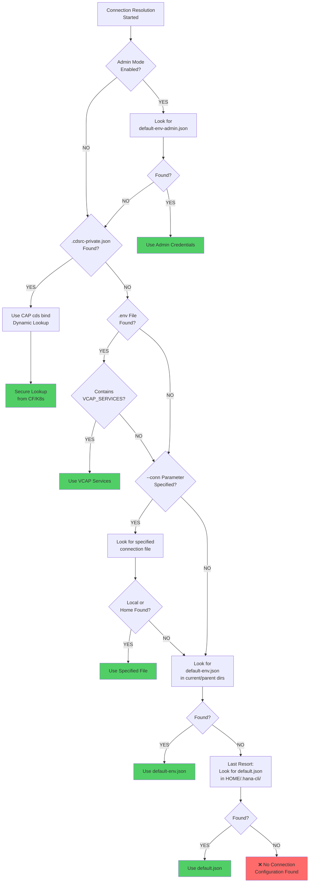
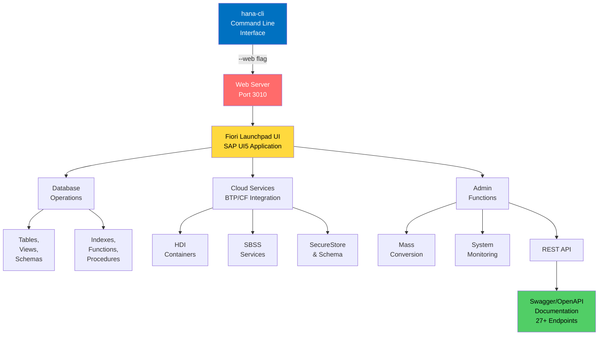
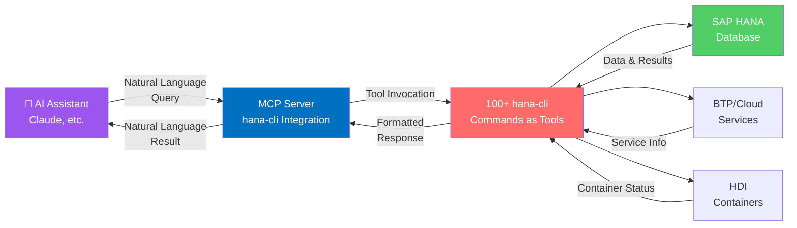
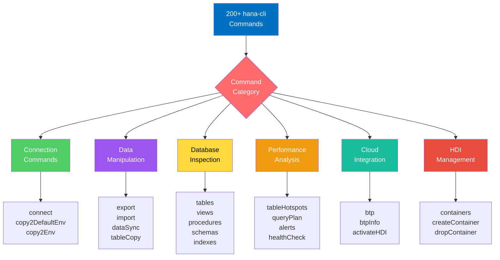
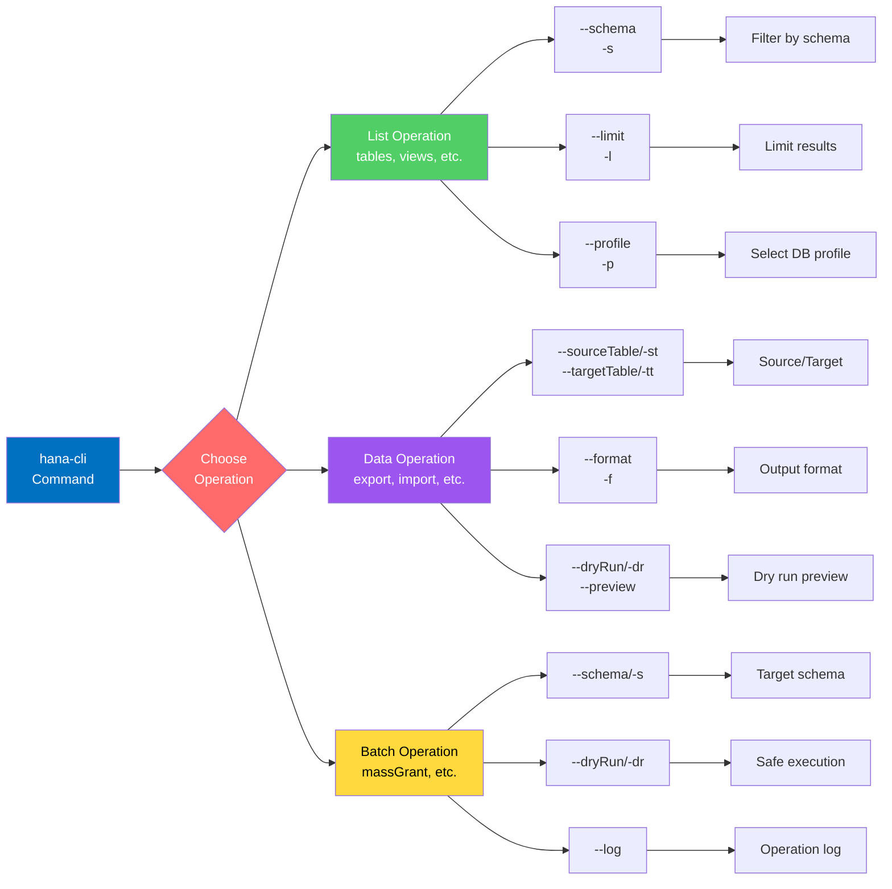

# SAP HANA Developer Command Line Interface

[](https://api.reuse.software/info/github.com/SAP-samples/hana-developer-cli-tool-example)

The [change log](CHANGELOG.md) describes notable changes in this package.

## 📚 Documentation

Complete documentation is available in the **[`docs/`](docs/)** folder and organized with VitePress. This README will maintain a high-level overview and quick links to the most important sections of the documentation but over time expect that more and more detailed documentation will be added to the docs folder as the project evolves.

**Quick Links:**

- **[Getting Started](docs/01-getting-started/)** - Installation and setup
- **[Command Reference](docs/02-commands/)** - All 20+ commands with examples
- **[Features Guide](docs/03-features/)** - CLI, API, MCP, and more
- **[API Reference](docs/04-api-reference/)** - REST API documentation
- **[FAQ](docs/faq.md)** - Frequently asked questions
- **[Troubleshooting](docs/troubleshooting.md)** - Common issues and solutions

### Run Documentation Locally

```bash
cd docs
npm install
npm run docs:dev
# Open http://localhost:5173
```

### Build For Production

```bash
cd docs
npm run docs:build
npm run docs:serve
```

See [docs/README.md](docs/README.md) for complete documentation setup details.

---

## Description

This sample is intended to shown how one could build a developer-centric SAP HANA command line tool, particularly designed to be used when performing local SAP HANA development in non-SAP tooling (like VSCode). It utilizes the default-env.json that is often used in local development for connectivity to a remote SAP HANA DB (although it can of course be used with a local SAP HANA, express edition instance as well). There is no intention to replacing the hdbsql tool as a generic SQL console. Instead this sample will focus on simplifying and grouping common and complex commands that otherwise might a lot of separate scripts.

Introduction Video: [https://youtu.be/dvVQfi9Qgog](https://youtu.be/dvVQfi9Qgog)

However the tool isn't limited to only local development. It also works well when developing in the cloud. The hana-cli tool can also run well from a cloud shell in the SAP Business Application Studio, Google Cloud Shell, AWS Cloud9, etc. We can also run against a SAP HANA service for SAP BTP or SAP HANA Cloud instance. This demonstrates that the tool can run just about anywhere you can get a command line that has access to the Node.js Runtime.  We can also connect to a remote HANA instance even if it isn't running in the same cloud environment in which we are performing our development tasks.

### Supported Environments


```mermaid
graph TD
    A["SAP HANA CLI Tool"] --> B{Development Environment}
    B --> C["Local Development"]
    B --> D["Cloud Development"]
    
    C --> C1["VSCode"]
    C --> C2["Local SAP HANA Express"]
    C --> C3["Remote SAP HANA"]
    
    D --> D1["SAP Business App Studio"]
    D --> D2["Google Cloud Shell"]
    D --> D3["AWS Cloud9"]
    D --> D4["SAP BTP HANA Service"]
    D --> D5["SAP HANA Cloud"]
    
    style A fill:#0070C0
    style B fill:#FF6B6B
    style C fill:#51CF66
    style D fill:#FFD93D
```

Running in Cloud Shells Video: [https://youtu.be/L7QyVLvAIIQ](https://youtu.be/L7QyVLvAIIQ)

## Requirements / Download and Installation

If you would rather just access the tool directly, it is now available in npm as well. You can install via:

```shell
npm install -g hana-cli
```

### Installation Methods


```mermaid
graph LR
    A["SAP HANA CLI Tool"] --> B{Installation Method}
    
    B --> B1["NPM Package<br/>Quick Install"]
    B1 --> B1a["npm install -g hana-cli"]
    B1a --> B1b["✅ Ready to Use"]
    
    B --> B2["Clone & Build<br/>From Source"]
    B2 --> B2a["Clone Repository<br/>from GitHub"]
    B2a --> B2b["Run npm install"]
    B2b --> B2c["Run npm link"]
    B2c --> B2d["✅ Ready to Use"]
    
    style B1 fill:#0070C0,color:#fff
    style B2 fill:#FF6B6B,color:#fff
    style B1b fill:#51CF66,color:#fff
    style B2d fill:#51CF66,color:#fff
```

Otherwise you can also run it from the sources as described here:

- Install Node.js version 20.19.0 or later on your development machine [https://nodejs.org/en/download/](https://nodejs.org/en/download/)

- Clone the repository from [https://github.com/SAP-samples/hana-developer-cli-tool-example](https://github.com/SAP-samples/hana-developer-cli-tool-example)

```shell
git clone https://github.com/SAP-samples/hana-developer-cli-tool-example
```

- Run NPM install from the root of the hana-developer-cli-tool-example project you just cloned to download dependencies

```shell
npm install
```

- Run NPM link from the cloned project root to make the hana-cli command available from everywhere [https://docs.npmjs.com/cli/link](https://docs.npmjs.com/cli/link)

```shell
npm link
```

[](https://asciinema.org/a/301560)

## BTP CLI Installation

The hana-cli tool includes several commands that interact with SAP Business Technology Platform (BTP) services. All BTP-related functionality in this tool relies on the [SAP BTP Command Line Interface (btp CLI)](https://help.sap.com/docs/btp/sap-business-technology-platform/btp-cli-command-reference) being installed and available in your system's PATH.

### About the BTP CLI

The btp CLI is SAP's official command-line tool for managing resources and services on the SAP Business Technology Platform. It provides capabilities for managing global accounts, directories, subaccounts, entitlements, service instances, and more. The hana-cli tool wraps and extends many of these capabilities with developer-friendly commands.

### Installing the BTP CLI with install-btp.sh

For Linux and macOS users, this repository includes a convenient installation script [`install-btp.sh`](install-btp.sh) that automates the installation of the BTP CLI.

The script performs the following actions:

1. Downloads the latest BTP CLI installer from the SAP Development Tools download page
2. Makes the installer executable and runs it with automatic confirmation
3. Configures shell aliases for easier BTP CLI usage
4. Adds the BTP CLI binary location to your PATH

**To use the installation script:**

```shell
chmod +x install-btp.sh
./install-btp.sh
```

After running the script, you may need to restart your terminal or run `source ~/.bashrc` to apply the PATH changes.

**Note:** Windows users should download the BTP CLI from the [SAP Development Tools page](https://tools.hana.ondemand.com/#cloud-btpcli) and follow the platform-specific instructions there.

### Verifying the Installation

Once installed, you can verify the BTP CLI is available by running:

```shell
btp --version
```

You can also use the hana-cli tool itself to check your BTP CLI configuration:

```shell
hana-cli btp
```

This will display your current BTP target information including global account, directory, and subaccount if configured.

## Security

This application primarily uses the default-env.json that is often used in local development for connectivity to a remote HANA DB (although it can of course be used with a local SAP HANA, express edition instance as well). For more details on how the default-env.json works, see the readme.md of the @sap/xsenv package or the @sap/hdi-deploy package.

### Connection Configuration Resolution Order

The tool doesn't simply look for a default-env.json file in the current directory however. There are numerous options and places it will look for the connection parameters. Here is the order in which it checks:


```mermaid
graph TD
    A["Connection Resolution<br/>Started"] --> B{Admin Mode<br/>Enabled?}
    B -->|YES| B1["Look for<br/>default-env-admin.json"]
    B -->|NO| C{.cdsrc-private.json<br/>Found?}
    
    B1 --> B2{Found?}
    B2 -->|YES| Z1["Use Admin Credentials"]
    B2 -->|NO| C
    
    C -->|YES| C1["Use CAP cds bind<br/>Dynamic Lookup"]
    C -->|NO| D{.env File<br/>Found?}
    
    C1 --> Z2["Secure Lookup<br/>from CF/K8s"]
    
    D -->|YES| D1{Contains<br/>VCAP_SERVICES?}
    D1 -->|YES| Z3["Use VCAP Services"]
    D1 -->|NO| E
    D -->|NO| E
    
    E{--conn Parameter<br/>Specified?} -->|YES| E1["Look for specified<br/>connection file"]
    E1 --> E2{Local or<br/>Home Found?}
    E2 -->|YES| Z4["Use Specified File"]
    E2 -->|NO| F
    E -->|NO| F
    
    F["Look for<br/>default-env.json<br/>in current/parent dirs"]
    F --> G{Found?}
    G -->|YES| Z5["Use default-env.json"]
    G -->|NO| H["Last Resort:<br/>Look for default.json<br/>in HOME/.hana-cli/"]
    
    H --> I{Found?}
    I -->|YES| Z6["Use default.json"]
    I -->|NO| Z7["❌ No Connection<br/>Configuration Found"]
    
    style Z1 fill:#51CF66
    style Z2 fill:#51CF66
    style Z3 fill:#51CF66
    style Z4 fill:#51CF66
    style Z5 fill:#51CF66
    style Z6 fill:#51CF66
    style Z7 fill:#FF6B6B
```

- First we look for the Admin option and use a default-env-admin.json - this overrides all other parameters
- If no admin option or if there was an admin option but no default-env-admin.json could be found in this directory or 5 parent directories, then look for `.cdsrc-private.json` in this directory or 5 parent directories and use [`cds bind`](https://cap.cloud.sap/docs/advanced/hybrid-testing#bind-to-cloud-services) functionality to lookup the credentials securely. This is the most secure option, but please note: this will make each command take a few seconds longer as credentials are no longer stored locally but looked up from cf or k8s dynamically with each command
- If no `.cdsrc-private.json` found in this directory or 5 parent directories, then look for a .env file in this directory or up to 5 parent directories
- No .env file found or it doesn't contain a VCAP_SERVICES section, then check to see if the --conn parameter was specified. If so check for that file in the current directory or up to 5 parent directories
- If the file specified via the --conn parameter wasn't found locally then check for it in the ${homedir}/.hana-cli/ folder
- If no specific configuration file was was found then look for a file named default-env.json in the current directory or up to 5 parent directories
- Last resort if nothing has been found up to this point - look for a file named default.json in the ${homedir}/.hana-cli/ folder

## Examples

A lot of the functionality of this tool revolves around typical tasks you face while doing HANA database development.
For example you might want to get a list of all views in your current schema/container:

```shell
C:\github\hana-xsa-opensap-hana7\user_db>hana-cli views
Schema: OPENSAP_HANA_USER, View: *
SCHEMA_NAME        VIEW_NAME                                    VIEW_OID  COMMENTS
-----------------  -------------------------------------------  --------  ------------
OPENSAP_HANA_USER  user.models::USER_DETAILS                    171133    USER_DETAILS
OPENSAP_HANA_USER  user.models::USER_DETAILS/hier/USER_DETAILS  171139    null
```

Then perhaps you want to inspect a view to see the columns and their data types:

```shell
C:\github\hana-xsa-opensap-hana7\user_db>hana-cli view * user.models::USER_DETAILS
Schema: %, View: user.models::USER_DETAILS
{ SCHEMA_NAME: 'OPENSAP_HANA_USER',
  VIEW_NAME: 'user.models::USER_DETAILS',
  VIEW_OID: 171133,
  COMMENTS: 'USER_DETAILS',
  IS_COLUMN_VIEW: 'TRUE',
  VIEW_TYPE: 'CALC',
  HAS_STRUCTURED_PRIVILEGE_CHECK: 'TRUE',
  HAS_PARAMETERS: 'TRUE',
  HAS_CACHE: 'NONE',
  CREATE_TIME: '2019-07-30 13:14:15.594000000' }


SCHEMA_NAME        VIEW_NAME                  VIEW_OID  COLUMN_NAME  POSITION  DATA_TYPE_NAME  OFFSET  LENGTH  SCALE  IS_NULLABLE  DEFAULT_VALUE  CS_DATA_TYPE_NAME  COLUMN_ID  COMMENTS
-----------------  -------------------------  --------  -----------  --------  --------------  ------  ------  -----  -----------  -------------  -----------------  ---------  ---------
OPENSAP_HANA_USER  user.models::USER_DETAILS  171133    EMAIL        1         NVARCHAR        0       255     null   TRUE         null           STRING             171135     Email
OPENSAP_HANA_USER  user.models::USER_DETAILS  171133    FIRSTNAME    2         NVARCHAR        0       40      null   TRUE         null           STRING             171136     FirstName
OPENSAP_HANA_USER  user.models::USER_DETAILS  171133    LASTNAME     3         NVARCHAR        0       40      null   TRUE         null           STRING             171137     LastName
OPENSAP_HANA_USER  user.models::USER_DETAILS  171133    USERID       4         INTEGER         0       10      0      TRUE         null           INT                171138     UserId
```

But there are multiple output options for inspection. Perhaps you are using Cloud Application Programming Model and need to create a proxy entity in CDS for a view. This tool will read the catalog metadata and convert it to CDS:

```shell
C:\github\hana-xsa-opensap-hana7\user_db>hana-cli view OPENSAP_HANA_USER user.models::USER_DETAILS -o cds
Schema: OPENSAP_HANA_USER, View: user.models::USER_DETAILS
@cds.persistence.exists
Entity user_modelsUSER_DETAILS {
 key    "EMAIL": String(255) null  @title: 'EMAIL: Email' ;
key     "FIRSTNAME": String(40) null  @title: 'FIRSTNAME: FirstName' ;
key     "LASTNAME": String(40) null  @title: 'LASTNAME: LastName' ;
key     "USERID": Integer null  @title: 'USERID: UserId' ;
}
```

Or maybe you are service enabling this view and you want to see it converted to EDMX:

```shell
C:\github\hana-xsa-opensap-hana7\user_db>hana-cli view OPENSAP_HANA_USER user.models::USER_DETAILS -o edmx
Schema: OPENSAP_HANA_USER, View: user.models::USER_DETAILS
<?xml version="1.0" encoding="utf-8"?>
<edmx:Edmx Version="1.0" xmlns:edmx="http://schemas.microsoft.com/ado/2007/06/edmx" xmlns:m="http://schemas.microsoft.com/ado/2007/08/dataservices/metadata" xmlns:sap="http://www.sap.com/Protocols/SAPData">
  <edmx:Reference Uri="https://wiki.scn.sap.com/wiki/download/attachments/448470974/Common.xml?api=v2" xmlns:edmx="http://docs.oasis-open.org/odata/ns/edmx">
    <edmx:Include Alias="Common" Namespace="com.sap.vocabularies.Common.v1"/>
  </edmx:Reference>
  <edmx:DataServices m:DataServiceVersion="2.0">
    <Schema Namespace="HanaCli" xmlns="http://schemas.microsoft.com/ado/2008/09/edm">
      <EntityContainer Name="EntityContainer" m:IsDefaultEntityContainer="true">
        <EntitySet Name="user_modelsUSER_DETAILS" EntityType="HanaCli.user_modelsUSER_DETAILS"/>
      </EntityContainer>
      <EntityType Name="user_modelsUSER_DETAILS">
        <Key>
          <PropertyRef Name="EMAIL"/>
          <PropertyRef Name="FIRSTNAME"/>
          <PropertyRef Name="LASTNAME"/>
          <PropertyRef Name="USERID"/>
        </Key>
        <Property Name="EMAIL" Type="Edm.String" MaxLength="255"/>
        <Property Name="FIRSTNAME" Type="Edm.String" MaxLength="40"/>
        <Property Name="LASTNAME" Type="Edm.String" MaxLength="40"/>
        <Property Name="USERID" Type="Edm.Int32"/>
      </EntityType>
      <Annotations Target="HanaCli.user_modelsUSER_DETAILS/EMAIL" xmlns="http://docs.oasis-open.org/odata/ns/edm">
        <Annotation Term="Common.Label" String="EMAIL: Email"/>
      </Annotations>
      <Annotations Target="HanaCli.user_modelsUSER_DETAILS/FIRSTNAME" xmlns="http://docs.oasis-open.org/odata/ns/edm">
        <Annotation Term="Common.Label" String="FIRSTNAME: FirstName"/>
      </Annotations>
      <Annotations Target="HanaCli.user_modelsUSER_DETAILS/LASTNAME" xmlns="http://docs.oasis-open.org/odata/ns/edm">
        <Annotation Term="Common.Label" String="LASTNAME: LastName"/>
      </Annotations>
      <Annotations Target="HanaCli.user_modelsUSER_DETAILS/USERID" xmlns="http://docs.oasis-open.org/odata/ns/edm">
        <Annotation Term="Common.Label" String="USERID: UserId"/>
      </Annotations>
    </Schema>
  </edmx:DataServices>
</edmx:Edmx>
```

This tool will even create a temporary OData V4 service for any existing table, view or Calculation View and launch a test Fiori Ui locally.


## Project Structure and Documentation

### Utils Documentation

For developers looking to understand or extend the internal utilities used by this CLI tool, comprehensive documentation is available in the [utils/README.md](utils/README.md) file. This documentation covers:

- **Core Utilities**: base module, connection management, database inspection, SQL injection protection
- **CLI Integration**: BTP, Cloud Foundry, and XSA CLI integration utilities
- **Database Abstraction**: Multi-database support (HANA, PostgreSQL, SQLite) with factory pattern
- **Usage Examples**: Practical examples for using the utility modules

The utils folder contains reusable modules that provide the foundation for all CLI commands, including database connectivity, terminal UI components, security utilities, and internationalization support.

### HTTP Routes Documentation

The hana-cli tool includes a built-in web server that exposes all CLI functionality through RESTful HTTP endpoints. Detailed documentation for all HTTP routes is available in the [routes/README.md](routes/README.md) file. This documentation covers:

- **Base Configuration Endpoints**: GET/PUT operations for managing CLI prompts and settings
- **HANA Database Endpoints**: Complete API for listing and inspecting HANA database objects (tables, views, schemas, containers, etc.)
- **Documentation Endpoints**: Access to README and CHANGELOG as HTML
- **WebSocket Support**: Real-time communication for long-running operations
- **Static Resources**: UI5 application and DFA integration

The web server is automatically started when using certain CLI commands with the `-w` or `--web` flag, making all hana-cli functionality accessible via HTTP requests at `http://localhost:3010` (configurable port).

### Swagger/OpenAPI Documentation

The hana-cli web server now includes comprehensive Swagger/OpenAPI 3.0 documentation for all REST API endpoints. This provides an interactive interface for exploring and testing all HTTP APIs, making it easier to integrate hana-cli functionality into your own applications.

**Key Features:**

- **Interactive API Documentation**: Browse all 27+ documented endpoints with full request/response schemas
- **Try-It-Out Functionality**: Test any API endpoint directly from the browser
- **Auto-Generated Specification**: Documentation automatically generated from JSDoc comments in route files
- **OpenAPI 3.0 Standard**: Industry-standard specification for maximum compatibility
- **Organized Categories**: Endpoints grouped into 10 logical categories (Configuration, HANA System, HANA Objects, HDI, Cloud Services, etc.)
- **Export Support**: Download the raw OpenAPI JSON specification for client SDK generation

**Accessing Swagger UI:**

```shell
# Start the UI server
hana-cli ui

# Open browser to Swagger UI
http://localhost:3010/api-docs

# Get raw OpenAPI JSON specification
http://localhost:3010/api-docs.json
```

For complete implementation details, usage examples, and customization options, see the [SWAGGER_IMPLEMENTATION.md](SWAGGER_IMPLEMENTATION.md) documentation.

### Web Applications (Fiori Launchpad UI)

The hana-cli tool includes a complete browser-based interface built with SAP UI5 and the Fiori Launchpad, providing a graphical alternative to the command-line interface. This web interface offers an intuitive, tile-based navigation system for all database operations.


```mermaid
graph TB
    CLI["hana-cli<br/>Command Line<br/>Interface"]
    
    CLI -->|--web flag| Server["Web Server<br/>Port 3010"]
    
    Server --> UI["Fiori Launchpad UI<br/>SAP UI5 Application"]
    
    UI --> DB["Database<br/>Operations"]
    UI --> Cloud["Cloud Services<br/>BTP/CF Integration"]
    UI --> Admin["Admin<br/>Functions"]
    
    DB --> T["Tables,<br/>Views,<br/>Schemas"]
    DB --> I["Indexes,<br/>Functions,<br/>Procedures"]
    
    Cloud --> HDI["HDI<br/>Containers"]
    Cloud --> SBSS["SBSS<br/>Services"]
    Cloud --> Store["SecureStore<br/>& Schema"]
    
    Admin --> Conv["Mass<br/>Conversion"]
    Admin --> Monitor["System<br/>Monitoring"]
    Admin --> API["REST API"]
    
    API --> Swagger["Swagger/OpenAPI<br/>Documentation<br/>27+ Endpoints"]
    
    style CLI fill:#0070C0,color:#fff
    style Server fill:#FF6B6B,color:#fff
    style UI fill:#FFD93D,color:#000
    style Swagger fill:#51CF66,color:#000
```

**Key Features:**

- **Fiori Launchpad Interface**: Modern, responsive UI with organized tile groups
- **Multiple UI5 Applications**: Specialized apps for listing, inspecting, and managing database objects
- **Real-Time Operations**: WebSocket-based communication for live updates and long-running tasks
- **Mass Conversion Tool**: Bulk convert tables to CDS, HDBTable, or HDBMigrationTable formats
- **System Information Dashboard**: View connection details, version info, and system status
- **Database Object Browser**: Interactive exploration of tables, views, schemas, functions, indexes, and more
- **Cloud Foundry Integration**: Manage HDI, SBSS, Schema, and SecureStore service instances
- **Theme Support**: Automatic light/dark mode detection and customization
- **Integrated Help**: SAP Digital Foundation Adapter (DFA) with contextual assistance

**Quick Start:**

```shell
hana-cli tables -w    # Launch web interface with tables view
hana-cli serve        # Start the web server standalone
```

The web UI runs on `http://localhost:3010` by default and provides access to all CLI functionality through an easy-to-use graphical interface. For complete documentation of all web applications, UI5 components, configuration, and development guides, see the [app/README.md](app/README.md) file.

### Experimental MCP (Model Context Protocol) Integration

The hana-cli tool now includes experimental support for the Model Context Protocol (MCP), enabling AI assistants like Claude to interact with SAP HANA databases through natural language. This integration exposes all 100+ hana-cli commands as tools that AI assistants can invoke directly.


```mermaid
graph LR
    AI["🤖 AI Assistant<br/>Claude, etc."]
    
    AI -->|Natural Language<br/>Query| MCP["MCP Server<br/>hana-cli Integration"]
    
    MCP -->|Tool Invocation| Tools["100+ hana-cli<br/>Commands as Tools"]
    
    Tools --> DB["SAP HANA<br/>Database"]
    Tools --> Cloud["BTP/Cloud<br/>Services"]
    Tools --> HDI["HDI<br/>Containers"]
    
    DB -->|Data & Results| Tools
    Cloud -->|Service Info| Tools
    HDI -->|Container Status| Tools
    
    Tools -->|Formatted<br/>Response| MCP
    MCP -->|Natural Language<br/>Result| AI
    
    style AI fill:#9D55F0,color:#fff
    style MCP fill:#0070C0,color:#fff
    style Tools fill:#FF6B6B,color:#fff
    style DB fill:#51CF66,color:#fff
```

**Key Features:**

- Natural language database queries and operations
- Full access to all hana-cli commands through AI assistants
- Seamless integration with AI development environments (Cline/Claude Dev, etc.)
- Command execution with proper parameter handling and error responses

For detailed setup instructions, configuration options, and usage examples, please refer to:

- [mcp-server/README.md](mcp-server/README.md) - Complete installation and configuration guide
- [mcp-server/TROUBLESHOOTING.md](mcp-server/TROUBLESHOOTING.md) - Common issues and solutions

**Note:** This is an experimental feature and may be subject to changes as the MCP specification evolves.

## Standard Parameters and Conventions

The hana-cli tool follows consistent parameter naming, aliasing, and default value conventions across all commands to provide a predictable and intuitive user experience.

### Command Categories Overview


```mermaid
graph TB
    A["200+ hana-cli<br/>Commands"] --> B{Command<br/>Category}
    
    B --> C["Connection<br/>Commands"]
    B --> D["Data<br/>Manipulation"]
    B --> E["Database<br/>Inspection"]
    B --> F["Performance<br/>Analysis"]
    B --> G["Cloud<br/>Integration"]
    B --> H["HDI<br/>Management"]
    
    C --> C1["connect<br/>copy2DefaultEnv<br/>copy2Env"]
    
    D --> D1["export<br/>import<br/>dataSync<br/>tableCopy"]
    
    E --> E1["tables<br/>views<br/>procedures<br/>schemas<br/>indexes"]
    
    F --> F1["tableHotspots<br/>queryPlan<br/>alerts<br/>healthCheck"]
    
    G --> G1["btp<br/>btpInfo<br/>activateHDI"]
    
    H --> H1["containers<br/>createContainer<br/>dropContainer"]
    
    style A fill:#0070C0,color:#fff
    style B fill:#FF6B6B,color:#fff
    style C fill:#51CF66,color:#fff
    style D fill:#9D55F0,color:#fff
    style E fill:#FFD93D,color:#000
    style F fill:#F39C12,color:#fff
    style G fill:#1ABC9C,color:#fff
    style H fill:#E74C3C,color:#fff
```

### Global Standard Parameters

All commands support the following standard connection and debugging parameters:

| Parameter | Alias | Type | Default | Description |
| --------- | ----- | ---- | ------- | ----------- |
| `--admin` | `-a` | boolean | false | Connect via admin credentials (uses default-env-admin.json) |
| `--conn` | — | string | — | Connection filename to override default-env.json |
| `--disableVerbose` | `--quiet` | boolean | false | Disable verbose output for scripting |
| `--debug` | `-d` | boolean | false | Enable debug output for troubleshooting |

### Common Command Parameters

Commands are organized into categories, each with their own standardized parameters:

#### Data Manipulation Commands

Commands like `export`, `import`, `compareData`, `tableCopy`, `dataSync`, etc.

| Parameter | Alias | Type | Default | Description |
| ----------- | ------- | ------ | --------- | ------------- |
| `--schema` | `-s` | string | `**CURRENT_SCHEMA**` | Target schema name |
| `--sourceSchema` | `-ss` | string | `**CURRENT_SCHEMA**` | Source schema for operations |
| `--targetSchema` | `-ts` | string | `**CURRENT_SCHEMA**` | Target schema for operations |
| `--table` / `--sourceTable` | `-t` / `-st` | string | — | Table name(s) |
| `--output` | `-o` | string | — | Output file path |
| `--format` | `-f` | string | see note | Output format (csv, json, excel, summary, etc.) |
| `--limit` | `-l` | number | 1000 | Maximum result set size |
| `--batchSize` | `-b`, `--batch` | number | 1000 | Batch size for processing |
| `--timeout` | `-to` | number | 3600 | Operation timeout in seconds (1 hour) |
| `--dryRun` | `-dr`, `--preview` | boolean | false | Preview operation without committing changes |
| `--profile` | `-p` | string | — | Database profile (hana, postgresql, sqlite, etc.) |

#### Batch Operations

Commands like `massGrant`, `massUpdate`, `massDelete`, `massExport`, etc.

| Parameter | Alias | Type | Default | Description |
| ----------- | ------- | ------ | --------- | ------------- |
| `--schema` | `-s` | string | — | Schema containing objects |
| `--object` | `-o` | string | — | Object name pattern |
| `--limit` | `-l` | number | 1000 | Maximum objects to process |
| `--dryRun` | `-dr`, `--preview` | boolean | false | Preview without executing |
| `--log` | — | boolean | false | Enable operation logging |

#### List/Inspect Commands

Commands like `tables`, `schemas`, `users`, `procedures`, `functions`, etc.

| Parameter | Alias | Type | Default | Description |
| --------- | ----- | ---- | ------- | ----------- |
| `--schema` | `-s` | string | `**CURRENT_SCHEMA**` | Filter by schema |
| `--limit` | `-l` | number | 200 | Maximum results to return |
| `--profile` | `-p` | string | — | Database profile selector |

### Naming Conventions

The tool follows these conventions for parameter naming:

1. **Single Operations**: Use singular names (e.g., `schema`, `table`, `user`)
2. **Source/Target Operations**: Use paired names (e.g., `sourceSchema`/`targetSchema`, `sourceTable`/`targetTable`)
3. **Boolean Flags**: Use descriptive names (e.g., `dryRun`, `includeHeaders`, `withGrantOption`)
4. **Aggregation Parameters**: Use plural or descriptive names (e.g., `columns`, `indexes`, `keyColumns`)

### Alias Conventions

Aliases follow these consistent patterns:

1. **Single-letter alias**: First letter of the parameter (e.g., `-s` for schema, `-t` for table)
2. **Extended alias**: Meaningful abbreviation (e.g., `-dr` for dryRun, `-batch` for batchSize)
3. **No self-referential aliases**: Parameter name itself is not used as an alias (e.g., `--schema` has alias `-s` only)
4. **Maximum aliases**: Parameters typically have at most 2 aliases to avoid confusion

### Default Values

Default values are standardized to ensure consistent behavior:

| Parameter | Standard Default | Note |
| ----------- | --------------- | ------ |
| `schema` | `**CURRENT_SCHEMA**` | Uses the connection's current schema |
| `limit` | 200 (lists) / 1000 (data) | Configurable per command based on context |
| `batchSize` | 1000 | Applies to all data manipulation operations |
| `timeout` | 3600 | 1 hour standard timeout for long-running operations |
| `dryRun` | false | Changes are committed by default; use `--dryRun` to preview |
| `format` | "csv" (export) / "json" (reports) | Varies by command type |
| `compress` | true | Data backups are compressed by default |

### Usage Examples

#### Using Standard Parameters


```mermaid
graph LR
    A["hana-cli<br/>Command"]
    
    A --> B{Choose<br/>Operation}
    
    B --> C["List Operation<br/>tables, views, etc."]
    C --> C1["--schema<br/>-s"]
    C --> C2["--limit<br/>-l"]
    C --> C3["--profile<br/>-p"]
    C1 --> C4["Filter by schema"]
    C2 --> C5["Limit results"]
    C3 --> C6["Select DB profile"]
    
    B --> D["Data Operation<br/>export, import, etc."]
    D --> D1["--sourceTable/-st<br/>--targetTable/-tt"]
    D --> D2["--format<br/>-f"]
    D --> D3["--dryRun/-dr<br/>--preview"]
    D1 --> D4["Source/Target"]
    D2 --> D5["Output format"]
    D3 --> D6["Dry run preview"]
    
    B --> E["Batch Operation<br/>massGrant, etc."]
    E --> E1["--schema/-s"]
    E --> E2["--dryRun/-dr"]
    E --> E3["--log"]
    E1 --> E4["Target schema"]
    E2 --> E5["Safe execution"]
    E3 --> E6["Operation log"]
    
    style A fill:#0070C0,color:#fff
    style B fill:#FF6B6B,color:#fff
    style C fill:#51CF66,color:#fff
    style D fill:#9D55F0,color:#fff
    style E fill:#FFD93D,color:#000
```

```bash
# List all tables in current schema with preview of first 100
hana-cli tables -s myschema -l 100

# Export data with dry-run preview
hana-cli export -t CUSTOMERS -s SALES -f csv -dr

# Copy table structure without data (dry-run)
hana-cli tableCopy --sourceTable ORDERS --targetTable ORDERS_ARCHIVE --structureOnly --dryRun

# Compare schemas between databases with 2-hour timeout
hana-cli compareSchema --sourceSchema PROD --targetSchema TEST -to 7200

# Batch grant permissions (preview first)
hana-cli massGrant -s MYSCHEMA -o MYTABLE -g DEVELOPER_USER -p SELECT -dr
```

#### Common Parameter Combinations

```bash
# Preview and log operations
hana-cli massUpdate -s SCHEMA -o TABLE -c "STATUS='ACTIVE'" --dryRun --log

# Limit results and increase timeout for large datasets
hana-cli dataValidator -t BIGDATA -l 1000000 -to 7200

# Specify output format and location
hana-cli export -t CUSTOMERS -f json -o ./exports/customers.json
```

### Current Schema Defaults (`**CURRENT_SCHEMA**`)

The vast majority of schema-aware commands now use `**CURRENT_SCHEMA**` as the default value for schema parameters. This special placeholder allows you to work with your current database context without explicitly specifying the schema name each time.

#### Supported Commands with Current Schema Default

The following command categories fully support the `**CURRENT_SCHEMA**` placeholder:

**Listing Commands** (30+ commands):

- All schema navigation: `tables`, `views`, `indexes`, `functions`, `procedures`, `triggers`, `sequences`, `synonyms`, `libraries`, `roles`, `objects`
- Specialized lists: `partitions`, `columnStats`, `spatialData`, `ftIndexes`, `graphWorkspaces`, `tableHotspots`, `tableGroups`, `calcViewAnalyzer`

**Data Manipulation Commands** (10+ commands):

- `export`, `import`, `dataProfile`, `dataDiff`, `compareData`, `compareSchema`, `tableCopy`, `dataSync`

**Analysis Commands** (10+ commands):

- `dataValidator`, `duplicateDetection`, `erdDiagram`, `dataLineage`, `referentialCheck`, and more

#### Current Schema Examples

```bash
# Without explicit schema - uses CURRENT_SCHEMA
hana-cli tables                          # List tables in current schema
hana-cli procedures                      # List procedures in current schema
hana-cli export -t CUSTOMERS             # Export from current schema

# With explicit schema override
hana-cli tables -s PRODUCTION            # List tables in PRODUCTION schema
hana-cli procedures -s OTHER_SCHEMA      # List procedures in OTHER_SCHEMA
hana-cli export -t CUSTOMERS -s SALES    # Export from SALES schema
```

For a complete list of all commands with `**CURRENT_SCHEMA**` support, see the [CONSISTENCY_REVIEW_COMPLETE.md](CONSISTENCY_REVIEW_COMPLETE.md) document.

### Multi-Profile Database Support

All database-connected commands now support the `--profile` parameter (alias `-p`), enabling you to work with different database configurations without switching connections or redefining credentials.

#### Supported Commands with Profile Parameter

The `--profile` parameter is available in:

- All data operations: `export`, `import`, `dataProfile`, `dataDiff`, `dataSync`, `duplicateDetection`, `referentialCheck`, `tableCopy`
- List operations: `tables`, `views`, `indexes`, `functions`, `procedures`, `triggers`, `sequences`, `libraries`, `roles`, `objects`, `partitions`, `columnStats`, `spatialData`, `ftIndexes`, `graphWorkspaces`, `tableHotspots`, `tableGroups`, `calcViewAnalyzer`
- Analysis tools: `compareData`, `compareSchema`, `dataValidator`, `dataLineage`, `erdDiagram`, and more

#### Profile Parameter Examples

```bash
# Specify database profile
hana-cli tables --profile production     # Connect using 'production' profile
hana-cli export -t CUSTOMERS -p staging  # Export from staging environment
hana-cli dataValidator -t TABLE -p dev   # Validate data in development

# Works with other parameters
hana-cli tables -s MYSCHEMA -p prod      # List tables in schema using prod profile
hana-cli compareSchema -ss SRC -ts TGT -p target  # Schema comparison using target profile
```

For more details on database profile configuration, see the [utils/README.md](utils/README.md) documentation.

### Quality Assurance Notes

The consistency of these parameters has been standardized across all 200+ commands in the tool. This standardization ensures:

- **Predictability**: Users can rely on consistent parameter behavior across commands
- **Discoverability**: Common parameters work the same way in different contexts
- **Scripting**: Automation scripts are more maintainable with consistent patterns
- **Error Reduction**: Familiar patterns reduce mistakes and learning curve
- **Multi-Environment Support**: Profile parameter enables seamless switching between database instances

For detailed analysis of all command consistency improvements deployed in February 2026, including the 30 commands and 50+ parameters updated, see:

- [CONSISTENCY_REVIEW_COMPLETE.md](CONSISTENCY_REVIEW_COMPLETE.md) - Complete review report
- [COMMAND_CONSISTENCY_FIXES.md](COMMAND_CONSISTENCY_FIXES.md) - Implementation details
- [COMMAND_CONSISTENCY_ANALYSIS.md](COMMAND_CONSISTENCY_ANALYSIS.md) - Detailed audit findings

For detailed information about specific commands, use the built-in help:

```bash
hana-cli help <command>
hana-cli <command> --help
```

## Commands

**📊 Visual Command Reference Guide**: For command structure diagrams, parameter relationships, and quick examples for all commands, see the **[Command Structure Reference Guide](COMMAND_REFERENCE.md)**. This separate document provides visual flowcharts and detailed usage patterns for:

- Connection & setup commands
- Data operations (export, import, sync)
- Database inspection & analysis
- HDI container management
- Backup & recovery operations
- Performance analysis tools
- Mass operations
- Cloud integration

Each command diagram shows the command syntax, available parameters, and typical usage patterns.

### Unit Testing

This project includes comprehensive unit tests to ensure code quality and reliability. The test suite covers core functionality, command execution, and database operations.

For detailed information about running tests, writing new tests, and understanding the test structure, please refer to the [Unit Testing Documentation](./tests/README_UNIT_TESTS.md).

### Running Tests

Quick start for running tests:

```shell
# Run all tests
npm test

# Run specific test suites
npm run test:cli      # CLI tests only
npm run test:utils    # Utils tests only
npm run test:routes   # Routes tests only
```

### Code Coverage

The project uses [nyc (Istanbul)](https://github.com/istanbuljs/nyc) for code coverage reporting. To generate code coverage reports:

```shell
# Run all tests with coverage
npm run coverage

# Run specific test suites with coverage
npm run coverage:cli      # CLI tests with coverage
npm run coverage:utils    # Utils tests with coverage
npm run coverage:routes   # Routes tests with coverage

# Generate detailed HTML coverage report
npm run coverage:report

# Check if coverage meets thresholds (80%)
npm run coverage:check
```

After running coverage tests, open `./coverage/index.html` in your browser to view the detailed interactive coverage report.

The project aims for 80% code coverage across:

- Lines
- Statements
- Functions
- Branches

For more information about code coverage configuration and interpretation, see the [Coverage section in the Unit Testing Documentation](./tests/README_UNIT_TESTS.md#code-coverage).

## Cross-Platform Support

The HANA CLI tool is designed to work seamlessly across Windows, Linux, and macOS platforms. This section describes the cross-platform features and testing strategies employed to ensure consistent behavior.

### Platform Compatibility

The tool has been tested and validated on:

- **Windows**: Windows 10 and later
- **Linux**: Ubuntu, Debian, RHEL, and other major distributions
- **macOS**: macOS 10.15 (Catalina) and later

### Cross-Platform Features

#### Path Handling

The tool automatically handles platform-specific path differences:

- Uses Node.js `path` module for all path operations
- Automatically detects and uses correct path separators (`/` on Unix, `\` on Windows)
- Normalizes paths for consistent behavior across platforms
- Supports both absolute and relative paths on all platforms

#### Environment Variables

Platform-specific environment variables are handled correctly:

- **Windows**: Uses `APPDATA` for configuration files
- **macOS**: Uses `HOME/Library/Preferences` with fallback to `HOME/Library/Application Support`
- **Linux**: Uses `HOME/.config` for configuration files

#### Line Endings

The project uses `.gitattributes` to ensure consistent line endings:

- Text files (`.js`, `.json`, `.md`, etc.) use LF (`\n`) in the repository
- Windows scripts (`.cmd`, `.bat`, `.ps1`) use CRLF (`\r\n`)
- Binary files are handled appropriately

### Cross-Platform Testing

The project includes comprehensive cross-platform testing:

```shell
# Run cross-platform specific tests
npm run test:platform

# Run tests tagged for Windows
npm run test:windows

# Run tests tagged for Unix systems (Linux/macOS)
npm run test:unix
```

#### Continuous Integration

GitHub Actions CI runs the full test suite on all three platforms:

- **Ubuntu Latest**: Tests Linux compatibility
- **Windows Latest**: Tests Windows compatibility
- **macOS Latest**: Tests macOS compatibility
- **Node.js versions**: 20.x, 22.x, and 24.x on each platform

The CI workflow validates:

- Package installation on each platform
- All unit tests pass on each platform
- Cross-platform specific tests
- Platform-specific path handling
- CLI command execution

#### Mock Filesystem Testing

Tests use `mock-fs` to simulate different filesystem structures:

- Tests can simulate Windows, macOS, and Linux filesystems
- Validates path handling without requiring multiple OS environments
- Tests platform-specific configuration file locations
- Ensures consistent behavior across platforms

### Development Recommendations

When contributing to this project, follow these cross-platform best practices:

1. **Always use `path.join()` or `path.resolve()`** instead of string concatenation for paths
2. **Use `os.EOL`** for platform-appropriate line endings in generated content
3. **Test environment variable fallbacks** for Windows (`APPDATA`, `USERPROFILE`) and Unix (`HOME`)
4. **Tag platform-specific tests** with `@windows` or `@unix` as appropriate
5. **Use `cross-env`** in npm scripts for environment variable consistency
6. **Avoid hard-coded path separators** (`/` or `\`) in code

For more details on cross-platform testing, see the [Cross-Platform Testing section in the Unit Testing Documentation](./tests/README_UNIT_TESTS.md#cross-platform-testing).

## How to obtain support

This project is provided "as-is": there is no guarantee that raised issues will be answered or addressed in future releases.

## License

Copyright (c) 2026 SAP SE or an SAP affiliate company. All rights reserved.
This project is licensed under the Apache Software License, v. 2 except as noted otherwise in the [LICENSE](LICENSES/Apache-2.0.txt) file.
