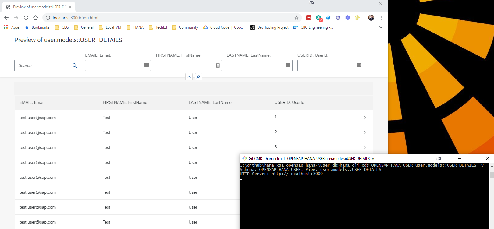

# SAP HANA Developer Command Line Interface

[](https://api.reuse.software/info/github.com/SAP-samples/hana-developer-cli-tool-example)

The [change log](CHANGELOG.md) describes notable changes in this package.

## Description

This sample is intended to shown how one could build a developer-centric SAP HANA command line tool, particularly designed to be used when performing local SAP HANA development in non-SAP tooling (like VSCode). It utilizes the default-env.json that is often used in local development for connectivity to a remote SAP HANA DB (although it can of course be used with a local SAP HANA, express edition instance as well). There is no intention to replacing the hdbsql tool as a generic SQL console. Instead this sample will focus on simplifying and grouping common and complex commands that otherwise might a lot of separate scripts.

Introduction Video: [https://youtu.be/dvVQfi9Qgog](https://youtu.be/dvVQfi9Qgog)

However the tool isn't limited to only local development. It also works well when developing in the cloud. The hana-cli tool can also run well from a cloud shell in the SAP Business Application Studio, Google Cloud Shell, AWS Cloud9, etc. We can also run against a SAP HANA service for SAP BTP or SAP HANA Cloud instance. This demonstrates that the tool can run just about anywhere you can get a command line that has access to the Node.js Runtime.  We can also connect to a remote HANA instance even if it isn't running in the same cloud environment in which we are performing our development tasks.

Running in Cloud Shells Video: [https://youtu.be/L7QyVLvAIIQ](https://youtu.be/L7QyVLvAIIQ)

## Requirements / Download and Installation

If you would rather just access the tool directly, it is now available in npm as well. You can install via:

```shell
npm install -g hana-cli
```

Otherwise you can also run it from the sources as described here:

* Install Node.js version 14.x or 16.x on your development machine [https://nodejs.org/en/download/](https://nodejs.org/en/download/)

* @sap Node.js packages have moved from <https://npm.sap.com> to the default registry <https://registry.npmjs.org>. As future versions of @sap modules are going to be published only there, please make sure to adjust your registry with:

```shell
npm config delete @sap:registry
```

* Clone the repository from [https://github.com/SAP-samples/hana-developer-cli-tool-example](https://github.com/SAP-samples/hana-developer-cli-tool-example)

```shell
git clone https://github.com/SAP-samples/hana-developer-cli-tool-example
```

* Run NPM install from the root of the hana-developer-cli-tool-example project you just cloned to download dependencies

```shell
npm install
```

* Run NPM link from the cloned project root to make the hana-cli command available from everywhere [https://docs.npmjs.com/cli/link](https://docs.npmjs.com/cli/link)

```shell
npm link
```

[](https://asciinema.org/a/301560)

## BTP CLI Installation

The hana-cli tool includes several commands that interact with SAP Business Technology Platform (BTP) services. All BTP-related functionality in this tool relies on the [SAP BTP Command Line Interface (btp CLI)](https://help.sap.com/docs/btp/sap-business-technology-platform/btp-cli-command-reference) being installed and available in your system's PATH.

### About the BTP CLI

The btp CLI is SAP's official command-line tool for managing resources and services on the SAP Business Technology Platform. It provides capabilities for managing global accounts, directories, subaccounts, entitlements, service instances, and more. The hana-cli tool wraps and extends many of these capabilities with developer-friendly commands.

### Installing the BTP CLI with install-btp.sh

For Linux and macOS users, this repository includes a convenient installation script [`install-btp.sh`](install-btp.sh) that automates the installation of the BTP CLI.

The script performs the following actions:

1. Downloads the latest BTP CLI installer from the official SAP samples repository
2. Makes the installer executable and runs it with automatic confirmation
3. Configures shell aliases for easier BTP CLI usage
4. Adds the BTP CLI binary location to your PATH

**To use the installation script:**

```shell
chmod +x install-btp.sh
./install-btp.sh
```

After running the script, you may need to restart your terminal or run `source ~/.bashrc` to apply the PATH changes.

**Note:** Windows users should refer to the [official BTP CLI installation documentation](https://help.sap.com/docs/btp/sap-business-technology-platform/download-and-start-using-btp-cli-client) for platform-specific installation instructions.

### Verifying the Installation

Once installed, you can verify the BTP CLI is available by running:

```shell
btp --version
```

You can also use the hana-cli tool itself to check your BTP CLI configuration:

```shell
hana-cli btp
```

This will display your current BTP target information including global account, directory, and subaccount if configured.

## Security

This application primarily uses the default-env.json that is often used in local development for connectivity to a remote HANA DB (although it can of course be used with a local SAP HANA, express edition instance as well). For more details on how the default-env.json works, see the readme.md of the @sap/xsenv package or the @sap/hdi-deploy package.

The tool doesn't simply look for a default-env.json file in the current directory however. There are numerous options and places it will look for the connection parameters. Here is the order in which it checks:

* First we look for the Admin option and use a default-env-admin.json - this overrides all other parameters
* If no admin option or if there was an admin option but no default-env-admin.json could be found in this directory or 5 parent directories, then look for `.cdsrc-private.json` in this directory or 5 parent directories and use [`cds bind`](https://cap.cloud.sap/docs/advanced/hybrid-testing#bind-to-cloud-services) functionality to lookup the credentials securely. This is the most secure option, but please note: this will make each command take a few seconds longer as credentials are no longer stored locally but looked up from cf or k8s dynamically with each command
* If no `.cdsrc-private.json` found in this directory or 5 parent directories, then look for a .env file in this directory or up to 5 parent directories
* No .env file found or it doesn't contain a VCAP_SERVICES section, then check to see if the --conn parameter was specified. If so check for that file in the current directory or up to 5 parent directories
* If the file specified via the --conn parameter wasn't found locally then check for it in the ${homedir}/.hana-cli/ folder
* If no specific configuration file was was found then look for a file named default-env.json in the current directory or up to 5 parent directories
* Last resort if nothing has been found up to this point - look for a file named default.json in the ${homedir}/.hana-cli/ folder

## Examples

A lot of the functionality of this tool revolves around typical tasks you face while doing HANA database development.
For example you might want to get a list of all views in your current schema/container:

```shell
C:\github\hana-xsa-opensap-hana7\user_db>hana-cli views
Schema: OPENSAP_HANA_USER, View: *
SCHEMA_NAME        VIEW_NAME                                    VIEW_OID  COMMENTS
-----------------  -------------------------------------------  --------  ------------
OPENSAP_HANA_USER  user.models::USER_DETAILS                    171133    USER_DETAILS
OPENSAP_HANA_USER  user.models::USER_DETAILS/hier/USER_DETAILS  171139    null
```

Then perhaps you want to inspect a view to see the columns and their data types:

```shell
C:\github\hana-xsa-opensap-hana7\user_db>hana-cli view * user.models::USER_DETAILS
Schema: %, View: user.models::USER_DETAILS
{ SCHEMA_NAME: 'OPENSAP_HANA_USER',
  VIEW_NAME: 'user.models::USER_DETAILS',
  VIEW_OID: 171133,
  COMMENTS: 'USER_DETAILS',
  IS_COLUMN_VIEW: 'TRUE',
  VIEW_TYPE: 'CALC',
  HAS_STRUCTURED_PRIVILEGE_CHECK: 'TRUE',
  HAS_PARAMETERS: 'TRUE',
  HAS_CACHE: 'NONE',
  CREATE_TIME: '2019-07-30 13:14:15.594000000' }


SCHEMA_NAME        VIEW_NAME                  VIEW_OID  COLUMN_NAME  POSITION  DATA_TYPE_NAME  OFFSET  LENGTH  SCALE  IS_NULLABLE  DEFAULT_VALUE  CS_DATA_TYPE_NAME  COLUMN_ID  COMMENTS
-----------------  -------------------------  --------  -----------  --------  --------------  ------  ------  -----  -----------  -------------  -----------------  ---------  ---------
OPENSAP_HANA_USER  user.models::USER_DETAILS  171133    EMAIL        1         NVARCHAR        0       255     null   TRUE         null           STRING             171135     Email
OPENSAP_HANA_USER  user.models::USER_DETAILS  171133    FIRSTNAME    2         NVARCHAR        0       40      null   TRUE         null           STRING             171136     FirstName
OPENSAP_HANA_USER  user.models::USER_DETAILS  171133    LASTNAME     3         NVARCHAR        0       40      null   TRUE         null           STRING             171137     LastName
OPENSAP_HANA_USER  user.models::USER_DETAILS  171133    USERID       4         INTEGER         0       10      0      TRUE         null           INT                171138     UserId
```

But there are multiple output options for inspection. Perhaps you are using Cloud Application Programming Model and need to create a proxy entity in CDS for a view. This tool will read the catalog metadata and convert it to CDS:

```shell
C:\github\hana-xsa-opensap-hana7\user_db>hana-cli view OPENSAP_HANA_USER user.models::USER_DETAILS -o cds
Schema: OPENSAP_HANA_USER, View: user.models::USER_DETAILS
@cds.persistence.exists
Entity user_modelsUSER_DETAILS {
 key    "EMAIL": String(255) null  @title: 'EMAIL: Email' ;
key     "FIRSTNAME": String(40) null  @title: 'FIRSTNAME: FirstName' ;
key     "LASTNAME": String(40) null  @title: 'LASTNAME: LastName' ;
key     "USERID": Integer null  @title: 'USERID: UserId' ;
}
```

Or maybe you are service enabling this view and you want to see it converted to EDMX:

```shell
C:\github\hana-xsa-opensap-hana7\user_db>hana-cli view OPENSAP_HANA_USER user.models::USER_DETAILS -o edmx
Schema: OPENSAP_HANA_USER, View: user.models::USER_DETAILS
<?xml version="1.0" encoding="utf-8"?>
<edmx:Edmx Version="1.0" xmlns:edmx="http://schemas.microsoft.com/ado/2007/06/edmx" xmlns:m="http://schemas.microsoft.com/ado/2007/08/dataservices/metadata" xmlns:sap="http://www.sap.com/Protocols/SAPData">
  <edmx:Reference Uri="https://wiki.scn.sap.com/wiki/download/attachments/448470974/Common.xml?api=v2" xmlns:edmx="http://docs.oasis-open.org/odata/ns/edmx">
    <edmx:Include Alias="Common" Namespace="com.sap.vocabularies.Common.v1"/>
  </edmx:Reference>
  <edmx:DataServices m:DataServiceVersion="2.0">
    <Schema Namespace="HanaCli" xmlns="http://schemas.microsoft.com/ado/2008/09/edm">
      <EntityContainer Name="EntityContainer" m:IsDefaultEntityContainer="true">
        <EntitySet Name="user_modelsUSER_DETAILS" EntityType="HanaCli.user_modelsUSER_DETAILS"/>
      </EntityContainer>
      <EntityType Name="user_modelsUSER_DETAILS">
        <Key>
          <PropertyRef Name="EMAIL"/>
          <PropertyRef Name="FIRSTNAME"/>
          <PropertyRef Name="LASTNAME"/>
          <PropertyRef Name="USERID"/>
        </Key>
        <Property Name="EMAIL" Type="Edm.String" MaxLength="255"/>
        <Property Name="FIRSTNAME" Type="Edm.String" MaxLength="40"/>
        <Property Name="LASTNAME" Type="Edm.String" MaxLength="40"/>
        <Property Name="USERID" Type="Edm.Int32"/>
      </EntityType>
      <Annotations Target="HanaCli.user_modelsUSER_DETAILS/EMAIL" xmlns="http://docs.oasis-open.org/odata/ns/edm">
        <Annotation Term="Common.Label" String="EMAIL: Email"/>
      </Annotations>
      <Annotations Target="HanaCli.user_modelsUSER_DETAILS/FIRSTNAME" xmlns="http://docs.oasis-open.org/odata/ns/edm">
        <Annotation Term="Common.Label" String="FIRSTNAME: FirstName"/>
      </Annotations>
      <Annotations Target="HanaCli.user_modelsUSER_DETAILS/LASTNAME" xmlns="http://docs.oasis-open.org/odata/ns/edm">
        <Annotation Term="Common.Label" String="LASTNAME: LastName"/>
      </Annotations>
      <Annotations Target="HanaCli.user_modelsUSER_DETAILS/USERID" xmlns="http://docs.oasis-open.org/odata/ns/edm">
        <Annotation Term="Common.Label" String="USERID: UserId"/>
      </Annotations>
    </Schema>
  </edmx:DataServices>
</edmx:Edmx>
```

This tool will even create a temporary OData V4 service for any existing table, view or Calculation View and launch a test Fiori Ui locally.


## Project Structure and Documentation

### Utils Documentation

For developers looking to understand or extend the internal utilities used by this CLI tool, comprehensive documentation is available in the [utils/README.md](utils/README.md) file. This documentation covers:

* **Core Utilities**: base module, connection management, database inspection, SQL injection protection
* **CLI Integration**: BTP, Cloud Foundry, and XSA CLI integration utilities
* **Database Abstraction**: Multi-database support (HANA, PostgreSQL, SQLite) with factory pattern
* **Usage Examples**: Practical examples for using the utility modules

The utils folder contains reusable modules that provide the foundation for all CLI commands, including database connectivity, terminal UI components, security utilities, and internationalization support.

### HTTP Routes Documentation

The hana-cli tool includes a built-in web server that exposes all CLI functionality through RESTful HTTP endpoints. Detailed documentation for all HTTP routes is available in the [routes/README.md](routes/README.md) file. This documentation covers:

* **Base Configuration Endpoints**: GET/PUT operations for managing CLI prompts and settings
* **HANA Database Endpoints**: Complete API for listing and inspecting HANA database objects (tables, views, schemas, containers, etc.)
* **Documentation Endpoints**: Access to README and CHANGELOG as HTML
* **WebSocket Support**: Real-time communication for long-running operations
* **Static Resources**: UI5 application and DFA integration

The web server is automatically started when using certain CLI commands with the `-w` or `--web` flag, making all hana-cli functionality accessible via HTTP requests at `http://localhost:3010` (configurable port).

### Swagger/OpenAPI Documentation

The hana-cli web server now includes comprehensive Swagger/OpenAPI 3.0 documentation for all REST API endpoints. This provides an interactive interface for exploring and testing all HTTP APIs, making it easier to integrate hana-cli functionality into your own applications.

**Key Features:**

* **Interactive API Documentation**: Browse all 27+ documented endpoints with full request/response schemas
* **Try-It-Out Functionality**: Test any API endpoint directly from the browser
* **Auto-Generated Specification**: Documentation automatically generated from JSDoc comments in route files
* **OpenAPI 3.0 Standard**: Industry-standard specification for maximum compatibility
* **Organized Categories**: Endpoints grouped into 10 logical categories (Configuration, HANA System, HANA Objects, HDI, Cloud Services, etc.)
* **Export Support**: Download the raw OpenAPI JSON specification for client SDK generation

**Accessing Swagger UI:**

```shell
# Start the UI server
hana-cli ui

# Open browser to Swagger UI
http://localhost:3010/api-docs

# Get raw OpenAPI JSON specification
http://localhost:3010/api-docs.json
```

For complete implementation details, usage examples, and customization options, see the [SWAGGER_IMPLEMENTATION.md](SWAGGER_IMPLEMENTATION.md) documentation.

### Web Applications (Fiori Launchpad UI)

The hana-cli tool includes a complete browser-based interface built with SAP UI5 and the Fiori Launchpad, providing a graphical alternative to the command-line interface. This web interface offers an intuitive, tile-based navigation system for all database operations.

**Key Features:**

* **Fiori Launchpad Interface**: Modern, responsive UI with organized tile groups
* **Multiple UI5 Applications**: Specialized apps for listing, inspecting, and managing database objects
* **Real-Time Operations**: WebSocket-based communication for live updates and long-running tasks
* **Mass Conversion Tool**: Bulk convert tables to CDS, HDBTable, or HDBMigrationTable formats
* **System Information Dashboard**: View connection details, version info, and system status
* **Database Object Browser**: Interactive exploration of tables, views, schemas, functions, indexes, and more
* **Cloud Foundry Integration**: Manage HDI, SBSS, Schema, and SecureStore service instances
* **Theme Support**: Automatic light/dark mode detection and customization
* **Integrated Help**: SAP Digital Foundation Adapter (DFA) with contextual assistance

**Quick Start:**

```shell
hana-cli tables -w    # Launch web interface with tables view
hana-cli serve        # Start the web server standalone
```

The web UI runs on `http://localhost:3010` by default and provides access to all CLI functionality through an easy-to-use graphical interface. For complete documentation of all web applications, UI5 components, configuration, and development guides, see the [app/README.md](app/README.md) file.

### Experimental MCP (Model Context Protocol) Integration

The hana-cli tool now includes experimental support for the Model Context Protocol (MCP), enabling AI assistants like Claude to interact with SAP HANA databases through natural language. This integration exposes all 100+ hana-cli commands as tools that AI assistants can invoke directly.

**Key Features:**

* Natural language database queries and operations
* Full access to all hana-cli commands through AI assistants
* Seamless integration with AI development environments (Cline/Claude Dev, etc.)
* Command execution with proper parameter handling and error responses

For detailed setup instructions, configuration options, and usage examples, please refer to:

* [mcp-server/README.md](mcp-server/README.md) - Complete installation and configuration guide
* [mcp-server/TROUBLESHOOTING.md](mcp-server/TROUBLESHOOTING.md) - Common issues and solutions

**Note:** This is an experimental feature and may be subject to changes as the MCP specification evolves.

## Commands

### activateHDI

```shell
hana-cli activateHDI [tenant]
[aliases: ahdi, ah]
Activate the HDI service in a particluar SAP HANA Tenant (Must be ran in the
SYSTEMDB)

Connection Parameters:
  -a, --admin, --Admin  Connect via admin (default-env-admin.json)
                                                      [boolean] [default: false]
      --conn            Connection Filename to override default-env.json

Troubleshooting:
      --disableVerbose, --quiet  Disable Verbose output - removes all extra
                                 output that is only helpful to human readable
                                 interface. Useful for scripting commands.
                                                      [boolean] [default: false]
      --debug, --Debug           Debug hana-cli itself by adding output of LOTS
                                 of intermediate details
                                                      [boolean] [default: false]

Options:
  -t, --tenant, --Tenant  SAP HANA Tenant                               [string]
```

### adminHDI

```shell
hana-cli adminHDI [user] [password]
[aliases: adHDI, adhdi]
Create an Admin User for HDI or assign HDI admin privileges to an existing user

Connection Parameters:
  -a, --admin, --Admin  Connect via admin (default-env-admin.json)
                                                      [boolean] [default: false]
      --conn            Connection Filename to override default-env.json

Troubleshooting:
      --disableVerbose, --quiet  Disable Verbose output - removes all extra
                                 output that is only helpful to human readable
                                 interface. Useful for scripting commands.
                                                      [boolean] [default: false]
      --debug, --Debug           Debug hana-cli itself by adding output of LOTS
                                 of intermediate details
                                                      [boolean] [default: false]

Options:
  -u, --user, --User          User
  -p, --password, --Password  Password
  -c, --create, --Create      Set this parameter to false to reuse an existing
                              database user and assign the HDI admin privileges
                              to this user. In this case a dummy password can
                              be given.
                                                      [boolean] [default: false]
```

### adminHDIGroup

```shell
hana-cli adminHDIGroup [user] [group]
[aliases: adHDIG, adhdig]
Add a User as an HDI Group Admin

Connection Parameters:
  -a, --admin, --Admin  Connect via admin (default-env-admin.json)
                                                      [boolean] [default: false]
      --conn            Connection Filename to override default-env.json

Troubleshooting:
      --disableVerbose, --quiet  Disable Verbose output - removes all extra
                                 output that is only helpful to human readable
                                 interface. Useful for scripting commands.
                                                      [boolean] [default: false]
      --debug, --Debug           Debug hana-cli itself by adding output of LOTS
                                 of intermediate details
                                                      [boolean] [default: false]

Options:
  -u, --user, --User    User
  -g, --group, --Group  HDI Group       [string] [default: "SYS_XS_HANA_BROKER"]
```

### backup

```shell
hana-cli backup [target] [name]
[aliases: bkp, createBackup]
Create backups of tables, schemas, or databases

Connection Parameters:
  -a, --admin, --Admin  Connect via admin (default-env-admin.json)
                  [boolean] [default: false]
  --conn            Connection Filename to override default-env.json

Troubleshooting:
  --disableVerbose, --quiet  Disable Verbose output - removes all extra
             output that is only helpful to human readable
             interface. Useful for scripting commands.
                  [boolean] [default: false]
  --debug, --Debug           Debug hana-cli itself by adding output of LOTS
             of intermediate details
                  [boolean] [default: false]

Options:
  --target, --tgt, --Target        Target object to backup (table, schema,
              or database)                      [string]
  -n, --name, --Name                    Backup name (auto-generated if omitted)
                          [string]
  --type, --backupType, --Type      Backup type
     [string] [choices: "table", "schema", "database"] [default: "table"]
  -f, --format, --Format                Backup file format
       [string] [choices: "csv", "binary", "parquet"] [default: "csv"]
  --destination, --dest, --Destination  Backup destination directory
                          [string]
  -c, --compress, --Compress            Compress backup files
                  [boolean] [default: true]
  -s, --schema, --Schema                Schema
                [string] [default: "**CURRENT_SCHEMA**"]
  --withData, --wd, --WithData      Include data in backup
                  [boolean] [default: true]
  --overwrite, --ow, --Overwrite    Overwrite existing backup
                     [boolean] [default: false]
```

### backupList

```shell
hana-cli backupList [directory]
[aliases: blist, listBackups, backups]
List available backups

Troubleshooting:
  --disableVerbose, --quiet  Disable Verbose output - removes all extra
             output that is only helpful to human readable
             interface. Useful for scripting commands.
                  [boolean] [default: false]
  --debug, --Debug           Debug hana-cli itself by adding output of LOTS
             of intermediate details
                  [boolean] [default: false]

Options:
  --directory, --dir, --Directory   Directory to scan for backups  [string]
  --type, --backupType, --Type      Backup type filter
       [string] [choices: "table", "schema", "database", "all"] [default: "all"]
  --sortBy, --sort, --Sort          Sort backups by
       [string] [choices: "name", "date", "size", "type"] [default: "date"]
  -o, --order, --Order                  Sort order
          [string] [choices: "asc", "desc"] [default: "desc"]
  -l, --limit, --Limit                  Limit results   [number] [default: 50]
  --showDetails, --details, --Details  Show detailed backup information
                     [boolean] [default: false]
```

### backupStatus

```shell
hana-cli backupStatus
[aliases: bstatus, backupstate, bkpstatus]
Check backup/recovery operation status

Connection Parameters:
  -a, --admin, --Admin  Connect via admin (default-env-admin.json)
                  [boolean] [default: false]
  --conn            Connection Filename to override default-env.json

Troubleshooting:
  --disableVerbose, --quiet  Disable Verbose output - removes all extra
             output that is only helpful to human readable
             interface. Useful for scripting commands.
                  [boolean] [default: false]
  --debug, --Debug           Debug hana-cli itself by adding output of LOTS
             of intermediate details
                  [boolean] [default: false]

Options:
  --catalogOnly, --co, --CatalogOnly  Show only backup catalog
                     [boolean] [default: false]
  -l, --limit, --Limit                    Limit results [number] [default: 20]
  --type, --backupType, --Type        Filter by backup type
  [string] [choices: "complete", "data", "log", "incremental", "differential", "all"]
                       [default: "all"]
  --status, --st, --Status            Filter by backup status
     [string] [choices: "successful", "running", "failed", "canceled", "all"]
                       [default: "all"]
  -d, --days, --Days                      Show backups from last N days
                   [number] [default: 7]
```

### restore

```shell
hana-cli restore [backupFile]
[aliases: rst, restoreBackup]
Restore database object(s) from backup

Connection Parameters:
  -a, --admin, --Admin  Connect via admin (default-env-admin.json)
                  [boolean] [default: false]
  --conn            Connection Filename to override default-env.json

Troubleshooting:
  --disableVerbose, --quiet  Disable Verbose output - removes all extra
             output that is only helpful to human readable
             interface. Useful for scripting commands.
                  [boolean] [default: false]
  --debug, --Debug           Debug hana-cli itself by adding output of LOTS
             of intermediate details
                  [boolean] [default: false]

Options:
  --backupFile, --bf, --BackupFile    Path to backup file          [string]
  --target, --tgt, --Target           Target object name (table or schema)
                          [string]
  -s, --schema, --Schema                  Schema                       [string]
  --overwrite, --ow, --Overwrite      Overwrite existing data
                     [boolean] [default: false]
  --dropExisting, --de, --DropExisting  Drop existing table before restore
                     [boolean] [default: false]
  --continueOnError, --coe, --ContinueOnError  Continue on errors
                     [boolean] [default: false]
  -b, --batchSize, --BatchSize            Batch size for inserts
                     [number] [default: 1000]
  --dryRun, --dr, --DryRun            Dry run (no changes)
                     [boolean] [default: false]
```

### btp

```shell
hana-cli btp [directory] [subaccount]

Set the target for commands for the btp CLI to the global account, a directory,
or a subaccount. Commands are executed in the specified target, unless you override it using a parameter. If the specified target is part of an account hierarchy, its parents are also targeted, so that if a command is only available on a higher level, it will be executed there.

Troubleshooting:
  --disableVerbose, --quiet  Disable Verbose output - removes all extra output t
                             hat is only helpful to human readable interface. Us
                             eful for scripting commands.
                                                      [boolean] [default: false]
  --debug, --Debug           Debug hana-cli itself by adding output of LOTS of i
                             ntermediate details      [boolean] [default: false]

Options:
  --subaccount, --sa  The ID of the subaccount to be targeted           [string]
```


### btpInfo

```shell
Detailed Information about btp CLI target

Troubleshooting:
      --disableVerbose, --quiet  Disable Verbose output - removes all extra outp
                                 ut that is only helpful to human readable inter
                                 face. Useful for scripting commands.
                                                      [boolean] [default: false]
      --debug, --Debug           Debug hana-cli itself by adding output of LOTS
                                 of intermediate details
                                                      [boolean] [default: false]

Options:
  -o, --output, --Output  Output Format for inspection
                              [string] [choices: "tbl", "json"] [default: "tbl"]
```

### callProcedure

```shell
hana-cli callProcedure [schema] [procedure]
[aliases: cp, callprocedure, callProc, callproc, callSP, callsp]
Call a stored procedure and display the results

Connection Parameters:
  -a, --admin, --Admin  Connect via admin (default-env-admin.json)
                                                      [boolean] [default: false]
      --conn            Connection Filename to override default-env.json

Troubleshooting:
      --disableVerbose, --quiet  Disable Verbose output - removes all extra
                                 output that is only helpful to human readable
                                 interface. Useful for scripting commands.
                                                      [boolean] [default: false]
      --debug, --Debug           Debug hana-cli itself by adding output of LOTS
                                 of intermediate details
                                                      [boolean] [default: false]

Options:
  -p, --procedure, --Procedure, --sp  Stored Procedure                  [string]
  -s, --schema, --Schema              schema
                                        [string] [default: "**CURRENT_SCHEMA**"]
```


### certificates

```shell
hana-cli certificates
[aliases: cert, certs]
List System Certificates

Connection Parameters:
  -a, --admin, --Admin  Connect via admin (default-env-admin.json)
                                                      [boolean] [default: false]
      --conn            Connection Filename to override default-env.json

Troubleshooting:
      --disableVerbose, --quiet  Disable Verbose output - removes all extra
                                 output that is only helpful to human readable
                                 interface. Useful for scripting commands.
                                                      [boolean] [default: false]
      --debug, --Debug           Debug hana-cli itself by adding output of LOTS
                                 of intermediate details
                                                      [boolean] [default: false]
```


### cacheStats

```shell
hana-cli cacheStats
View SQL plan cache and result cache statistics

Connection Parameters:
  -a, --admin, --Admin  Connect via admin (default-env-admin.json)
                                                      [boolean] [default: false]
      --conn            Connection Filename to override default-env.json

Troubleshooting:
      --disableVerbose, --quiet  Disable Verbose output - removes all extra
                                 output that is only helpful to human readable
                                 interface. Useful for scripting commands.
                                                      [boolean] [default: false]
      --debug, --Debug           Debug hana-cli itself by adding output of LOTS
                                 of intermediate details
                                                      [boolean] [default: false]

Options:
  -t, --cacheType, --CacheType  Cache type to display
     [string] [choices: "plan", "result", "all"] [default: "all"]
  -l, --limit, --Limit          Limit results               [number] [default: 50]
```

### columnStats

```shell
hana-cli columnStats [schema] [table]
Analyze column store statistics

Connection Parameters:
  -a, --admin, --Admin  Connect via admin (default-env-admin.json)
                                                      [boolean] [default: false]
      --conn            Connection Filename to override default-env.json

Troubleshooting:
      --disableVerbose, --quiet  Disable Verbose output - removes all extra
                                 output that is only helpful to human readable
                                 interface. Useful for scripting commands.
                                                      [boolean] [default: false]
      --debug, --Debug           Debug hana-cli itself by adding output of LOTS
                                 of intermediate details
                                                      [boolean] [default: false]

Options:
  -t, --table, --Table   Database Table                       [string] [default: "*"]
  -s, --schema, --Schema  schema            [string] [default: "**CURRENT_SCHEMA**"]
  -l, --limit, --Limit   Limit results                       [number] [default: 200]
```

### calcViewAnalyzer

```shell
hana-cli calcViewAnalyzer [schema] [view]
[aliases: cva, analyzeCalcView, calcview]
Analyze calculation view performance

Connection Parameters:
  -a, --admin, --Admin  Connect via admin (default-env-admin.json)
                                                      [boolean] [default: false]
      --conn            Connection Filename to override default-env.json

Troubleshooting:
      --disableVerbose, --quiet  Disable Verbose output - removes all extra
                                 output that is only helpful to human readable
                                 interface. Useful for scripting commands.
                                                      [boolean] [default: false]
      --debug, --Debug           Debug hana-cli itself by adding output of LOTS
                                 of intermediate details
                                                      [boolean] [default: false]

Options:
  -v, --view, --View        Calculation view name       [string] [default: "*"]
  -s, --schema, --Schema    Schema name [string] [default: "**CURRENT_SCHEMA**"]
  -m, --metrics, --Metrics  Include performance metrics
                                                      [boolean] [default: false]
  -l, --limit, --Limit      Limit results              [number] [default: 100]
```

### expensiveStatements

```shell
hana-cli expensiveStatements
View top resource-consuming SQL statements

Connection Parameters:
  -a, --admin, --Admin  Connect via admin (default-env-admin.json)
                                                      [boolean] [default: false]
      --conn            Connection Filename to override default-env.json

Troubleshooting:
      --disableVerbose, --quiet  Disable Verbose output - removes all extra
                                 output that is only helpful to human readable
                                 interface. Useful for scripting commands.
                                                      [boolean] [default: false]
      --debug, --Debug           Debug hana-cli itself by adding output of LOTS
                                 of intermediate details
                                                      [boolean] [default: false]

Options:
  -l, --limit, --Limit             Limit results            [number] [default: 50]
  -o, --orderBy, --OrderBy         Order results by execution time or start time
         [string] [choices: "totalTime", "startTime"] [default: "totalTime"]
```

### memoryAnalysis

```shell
hana-cli memoryAnalysis
Memory consumption breakdown by component

Connection Parameters:
  -a, --admin, --Admin  Connect via admin (default-env-admin.json)
                                                      [boolean] [default: false]
      --conn            Connection Filename to override default-env.json

Troubleshooting:
      --disableVerbose, --quiet  Disable Verbose output - removes all extra
                                 output that is only helpful to human readable
                                 interface. Useful for scripting commands.
                                                      [boolean] [default: false]
      --debug, --Debug           Debug hana-cli itself by adding output of LOTS
                                 of intermediate details
                                                      [boolean] [default: false]

Options:
  -c, --component, --Component  Component filter             [string] [default: "*"]
  -l, --limit, --Limit          Limit results               [number] [default: 200]
```

### queryPlan

```shell
hana-cli queryPlan --sql "<statement>"
Visualize query execution plan

Connection Parameters:
  -a, --admin, --Admin  Connect via admin (default-env-admin.json)
                                                      [boolean] [default: false]
      --conn            Connection Filename to override default-env.json

Troubleshooting:
      --disableVerbose, --quiet  Disable Verbose output - removes all extra
                                 output that is only helpful to human readable
                                 interface. Useful for scripting commands.
                                                      [boolean] [default: false]
      --debug, --Debug           Debug hana-cli itself by adding output of LOTS
                                 of intermediate details
                                                      [boolean] [default: false]

Options:
  -q, --sql, --Sql, --SQL, --Query  SQL Statement             [string]
```

### tableHotspots

```shell
hana-cli tableHotspots [schema] [table]
Identify frequently accessed tables/partitions

Connection Parameters:
  -a, --admin, --Admin  Connect via admin (default-env-admin.json)
                                                      [boolean] [default: false]
      --conn            Connection Filename to override default-env.json

Troubleshooting:
      --disableVerbose, --quiet  Disable Verbose output - removes all extra
                                 output that is only helpful to human readable
                                 interface. Useful for scripting commands.
                                                      [boolean] [default: false]
      --debug, --Debug           Debug hana-cli itself by adding output of LOTS
                                 of intermediate details
                                                      [boolean] [default: false]

Options:
  -t, --table, --Table               Database Table           [string] [default: "*"]
  -s, --schema, --Schema             schema        [string] [default: "**CURRENT_SCHEMA**"]
  -p, --includePartitions, --Partitions  Include partition-level statistics
                                                    [boolean] [default: true]
  -l, --limit, --Limit               Limit results           [number] [default: 200]
```

### alerts

```shell
hana-cli alerts
[aliases: alrt, alert]
View database system alerts and warnings

Connection Parameters:
  -a, --admin, --Admin  Connect via admin (default-env-admin.json)
                                                      [boolean] [default: false]
      --conn            Connection Filename to override default-env.json

Troubleshooting:
      --disableVerbose, --quiet  Disable Verbose output - removes all extra
                                 output that is only helpful to human readable
                                 interface. Useful for scripting commands.
                                                      [boolean] [default: false]
      --debug, --Debug           Debug hana-cli itself by adding output of LOTS
                                 of intermediate details
                                                      [boolean] [default: false]

Options:
  -l, --limit, --Limit             Limit results            [number] [default: 50]
  -sev, --severity, --Severity     Filter by severity level
         [string] [choices: "ALL", "HIGH", "MEDIUM", "LOW"] [default: "ALL"]
```

### blocking

```shell
hana-cli blocking
[aliases: blk, blocks, locks]
Identify blocking locks and lock waits

Connection Parameters:
  -a, --admin, --Admin  Connect via admin (default-env-admin.json)
                                                      [boolean] [default: false]
      --conn            Connection Filename to override default-env.json

Troubleshooting:
      --disableVerbose, --quiet  Disable Verbose output - removes all extra
                                 output that is only helpful to human readable
                                 interface. Useful for scripting commands.
                                                      [boolean] [default: false]
      --debug, --Debug           Debug hana-cli itself by adding output of LOTS
                                 of intermediate details
                                                      [boolean] [default: false]

Options:
  -l, --limit, --Limit             Limit results            [number] [default: 50]
  -wt, --waitTime, --WaitTime     Minimum wait time threshold in milliseconds
                                                      [number] [default: 1000]
```

### connections

```shell
hana-cli connections
[aliases: conn, sessions]
Monitor database connections and active sessions

Connection Parameters:
  -a, --admin, --Admin  Connect via admin (default-env-admin.json)
                                                      [boolean] [default: false]
      --conn            Connection Filename to override default-env.json

Troubleshooting:
      --disableVerbose, --quiet  Disable Verbose output - removes all extra
                                 output that is only helpful to human readable
                                 interface. Useful for scripting commands.
                                                      [boolean] [default: false]
      --debug, --Debug           Debug hana-cli itself by adding output of LOTS
                                 of intermediate details
                                                      [boolean] [default: false]

Options:
  -l, --limit, --Limit             Limit results            [number] [default: 50]
  -u, --user, --User              Filter by user                   [string]
  -s, --status, --Status          Filter by session status
              [string] [choices: "ALL", "RUNNING", "IDLE"] [default: "ALL"]
```

### healthCheck

```shell
hana-cli healthCheck
[aliases: hc, health]
Perform comprehensive database health diagnostics

Connection Parameters:
  -a, --admin, --Admin  Connect via admin (default-env-admin.json)
                                                      [boolean] [default: false]
      --conn            Connection Filename to override default-env.json

Troubleshooting:
      --disableVerbose, --quiet  Disable Verbose output - removes all extra
                                 output that is only helpful to human readable
                                 interface. Useful for scripting commands.
                                                      [boolean] [default: false]
      --debug, --Debug           Debug hana-cli itself by adding output of LOTS
                                 of intermediate details
                                                      [boolean] [default: false]

Options:
  -c, --category, --Category      Health check category
         [string] [choices: "all", "disk", "memory", "sessions", "backup", "database"]
         [default: "all"]
```

### longRunning

```shell
hana-cli longRunning
[aliases: lr, slowQuery, longquery]
Identify long-running and slow SQL statements

Connection Parameters:
  -a, --admin, --Admin  Connect via admin (default-env-admin.json)
                                                      [boolean] [default: false]
      --conn            Connection Filename to override default-env.json

Troubleshooting:
      --disableVerbose, --quiet  Disable Verbose output - removes all extra
                                 output that is only helpful to human readable
                                 interface. Useful for scripting commands.
                                                      [boolean] [default: false]
      --debug, --Debug           Debug hana-cli itself by adding output of LOTS
                                 of intermediate details
                                                      [boolean] [default: false]

Options:
  -l, --limit, --Limit             Limit results            [number] [default: 50]
  -d, --duration, --Duration      Minimum execution time threshold in milliseconds
                                                      [number] [default: 5000]
```

### recommendations

```shell
hana-cli recommendations
[aliases: rec, recommend]
AI-based performance optimization recommendations

Connection Parameters:
  -a, --admin, --Admin  Connect via admin (default-env-admin.json)
                                                      [boolean] [default: false]
      --conn            Connection Filename to override default-env.json

Troubleshooting:
      --disableVerbose, --quiet  Disable Verbose output - removes all extra
                                 output that is only helpful to human readable
                                 interface. Useful for scripting commands.
                                                      [boolean] [default: false]
      --debug, --Debug           Debug hana-cli itself by adding output of LOTS
                                 of intermediate details
                                                      [boolean] [default: false]

Options:
  -c, --category, --Category      Recommendation category
         [string] [choices: "all", "indexes", "queries", "cache", "tables", "locks", "memory"]
         [default: "all"]
  -l, --limit, --Limit             Limit results            [number] [default: 50]
```

### cds

```shell
hana-cli cds [schema] [table]
[aliases: cdsPreview]
Display a DB object via CDS

Connection Parameters:
  -a, --admin, --Admin  Connect via admin (default-env-admin.json)
                                                      [boolean] [default: false]
      --conn            Connection Filename to override default-env.json

Troubleshooting:
      --disableVerbose, --quiet  Disable Verbose output - removes all extra
                                 output that is only helpful to human readable
                                 interface. Useful for scripting commands.
                                                      [boolean] [default: false]
      --debug, --Debug           Debug hana-cli itself by adding output of LOTS
                                 of intermediate details
                                                      [boolean] [default: false]

Options:
  -t, --table, --Table        Database Table                            [string]
  -s, --schema, --Schema      schema    [string] [default: "**CURRENT_SCHEMA**"]
  -v, --view, --View          CDS processing for View instead of Table
                                                      [boolean] [default: false]
      --useHanaTypes, --hana  Use SAP HANA-Specific Data Types See (https://cap.
                              cloud.sap/docs/cds/cdl#predefined-types)
                                                      [boolean] [default: false]
  -q, --useQuoted, --quoted, --quotedIdent  Use Quoted Identifiers ![non-identif
  ifiers                                    ier]      [boolean] [default: false]                                                      
  -p, --port                  Port to run HTTP server for CDS preview
                                                                [default: false]
```

#### About the CDS Command

The `cds` command is a unique and powerful feature that bridges SAP HANA database objects with the SAP Cloud Application Programming Model (CAP) framework. This command provides an innovative way to instantly preview and interact with existing database tables and views through a fully functional CDS-based service.

**Prerequisites:**

This command requires the separate installation of the SAP CDS Development Kit (`@sap/cds-dk`). Install it globally using:

```shell
npm install -g @sap/cds-dk
```

**How It Works:**

When you execute the `cds` command against a table or view, the tool performs the following sophisticated operations:

1. **Metadata Extraction**: Reads the complete schema metadata from the specified HANA table or view, including column names, data types, keys, and constraints.

2. **Dynamic CDS Entity Generation**: Automatically generates a temporary CDS entity definition that mirrors the structure of your database object. This entity is created in-memory and includes:
   * Proper data type mappings from HANA types to CDS types
   * Preservation of primary keys and nullable constraints
   * Optional use of HANA-specific data types when the `--useHanaTypes` flag is specified
   * Quoted identifiers support for non-standard naming conventions

3. **Temporary Service Creation**: Creates an ephemeral CAP service that exposes the generated entity through a fully functional OData V4 endpoint.

4. **Local Server Launch**: Spins up a local CDS development server (default on a random available port, or specify with `--port` parameter) that serves the data from your actual HANA database table/view.

5. **Interactive Preview**: Opens your default web browser to display the Fiori Elements preview, allowing you to immediately browse, filter, and interact with your data through a modern, responsive UI.

**What This Enables:**

* **Instant Prototyping**: Quickly visualize how database tables will look in a Fiori application without writing any CDS or UI code
* **Data Exploration**: Browse existing database content through an intuitive interface with built-in filtering, sorting, and pagination
* **Service Testing**: Test OData queries and operations against real data before committing to a formal service design
* **Entity Modeling**: See how HANA database types translate to CDS types and identify potential modeling improvements
* **Demonstration**: Showcase database content to stakeholders in a professional, web-based interface
* **Development Aid**: Validate database structures and data quality during development iterations

**Example Usage:**

```shell
# Preview a table with default CDS types
hana-cli cds -t MY_TABLE

# Preview a view using HANA-specific types on port 4005
hana-cli cds -v MY_VIEW --hana --port 4005

# Preview with quoted identifiers for non-standard names
hana-cli cds -t "my-special-table" --quoted
```

This command effectively transforms any database object into a temporary, fully functional CAP application, demonstrating the power and flexibility of the Cloud Application Programming Model while leveraging your existing HANA assets.

### changelog

```shell
hana-cli changelog
[aliases: chg]
Open Change Log in browser

Troubleshooting:
  --disableVerbose, --quiet  Disable Verbose output - removes all extra output
                             that is only helpful to human readable interface.
                             Useful for scripting commands.
                                                      [boolean] [default: false]
  --debug, --Debug           Debug hana-cli itself by adding output of LOTS of
                             intermediate details     [boolean] [default: false]
```

### changes

```shell
hana-cli changes
[aliases: chg]
Display Change Log in CLI
```

### changesUI

```shell
hana-cli changesUI
[aliases: chgUI, chgui, changeLogUI, changelogui]
Display Change Log in Browser UI
```

### completion

```shell
hana-cli completion
generate completion script for bash shell
```

### connect

```shell
hana-cli connect [user] [password]
[aliases: c, login]
Connects to an SAP HANA DB and writes connection information to a
default-env-admin.json

Troubleshooting:
      --disableVerbose, --quiet  Disable Verbose output - removes all extra
                                 output that is only helpful to human readable
                                 interface. Useful for scripting commands.
                                                      [boolean] [default: false]
      --debug, --Debug           Debug hana-cli itself by adding output of LOTS
                                 of intermediate details
                                                      [boolean] [default: false]

Options:
  -n, --connection                          Connection String  <host>[:<port>]
  -u, --user, --User                        User
  -p, --password, --Password                Password
  -U, --userstorekey, --UserStoreKey        Optional: HDB User Store Key -
                                            Overrides all other Connection
                                            Parameters
  -s, --save, --Save                        Save Credentials to
                                            default-env-admin.json
                                                       [boolean] [default: true]
  -e, --encrypt, --Encrypt, --ssl           Encrypt connections (required for
                                            SAP HANA service for SAP BTP or SAP
                                            HANA Cloud)                [boolean]
  -t, --trustStore, --Trust, --trust,       SSL Trust Store
  --truststore
```


### containers

```shell
hana-cli containers [containerGroup] [container]
[aliases: cont, listContainers, listcontainers]
List all HDI Containers

Connection Parameters:
  -a, --admin, --Admin  Connect via admin (default-env-admin.json)
                                                      [boolean] [default: false]
      --conn            Connection Filename to override default-env.json

Troubleshooting:
      --disableVerbose, --quiet  Disable Verbose output - removes all extra
                                 output that is only helpful to human readable
                                 interface. Useful for scripting commands.
                                                      [boolean] [default: false]
      --debug, --Debug           Debug hana-cli itself by adding output of LOTS
                                 of intermediate details
                                                      [boolean] [default: false]

Options:
  -c, --container, --Container              Container Name
                                                         [string] [default: "*"]
  -g, --containerGroup, --Group, --group,   Container Group
  --containergroup                                       [string] [default: "*"]
  -l, --limit                               Limit results[number] [default: 200]
```

### containersUI

```shell
hana-cli containersUI [containerGroup] [container]
[aliases: contui, listContainersUI, listcontainersui, containersui]
List all HDI Containers in browser UI

Connection Parameters:
  -a, --admin, --Admin  Connect via admin (default-env-admin.json)
                                                      [boolean] [default: false]
      --conn            Connection Filename to override default-env.json

Troubleshooting:
      --disableVerbose, --quiet  Disable Verbose output - removes all extra
                                 output that is only helpful to human readable
                                 interface. Useful for scripting commands.
                                                      [boolean] [default: false]
      --debug, --Debug           Debug hana-cli itself by adding output of LOTS
                                 of intermediate details
                                                      [boolean] [default: false]

Options:
  -c, --container, --Container              Container Name
                                                         [string] [default: "*"]
  -g, --containerGroup, --Group, --group,   Container Group
  --containergroup                                       [string] [default: "*"]
  -l, --limit                               Limit results[number] [default: 200]
```

### copy2DefaultEnv

```shell
hana-cli copy2DefaultEnv
[aliases: copyDefaultEnv, copyDefault-Env, copy2defaultenv, copydefaultenv,
                                                                copydefault-env]
Copy .env contents to default-env.json and reformat

Troubleshooting:
  --disableVerbose, --quiet  Disable Verbose output - removes all extra output
                             that is only helpful to human readable interface.
                             Useful for scripting commands.
                                                      [boolean] [default: false]
  --debug, --Debug           Debug hana-cli itself by adding output of LOTS of
                             intermediate details     [boolean] [default: false]
```

### copy2Env

```shell
hana-cli copy2Env
[aliases: copyEnv, copyenv, copy2env]
Copy default-env.json contents to .env and reformat

Connection Parameters:
  -a, --admin, --Admin  Connect via admin (default-env-admin.json)
                                                      [boolean] [default: false]
      --conn            Connection Filename to override default-env.json

Troubleshooting:
      --disableVerbose, --quiet  Disable Verbose output - removes all extra
                                 output that is only helpful to human readable
                                 interface. Useful for scripting commands.
                                                      [boolean] [default: false]
      --debug, --Debug           Debug hana-cli itself by adding output of LOTS
                                 of intermediate details
                                                      [boolean] [default: false]
```

### copy2Secrets

```shell
hana-cli copy2Secrets
[aliases: secrets, make:secrets]
make secrets for Kubernetes deployment
(https://www.npmjs.com/package/@sap/xsenv#usage-in-kubernetes)

Troubleshooting:
  --disableVerbose, --quiet  Disable Verbose output - removes all extra output
                             that is only helpful to human readable interface.
                             Useful for scripting commands.
                                                      [boolean] [default: false]
  --debug, --Debug           Debug hana-cli itself by adding output of LOTS of
                             intermediate details     [boolean] [default: false]

Options:
  --envJson, --from-file        JSON file containing VCAP_SERVICES variable
                                          [string] [default: "default-env.json"]
  --secretsFolder, --to-folder  Folder name for storing secrets
                                                   [string] [default: "secrets"]
  --filter                      List of service instances to process    [string]
```

### createGroup

```shell
hana-cli createGroup [group]
[aliases: cg, cGrp]
Create an HDI container group

Connection Parameters:
  -a, --admin, --Admin  Connect via admin (default-env-admin.json)
                                                      [boolean] [default: false]
      --conn            Connection Filename to override default-env.json

Troubleshooting:
      --disableVerbose, --quiet  Disable Verbose output - removes all extra
                                 output that is only helpful to human readable
                                 interface. Useful for scripting commands.
                                                      [boolean] [default: false]
      --debug, --Debug           Debug hana-cli itself by adding output of LOTS
                                 of intermediate details
                                                      [boolean] [default: false]

Options:
  -g, --group, --Group           Container Group Name                   [string]
```

### createContainer

```shell
hana-cli createContainer [container] [group]
[aliases: cc, cCont]
Create an HDI Container and populate connection details into default-env.json

Connection Parameters:
  -a, --admin, --Admin  Connect via admin (default-env-admin.json)
                                                      [boolean] [default: false]
      --conn            Connection Filename to override default-env.json

Troubleshooting:
      --disableVerbose, --quiet  Disable Verbose output - removes all extra
                                 output that is only helpful to human readable
                                 interface. Useful for scripting commands.
                                                      [boolean] [default: false]
      --debug, --Debug           Debug hana-cli itself by adding output of LOTS
                                 of intermediate details
                                                      [boolean] [default: false]

Options:
  -c, --container, --Container     Container Name                       [string]
  -g, --group, --Group             Container Group Name [string] [default: empty]
  -s, --save, --Save               Save Credentials to default-env.json
                                                       [boolean] [default: true]
  -e, --encrypt, --Encrypt, --ssl  Encrypt connections (required for SAP HANA
                                   service for SAP BTP or SAP HANA Cloud)
                                                      [boolean] [default: false]
```


### createContainerUsers

```shell
hana-cli createContainerUsers [container]
[aliases: ccu, cContU]
Create new HDI Container technical users for an existing container and populates
connection details into default-env.json

Connection Parameters:
  -a, --admin, --Admin  Connect via admin (default-env-admin.json)
                                                      [boolean] [default: false]
      --conn            Connection Filename to override default-env.json

Troubleshooting:
      --disableVerbose, --quiet  Disable Verbose output - removes all extra
                                 output that is only helpful to human readable
                                 interface. Useful for scripting commands.
                                                      [boolean] [default: false]
      --debug, --Debug           Debug hana-cli itself by adding output of LOTS
                                 of intermediate details
                                                      [boolean] [default: false]

Options:
  -c, --container, --Container     Container Name                       [string]
  -s, --save, --Save               Save Credentials to default-env.json
                                                       [boolean] [default: true]
  -e, --encrypt, --Encrypt, --ssl  Encrypt connections (required for SAP HANA
                                   service for SAP BTP or SAP HANA Cloud)
                                                      [boolean] [default: false]
```

### createJWT

```shell
hana-cli createJWT [name]
[aliases: cJWT, cjwt, cJwt]
Create JWT Token and Import Certificate (To obtain the certificate and issuer
used in the SQL you need to use the xsuaa service key credentials.url element
which should look like this:
https://<subdomain>.authentication.<region>.hana.ondemand.com then add
/sap/trust/jwt path to it in a browser)

Connection Parameters:
  -a, --admin, --Admin  Connect via admin (default-env-admin.json)
                                                      [boolean] [default: false]
      --conn            Connection Filename to override default-env.json

Troubleshooting:
      --disableVerbose, --quiet  Disable Verbose output - removes all extra
                                 output that is only helpful to human readable
                                 interface. Useful for scripting commands.
                                                      [boolean] [default: false]
      --debug, --Debug           Debug hana-cli itself by adding output of LOTS
                                 of intermediate details
                                                      [boolean] [default: false]

Options:
  -c, --name, --Name                JWT Provider Name (Any descriptive Value)
                                                                        [string]
  -c, --certificate, --Certificate  certificate                         [string]
  -i, --issuer, --Issuer            Certificate Issuer                  [string]
```

### createModule

```shell
hana-cli createModule
[aliases: createDB, createDBModule]
Create DB Module

Troubleshooting:
      --disableVerbose, --quiet  Disable Verbose output - removes all extra
                                 output that is only helpful to human readable
                                 interface. Useful for scripting commands.
                                                      [boolean] [default: false]
      --debug, --Debug           Debug hana-cli itself by adding output of LOTS
                                 of intermediate details
                                                      [boolean] [default: false]

Options:
  -f, --folder, --Folder                    DB Module Folder Name
                                                        [string] [default: "db"]
      --hanaCloud, --hc, --hana-cloud,      Build Module for SAP HANA Cloud?
      --hanacloud                                      [boolean] [default: true]
```

### createXSAAdmin

```shell
hana-cli createXSAAdmin [user] [password]
[aliases: cXSAAdmin, cXSAA, cxsaadmin, cxsaa]
Create an SAP HANA DB User which is also an XSA Admin

Connection Parameters:
  -a, --admin, --Admin  Connect via admin (default-env-admin.json)
                                                      [boolean] [default: false]
      --conn            Connection Filename to override default-env.json

Troubleshooting:
      --disableVerbose, --quiet  Disable Verbose output - removes all extra
                                 output that is only helpful to human readable
                                 interface. Useful for scripting commands.
                                                      [boolean] [default: false]
      --debug, --Debug           Debug hana-cli itself by adding output of LOTS
                                 of intermediate details
                                                      [boolean] [default: false]

Options:
  -u, --user, --User          User
  -p, --password, --Password  Passwordd
```


### compareData

```shell
hana-cli compareData
[aliases: cmpdata, compardata, dataCompare]
Compare data between two tables or schemas for differences

Connection Parameters:
  -a, --admin, --Admin  Connect via admin (default-env-admin.json)
                                                      [boolean] [default: false]
      --conn            Connection Filename to override default-env.json

Troubleshooting:
      --disableVerbose, --quiet  Disable Verbose output - removes all extra
                                 output that is only helpful to human readable
                                 interface. Useful for scripting commands.
                                                      [boolean] [default: false]
      --debug, --Debug           Debug hana-cli itself by adding output of LOTS
                                 of intermediate details
                                                      [boolean] [default: false]

Options:
  -st, --sourceTable, --SourceTable      Source table name                 [string]
  -ss, --sourceSchema, --SourceSchema    Source schema name                [string]
  -tt, --targetTable, --TargetTable      Target table name                 [string]
  -ts, --targetSchema, --TargetSchema    Target schema name                [string]
  -k, --keyColumns, --KeyColumns         Key columns for matching (required) [string]
  -c, --columns, --Columns               Columns to compare (optional)     [string]
  -o, --output, --Output                 Output report file path           [string]
      --showMatches, --sm                Show matching row details [boolean] [default: false]
  -l, --limit, --Limit                   Maximum rows to compare[number] [default: 1000]
```

For detailed documentation, see [COMPARE_DATA_COMMAND.md](docs/COMPARE_DATA_COMMAND.md)

### compareSchema

```shell
hana-cli compareSchema
[aliases: cmpschema, schemaCompare, compareschema]
Compare database schema structures across environments

Connection Parameters:
  -a, --admin, --Admin  Connect via admin (default-env-admin.json)
                                                      [boolean] [default: false]
      --conn            Connection Filename to override default-env.json

Troubleshooting:
      --disableVerbose, --quiet  Disable Verbose output - removes all extra
                                 output that is only helpful to human readable
                                 interface. Useful for scripting commands.
                                                      [boolean] [default: false]
      --debug, --Debug           Debug hana-cli itself by adding output of LOTS
                                 of intermediate details
                                                      [boolean] [default: false]

Options:
  -ss, --sourceSchema, --SourceSchema          Source schema name (required)     [string]
  -ts, --targetSchema, --TargetSchema          Target schema name (required)     [string]
      --tables, --tb                           Specific tables to compare        [string]
      --compareIndexes, --ci                   Compare indexes [boolean] [default: true]
      --compareTriggers, --ct                  Compare triggers [boolean] [default: true]
      --compareConstraints, --cc               Compare constraints [boolean] [default: true]
  -o, --output, --Output                       Output report file path          [string]
```

For detailed documentation, see [COMPARE_SCHEMA_COMMAND.md](docs/COMPARE_SCHEMA_COMMAND.md)

### dataTypes

```shell
hana-cli dataTypes
[aliases: dt, datatypes, dataType, datatype]
List of HANA Data Types and their technical details

Connection Parameters:
  -a, --admin, --Admin  Connect via admin (default-env-admin.json)
                                                      [boolean] [default: false]
      --conn            Connection Filename to override default-env.json

Troubleshooting:
      --disableVerbose, --quiet  Disable Verbose output - removes all extra
                                 output that is only helpful to human readable
                                 interface. Useful for scripting commands.
                                                      [boolean] [default: false]
      --debug, --Debug           Debug hana-cli itself by adding output of LOTS
                                 of intermediate details
                                                      [boolean] [default: false]
```


### dataDiff

```shell
hana-cli dataDiff
[aliases: ddiff, diffData]
Show differences between two datasets with detailed change tracking

Connection Parameters:
  -a, --admin, --Admin  Connect via admin (default-env-admin.json)
                                                      [boolean] [default: false]
      --conn            Connection Filename to override default-env.json

Troubleshooting:
      --disableVerbose, --quiet  Disable Verbose output - removes all extra
                                 output that is only helpful to human readable
                                 interface. Useful for scripting commands.
                                                      [boolean] [default: false]
      --debug, --Debug           Debug hana-cli itself by adding output of LOTS
                                 of intermediate details
                                                      [boolean] [default: false]

Options:
  -t1, --table1, --Table1                First table name (required)           [string]
  -t2, --table2, --Table2                Second table name (required)          [string]
  -k, --keyColumns, --KeyColumns         Key columns for matching (required)   [string]
  -s1, --schema1, --Schema1              Schema for first table                [string]
  -s2, --schema2, --Schema2              Schema for second table               [string]
  -c, --compareColumns, --CompareColumns Columns to compare (optional)         [string]
  -f, --format, --Format                 Report format (json, csv, summary)
                                  [string] [choices: "json", "csv", "summary"] [default: "summary"]
  -o, --output, --Output                 Output report file path               [string]
      --showValues, --sv                 Show actual values [boolean] [default: false]
  -l, --limit, --Limit                   Maximum rows to compare[number] [default: 10000]
```

For detailed documentation, see [DATA_DIFF_COMMAND.md](docs/DATA_DIFF_COMMAND.md)

### dataProfile

```shell
hana-cli dataProfile
[aliases: prof, profileData, dataStats]
Generate data quality metrics and statistical analysis for tables

Connection Parameters:
  -a, --admin, --Admin  Connect via admin (default-env-admin.json)
                                                      [boolean] [default: false]
      --conn            Connection Filename to override default-env.json

Troubleshooting:
      --disableVerbose, --quiet  Disable Verbose output - removes all extra
                                 output that is only helpful to human readable
                                 interface. Useful for scripting commands.
                                                      [boolean] [default: false]
      --debug, --Debug           Debug hana-cli itself by adding output of LOTS
                                 of intermediate details
                                                      [boolean] [default: false]

Options:
  -t, --table, --Table                   Target table name (required)          [string]
  -s, --schema, --Schema                 Target schema name                    [string]
  -c, --columns, --Columns               Columns to profile (optional)         [string]
  -f, --format, --Format                 Report format (json, csv, summary)
                                  [string] [choices: "json", "csv", "summary"] [default: "summary"]
  -o, --output, --Output                 Output report file path               [string]
      --nullAnalysis, --na               Include NULL analysis [boolean] [default: true]
      --cardinalityAnalysis, --ca        Include distinct count analysis [boolean] [default: true]
      --statisticalAnalysis, --sa        Include min/max/avg analysis [boolean] [default: true]
      --patternAnalysis, --pa            Include string length analysis [boolean] [default: false]
      --sampleSize, --ss                 Maximum rows to analyze[number] [default: 10000]
```

For detailed documentation, see [DATA_PROFILE_COMMAND.md](docs/DATA_PROFILE_COMMAND.md)

### dataTypesUI

```shell
hana-cli dataTypesUI
[aliases: dtui, datatypesui, dataTypeUI, datatypeui]
List of HANA Data Types and their technical details in the browser UI

Connection Parameters:
  -a, --admin, --Admin  Connect via admin (default-env-admin.json)
                                                      [boolean] [default: false]
      --conn            Connection Filename to override default-env.json

Troubleshooting:
      --disableVerbose, --quiet  Disable Verbose output - removes all extra
                                 output that is only helpful to human readable
                                 interface. Useful for scripting commands.
                                                      [boolean] [default: false]
      --debug, --Debug           Debug hana-cli itself by adding output of LOTS
                                 of intermediate details
                                                      [boolean] [default: false]
```

### dataVolumes

```shell
hana-cli dataVolumes
[aliases: dv, datavolumes]
Details about the HANA Data Volumes

Connection Parameters:
  -a, --admin, --Admin  Connect via admin (default-env-admin.json)
                                                      [boolean] [default: false]
      --conn            Connection Filename to override default-env.json

Troubleshooting:
      --disableVerbose, --quiet  Disable Verbose output - removes all extra
                                 output that is only helpful to human readable
                                 interface. Useful for scripting commands.
                                                      [boolean] [default: false]
      --debug, --Debug           Debug hana-cli itself by adding output of LOTS
                                 of intermediate details
                                                      [boolean] [default: false]
```


### disks

```shell
hana-cli disks
[aliases: di, Disks]
Details about disk devices used by HANA

Connection Parameters:
  -a, --admin, --Admin  Connect via admin (default-env-admin.json)
                                                      [boolean] [default: false]
      --conn            Connection Filename to override default-env.json

Troubleshooting:
      --disableVerbose, --quiet  Disable Verbose output - removes all extra
                                 output that is only helpful to human readable
                                 interface. Useful for scripting commands.
                                                      [boolean] [default: false]
      --debug, --Debug           Debug hana-cli itself by adding output of LOTS
                                 of intermediate details
                                                      [boolean] [default: false]
```


### export

```shell
hana-cli export
[aliases: exp, downloadData, downloaddata]
Export table/view data to CSV, Excel, or JSON files

Connection Parameters:
  -a, --admin, --Admin  Connect via admin (default-env-admin.json)
                                                      [boolean] [default: false]
      --conn            Connection Filename to override default-env.json

Troubleshooting:
      --disableVerbose, --quiet  Disable Verbose output - removes all extra
                                 output that is only helpful to human readable
                                 interface. Useful for scripting commands.
                                                      [boolean] [default: false]
      --debug, --Debug           Debug hana-cli itself by adding output of LOTS
                                 of intermediate details
                                                      [boolean] [default: false]

Options:
  -t, --table, --Table                   Source table name (required)          [string]
  -s, --schema, --Schema                 Source schema name                    [string]
  -o, --output, --Output                 Output file path (required)           [string]
  -f, --format, --Format                 Export format (csv, excel, json)
                                  [string] [choices: "csv", "excel", "json"] [default: "csv"]
  -w, --where, --Where                   WHERE clause for filtering            [string]
  -l, --limit, --Limit                   Maximum rows to export                [number]
      --orderby, --ob                    ORDER BY clause for sorting           [string]
  -c, --columns, --Columns               Comma-separated column list           [string]
  -d, --delimiter, --Delimiter           CSV delimiter character [string] [default: ","]
      --includeHeaders, --ih             Include header row [boolean] [default: true]
      --nullValue, --nv                  Value for NULL cells [string] [default: ""]
```

For comprehensive examples and detailed documentation, see [EXPORT_COMMAND.md](docs/EXPORT_COMMAND.md)

### dropContainer

```shell
hana-cli dropContainer [container] [group]
[aliases: dc, dropC]
Drop HDI container and clean up HDI Container users

Connection Parameters:
  -a, --admin, --Admin  Connect via admin (default-env-admin.json)
                                                      [boolean] [default: false]
      --conn            Connection Filename to override default-env.json

Troubleshooting:
      --disableVerbose, --quiet  Disable Verbose output - removes all extra
                                 output that is only helpful to human readable
                                 interface. Useful for scripting commands.
                                                      [boolean] [default: false]
      --debug, --Debug           Debug hana-cli itself by adding output of LOTS
                                 of intermediate details
                                                      [boolean] [default: false]

Options:
  -c, --container, --Container  Container Name                          [string]
  -g, --group, --Group          Container Group Name   [string] [default: empty]
```

### dropGroup

```shell
hana-cli dropGroup [group]
[aliases: dg, dropG]
Drop HDI container group

Connection Parameters:
  -a, --admin, --Admin  Connect via admin (default-env-admin.json)
                                                      [boolean] [default: false]
      --conn            Connection Filename to override default-env.json

Troubleshooting:
      --disableVerbose, --quiet  Disable Verbose output - removes all extra
                                 output that is only helpful to human readable
                                 interface. Useful for scripting commands.
                                                      [boolean] [default: false]
      --debug, --Debug           Debug hana-cli itself by adding output of LOTS
                                 of intermediate details
                                                      [boolean] [default: false]

Options:
  -g, --group, --Group           Container Group Name                   [string]
```

### features

```shell
hana-cli features
[aliases: fe, Features]
SAP HANA Features and Version

Connection Parameters:
  -a, --admin, --Admin  Connect via admin (default-env-admin.json)
                                                      [boolean] [default: false]
      --conn            Connection Filename to override default-env.json

Troubleshooting:
      --disableVerbose, --quiet  Disable Verbose output - removes all extra
                                 output that is only helpful to human readable
                                 interface. Useful for scripting commands.
                                                      [boolean] [default: false]
      --debug, --Debug           Debug hana-cli itself by adding output of LOTS
                                 of intermediate details
                                                      [boolean] [default: false]
```


### featuresUI

```shell
hana-cli featuresUI
[aliases: feui, featuresui, FeaturesUI]
dataTypes

Connection Parameters:
  -a, --admin, --Admin  Connect via admin (default-env-admin.json)
                                                      [boolean] [default: false]
      --conn            Connection Filename to override default-env.json

Troubleshooting:
      --disableVerbose, --quiet  Disable Verbose output - removes all extra
                                 output that is only helpful to human readable
                                 interface. Useful for scripting commands.
                                                      [boolean] [default: false]
      --debug, --Debug           Debug hana-cli itself by adding output of LOTS
                                 of intermediate details
                                                      [boolean] [default: false]
```

### featureUsage

```shell
hana-cli featureUsage
[aliases: fu, FeaturesUsage]
Usage Statistics by Feature

Connection Parameters:
  -a, --admin, --Admin  Connect via admin (default-env-admin.json)
                                                      [boolean] [default: false]
      --conn            Connection Filename to override default-env.json

Troubleshooting:
      --disableVerbose, --quiet  Disable Verbose output - removes all extra
                                 output that is only helpful to human readable
                                 interface. Useful for scripting commands.
                                                      [boolean] [default: false]
      --debug, --Debug           Debug hana-cli itself by adding output of LOTS
                                 of intermediate details
                                                      [boolean] [default: false]
```


### featureUsageUI

```shell
hana-cli featureUsageUI
[aliases: fuui, featureusageui, FeaturesUsageUI, featuresusageui]
Usage Statistics by Feature

Connection Parameters:
  -a, --admin, --Admin  Connect via admin (default-env-admin.json)
                                                      [boolean] [default: false]
      --conn            Connection Filename to override default-env.json

Troubleshooting:
      --disableVerbose, --quiet  Disable Verbose output - removes all extra
                                 output that is only helpful to human readable
                                 interface. Useful for scripting commands.
                                                      [boolean] [default: false]
      --debug, --Debug           Debug hana-cli itself by adding output of LOTS
                                 of intermediate details
                                                      [boolean] [default: false]
```

### functions

```shell
hana-cli functions [schema] [function]
[aliases: f, listFuncs, ListFunc, listfuncs, Listfunc, listFunctions,
                                                                  listfunctions]
Get a list of all functions

Connection Parameters:
  -a, --admin, --Admin  Connect via admin (default-env-admin.json)
                                                      [boolean] [default: false]
      --conn            Connection Filename to override default-env.json

Troubleshooting:
      --disableVerbose, --quiet  Disable Verbose output - removes all extra
                                 output that is only helpful to human readable
                                 interface. Useful for scripting commands.
                                                      [boolean] [default: false]
      --debug, --Debug           Debug hana-cli itself by adding output of LOTS
                                 of intermediate details
                                                      [boolean] [default: false]

Options:
  -f, --function, --Function  Function                   [string] [default: "*"]
  -s, --schema, --Schema      schema    [string] [default: "**CURRENT_SCHEMA**"]
  -l, --limit                 Limit results              [number] [default: 200]
```


### functionsUI

```shell
hana-cli functionsUI [schema] [function]
[aliases: fui, listFuncsUI, ListFuncUI, listfuncsui, Listfuncui,
                                               listFunctionsUI, listfunctionsui]
Get a list of all functions

Connection Parameters:
  -a, --admin, --Admin  Connect via admin (default-env-admin.json)
                                                      [boolean] [default: false]
      --conn            Connection Filename to override default-env.json

Troubleshooting:
      --disableVerbose, --quiet  Disable Verbose output - removes all extra
                                 output that is only helpful to human readable
                                 interface. Useful for scripting commands.
                                                      [boolean] [default: false]
      --debug, --Debug           Debug hana-cli itself by adding output of LOTS
                                 of intermediate details
                                                      [boolean] [default: false]

Options:
  -f, --function, --Function  Function                   [string] [default: "*"]
  -s, --schema, --Schema      schema    [string] [default: "**CURRENT_SCHEMA**"]
  -l, --limit                 Limit results              [number] [default: 200]
```

### hdi

```shell
hana-cli hdi
[aliases: hdiInstances, hdiinstances, hdiServices, listhdi, hdiservices, hdis]
List all SAP HANA Cloud HDI service instances in your target Space

Troubleshooting:
  --disableVerbose, --quiet  Disable Verbose output - removes all extra output
                             that is only helpful to human readable interface.
                             Useful for scripting commands.
                                                      [boolean] [default: false]
  --debug, --Debug           Debug hana-cli itself by adding output of LOTS of
                             intermediate details     [boolean] [default: false]
Options:
  -c, --cf, --cmd  Cloud Foundry?                      [boolean] [default: true]
```


### hdiUI

```shell
hana-cli hdiUI
[aliases: hdiInstancesUI, hdiinstancesui, hdiServicesUI, listhdiui,
                                                          hdiservicesui, hdisui]
List all SAP HANA Cloud HDI service instances in your target Space

Troubleshooting:
      --disableVerbose, --quiet  Disable Verbose output - removes all extra
                                 output that is only helpful to human readable
                                 interface. Useful for scripting commands.
                                                      [boolean] [default: false]
      --debug, --Debug           Debug hana-cli itself by adding output of LOTS
                                 of intermediate details
                                                      [boolean] [default: false]

Options:
  -c, --cf, --cmd  Cloud Foundry?                      [boolean] [default: true]
```

### hc

```shell
hana-cli hc [name]
[aliases: hcInstances, instances, listHC, listhc, hcinstances]
List all SAP HANA Cloud instances in your target Space

Troubleshooting:
      --disableVerbose, --quiet  Disable Verbose output - removes all extra
                                 output that is only helpful to human readable
                                 interface. Useful for scripting commands.
                                                      [boolean] [default: false]
      --debug, --Debug           Debug hana-cli itself by adding output of LOTS
                                 of intermediate details
                                                      [boolean] [default: false]

Options:
  -n, --name  SAP HANA Cloud Instance name     [string] [default: "**default**"]
```


### hcStart

```shell
hana-cli hcStart [name]
[aliases: hcstart, hc_start, start]
Start SAP HANA Cloud instance

Troubleshooting:
      --disableVerbose, --quiet  Disable Verbose output - removes all extra
                                 output that is only helpful to human readable
                                 interface. Useful for scripting commands.
                                                      [boolean] [default: false]
      --debug, --Debug           Debug hana-cli itself by adding output of LOTS
                                 of intermediate details
                                                      [boolean] [default: false]

Options:
  -n, --name  SAP HANA Cloud Instance name     [string] [default: "**default**"]
```

### hcStop

```shell
hana-cli hcStop [name]
[aliases: hcstop, hc_stop, stop]
Stop SAP HANA Cloud instance

Troubleshooting:
      --disableVerbose, --quiet  Disable Verbose output - removes all extra
                                 output that is only helpful to human readable
                                 interface. Useful for scripting commands.
                                                      [boolean] [default: false]
      --debug, --Debug           Debug hana-cli itself by adding output of LOTS
                                 of intermediate details
                                                      [boolean] [default: false]

Options:
  -n, --name  SAP HANA Cloud Instance name     [string] [default: "**default**"]
```

### hdbsql

```shell
hana-cli hdbsql

Launch the hdbsql tool (if installed separately) using the locally persisted
credentials default-env*.json

Connection Parameters:
  -a, --admin, --Admin  Connect via admin (default-env-admin.json)
                                                      [boolean] [default: false]
      --conn            Connection Filename to override default-env.json

Troubleshooting:
      --disableVerbose, --quiet  Disable Verbose output - removes all extra
                                 output that is only helpful to human readable
                                 interface. Useful for scripting commands.
                                                      [boolean] [default: false]
      --debug, --Debug           Debug hana-cli itself by adding output of LOTS
                                 of intermediate details
                                                      [boolean] [default: false]
```


### help

```shell
hana-cli help
List all Commands and their Aliases
```

### hostInformation

```shell
hana-cli hostInformation
[aliases: hi, HostInformation, hostInfo, hostinfo]
Host technical details

Connection Parameters:
  -a, --admin, --Admin  Connect via admin (default-env-admin.json)
                                                      [boolean] [default: false]
      --conn            Connection Filename to override default-env.json

Troubleshooting:
      --disableVerbose, --quiet  Disable Verbose output - removes all extra
                                 output that is only helpful to human readable
                                 interface. Useful for scripting commands.
                                                      [boolean] [default: false]
      --debug, --Debug           Debug hana-cli itself by adding output of LOTS
                                 of intermediate details
                                                      [boolean] [default: false]
```


### indexes

```shell
hana-cli indexes [schema] [indexes]
[aliases: ind, listIndexes, ListInd, listind, Listind, listfindexes]
Get a list of indexes

Connection Parameters:
  -a, --admin, --Admin  Connect via admin (default-env-admin.json)
                                                      [boolean] [default: false]
      --conn            Connection Filename to override default-env.json

Troubleshooting:
      --disableVerbose, --quiet  Disable Verbose output - removes all extra
                                 output that is only helpful to human readable
                                 interface. Useful for scripting commands.
                                                      [boolean] [default: false]
      --debug, --Debug           Debug hana-cli itself by adding output of LOTS
                                 of intermediate details
                                                      [boolean] [default: false]

Options:
  -i, --indexes, --Indexes  Function                     [string] [default: "*"]
  -s, --schema, --Schema    schema      [string] [default: "**CURRENT_SCHEMA**"]
  -l, --limit               Limit results                [number] [default: 200]
```


### indexesUI

```shell
hana-cli indexesUI [schema] [indexes]
[aliases: indUI, listIndexesUI, ListIndUI, listindui, Listindui,
                                                      listfindexesui, indexesui]
Get a list of indexes

Connection Parameters:
  -a, --admin, --Admin  Connect via admin (default-env-admin.json)
                                                      [boolean] [default: false]
      --conn            Connection Filename to override default-env.json

Troubleshooting:
      --disableVerbose, --quiet  Disable Verbose output - removes all extra
                                 output that is only helpful to human readable
                                 interface. Useful for scripting commands.
                                                      [boolean] [default: false]
      --debug, --Debug           Debug hana-cli itself by adding output of LOTS
                                 of intermediate details
                                                      [boolean] [default: false]

Options:
  -i, --indexes, --Indexes  Function                     [string] [default: "*"]
  -s, --schema, --Schema    schema      [string] [default: "**CURRENT_SCHEMA**"]
  -l, --limit               Limit results                [number] [default: 200]
```

### iniContents

```shell
hana-cli iniContents [file] [section]
[aliases: if, inifiles, ini]
Contents of INI Configuration (filtered by File Name)

Connection Parameters:
  -a, --admin, --Admin  Connect via admin (default-env-admin.json)
                                                      [boolean] [default: false]
      --conn            Connection Filename to override default-env.json

Troubleshooting:
      --disableVerbose, --quiet  Disable Verbose output - removes all extra
                                 output that is only helpful to human readable
                                 interface. Useful for scripting commands.
                                                      [boolean] [default: false]
      --debug, --Debug           Debug hana-cli itself by adding output of LOTS
                                 of intermediate details
                                                      [boolean] [default: false]

Options:
  -f, --file, --File        File Name                    [string] [default: "*"]
  -s, --section, --Section  Section                      [string] [default: "*"]
  -l, --limit               Limit results                [number] [default: 200]
```


### iniFiles

```shell
hana-cli iniFiles
[aliases: if, inifiles, ini]
List of INI Configuration Files for SAP HANA

Connection Parameters:
  -a, --admin, --Admin  Connect via admin (default-env-admin.json)
                                                      [boolean] [default: false]
      --conn            Connection Filename to override default-env.json

Troubleshooting:
      --disableVerbose, --quiet  Disable Verbose output - removes all extra
                                 output that is only helpful to human readable
                                 interface. Useful for scripting commands.
                                                      [boolean] [default: false]
      --debug, --Debug           Debug hana-cli itself by adding output of LOTS
                                 of intermediate details
                                                      [boolean] [default: false]
```


### inspectFunction

```shell
hana-cli inspectFunction [schema] [function]
[aliases: if, function, insFunc, inspectfunction]
Return metadata about a Function

Connection Parameters:
  -a, --admin, --Admin  Connect via admin (default-env-admin.json)
                                                      [boolean] [default: false]
      --conn            Connection Filename to override default-env.json

Troubleshooting:
      --disableVerbose, --quiet  Disable Verbose output - removes all extra
                                 output that is only helpful to human readable
                                 interface. Useful for scripting commands.
                                                      [boolean] [default: false]
      --debug, --Debug           Debug hana-cli itself by adding output of LOTS
                                 of intermediate details
                                                      [boolean] [default: false]

Options:
  -f, --function, --Function  Function                                  [string]
  -s, --schema, --Schema      schema    [string] [default: "**CURRENT_SCHEMA**"]
  -o, --output, --Output      Output Format for inspection
                               [string] [choices: "tbl", "sql"] [default: "tbl"]
```


### inspectIndex

```shell
hana-cli inspectIndex [schema] [index]
[aliases: ii, index, insIndex, inspectindex]
Return metadata about an Index

Connection Parameters:
  -a, --admin, --Admin  Connect via admin (default-env-admin.json)
                                                      [boolean] [default: false]
      --conn            Connection Filename to override default-env.json

Troubleshooting:
      --disableVerbose, --quiet  Disable Verbose output - removes all extra
                                 output that is only helpful to human readable
                                 interface. Useful for scripting commands.
                                                      [boolean] [default: false]
      --debug, --Debug           Debug hana-cli itself by adding output of LOTS
                                 of intermediate details
                                                      [boolean] [default: false]

Options:
  -i, --index, --Index    DB Table Index                                [string]
  -s, --schema, --Schema  schema        [string] [default: "**CURRENT_SCHEMA**"]
```


### inspectJWT

```shell
hana-cli inspectJWT
[aliases: jwt, ijwt, iJWT, iJwt]
Inspect JWT Token Configuration

Connection Parameters:
  -a, --admin, --Admin  Connect via admin (default-env-admin.json)
                                                      [boolean] [default: false]
      --conn            Connection Filename to override default-env.json

Troubleshooting:
      --disableVerbose, --quiet  Disable Verbose output - removes all extra
                                 output that is only helpful to human readable
                                 interface. Useful for scripting commands.
                                                      [boolean] [default: false]
      --debug, --Debug           Debug hana-cli itself by adding output of LOTS
                                 of intermediate details
                                                      [boolean] [default: false]
```

### inspectLibMember

```shell
hana-cli inspectLibMember [schema] [library] [libraryMem]
[aliases: ilm, libraryMember, librarymember, insLibMem, inspectlibrarymember]
Return metata about a Library Member

Connection Parameters:
  -a, --admin, --Admin  Connect via admin (default-env-admin.json)
                                                      [boolean] [default: false]
      --conn            Connection Filename to override default-env.json

Troubleshooting:
      --disableVerbose, --quiet  Disable Verbose output - removes all extra
                                 output that is only helpful to human readable
                                 interface. Useful for scripting commands.
                                                      [boolean] [default: false]
      --debug, --Debug           Debug hana-cli itself by adding output of LOTS
                                 of intermediate details
                                                      [boolean] [default: false]

Options:
      --library, --lib, --Library           Library                     [string]
  -m, --libraryMem, --libMem,               Library Member
  --LibraryMember                                                       [string]
  -s, --schema, --Schema                    schema
                                        [string] [default: "**CURRENT_SCHEMA**"]
  -o, --output, --Output                    Output Format for inspection
                               [string] [choices: "tbl", "sql"] [default: "tbl"]
```


### inspectLibrary

```shell
hana-cli inspectLibrary [schema] [library]
[aliases: il, library, insLib, inspectlibrary]
Return metadata about a Library

Connection Parameters:
  -a, --admin, --Admin  Connect via admin (default-env-admin.json)
                                                      [boolean] [default: false]
      --conn            Connection Filename to override default-env.json

Troubleshooting:
      --disableVerbose, --quiet  Disable Verbose output - removes all extra
                                 output that is only helpful to human readable
                                 interface. Useful for scripting commands.
                                                      [boolean] [default: false]
      --debug, --Debug           Debug hana-cli itself by adding output of LOTS
                                 of intermediate details
                                                      [boolean] [default: false]

Options:
      --library, --lib, --Library  Library                              [string]
  -s, --schema, --Schema           schema
                                        [string] [default: "**CURRENT_SCHEMA**"]
  -o, --output, --Output           Output Format for inspection
                               [string] [choices: "tbl", "sql"] [default: "tbl"]
```


### inspectProcedure

```shell
hana-cli inspectProcedure [schema] [procedure]
 [aliases: ip, procedure, insProc, inspectprocedure, inspectsp]
Return metadata about a Stored Procedure

Connection Parameters:
  -a, --admin, --Admin  Connect via admin (default-env-admin.json)
                                                      [boolean] [default: false]
      --conn            Connection Filename to override default-env.json

Troubleshooting:
      --disableVerbose, --quiet  Disable Verbose output - removes all extra
                                 output that is only helpful to human readable
                                 interface. Useful for scripting commands.
                                                      [boolean] [default: false]
      --debug, --Debug           Debug hana-cli itself by adding output of LOTS
                                 of intermediate details
                                                      [boolean] [default: false]

Options:
  -p, --procedure, --Procedure, --sp  Stored Procedure                  [string]
  -s, --schema, --Schema              schema
                                        [string] [default: "**CURRENT_SCHEMA**"]
  -o, --output, --Output              Output Format for inspection
                               [string] [choices: "tbl", "sql"] [default: "tbl"]
```


### inspectTable

```shell
hana-cli inspectTable [schema] [table]
[aliases: it, table, insTbl, inspecttable, inspectable]
Return metadata about a DB table

Connection Parameters:
  -a, --admin, --Admin  Connect via admin (default-env-admin.json)
                                                      [boolean] [default: false]
      --conn            Connection Filename to override default-env.json

Troubleshooting:
      --disableVerbose, --quiet  Disable Verbose output - removes all extra
                                 output that is only helpful to human readable
                                 interface. Useful for scripting commands.
                                                      [boolean] [default: false]
      --debug, --Debug           Debug hana-cli itself by adding output of LOTS
                                 of intermediate details
                                                      [boolean] [default: false]

Options:
  -t, --table, --Table        Database Table                            [string]
  -s, --schema, --Schema      schema    [string] [default: "**CURRENT_SCHEMA**"]
  -o, --output, --Output      Output Format for inspection
        [string] [choices: "tbl", "sql", "sqlite", "cds", "json", "yaml", "cdl",
     "annos", "edm", "edmx", "swgr", "openapi", "hdbtable", "hdbmigrationtable",
                                             "hdbcds", "jsdoc"] [default: "tbl"]
      --useHanaTypes, --hana  Use SAP HANA-Specific Data Types See (https://cap.
                              cloud.sap/docs/cds/cdl#predefined-types)
                                                      [boolean] [default: false]
      --useExists, --exists, --persistence  Use Persistence Exists Annotation
                                                       [boolean] [default: true]
  -q, --useQuoted, --quoted, --quotedIdent  Use Quoted Identifiers ![non-identif
  ifiers                                    ier]      [boolean] [default: false]                                                      
```


### inspectTableUI

```shell
hana-cli inspectTableUI [schema] [table]
[aliases: itui, tableUI, tableui, insTblUI, inspecttableui, inspectableui]
Return metadata about a DB table

Connection Parameters:
  -a, --admin, --Admin  Connect via admin (default-env-admin.json)
                                                      [boolean] [default: false]
      --conn            Connection Filename to override default-env.json

Troubleshooting:
      --disableVerbose, --quiet  Disable Verbose output - removes all extra
                                 output that is only helpful to human readable
                                 interface. Useful for scripting commands.
                                                      [boolean] [default: false]
      --debug, --Debug           Debug hana-cli itself by adding output of LOTS
                                 of intermediate details
                                                      [boolean] [default: false]

Options:
  -t, --table, --Table                      Database Table              [string]
  -s, --schema, --Schema                    schema
                                        [string] [default: "**CURRENT_SCHEMA**"]
  -o, --output, --Output                    Output Format for inspection
        [string] [choices: "tbl", "sql", "sqlite", "cds", "json", "yaml", "cdl",
     "annos", "edm", "edmx", "swgr", "openapi", "hdbtable", "hdbmigrationtable",
                      "hdbcds", "jsdoc", "graphql", "postgres"] [default: "tbl"]
      --useHanaTypes, --hana                Use SAP HANA-Specific Data Types See
                                            (https://cap.cloud.sap/docs/cds/cdl#
                                            predefined-types)
                                                      [boolean] [default: false]
      --useExists, --exists, --persistence  Use Persistence Exists Annotation
                                                       [boolean] [default: true]
  -q, --useQuoted, --quoted,                Use Quoted Identifiers
  --quotedIdentifiers                       ![non-identifier]
                                                      [boolean] [default: false]
      --noColons                            Replace :: in table/view path with
                                            dot       [boolean] [default: false]
```

### inspectTrigger

```shell
hana-cli inspectTrigger [schema] [trigger]
[aliases: itrig, trigger, insTrig, inspecttrigger, inspectrigger]
Return metadata about a Trigger

Connection Parameters:
  -a, --admin, --Admin  Connect via admin (default-env-admin.json)
                                                      [boolean] [default: false]
      --conn            Connection Filename to override default-env.json

Troubleshooting:
      --disableVerbose, --quiet  Disable Verbose output - removes all extra
                                 output that is only helpful to human readable
                                 interface. Useful for scripting commands.
                                                      [boolean] [default: false]
      --debug, --Debug           Debug hana-cli itself by adding output of LOTS
                                 of intermediate details
                                                      [boolean] [default: false]

Options:
  -t, --trigger, --Trigger  Sequence                     [string] [default: "*"]
  -s, --schema, --Schema    schema      [string] [default: "**CURRENT_SCHEMA**"]
  -o, --output, --Output    Output Format for inspection
                               [string] [choices: "tbl", "sql"] [default: "tbl"]
```

### inspectUser

```shell
hana-cli inspectUser [user]
[aliases: iu, user, insUser, inspectuser]
Return metadata about a User

Connection Parameters:
  -a, --admin, --Admin  Connect via admin (default-env-admin.json)
                                                      [boolean] [default: false]
      --conn            Connection Filename to override default-env.json

Troubleshooting:
      --disableVerbose, --quiet  Disable Verbose output - removes all extra
                                 output that is only helpful to human readable
                                 interface. Useful for scripting commands.
                                                      [boolean] [default: false]
      --debug, --Debug           Debug hana-cli itself by adding output of LOTS
                                 of intermediate details
                                                      [boolean] [default: false]

Options:
  -u, --user, --User  User                                              [string]
```


### inspectView

```shell
hana-cli inspectView [schema] [view]
[aliases: iv, view, insVew, inspectview]
Return metadata about a DB view

Connection Parameters:
  -a, --admin, --Admin  Connect via admin (default-env-admin.json)
                                                      [boolean] [default: false]
      --conn            Connection Filename to override default-env.json

Troubleshooting:
      --disableVerbose, --quiet  Disable Verbose output - removes all extra
                                 output that is only helpful to human readable
                                 interface. Useful for scripting commands.
                                                      [boolean] [default: false]
      --debug, --Debug           Debug hana-cli itself by adding output of LOTS
                                 of intermediate details
                                                      [boolean] [default: false]

Options:
  -v, --view, --View          Database View                             [string]
  -s, --schema, --Schema      schema    [string] [default: "**CURRENT_SCHEMA**"]
  -o, --output, --Output      Output Format for inspection
        [string] [choices: "tbl", "sql", "sqlite", "cds", "json", "yaml", "cdl",
        "annos", "edm", "edmx", "swgr", "openapi", "hdbview", "hdbcds", "jsdoc",
                                         "graphql", "postgres"] [default: "tbl"]
      --useHanaTypes, --hana  Use SAP HANA-Specific Data Types See (https://cap.
                              cloud.sap/docs/cds/cdl#predefined-types)
                                                      [boolean] [default: false]
      --useExists, --exists, --persistence  Use Persistence Exists Annotation
                                                       [boolean] [default: true]
  -q, --useQuoted, --quoted, --quotedIdent  Use Quoted Identifiers ![non-identif
  ifiers                                    ier]      [boolean] [default: false]                                                      
```

### issue

```shell
Report an Issue with the hana-cli

Troubleshooting:
  --disableVerbose, --quiet  Disable Verbose output - removes all extra output t
                             hat is only helpful to human readable interface. Us
                             eful for scripting commands.
                                                      [boolean] [default: false]
  --debug, --Debug           Debug hana-cli itself by adding output of LOTS of i
                             ntermediate details      [boolean] [default: false]
```

### libraries

```shell
hana-cli libraries [schema] [library]
[aliases: l, listLibs, ListLibs, listlibs, ListLib, listLibraries,
                                                                  listlibraries]
Get a list of all libraries

Connection Parameters:
  -a, --admin, --Admin  Connect via admin (default-env-admin.json)
                                                      [boolean] [default: false]
      --conn            Connection Filename to override default-env.json

Troubleshooting:
      --disableVerbose, --quiet  Disable Verbose output - removes all extra
                                 output that is only helpful to human readable
                                 interface. Useful for scripting commands.
                                                      [boolean] [default: false]
      --debug, --Debug           Debug hana-cli itself by adding output of LOTS
                                 of intermediate details
                                                      [boolean] [default: false]

Options:
      --library, --lib, --Library  Library               [string] [default: "*"]
  -s, --schema, --Schema           schema
                                        [string] [default: "**CURRENT_SCHEMA**"]
  -l, --limit                      Limit results         [number] [default: 200]
```


### massConvert

```shell
hana-cli massConvert [schema] [table]

Convert a group of tables to CDS or HDBTable format

Connection Parameters:
  -a, --admin, --Admin  Connect via admin (default-env-admin.json)
                                                      [boolean] [default: false]
      --conn            Connection Filename to override default-env.json

Troubleshooting:
      --disableVerbose, --quiet  Disable Verbose output - removes all extra
                                 output that is only helpful to human readable
                                 interface. Useful for scripting commands.
                                                      [boolean] [default: false]
      --debug, --Debug           Debug hana-cli itself by adding output of LOTS
                                 of intermediate details
                                                      [boolean] [default: false]

Options:
  -t, --table, --Table                     Database Table[string] [default: "*"]
  -s, --schema, --Schema                   schema
                                        [string] [default: "**CURRENT_SCHEMA**"]
  -l, --limit                              Limit results [number] [default: 200]
  -f, --folder, --Folder                   DB Module Folder Name
                                                        [string] [default: "./"]
  -n, --filename, --Filename               File name                    [string]
  -o, --output, --Output                   Output Format for inspection
     [string] [choices: "hdbtable", "cds", "hdbmigrationtable"] [default: "cds"]
      --useHanaTypes, --hana               Use SAP HANA-Specific Data Types See
                                           (https://cap.cloud.sap/docs/cds/cdl#p
                                           redefined-types)
                                                      [boolean] [default: false]
      --useCatalogPure, --catalog, --pure  Use "Pure" catalog definitions in a
                                           massConvert. Will include additional
                                           metadata such as Associations and
                                           Merge settings but will also include
                                           some references that are incompatible
                                           with HDI   [boolean] [default: false]
      --useExists, --exists, --persistence  Use Persistence Exists Annotation
                                                       [boolean] [default: true]
  -q, --useQuoted, --quoted, --quotedIdent  Use Quoted Identifiers ![non-identif
  ifiers                                    ier]      [boolean] [default: false]                                           
      --namespace, --ns                    CDS namespace  [string] [default: ""]
      --synonyms                           Filename to store sysnonyms
                                                          [string] [default: ""]
      --keepPath                           Keep table/view path (with dots)
                                                      [boolean] [default: false]
      --noColons                           Replace :: in table/view path with
                                           dot        [boolean] [default: false]
```

  Notes:

* `--limit` must be a positive integer when provided.
* For `-o hdbtable`, views are exported as `.hdbview` artifacts inside the ZIP.
* The output folder is created automatically if it does not exist.

### massConvertUI

```shell
hana-cli massConvertUI [schema] [table]

Convert a group of tables to CDS or HDBTable format via a browser based UI

Connection Parameters:
  -a, --admin, --Admin  Connect via admin (default-env-admin.json)
                                                      [boolean] [default: false]
      --conn            Connection Filename to override default-env.json

Troubleshooting:
      --disableVerbose, --quiet  Disable Verbose output - removes all extra
                                 output that is only helpful to human readable
                                 interface. Useful for scripting commands.
                                                      [boolean] [default: false]
      --debug, --Debug           Debug hana-cli itself by adding output of LOTS
                                 of intermediate details
                                                      [boolean] [default: false]

Options:
  -t, --table, --Table                     Database Table[string] [default: "*"]
  -s, --schema, --Schema                   schema
                                        [string] [default: "**CURRENT_SCHEMA**"]
  -l, --limit                              Limit results [number] [default: 200]
  -f, --folder, --Folder                   DB Module Folder Name
                                                        [string] [default: "./"]
  -n, --filename, --Filename               File name                    [string]
  -o, --output, --Output                   Output Format for inspection
     [string] [choices: "hdbtable", "cds", "hdbmigrationtable"] [default: "cds"]
      --useHanaTypes, --hana               Use SAP HANA-Specific Data Types See
                                           (https://cap.cloud.sap/docs/cds/cdl#p
                                           redefined-types)
                                                      [boolean] [default: false]
      --useCatalogPure, --catalog, --pure  Use "Pure" catalog definitions in a
                                           massConvert. Will include additional
                                           metadata such as Associations and
                                           Merge settings but will also include
                                           some references that are incompatible
                                           with HDI   [boolean] [default: false]
      --namespace, --ns                    CDS namespace  [string] [default: ""]
      --synonyms                           Filename to store sysnonyms
                                                          [string] [default: ""]
      --keepPath                           Keep table/view path (with dots)
                                                      [boolean] [default: false]
      --noColons                           Replace :: in table/view path with
                                           dot        [boolean] [default: false]
```


### massDelete

```shell
hana-cli massDelete [schema] [object]
[aliases: md, massdelete, massDel, massdel]
Bulk delete operations with filtering

Connection Parameters:
  -a, --admin, --Admin  Connect via admin (default-env-admin.json)
                                                      [boolean] [default: false]
      --conn            Connection Filename to override default-env.json

Troubleshooting:
      --disableVerbose, --quiet  Disable Verbose output - removes all extra
                                 output that is only helpful to human readable
                                 interface. Useful for scripting commands.
                                                      [boolean] [default: false]
      --debug, --Debug           Debug hana-cli itself by adding output of LOTS
                                 of intermediate details
                                                      [boolean] [default: false]

Options:
  -s, --schema, --Schema  Schema name                [string] [default: "**CURRENT_SCHEMA**"]
  -o, --object, --Object  Object pattern (supports *)
                                                         [string] [default: "*"]
  -t, --type              Object Type (TABLE, VIEW)      [string]
  -l, --limit             Limit results                  [number] [default: 1000]
  -d, --dry, --dryrun     Dry run mode - show what would happen without making changes
                                                      [boolean] [default: false]
  -f, --force             Force operation without confirmation
                                                      [boolean] [default: false]
      --log               Write progress log to file rather than stop on error
                                                      [boolean] [default: false]
```

  Notes:

* Use `--dry` flag to preview which objects will be deleted before performing the actual deletion
* Pattern matching supports `*` and `%` wildcards
* Use `--force` to skip confirmation prompts (useful for automation)
* Logs are saved as JSON files with full deletion details

### massUpdate

```shell
hana-cli massUpdate [schema] [object]
[aliases: mu, massupdate, massUpd, massupd]
Bulk update operations

Connection Parameters:
  -a, --admin, --Admin  Connect via admin (default-env-admin.json)
                                                      [boolean] [default: false]
      --conn            Connection Filename to override default-env.json

Troubleshooting:
      --disableVerbose, --quiet  Disable Verbose output - removes all extra
                                 output that is only helpful to human readable
                                 interface. Useful for scripting commands.
                                                      [boolean] [default: false]
      --debug, --Debug           Debug hana-cli itself by adding output of LOTS
                                 of intermediate details
                                                      [boolean] [default: false]

Options:
  -s, --schema, --Schema  Schema name                [string] [default: "**CURRENT_SCHEMA**"]
  -o, --object, --Object  Table pattern (supports *)
                                                         [string] [default: "*"]
  -c, --set               SET clause for UPDATE statement (required)
                                                         [string]
  -w, --where             WHERE clause for filtering
                                                         [string]
  -l, --limit             Limit results                  [number] [default: 1000]
  -d, --dry, --dryrun     Dry run mode - show what would happen without making changes
                                                      [boolean] [default: false]
      --log               Write progress log to file rather than stop on error
                                                      [boolean] [default: false]
```

  Notes:

* Use `--dry` flag to preview the UPDATE statements and row counts before execution
* Pattern matching supports `*` and `%` wildcards for table names
* The `--set` parameter should contain the column assignments (e.g., "COLUMN1='value'")
* The `--where` parameter is optional; if omitted, all matching tables are updated
* Row counts are tracked and logged for each table

### massGrant

```shell
hana-cli massGrant [schema] [object]
[aliases: mg, massgrant, massGrn, massgrn]
Bulk privilege management

Connection Parameters:
  -a, --admin, --Admin  Connect via admin (default-env-admin.json)
                                                      [boolean] [default: false]
      --conn            Connection Filename to override default-env.json

Troubleshooting:
      --disableVerbose, --quiet  Disable Verbose output - removes all extra
                                 output that is only helpful to human readable
                                 interface. Useful for scripting commands.
                                                      [boolean] [default: false]
      --debug, --Debug           Debug hana-cli itself by adding output of LOTS
                                 of intermediate details
                                                      [boolean] [default: false]

Options:
  -s, --schema, --Schema    Schema name                [string] [default: "**CURRENT_SCHEMA**"]
  -o, --object, --Object    Object pattern (supports *)
                                                         [string] [default: "*"]
  -t, --type                Object Type (TABLE, VIEW, PROCEDURE)
                                                         [string]
  -p, --privilege           Privilege to grant (SELECT, INSERT, UPDATE, DELETE, EXECUTE)
                                                         [string] [required]
  -g, --grantee             User or role to grant privileges to
                                                         [string] [required]
      --wgo                 Grant WITH GRANT OPTION
                                                      [boolean] [default: false]
  -d, --dry, --dryrun       Dry run mode - show what would happen without making changes
                                                      [boolean] [default: false]
      --log                 Write progress log to file rather than stop on error
                                                      [boolean] [default: false]
```

  Notes:

* Pattern matching supports `*` and `%` wildcards for object names
* Use `--dry` flag to preview which GRANT statements will be executed
* Use `--wgo` to allow the grantee to grant the same privileges to other users/roles
* Grantee can be a user name or role name
* Logs include confirmation of which privileges were granted to whom

### massExport

```shell
hana-cli massExport [schema] [object]
[aliases: me, mexport, massExp, massexp]
Export multiple objects at once

Connection Parameters:
  -a, --admin, --Admin  Connect via admin (default-env-admin.json)
                                                      [boolean] [default: false]
      --conn            Connection Filename to override default-env.json

Troubleshooting:
      --disableVerbose, --quiet  Disable Verbose output - removes all extra
                                 output that is only helpful to human readable
                                 interface. Useful for scripting commands.
                                                      [boolean] [default: false]
      --debug, --Debug           Debug hana-cli itself by adding output of LOTS
                                 of intermediate details
                                                      [boolean] [default: false]

Options:
  -s, --schema, --Schema      Schema name                [string] [default: "**CURRENT_SCHEMA**"]
  -o, --object, --Object      Table pattern (supports *)
                                                         [string] [default: "*"]
  -t, --type                  Object Type (TABLE, VIEW)  [string]
  -l, --limit                 Limit results              [number] [default: 1000]
  -f, --format                Export format (csv, json)  [string] [default: "csv"]
  -d, --directory             Output directory for exports
                                                         [string] [default: "./"]
      --data, --includeData   Include table data along with structure
                                                      [boolean] [default: false]
```

  Notes:

* Pattern matching supports `*` and `%` wildcards for table names
* Exports table structure (columns, types, nullability) by default
* Use `--data` flag to also export actual table data
* JSON format exports complete metadata and row data
* CSV format exports comma-separated values suitable for documentation
* Each table generates separate `_structure` and optionally `_data` files
* Logs include export status and file locations

### massRename

```shell
hana-cli massRename
[aliases: mr, massrename, massRN, massrn]
Mass Rename fields based upon a CDS-based massExport file

Connection Parameters:
  -a, --admin, --Admin  Connect via admin (default-env-admin.json)
                                                      [boolean] [default: false]
      --conn            Connection Filename to override default-env.json

Troubleshooting:
      --disableVerbose, --quiet  Disable Verbose output - removes all extra
                                 output that is only helpful to human readable
                                 interface. Useful for scripting commands.
                                                      [boolean] [default: false]
      --debug, --Debug           Debug hana-cli itself by adding output of LOTS
                                 of intermediate details
                                                      [boolean] [default: false]
```

### massUsers

```shell
hana-cli massUsers [user] [password]
[aliases: massUser, mUsers, mUser, mu]
Mass Create 50 Developer Users (for workshops)

Connection Parameters:
  -a, --admin, --Admin  Connect via admin (default-env-admin.json)
                                                      [boolean] [default: false]
      --conn            Connection Filename to override default-env.json

Troubleshooting:
      --disableVerbose, --quiet  Disable Verbose output - removes all extra
                                 output that is only helpful to human readable
                                 interface. Useful for scripting commands.
                                                      [boolean] [default: false]
      --debug, --Debug           Debug hana-cli itself by adding output of LOTS
                                 of intermediate details
                                                      [boolean] [default: false]

Options:
  -u, --user, --User          User
  -p, --password, --Password  Password
```

### objects

```shell
hana-cli objects [schema] [object]
[aliases: o, listObjects, listobjects]
Search across all object types

Connection Parameters:
  -a, --admin, --Admin  Connect via admin (default-env-admin.json)
                                                      [boolean] [default: false]
      --conn            Connection Filename to override default-env.json

Troubleshooting:
      --disableVerbose, --quiet  Disable Verbose output - removes all extra
                                 output that is only helpful to human readable
                                 interface. Useful for scripting commands.
                                                      [boolean] [default: false]
      --debug, --Debug           Debug hana-cli itself by adding output of LOTS
                                 of intermediate details
                                                      [boolean] [default: false]

Options:
  -o, --object, --Object  DB Object                      [string] [default: "*"]
  -s, --schema, --Schema  schema        [string] [default: "**CURRENT_SCHEMA**"]
  -l, --limit             Limit results                  [number] [default: 200]
```


### openbas

```shell
hana-cli openbas

Open SAP Business Appplication Studio

Troubleshooting:
  --disableVerbose, --quiet  Disable Verbose output - removes all extra output t
                             hat is only helpful to human readable interface. Us
                             eful for scripting commands.
                                                      [boolean] [default: false]
  --debug, --Debug           Debug hana-cli itself by adding output of LOTS of i
                             ntermediate details      [boolean] [default: false]
```


### openDBX

```shell
hana-cli opendbx
[aliases: open, openDBX, opendb, openDBExplorer, opendbexplorer]
Open DB Explorer

Connection Parameters:
  -a, --admin, --Admin  Connect via admin (default-env-admin.json)
                                                      [boolean] [default: false]
      --conn            Connection Filename to override default-env.json

Troubleshooting:
      --disableVerbose, --quiet  Disable Verbose output - removes all extra
                                 output that is only helpful to human readable
                                 interface. Useful for scripting commands.
                                                      [boolean] [default: false]
      --debug, --Debug           Debug hana-cli itself by adding output of LOTS
                                 of intermediate details
                                                      [boolean] [default: false]
```

### ports

```shell
hana-cli ports

Display port assignments for internal SAP HANA services

Connection Parameters:
  -a, --admin, --Admin  Connect via admin (default-env-admin.json)
                                                      [boolean] [default: false]
      --conn            Connection Filename to override default-env.json

Troubleshooting:
      --disableVerbose, --quiet  Disable Verbose output - removes all extra
                                 output that is only helpful to human readable
                                 interface. Useful for scripting commands.
                                                      [boolean] [default: false]
      --debug, --Debug           Debug hana-cli itself by adding output of LOTS
                                 of intermediate details
                                                      [boolean] [default: false]
```

### privilegeError

```shell
hana-cli privilegeError [guid]
[aliases: pe, privilegeerror, privilegerror,
                                          getInsuffficientPrivilegeErrorDetails]
Get Insufficient Privilege Error Details

Connection Parameters:
  -a, --admin, --Admin  Connect via admin (default-env-admin.json)
                                                      [boolean] [default: false]
      --conn            Connection Filename to override default-env.json

Troubleshooting:
      --disableVerbose, --quiet  Disable Verbose output - removes all extra
                                 output that is only helpful to human readable
                                 interface. Useful for scripting commands.
                                                      [boolean] [default: false]
      --debug, --Debug           Debug hana-cli itself by adding output of LOTS
                                 of intermediate details
                                                      [boolean] [default: false]

Options:
  -g, --guid, --error  GUID from original error message                 [string]
```


### procedures

```shell
hana-cli procedures [schema] [procedure]
[aliases: p, listProcs, ListProc, listprocs, Listproc, listProcedures,
                                                                 listprocedures]
Get a list of all stored procedures

Connection Parameters:
  -a, --admin, --Admin  Connect via admin (default-env-admin.json)
                                                      [boolean] [default: false]
      --conn            Connection Filename to override default-env.json

Troubleshooting:
      --disableVerbose, --quiet  Disable Verbose output - removes all extra
                                 output that is only helpful to human readable
                                 interface. Useful for scripting commands.
                                                      [boolean] [default: false]
      --debug, --Debug           Debug hana-cli itself by adding output of LOTS
                                 of intermediate details
                                                      [boolean] [default: false]

Options:
  -p, --procedure, --Procedure  Stored Procedure         [string] [default: "*"]
  -s, --schema, --Schema        schema  [string] [default: "**CURRENT_SCHEMA**"]
  -l, --limit                   Limit results            [number] [default: 200]
```


### querySimple

```shell
hana-cli querySimple
[aliases: qs, querysimple]
Execute single SQL command and output results

Connection Parameters:
  -a, --admin, --Admin  Connect via admin (default-env-admin.json)
                                                      [boolean] [default: false]
      --conn            Connection Filename to override default-env.json

Troubleshooting:
      --disableVerbose, --quiet  Disable Verbose output - removes all extra
                                 output that is only helpful to human readable
                                 interface. Useful for scripting commands.
                                                      [boolean] [default: false]
      --debug, --Debug           Debug hana-cli itself by adding output of LOTS
                                 of intermediate details
                                                      [boolean] [default: false]

Options:
  -q, --query, --Query        SQL Statement                             [string]
  -f, --folder, --Folder      DB Module Folder Name     [string] [default: "./"]
  -n, --filename, --Filename  File name                                 [string]
  -o, --output, --Output      Output Type for Query Results
                 [string] [choices: "table", "json", "excel", "csv"] [default: "table"]
```


### querySimpleUI

```shell
hana-cli querySimpleUI
[aliases: qsui, querysimpleui, queryUI, sqlUI]
Execute single SQL command and output results via HTML UI

Connection Parameters:
  -a, --admin, --Admin  Connect via admin (default-env-admin.json)
                                                      [boolean] [default: false]
      --conn            Connection Filename to override default-env.json

Troubleshooting:
      --disableVerbose, --quiet  Disable Verbose output - removes all extra
                                 output that is only helpful to human readable
                                 interface. Useful for scripting commands.
                                                      [boolean] [default: false]
      --debug, --Debug           Debug hana-cli itself by adding output of LOTS
                                 of intermediate details
                                                      [boolean] [default: false]

Options:
  -q, --query, --Query        SQL Statement                             [string]
  -f, --folder, --Folder      DB Module Folder Name     [string] [default: "./"]
  -n, --filename, --Filename  File name                                 [string]
  -o, --output, --Output      Output Type for Query Results
                 [string] [choices: "table", "json", "excel", "csv"] [default: "table"]
```

### import

```shell
hana-cli import
[aliases: imp, uploadData, uploaddata]
Import data from CSV or Excel files into a database table (complement to export command)

Connection Parameters:
  -a, --admin, --Admin  Connect via admin (default-env-admin.json)
                                                      [boolean] [default: false]
      --conn            Connection Filename to override default-env.json

Troubleshooting:
      --disableVerbose, --quiet  Disable Verbose output - removes all extra
                                 output that is only helpful to human readable
                                 interface. Useful for scripting commands.
                                                      [boolean] [default: false]
      --debug, --Debug           Debug hana-cli itself by adding output of LOTS
                                 of intermediate details
                                                      [boolean] [default: false]

Options:
  -n, --filename, --Filename      Path to the CSV or Excel file to import [string]
  -t, --table, --Table            Target database table (format: SCHEMA.TABLE
                                  or just TABLE)                          [string]
  -o, --output, --Output          File format (csv or excel)
                                  [string] [choices: "csv", "excel"] [default: "csv"]
  -m, --matchMode, --MatchMode    Column matching mode - order: by position,
                                  name: by column names, auto: try names then
                                  fall back to position
                                  [string] [choices: "order", "name", "auto"] [default: "auto"]
      --truncate, --tr            Truncate target table before import
                                                      [boolean] [default: false]
  -b, --batchSize, --BatchSize    Batch size for bulk insert operations
                                  (1-10000)                 [number] [default: 1000]
  -w, --worksheet, --Worksheet    Excel worksheet number to import (1-based)
                                                          [number] [default: 1]
      --startRow, --sr            Starting row number in Excel (1-based, row 1
                                  is header)                [number] [default: 1]
      --skipEmptyRows, --se       Skip empty rows in Excel files
                                                       [boolean] [default: true]
      --excelCacheMode, --ec      Excel shared strings cache mode
                                  [string] [choices: "cache", "emit", "ignore"] [default: "cache"]
      --dryRun, --dr              Preview import results without committing to
                                  database              [boolean] [default: false]
      --maxFileSizeMB, --mfs      Maximum file size in MB (prevents memory
                                  exhaustion)            [number] [default: 500]
      --timeoutSeconds, --ts      Import operation timeout in seconds (0 = no
                                  timeout)             [number] [default: 3600]
      --nullValues, --nv          Comma-separated list of values to treat as
                                  NULL          [string] [default: "null,NULL,#N/A,"]
      --skipWithErrors, --swe     Continue import even if errors exceed
                                  threshold             [boolean] [default: false]
      --maxErrorsAllowed, --mea   Maximum errors allowed before stopping
                                  (-1 = unlimited)        [number] [default: -1]
  -p, --profile, --Profile        CDS Profile                               [string]
```

**Description:**

The `import` command allows you to upload data from CSV or Excel files directly into SAP HANA, PostgreSQL, or SQLite database tables. This is the complementary command to `querySimple`, which exports table data to files.

**Key Features:**

* **Multi-Database Support**: Works with SAP HANA, PostgreSQL, SQLite, and other CDS-connected databases
* **Smart Column Matching**: Automatically matches file columns to table columns by name or position
* **Data Type Conversion**: Automatically converts integers, decimals, dates, timestamps, booleans, and text values
* **Memory Management**: Automatic batch size adjustment based on available memory to prevent exhaustion
* **Progress Tracking**: Real-time progress updates with throughput and memory statistics
* **Error Recovery**: Granular error handling with optional continuation despite errors
* **Security**: Path traversal prevention, file size validation, and SQL injection protection

**Column Matching Strategies:**

* **order**: Match columns by position (useful when file has same column order as table)
* **name**: Match columns by name, case-insensitive (useful when names differ but columns are identifiable)
* **auto** (default): Try name matching first, then fall back to position matching

**Data Type Support:**

Automatically converts data types including:

* Integers (INT, BIGINT, etc.)
* Decimals and Floats (DECIMAL, NUMERIC, REAL, DOUBLE, etc.)
* Dates and Timestamps
* Booleans
* Text values (VARCHAR, CLOB, etc.)

**Performance Tuning:**

* **Batch Size**: Control the number of rows inserted per batch operation. Larger batches (up to 10000) can improve throughput for high-volume imports, while smaller batches may be better for large row sizes or constrained systems. Automatically adjusted based on available memory.
* **Excel Cache Mode**: Choose between:
  * `cache` (default): Faster parsing, uses more memory (best for files under 100 MB)
  * `emit`: Streaming mode with lower memory usage (best for large files)
  * `ignore`: Skips shared strings entirely (minimal memory, fastest)

**Excel-Specific Options:**

* **Worksheet Selection**: Import from a specific worksheet by number (e.g., `--worksheet 2` for the second sheet)
* **Start Row**: Specify which row contains headers when data starts after title rows or metadata
* **Skip Empty Rows**: Control whether completely empty rows are ignored during import

**Security & Validation Options:**

* **Dry-Run Mode**: Preview import results without committing to database (transaction is rolled back)
* **File Size Limit**: Control maximum file size to prevent memory exhaustion (default: 500 MB)
* **Operation Timeout**: Set maximum duration for import operation (default: 1 hour)
* **Custom NULL Values**: Define which string values should be treated as NULL (default: `null,NULL,#N/A,`)
* **Error Handling**:
  * Stop import after specified number of errors with `--maxErrorsAllowed`
  * Or continue despite errors with `--skipWithErrors` (errors are logged)

**Usage Examples:**

```bash
# Basic CSV import with auto column matching and progress
hana-cli import -n data.csv -t EMPLOYEES

# Import Excel file with name-based column matching
hana-cli import -n data.xlsx -o excel -t EMPLOYEES -m name

# Dry-run to preview import without committing
hana-cli import -n data.csv -t EMPLOYEES --dryRun

# Preview with verbose output to see progress
hana-cli import -n data.csv -t EMPLOYEES --dryRun --disableVerbose false

# Replace all data (truncate first, then import)
hana-cli import -n data.csv -t EMPLOYEES --truncate

# Import using schema-qualified table name
hana-cli import -n backup/employees.csv -t HR.EMPLOYEES

# High-volume import with larger batch size (auto-adjusted for memory)
hana-cli import -n bigdata.csv -t SALES --batchSize 5000

# Import from specific Excel worksheet with headers on row 3
hana-cli import -n report.xlsx -o excel -t MONTHLY_SALES --worksheet 2 --startRow 3

# Large Excel file with memory-efficient streaming
hana-cli import -n large.xlsx -o excel -t BIGTABLE --excelCacheMode emit --batchSize 500

# Large file with size limit and timeout protection
hana-cli import -n large.xlsx -o excel -t BIGTABLE --maxFileSizeMB 2000 --timeoutSeconds 1800

# Custom NULL value handling (treat "N/A" and empty string as NULL)
hana-cli import -n data.csv -t PRODUCTS --nullValues "N/A,n/a,"

# Stop after 50 errors instead of failing entire batch
hana-cli import -n data.csv -t RECORDS --maxErrorsAllowed 50

# Continue import despite errors (errors are logged but import continues)
hana-cli import -n data.csv -t ITEMS --skipWithErrors

# Import Excel without skipping empty rows
hana-cli import -n data.xlsx -o excel -t SPARSE_DATA --skipEmptyRows false

# Complex example: dry-run with validation
hana-cli import -n data.xlsx -o excel -t ORDERS -m name --dryRun --worksheet 1 --maxErrorsAllowed 10 --debug
```

### kafkaConnect

```shell
hana-cli kafkaConnect [action]
[aliases: kafka, kafkaAdapter, kafkasub]
Kafka connector configuration management

Connection Parameters:
  -a, --admin, --Admin  Connect via admin (default-env-admin.json)
                                                      [boolean] [default: false]
      --conn            Connection Filename to override default-env.json

Troubleshooting:
      --disableVerbose, --quiet  Disable Verbose output - removes all extra
                                 output that is only helpful to human readable
                                 interface. Useful for scripting commands.
                                                      [boolean] [default: false]
      --debug, --Debug           Debug hana-cli itself by adding output of LOTS
                                 of intermediate details
                                                      [boolean] [default: false]

Options:
  -a, --action, --Action        Action to perform (list, create, delete, status, test, info)
                                [string] [choices: "list", "create", "delete", "status", "test", "info"] [default: "list"]
  -n, --name, --Name            Kafka Connector Name                          [string]
  -b, --brokers, --Brokers      Kafka Brokers (comma-separated)               [string]
  -t, --topic, --Topic          Kafka Topic Name                              [string]
  -c, --config, --Config        Configuration file path                       [string]

**Actions:**

* **list** - Display all Kafka connectors and their status
* **create** - Create a new Kafka connector (requires: name, brokers, topic)
* **delete** - Remove a Kafka connector (requires: name)
* **status** - Check connector operational status and metrics
* **test** - Test Kafka connector connectivity
* **info** - Get detailed connector configuration and mapping information

**Usage Examples:**

```bash
# List all Kafka connectors
hana-cli kafkaConnect list

# Create a new Kafka connector
hana-cli kafka create --name myconnector --brokers kafka:9092 --topic events

# Test connector connection
hana-cli kafkaConnect test --name myconnector

# Check connector status
hana-cli kafka status --name myconnector

# Delete a connector
hana-cli kafkaConnect delete --name oldconnector

# Get detailed connector info
hana-cli kafka info --name myconnector
```

### readMe

```shell
hana-cli readMe
Display Read Me in CLI
```

### readMeUI

```shell
hana-cli readMeUI
Display Read Me in Browser UI
```

### readme

```shell
hana-cli readme
[aliases: openreadme, openReadme, openReadMe, openHelp, openhelp]
Open Readme Documentation in browser
```

### reclaim

```shell
hana-cli reclaim
[aliases: re]
Reclaim LOB, Log, and Data Volume space

Connection Parameters:
  -a, --admin, --Admin  Connect via admin (default-env-admin.json)
                                                      [boolean] [default: false]
      --conn            Connection Filename to override default-env.json

Troubleshooting:
      --disableVerbose, --quiet  Disable Verbose output - removes all extra
                                 output that is only helpful to human readable
                                 interface. Useful for scripting commands.
                                                      [boolean] [default: false]
      --debug, --Debug           Debug hana-cli itself by adding output of LOTS
                                 of intermediate details
                                                      [boolean] [default: false]
```

### rick

```shell
hana-cli rick

For expert users only
```

### roles

```shell
hana-cli roles [schema] [role]
[aliases: tc, traceContents, traceContent, tracecontent]
Get a list of roles

Connection Parameters:
  -a, --admin, --Admin  Connect via admin (default-env-admin.json)
                                                      [boolean] [default: false]
      --conn            Connection Filename to override default-env.json

Troubleshooting:
      --disableVerbose, --quiet  Disable Verbose output - removes all extra
                                 output that is only helpful to human readable
                                 interface. Useful for scripting commands.
                                                      [boolean] [default: false]
      --debug, --Debug           Debug hana-cli itself by adding output of LOTS
                                 of intermediate details
                                                      [boolean] [default: false]

Options:
  -r, --role, --Role      Database Role                  [string] [default: "*"]
  -s, --schema, --Schema  schema        [string] [default: "**CURRENT_SCHEMA**"]
  -l, --limit             Limit results                  [number] [default: 200]
```


### sbss

```shell
hana-cli sbss                             List all SAP HANA Cloud SBSS service
                                           instances in your target Space
[aliases: sbssInstances, sbssinstances, sbssServices, listsbss, sbssservices,
                                                                       sbsss]
Troubleshooting:
      --disableVerbose, --quiet  Disable Verbose output - removes all extra
                                 output that is only helpful to human readable
                                 interface. Useful for scripting commands.
                                                      [boolean] [default: false]
      --debug, --Debug           Debug hana-cli itself by adding output of LOTS
                                 of intermediate details
                                                      [boolean] [default: false]

Options:
  -c, --cf, --cmd  Cloud Foundry?                      [boolean] [default: true]
```

### sbssUI

```shell
hana-cli sbssUI
[aliases: sbssInstancesUI, sbssinstancesui, sbssServicesUI, listsbssui,
                                                        sbssservicesui, sbsssui]
List all SAP HANA Cloud SBSS service instances in your target Space

Troubleshooting:
      --disableVerbose, --quiet  Disable Verbose output - removes all extra
                                 output that is only helpful to human readable
                                 interface. Useful for scripting commands.
                                                      [boolean] [default: false]
      --debug, --Debug           Debug hana-cli itself by adding output of LOTS
                                 of intermediate details
                                                      [boolean] [default: false]

Options:
  -c, --cf, --cmd  Cloud Foundry?                      [boolean] [default: true]
```

### schemas

```shell
hana-cli schemas [schema]
[aliases: sch, getSchemas, listSchemas]
Get a list of all schemas

Connection Parameters:
  -a, --admin, --Admin  Connect via admin (default-env-admin.json)
                                                      [boolean] [default: false]
      --conn            Connection Filename to override default-env.json

Troubleshooting:
      --disableVerbose, --quiet  Disable Verbose output - removes all extra
                                 output that is only helpful to human readable
                                 interface. Useful for scripting commands.
                                                      [boolean] [default: false]
      --debug, --Debug           Debug hana-cli itself by adding output of LOTS
                                 of intermediate details
                                                      [boolean] [default: false]

Options:
  -s, --schema, --schemas        schema                  [string] [default: "*"]
  -l, --limit                    Limit results           [number] [default: 200]
      --all, --al, --allSchemas  Show all schemas regardless of permissions
                                                      [boolean] [default: false]
```


### schemasUI

```shell
hana-cli schemasUI [schema]
[aliases: schui, getSchemasUI, listSchemasUI, schemasui]
Get a list of all schemas in the Browser UI

Connection Parameters:
  -a, --admin, --Admin  Connect via admin (default-env-admin.json)
                                                      [boolean] [default: false]
      --conn            Connection Filename to override default-env.json

Troubleshooting:
      --disableVerbose, --quiet  Disable Verbose output - removes all extra
                                 output that is only helpful to human readable
                                 interface. Useful for scripting commands.
                                                      [boolean] [default: false]
      --debug, --Debug           Debug hana-cli itself by adding output of LOTS
                                 of intermediate details
                                                      [boolean] [default: false]

Options:
  -s, --schema, --schemas        schema                  [string] [default: "*"]
  -l, --limit                    Limit results           [number] [default: 200]
      --all, --al, --allSchemas  Show all schemas regardless of permissions
                                                      [boolean] [default: false]
```

### schemaInstances

```shell
hana-cli schemaInstances                  List all SAP HANA Cloud Schema
                                            service instances in your target
                                            Space
         [aliases: schemainstances, schemaServices, listschemas, schemaservices]
Troubleshooting:
      --disableVerbose, --quiet  Disable Verbose output - removes all extra
                                 output that is only helpful to human readable
                                 interface. Useful for scripting commands.
                                                      [boolean] [default: false]
      --debug, --Debug           Debug hana-cli itself by adding output of LOTS
                                 of intermediate details
                                                      [boolean] [default: false]

Options:
  -c, --cf, --cmd  Cloud Foundry?                      [boolean] [default: true]
```

### schemaInstancesUI

```shell
hana-cli schemaInstancesUI
[aliases: schemainstancesui, schemaServicesUI, listschemasui,
                                                               schemaservicesui]
List all SAP HANA Cloud Schema service instances in your target Space

Troubleshooting:
      --disableVerbose, --quiet  Disable Verbose output - removes all extra
                                 output that is only helpful to human readable
                                 interface. Useful for scripting commands.
                                                      [boolean] [default: false]
      --debug, --Debug           Debug hana-cli itself by adding output of LOTS
                                 of intermediate details
                                                      [boolean] [default: false]

Options:
  -c, --cf, --cmd  Cloud Foundry?                      [boolean] [default: true]
```

### securestore

```shell
hana-cli securestore                      List all SAP HANA Cloud SecureStore
                                            service instances in your target
                                            Space
      [aliases: secureStoreInstances, securestoreinstances, secureStoreServices,
                             listSecureStore, securestoreservices, securestores]
Troubleshooting:
      --disableVerbose, --quiet  Disable Verbose output - removes all extra
                                 output that is only helpful to human readable
                                 interface. Useful for scripting commands.
                                                      [boolean] [default: false]
      --debug, --Debug           Debug hana-cli itself by adding output of LOTS
                                 of intermediate details
                                                      [boolean] [default: false]

Options:
  -c, --cf, --cmd  Cloud Foundry?                      [boolean] [default: true]
```

### securestoreUI

```shell
hana-cli securestoreUI
[aliases: secureStoreInstancesUI, secureStoreUI, securestoreinstancesui,
                secureStoreServicesUI, listSecureStoreUI, securestoreservicesui,
                                                                 securestoresui]
List all SAP HANA Cloud SecureStore service instances in your target Space

Troubleshooting:
      --disableVerbose, --quiet  Disable Verbose output - removes all extra
                                 output that is only helpful to human readable
                                 interface. Useful for scripting commands.
                                                      [boolean] [default: false]
      --debug, --Debug           Debug hana-cli itself by adding output of LOTS
                                 of intermediate details
                                                      [boolean] [default: false]

Options:
  -c, --cf, --cmd  Cloud Foundry?                      [boolean] [default: true]
```

### serviceKey

```shell
hana-cli serviceKey [instance] [key]
[aliases: key, servicekey, service-key]
Connect and write default-env.json via service key

Troubleshooting:
      --disableVerbose, --quiet  Disable Verbose output - removes all extra
                                 output that is only helpful to human readable
                                 interface. Useful for scripting commands.
                                                      [boolean] [default: false]
      --debug, --Debug           Debug hana-cli itself by adding output of LOTS
                                 of intermediate details
                                                      [boolean] [default: false]

Options:
  -i, --instance, --Instance                CF/XS Service Instance Name
  -e, --encrypt, --Encrypt, --ssl           Encrypt connections (required for
                                            SAP HANA service for SAP BTP or SAP
                                            HANA Cloud)[boolean] [default: true]
  -v, --validate, --Validate,               Validate Certificate
  --validateCertificate                               [boolean] [default: false]
  -c, --cf, --cmd                           Cloud Foundry?
                                                       [boolean] [default: true]
  -s, --save, --Save                        Save Credentials to default-env.json
                                                       [boolean] [default: true]
```

### sequences

```shell
hana-cli sequences [schema] [sequence]
[aliases: seq, listSeqs, ListSeqs, listseqs, Listseq, listSequences]
Get a list of all squences

Connection Parameters:
  -a, --admin, --Admin  Connect via admin (default-env-admin.json)
                                                      [boolean] [default: false]
      --conn            Connection Filename to override default-env.json

Troubleshooting:
      --disableVerbose, --quiet  Disable Verbose output - removes all extra
                                 output that is only helpful to human readable
                                 interface. Useful for scripting commands.
                                                      [boolean] [default: false]
      --debug, --Debug           Debug hana-cli itself by adding output of LOTS
                                 of intermediate details
                                                      [boolean] [default: false]

Options:
      --sequence, --seq, --Sequence  Sequence            [string] [default: "*"]
  -s, --schema, --Schema             schema
                                        [string] [default: "**CURRENT_SCHEMA**"]
  -l, --limit                        Limit results       [number] [default: 200]
```

### status

```shell
hana-cli status
[aliases: s, whoami]
Get Connection Status

Connection Parameters:
  -a, --admin, --Admin  Connect via admin (default-env-admin.json)
                                                      [boolean] [default: false]
      --conn            Connection Filename to override default-env.json

Troubleshooting:
      --disableVerbose, --quiet  Disable Verbose output - removes all extra
                                 output that is only helpful to human readable
                                 interface. Useful for scripting commands.
                                                      [boolean] [default: false]
      --debug, --Debug           Debug hana-cli itself by adding output of LOTS
                                 of intermediate details
                                                      [boolean] [default: false]

Options:
  -p, --priv, --privileges  Includes Privileges in Output (will be long)
                                                      [boolean] [default: false]
```


### sub

```shell
BTP Active Subscriptions and their URL

Troubleshooting:
  --disableVerbose, --quiet  Disable Verbose output - removes all extra output t
                             hat is only helpful to human readable interface. Us
                             eful for scripting commands.
                                                      [boolean] [default: false]
  --debug, --Debug           Debug hana-cli itself by adding output of LOTS of i
                             ntermediate details      [boolean] [default: false]
```

### synonyms

```shell
hana-cli synonyms [schema] [synonym] [target]
[aliases: syn, listSynonyms, listsynonyms]
List of all synonyms

Connection Parameters:
  -a, --admin, --Admin  Connect via admin (default-env-admin.json)
                                                      [boolean] [default: false]
      --conn            Connection Filename to override default-env.json

Troubleshooting:
      --disableVerbose, --quiet  Disable Verbose output - removes all extra
                                 output that is only helpful to human readable
                                 interface. Useful for scripting commands.
                                                      [boolean] [default: false]
      --debug, --Debug           Debug hana-cli itself by adding output of LOTS
                                 of intermediate details
                                                      [boolean] [default: false]

Options:
      --synonym, --syn, --Synonym  Database Synonym      [string] [default: "*"]
  -t, --target, --Target           Target object         [string] [default: "*"]
  -s, --schema, --Schema           schema
                                        [string] [default: "**CURRENT_SCHEMA**"]
  -l, --limit                      Limit results         [number] [default: 200]
```

### systemInfo

```shell
hana-cli systemInfo
[aliases: sys, sysinfo, sysInfo, systeminfo]
General System Details

Connection Parameters:
  -a, --admin, --Admin  Connect via admin (default-env-admin.json)
                                                      [boolean] [default: false]
      --conn            Connection Filename to override default-env.json

Troubleshooting:
      --disableVerbose, --quiet  Disable Verbose output - removes all extra
                                 output that is only helpful to human readable
                                 interface. Useful for scripting commands.
                                                      [boolean] [default: false]
      --debug, --Debug           Debug hana-cli itself by adding output of LOTS
                                 of intermediate details
                                                      [boolean] [default: false]
```


### systemInfoUI

```shell
hana-cli systemInfoUI
[aliases: sysUI, sysinfoui, sysInfoUI, systeminfoui]
General System Details displayed in a Web Browser

Connection Parameters:
  -a, --admin, --Admin  Connect via admin (default-env-admin.json)
                                                      [boolean] [default: false]
      --conn            Connection Filename to override default-env.json

Troubleshooting:
      --disableVerbose, --quiet  Disable Verbose output - removes all extra
                                 output that is only helpful to human readable
                                 interface. Useful for scripting commands.
                                                      [boolean] [default: false]
      --debug, --Debug           Debug hana-cli itself by adding output of LOTS
                                 of intermediate details
                                                      [boolean] [default: false]
```


### tables

```shell
hana-cli tables [schema] [table]
[aliases: t, listTables, listtables]
Get a list of all tables

Connection Parameters:
  -a, --admin, --Admin  Connect via admin (default-env-admin.json)
                                                      [boolean] [default: false]
      --conn            Connection Filename to override default-env.json

Troubleshooting:
      --disableVerbose, --quiet  Disable Verbose output - removes all extra
                                 output that is only helpful to human readable
                                 interface. Useful for scripting commands.
                                                      [boolean] [default: false]
      --debug, --Debug           Debug hana-cli itself by adding output of LOTS
                                 of intermediate details
                                                      [boolean] [default: false]

Options:
  -t, --table, --Table    Database Table                 [string] [default: "*"]
  -s, --schema, --Schema  schema        [string] [default: "**CURRENT_SCHEMA**"]
  -l, --limit             Limit results                  [number] [default: 200]
```

### tablesPG

```shell
hana-cli tablesPG [schema] [table]
[aliases: tablespg, tablespostgres, tablesPostgres, tables-postgres,
                                             tables-postgressql, tablesPOSTGRES]
tablesPG

Troubleshooting:
      --disableVerbose, --quiet  Disable Verbose output - removes all extra
                                 output that is only helpful to human readable
                                 interface. Useful for scripting commands.
                                                      [boolean] [default: false]
      --debug, --Debug           Debug hana-cli itself by adding output of LOTS
                                 of intermediate details
                                                      [boolean] [default: false]

Options:
  -t, --table, --Table      Database Table               [string] [default: "*"]
  -s, --schema, --Schema    schema      [string] [default: "**CURRENT_SCHEMA**"]
  -p, --profile, --Profile  CDS Profile                 [string] [default: "pg"]
  -l, --limit               Limit results                [number] [default: 200]
```

### tablesSQLite

```shell
hana-cli tablesSQLite [table]
[aliases: tablessqlite, tablesqlite, tablesSqlite, tables-sqlite, tables-sql,
                                                                      tablesSQL]
Get a list of all tables from Postgres

Troubleshooting:
      --disableVerbose, --quiet  Disable Verbose output - removes all extra
                                 output that is only helpful to human readable
                                 interface. Useful for scripting commands.
                                                      [boolean] [default: false]
      --debug, --Debug           Debug hana-cli itself by adding output of LOTS
                                 of intermediate details
                                                      [boolean] [default: false]

Options:
  -t, --table, --Table      Database Table               [string] [default: "*"]
  -p, --profile, --Profile  CDS Profile             [string] [default: "sqlite"]
  -l, --limit               Limit results                [number] [default: 200]
```


### tablesUI

```shell
hana-cli tablesUI [schema] [table]
[aliases: tui, listTablesUI, listtablesui, tablesui]
Get a list of all tables in browser based UI

Connection Parameters:
  -a, --admin, --Admin  Connect via admin (default-env-admin.json)
                                                      [boolean] [default: false]
      --conn            Connection Filename to override default-env.json

Troubleshooting:
      --disableVerbose, --quiet  Disable Verbose output - removes all extra
                                 output that is only helpful to human readable
                                 interface. Useful for scripting commands.
                                                      [boolean] [default: false]
      --debug, --Debug           Debug hana-cli itself by adding output of LOTS
                                 of intermediate details
                                                      [boolean] [default: false]

Options:
  -t, --table, --Table    Database Table                 [string] [default: "*"]
  -s, --schema, --Schema  schema        [string] [default: "**CURRENT_SCHEMA**"]
  -l, --limit             Limit results                  [number] [default: 200]
```

### traces

```shell
hana-cli traces
[aliases: tf, Traces]
List all trace files

Connection Parameters:
  -a, --admin, --Admin  Connect via admin (default-env-admin.json)
                                                      [boolean] [default: false]
      --conn            Connection Filename to override default-env.json

Troubleshooting:
      --disableVerbose, --quiet  Disable Verbose output - removes all extra
                                 output that is only helpful to human readable
                                 interface. Useful for scripting commands.
                                                      [boolean] [default: false]
      --debug, --Debug           Debug hana-cli itself by adding output of LOTS
                                 of intermediate details
                                                      [boolean] [default: false]
```

### traceContents

```shell
hana-cli traceContents [host] [file]
[aliases: tc, traceContents, traceContent, tracecontent]
Contents of a selected trace file - Reading from the end of the file backwards

Connection Parameters:
  -a, --admin, --Admin  Connect via admin (default-env-admin.json)
                                                      [boolean] [default: false]
      --conn            Connection Filename to override default-env.json

Troubleshooting:
      --disableVerbose, --quiet  Disable Verbose output - removes all extra
                                 output that is only helpful to human readable
                                 interface. Useful for scripting commands.
                                                      [boolean] [default: false]
      --debug, --Debug           Debug hana-cli itself by adding output of LOTS
                                 of intermediate details
                                                      [boolean] [default: false]

Options:
      --host, --ho, --Host  Hostname                                    [string]
  -f, --file, --File        File Name                                   [string]
  -l, --limit               Limit results               [number] [default: 2000]
```


### triggers

```shell
hana-cli triggers [schema] [trigger] [target]
[aliases: trig, listTriggers, ListTrigs, listtrigs, Listtrig, listrig]
List of all triggers

Connection Parameters:
  -a, --admin, --Admin  Connect via admin (default-env-admin.json)
                                                      [boolean] [default: false]
      --conn            Connection Filename to override default-env.json

Troubleshooting:
      --disableVerbose, --quiet  Disable Verbose output - removes all extra
                                 output that is only helpful to human readable
                                 interface. Useful for scripting commands.
                                                      [boolean] [default: false]
      --debug, --Debug           Debug hana-cli itself by adding output of LOTS
                                 of intermediate details
                                                      [boolean] [default: false]

Options:
  -t, --trigger, --Trigger      Sequence                 [string] [default: "*"]
      --target, --to, --Target  Target object            [string] [default: "*"]
  -s, --schema, --Schema        schema  [string] [default: "**CURRENT_SCHEMA**"]
  -l, --limit                   Limit results            [number] [default: 200]
```

### timeSeriesTools

```shell
hana-cli timeSeriesTools [action]
[aliases: timeseries, tst, timeSeriesAnalysis, tsAnalyzer]
Time-series data analysis, aggregation, forecasting, and anomaly detection

Connection Parameters:
  -a, --admin, --Admin  Connect via admin (default-env-admin.json)
                                                      [boolean] [default: false]
      --conn            Connection Filename to override default-env.json

Troubleshooting:
      --disableVerbose, --quiet  Disable Verbose output - removes all extra
                                 output that is only helpful to human readable
                                 interface. Useful for scripting commands.
                                                      [boolean] [default: false]
      --debug, --Debug           Debug hana-cli itself by adding output of LOTS
                                 of intermediate details
                                                      [boolean] [default: false]

Options:
  -a, --action, --Action        Action to perform (list, analyze, aggregate, forecast, detect, info)
                                [string] [choices: "list", "analyze", "aggregate", "forecast", "detect", "info"] [default: "list"]
  -t, --table, --Table          Table name for analysis                       [string]
  -c, --timeColumn, --TimeColumn  Timestamp column name                       [string]
  -v, --valueColumn, --ValueColumn  Numeric value column for aggregation     [string]
  -i, --interval, --Interval    Aggregation interval (SECOND, MINUTE, HOUR, DAY, WEEK, MONTH)
                                [string] [choices: "SECOND", "MINUTE", "HOUR", "DAY", "WEEK", "MONTH"]
                                [default: "HOUR"]

**Actions:**

* **list** - Display all time-series tables and column listings
* **analyze** - Provide basic statistics and metadata about a time-series table (min/max timestamp, row count)
* **aggregate** - Aggregate time-series data by specified interval (supports SECOND, MINUTE, HOUR, DAY, WEEK, MONTH)
* **forecast** - Generate forecasts using SAP HANA ML predictive capabilities
* **detect** - Identify anomalies and outliers in time-series data
* **info** - Get detailed configuration and analysis capabilities information

**Usage Examples:**

```bash
# List all time-series tables
hana-cli timeSeriesTools list

# Analyze a specific time-series table
hana-cli tst analyze --table SENSOR_DATA --timeColumn TIMESTAMP

# Aggregate data by hour
hana-cli timeseries aggregate --table SENSOR_DATA --timeColumn TIMESTAMP --valueColumn TEMPERATURE --interval HOUR

# Aggregate by day for longer-term trends
hana-cli tst aggregate --table STOCK_PRICES --timeColumn TRADE_DATE --valueColumn CLOSE_PRICE --interval DAY

# Detect anomalies in sensor readings
hana-cli timeSeriesTools detect --table SENSOR_DATA --timeColumn TIMESTAMP --valueColumn TEMPERATURE

# Generate forecast for next period
hana-cli tst forecast --table DEMAND_FORECAST --timeColumn PERIOD --valueColumn DEMAND

# Get detailed time-series tool information
hana-cli timeseries info
```

### UI

```shell
hana-cli UI
[aliases: ui, gui, GUI, launchpad, LaunchPad, launchPad]
Launch Browser Based UI Version of hana-cli

Troubleshooting:
  --disableVerbose, --quiet  Disable Verbose output - removes all extra output
                             that is only helpful to human readable interface.
                             Useful for scripting commands.
                                                      [boolean] [default: false]
  --debug, --Debug           Debug hana-cli itself by adding output of LOTS of
                             intermediate details     [boolean] [default: false]
```


#### About the UI Command

The `UI` command represents a comprehensive web-based interface to hana-cli, transforming the command-line tool into a full-featured web application. This command launches a sophisticated local web server that provides browser-based access to most hana-cli functionality through an interactive, modern UI.

**Architecture and Technology Stack:**

The UI command is built on a robust technology stack that combines several key components:

1. **Express.js Web Server**: At its core, the UI runs on an Express.js server that handles HTTP requests, serves static assets, and manages API endpoints. The server automatically binds to an available port (typically starting from 4000) and opens your default browser to the application.

2. **WebSocket Integration**: Real-time communication is enabled through WebSocket connections, allowing for:
   * Live updates of command execution status
   * Streaming output from long-running operations
   * Instant feedback without page refreshes
   * Push notifications for completed tasks

3. **SAP CDS Integration**: For database object previews, the UI seamlessly integrates with the SAP Cloud Application Programming Model (requires `@sap/cds-dk`):
   * Dynamic OData service generation for tables and views
   * Embedded Fiori Elements preview capabilities
   * Interactive data exploration with filtering and sorting
   * Full CDS modeling support with type conversions

4. **RESTful API Layer**: The server exposes a comprehensive REST API that mirrors the CLI command structure, enabling programmatic access to all functions through standard HTTP methods.

**Available Capabilities:**

The web interface provides access to a wide range of hana-cli features through an intuitive dashboard:

* **Database Object Exploration**:
  * Browse tables, views, procedures, functions, and other database objects
  * View detailed metadata and schema information
  * Inspect object definitions with syntax highlighting
  * Navigate relationships between objects

* **Data Management**:
  * Execute SQL queries with rich result formatting
  * Export query results to JSON, CSV, or Excel formats
  * Preview data with pagination and filtering
  * Mass convert tables to CDS or HDI formats

* **System Information**:
  * Monitor HANA system health and statistics
  * View feature usage and version details
  * Inspect configuration settings and parameters
  * Track active connections and sessions

* **Development Tools**:
  * Generate CDS entities from existing tables
  * Create OData service previews
  * Convert between different object formats (SQL, CDS, EDMX, OpenAPI)
  * Test stored procedures with parameter inputs

* **Administration Functions**:
  * Manage HDI containers and groups
  * View and configure users and roles
  * Monitor trace files and logs
  * Access BTP service instances and bindings

**User Experience Features:**

* **Responsive Design**: The interface adapts to different screen sizes and devices, providing an optimal experience on desktop, tablet, or mobile
* **Navigation**: Intuitive menu structure with breadcrumbs and search functionality
* **History**: Command history tracking for easy repetition of common tasks
* **Themes**: Support for light and dark modes
* **Bookmarks**: Save frequently used commands and queries for quick access
* **Multi-tab Support**: Work with multiple objects or queries simultaneously

**How to Use:**

Simply execute the command:

```shell
hana-cli ui
```

The server will start, your browser will open automatically to `http://localhost:<port>`, and you'll be presented with the hana-cli launchpad interface. From there, you can navigate through tiles representing different functional areas, each providing access to related commands and features.

**Benefits of the Web UI:**

* **Ease of Use**: No need to remember command syntax or parameters
* **Visual Feedback**: Rich formatting of results with tables, charts, and graphs
* **Collaboration**: Share results easily by copying links or exporting data
* **Documentation**: Inline help and tooltips for every feature
* **Efficiency**: Faster execution of complex workflows through guided interfaces
* **Accessibility**: Work from any device with a web browser

The UI command effectively transforms hana-cli from a powerful command-line tool into a full-featured web application, making SAP HANA development and administration accessible to users who prefer graphical interfaces while maintaining all the power and flexibility of the underlying CLI commands.

### ups

```shell
hana-cli ups
[aliases: upsInstances, upsinstances, upServices, listups, upsservices]
List all Cloud Foundry user provided service instances in your target Space

Troubleshooting:
  --disableVerbose, --quiet  Disable Verbose output - removes all extra output
                             that is only helpful to human readable interface.
                             Useful for scripting commands.
                                                      [boolean] [default: false]
  --debug, --Debug           Debug hana-cli itself by adding output of LOTS of
                             intermediate details     [boolean] [default: false]
Options:
  -c, --cf, --cmd  Cloud Foundry?                      [boolean] [default: true]
```

### upsUI

```shell
hana-cli upsUI
[aliases: upsInstancesUI, upsinstancesui, upServicesUI, listupsui,
                                                                  upsservicesui]
List all Cloud Foundry user provided service instances in your target Space

Troubleshooting:
      --disableVerbose, --quiet  Disable Verbose output - removes all extra
                                 output that is only helpful to human readable
                                 interface. Useful for scripting commands.
                                                      [boolean] [default: false]
      --debug, --Debug           Debug hana-cli itself by adding output of LOTS
                                 of intermediate details
                                                      [boolean] [default: false]

Options:
  -c, --cf, --cmd  Cloud Foundry?                      [boolean] [default: true]
```

### users

```shell
hana-cli users [user]
[aliases: u, listUsers, listusers]
Get a list of all users

Connection Parameters:
  -a, --admin, --Admin  Connect via admin (default-env-admin.json)
                                                      [boolean] [default: false]
      --conn            Connection Filename to override default-env.json

Troubleshooting:
      --disableVerbose, --quiet  Disable Verbose output - removes all extra
                                 output that is only helpful to human readable
                                 interface. Useful for scripting commands.
                                                      [boolean] [default: false]
      --debug, --Debug           Debug hana-cli itself by adding output of LOTS
                                 of intermediate details
                                                      [boolean] [default: false]

Options:
  -u, --user, --User  User                               [string] [default: "*"]
  -l, --limit         Limit results                      [number] [default: 200]
```


### version

```shell
hana-cli version
[aliases: ver]
Version details

Troubleshooting:
  --disableVerbose, --quiet  Disable Verbose output - removes all extra output
                             that is only helpful to human readable interface.
                             Useful for scripting commands.
                                                      [boolean] [default: false]
  --debug, --Debug           Debug hana-cli itself by adding output of LOTS of
                             intermediate details     [boolean] [default: false]
```


### views

```shell
hana-cli views [schema] [view]
[aliases: v, listViews, listviews]
Get a list of all views

Connection Parameters:
  -a, --admin, --Admin  Connect via admin (default-env-admin.json)
                                                      [boolean] [default: false]
      --conn            Connection Filename to override default-env.json

Troubleshooting:
      --disableVerbose, --quiet  Disable Verbose output - removes all extra
                                 output that is only helpful to human readable
                                 interface. Useful for scripting commands.
                                                      [boolean] [default: false]
      --debug, --Debug           Debug hana-cli itself by adding output of LOTS
                                 of intermediate details
                                                      [boolean] [default: false]

Options:
  -v, --view, --View      Database View                  [string] [default: "*"]
  -s, --schema, --Schema  schema        [string] [default: "**CURRENT_SCHEMA**"]
  -l, --limit             Limit results                  [number] [default: 200]
```

### xsaServices

```shell
hana-cli xsaServices [action]
[aliases: xsa, xsaServiceManagement, xsaServiceMgmt, xsaSvc]
XSA (Extended Services Architecture) service management and monitoring

Connection Parameters:
  -a, --admin, --Admin  Connect via admin (default-env-admin.json)
                                                      [boolean] [default: false]
      --conn            Connection Filename to override default-env.json

Troubleshooting:
      --disableVerbose, --quiet  Disable Verbose output - removes all extra
                                 output that is only helpful to human readable
                                 interface. Useful for scripting commands.
                                                      [boolean] [default: false]
      --debug, --Debug           Debug hana-cli itself by adding output of LOTS
                                 of intermediate details
                                                      [boolean] [default: false]

Options:
  -a, --action, --Action        Action to perform (list, status, start, stop, restart, info)
                                [string] [choices: "list", "status", "start", "stop", "restart", "info"] [default: "list"]
  -s, --service, --Service      Service name to manage                        [string]
  -d, --details, --Details      Show detailed information about services      [boolean] [default: false]
  -m, --monitoring              Enable real-time monitoring                   [boolean] [default: false]

**Actions:**

* **list** - Display all XSA services and their operational status
* **status** - Check current status and resource utilization of services
* **start** - Start a specified XSA service
* **stop** - Stop a specified XSA service
* **restart** - Restart a specified XSA service (stop then start)
* **info** - Get detailed configuration and capability information about services

**Usage Examples:**

```bash
# List all XSA services
hana-cli xsaServices list

# Check status of all services with details
hana-cli xsa list --details

# Get status of a specific service
hana-cli xsaServices status --service gateway

# Start a service
hana-cli xsa start --service gateway

# Stop a service
hana-cli xsaServices stop --service router

# Restart a service
hana-cli xsa restart --service gateway

# Enable real-time monitoring
hana-cli xsaServices status --monitoring

# Get detailed service information
hana-cli xsa info --service gateway
```

### auditLog

```shell
hana-cli auditLog [action]
[aliases: audit, auditTrail, audit-log]
Query and analyze SAP HANA audit logs for security events and user activities

Connection Parameters:
  -a, --admin, --Admin  Connect via admin (default-env-admin.json)
                                                      [boolean] [default: false]
      --conn            Connection Filename to override default-env.json

Troubleshooting:
      --disableVerbose, --quiet  Disable Verbose output - removes all extra
                                 output that is only helpful to human readable
                                 interface. Useful for scripting commands.
                                                      [boolean] [default: false]
      --debug, --Debug           Debug hana-cli itself by adding output of LOTS
                                 of intermediate details
                                                      [boolean] [default: false]

Options:
  -a, --action, --Action          Action to perform (list, search, filter, export)
                    [string] [choices: "list", "search", "filter", "export"] [default: "list"]
  -u, --user, --User              Filter by user name                         [string]
  -e, --event, --Event            Filter by event type                        [string]
  -d, --days, --Days              Audit logs from last N days        [number] [default: 30]
  -l, --limit, --Limit            Limit results                      [number] [default: 100]
  --severity, --sev, --Severity   Filter by severity (info, warn, error)    [string]
  -o, --output, --Output          Export format (json, csv)                 [string]

**Usage Examples:**

```bash
# List recent audit logs
hana-cli auditLog list

# Search for specific user activity
hana-cli auditLog search --user SYSTEM

# Filter by event type
hana-cli auditLog filter --event "USER_CONNECT"

# Export audit logs to CSV
hana-cli auditLog export --output csv --days 90

# Show last 7 days of security events
hana-cli auditLog --days 7 --severity warn
```

### privilegeAnalysis

```shell
hana-cli privilegeAnalysis [analysis]
[aliases: priv, privAnalysis, privilege-analysis]
Analyze user and role privileges with least-privilege recommendations

Connection Parameters:
  -a, --admin, --Admin  Connect via admin (default-env-admin.json)
                                                      [boolean] [default: false]
      --conn            Connection Filename to override default-env.json

Troubleshooting:
      --disableVerbose, --quiet  Disable Verbose output - removes all extra
                                 output that is only helpful to human readable
                                 interface. Useful for scripting commands.
                                                      [boolean] [default: false]
      --debug, --Debug           Debug hana-cli itself by adding output of LOTS
                                 of intermediate details
                                                      [boolean] [default: false]

Options:
  -u, --user, --User              User to analyze                             [string]
  -r, --role, --Role              Role to analyze                             [string]
  --unused, --showUnused          Show unused privileges                [boolean] [default: false]
  -s, --suggest, --Suggest        Show privilege reduction suggestions [boolean] [default: false]
  --detailed, --details           Show detailed privilege breakdown   [boolean] [default: false]

**Usage Examples:**

```bash
# Analyze privileges for a specific user
hana-cli privilegeAnalysis --user DEVELOPER

# Analyze a role
hana-cli privilegeAnalysis --role DEVELOPERS

# Show unused privileges
hana-cli privilegeAnalysis --user DEVELOPER --unused

# Get privilege reduction recommendations
hana-cli privilegeAnalysis --suggest

# Detailed privilege analysis
hana-cli privilegeAnalysis --user SYSTEM --detailed
```

### securityScan

```shell
hana-cli securityScan [category]
[aliases: security, scan, sec-scan]
Comprehensive security scan for common vulnerabilities and misconfigurations

Connection Parameters:
  -a, --admin, --Admin  Connect via admin (default-env-admin.json)
                                                      [boolean] [default: false]
      --conn            Connection Filename to override default-env.json

Troubleshooting:
      --disableVerbose, --quiet  Disable Verbose output - removes all extra
                                 output that is only helpful to human readable
                                 interface. Useful for scripting commands.
                                                      [boolean] [default: false]
      --debug, --Debug           Debug hana-cli itself by adding output of LOTS
                                 of intermediate details
                                                      [boolean] [default: false]

Options:
  -c, --category, --Category      Scan category (passwords, privileges, users, encryption, audit, all)
                    [string] [choices: "passwords", "privileges", "users", "encryption", "audit", "all"] [default: "all"]
  --detailed, --details           Show detailed scan results              [boolean] [default: false]
  -o, --output, --Output          Export scan results (json, csv, html)    [string]

**Scan Categories:**

* **passwords** - Password policy compliance, expired passwords, weak policies
* **privileges** - Excessive system privileges, wildcard grants, privilege creep
* **users** - Inactive users, deactivated accounts, unused user accounts
* **encryption** - Database encryption status, data at rest protection
* **audit** - Audit logging enabled, audit trail completeness
* **all** - Comprehensive scan of all categories

**Usage Examples:**

```bash
# Run comprehensive security scan
hana-cli securityScan

# Scan password policies only
hana-cli securityScan --category passwords

# Detailed vulnerability scan
hana-cli securityScan --category privileges --detailed

# Export scan results to JSON
hana-cli securityScan --output json

# Audit compliance check
hana-cli securityScan --category audit
```

### pwdPolicy

```shell
hana-cli pwdPolicy [action]
[aliases: pwd, password, pwdpolicy]
Manage password policies and compliance requirements

Connection Parameters:
  -a, --admin, --Admin  Connect via admin (default-env-admin.json)
                                                      [boolean] [default: false]
      --conn            Connection Filename to override default-env.json

Troubleshooting:
      --disableVerbose, --quiet  Disable Verbose output - removes all extra
                                 output that is only helpful to human readable
                                 interface. Useful for scripting commands.
                                                      [boolean] [default: false]
      --debug, --Debug           Debug hana-cli itself by adding output of LOTS
                                 of intermediate details
                                                      [boolean] [default: false]

Options:
  -l, --list, --List              List all password policies              [boolean] [default: false]
  -p, --policy, --Policy          Policy name to analyze                       [string]
  -u, --users, --Users            Show users affected by policy           [boolean] [default: false]
  -d, --details, --Details        Show detailed policy information        [boolean] [default: false]

**Usage Examples:**

```bash
# Show password policy compliance summary
hana-cli pwdPolicy

# List all configured policies
hana-cli pwdPolicy --list

# Show details of specific policy
hana-cli pwdPolicy --policy DEFAULT --details

# Show users assigned to policy
hana-cli pwdPolicy --policy DEFAULT --users

# Detailed policy analysis
hana-cli pwdPolicy --policy DEFAULT --details --users
```

### encryptionStatus

```shell
hana-cli encryptionStatus [scope]
[aliases: encrypt, encryption, enc-status]
Check database encryption status and data protection configuration

Connection Parameters:
  -a, --admin, --Admin  Connect via admin (default-env-admin.json)
                                                      [boolean] [default: false]
      --conn            Connection Filename to override default-env.json

Troubleshooting:
      --disableVerbose, --quiet  Disable Verbose output - removes all extra
                                 output that is only helpful to human readable
                                 interface. Useful for scripting commands.
                                                      [boolean] [default: false]
      --debug, --Debug           Debug hana-cli itself by adding output of LOTS
                                 of intermediate details
                                                      [boolean] [default: false]

Options:
  -s, --scope, --Scope            Encryption scope (persisted, runtime, all)
                    [string] [choices: "persisted", "runtime", "all"] [default: "all"]
  --details, --Details            Show detailed encryption configuration  [boolean] [default: false]
  --recommendations                Show optimization recommendations     [boolean] [default: false]

**Encryption Scopes:**

* **persisted** - Data at rest encryption for persistent storage
* **runtime** - Data in-use encryption in memory
* **all** - Check all encryption categories

**Usage Examples:**

```bash
# Check overall encryption status
hana-cli encryptionStatus

# Check persisted data encryption
hana-cli encryptionStatus --scope persisted

# Detailed encryption analysis
hana-cli encryptionStatus --details

# Get encryption recommendations
hana-cli encryptionStatus --recommendations

# Show all encryption details with recommendations
hana-cli encryptionStatus --scope all --details --recommendations
```

### grantChains

```shell
hana-cli grantChains [type]
[aliases: grants, grant-chains, privilege-chains]
Visualize privilege inheritance chains and role hierarchies

Connection Parameters:
  -a, --admin, --Admin  Connect via admin (default-env-admin.json)
                                                      [boolean] [default: false]
      --conn            Connection Filename to override default-env.json

Troubleshooting:
      --disableVerbose, --quiet  Disable Verbose output - removes all extra
                                 output that is only helpful to human readable
                                 interface. Useful for scripting commands.
                                                      [boolean] [default: false]
      --debug, --Debug           Debug hana-cli itself by adding output of LOTS
                                 of intermediate details
                                                      [boolean] [default: false]

Options:
  -u, --user, --User              Show grant chain for specific user           [string]
  -r, --role, --Role              Show grant chain for specific role           [string]
  --depth, --Depth                Maximum chain depth to display      [number] [default: 10]
  --circular, --Circular          Highlight circular grant dependencies [boolean] [default: false]
  --unused, --Unused              Show unused roles in chains          [boolean] [default: false]
  -o, --output, --Output          Export format (json, csv, text)             [string]

**Chain Types:**

* **user-to-role** - Shows which roles are assigned to users
* **role-to-role** - Shows role inheritance and hierarchy
* **privilege-inheritance** - Shows complete privilege inheritance path
* **all** - Display all grant chain types

**Usage Examples:**

```bash
# Show all grant chains
hana-cli grantChains

# Show grant chain for specific user
hana-cli grantChains --user DEVELOPER

# Show role inheritance hierarchy
hana-cli grantChains --role DEVELOPERS

# Highlight circular dependencies
hana-cli grantChains --circular

# Show unused roles in chains
hana-cli grantChains --unused

# Export grant chains to JSON
hana-cli grantChains --output json

# Deep chain analysis
hana-cli grantChains --depth 20 --unused
```

## Unit Testing

This project includes comprehensive unit tests to ensure code quality and reliability. The test suite covers core functionality, command execution, and database operations.

For detailed information about running tests, writing new tests, and understanding the test structure, please refer to the [Unit Testing Documentation](./tests/README_UNIT_TESTS.md).

### Running Tests

Quick start for running tests:

```shell
# Run all tests
npm test

# Run specific test suites
npm run test:cli      # CLI tests only
npm run test:utils    # Utils tests only
npm run test:routes   # Routes tests only
```

### Code Coverage

The project uses [nyc (Istanbul)](https://github.com/istanbuljs/nyc) for code coverage reporting. To generate code coverage reports:

```shell
# Run all tests with coverage
npm run coverage

# Run specific test suites with coverage
npm run coverage:cli      # CLI tests with coverage
npm run coverage:utils    # Utils tests with coverage
npm run coverage:routes   # Routes tests with coverage

# Generate detailed HTML coverage report
npm run coverage:report

# Check if coverage meets thresholds (80%)
npm run coverage:check
```

After running coverage tests, open `./coverage/index.html` in your browser to view the detailed interactive coverage report.

The project aims for 80% code coverage across:

* Lines
* Statements
* Functions
* Branches

For more information about code coverage configuration and interpretation, see the [Coverage section in the Unit Testing Documentation](./tests/README_UNIT_TESTS.md#code-coverage).

## Cross-Platform Support

The HANA CLI tool is designed to work seamlessly across Windows, Linux, and macOS platforms. This section describes the cross-platform features and testing strategies employed to ensure consistent behavior.

### Platform Compatibility

The tool has been tested and validated on:

* **Windows**: Windows 10 and later
* **Linux**: Ubuntu, Debian, RHEL, and other major distributions
* **macOS**: macOS 10.15 (Catalina) and later

### Cross-Platform Features

#### Path Handling

The tool automatically handles platform-specific path differences:

* Uses Node.js `path` module for all path operations
* Automatically detects and uses correct path separators (`/` on Unix, `\` on Windows)
* Normalizes paths for consistent behavior across platforms
* Supports both absolute and relative paths on all platforms

#### Environment Variables

Platform-specific environment variables are handled correctly:

* **Windows**: Uses `APPDATA` for configuration files
* **macOS**: Uses `HOME/Library/Preferences` with fallback to `HOME/Library/Application Support`
* **Linux**: Uses `HOME/.config` for configuration files

#### Line Endings

The project uses `.gitattributes` to ensure consistent line endings:

* Text files (`.js`, `.json`, `.md`, etc.) use LF (`\n`) in the repository
* Windows scripts (`.cmd`, `.bat`, `.ps1`) use CRLF (`\r\n`)
* Binary files are handled appropriately

### Cross-Platform Testing

The project includes comprehensive cross-platform testing:

```shell
# Run cross-platform specific tests
npm run test:platform

# Run tests tagged for Windows
npm run test:windows

# Run tests tagged for Unix systems (Linux/macOS)
npm run test:unix
```

#### Continuous Integration

GitHub Actions CI runs the full test suite on all three platforms:

* **Ubuntu Latest**: Tests Linux compatibility
* **Windows Latest**: Tests Windows compatibility
* **macOS Latest**: Tests macOS compatibility
* **Node.js versions**: 20.x, 22.x, and 24.x on each platform

The CI workflow validates:

* Package installation on each platform
* All unit tests pass on each platform
* Cross-platform specific tests
* Platform-specific path handling
* CLI command execution

#### Mock Filesystem Testing

Tests use `mock-fs` to simulate different filesystem structures:

* Tests can simulate Windows, macOS, and Linux filesystems
* Validates path handling without requiring multiple OS environments
* Tests platform-specific configuration file locations
* Ensures consistent behavior across platforms

### Development Recommendations

When contributing to this project, follow these cross-platform best practices:

1. **Always use `path.join()` or `path.resolve()`** instead of string concatenation for paths
2. **Use `os.EOL`** for platform-appropriate line endings in generated content
3. **Test environment variable fallbacks** for Windows (`APPDATA`, `USERPROFILE`) and Unix (`HOME`)
4. **Tag platform-specific tests** with `@windows` or `@unix` as appropriate
5. **Use `cross-env`** in npm scripts for environment variable consistency
6. **Avoid hard-coded path separators** (`/` or `\`) in code

For more details on cross-platform testing, see the [Cross-Platform Testing section in the Unit Testing Documentation](./tests/README_UNIT_TESTS.md#cross-platform-testing).

## How to obtain support

This project is provided "as-is": there is no guarantee that raised issues will be answered or addressed in future releases.

## License

Copyright (c) 2026 SAP SE or an SAP affiliate company. All rights reserved.
This project is licensed under the Apache Software License, v. 2 except as noted otherwise in the [LICENSE](LICENSES/Apache-2.0.txt) file.
