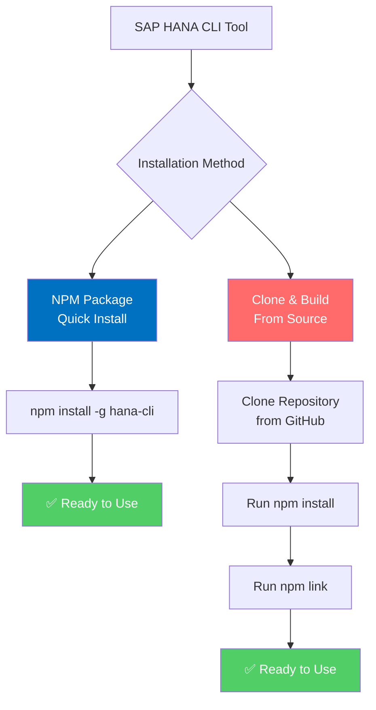
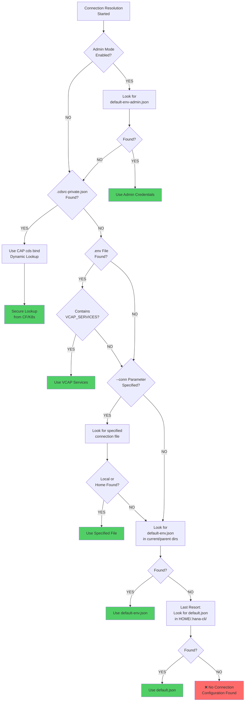

# Installation Guide

## Prerequisites

- **Node.js**: Version 20.19.0 or later
  - Download from [nodejs.org](https://nodejs.org/)
  - Verify: `node --version`

- **SAP HANA Database**: One of these options
  - Local SAP HANA Express instance
  - Remote SAP HANA server
  - SAP BTP HANA service
  - SAP HANA Cloud

- **Database Connectivity**
  - Network access to HANA server
  - Valid database user credentials

## Installation Methods



### Method 1: NPM Package (Recommended)

The quickest way to install HANA CLI globally:

```bash
npm install -g hana-cli
```

Verify the installation:

```bash
hana-cli --version
```

### Method 2: From Source

Clone and build from the repository:

```bash
# Clone the repository
git clone https://github.com/SAP-samples/hana-developer-cli-tool-example.git
cd hana-developer-cli-tool-example

# Install dependencies
npm install

# Link globally
npm link
```

### Method 3: Local Development

For development or local use:

```bash
# In project directory
npm install

# Run with npx or use directly
node bin/hana-cli
```

## Optional Additional Tools

### BTP CLI Installation

The hana-cli tool includes several commands that interact with SAP Business Technology Platform (BTP) services. All BTP-related functionality in this tool relies on the [SAP BTP Command Line Interface (btp CLI)](https://help.sap.com/docs/btp/sap-business-technology-platform/btp-cli-command-reference) being installed and available in your system's PATH.

#### About the BTP CLI

The btp CLI is SAP's official command-line tool for managing resources and services on the SAP Business Technology Platform. It provides capabilities for managing global accounts, directories, subaccounts, entitlements, service instances, and more. The hana-cli tool wraps and extends many of these capabilities with developer-friendly commands.

#### Installing the BTP CLI with install-btp.sh

For Linux and macOS users, this repository includes a convenient installation script `install-btp.sh` that automates the installation of the BTP CLI.

The script performs the following actions:

1. Downloads the latest BTP CLI installer from the SAP Development Tools download page
2. Makes the installer executable and runs it with automatic confirmation
3. Configures shell aliases for easier BTP CLI usage
4. Adds the BTP CLI binary location to your PATH

**To use the installation script:**

```shell
chmod +x install-btp.sh
./install-btp.sh
```

After running the script, you may need to restart your terminal or run `source ~/.bashrc` to apply the PATH changes.

**Note:** Windows users should download the BTP CLI from the [SAP Development Tools page](https://tools.hana.ondemand.com/#cloud-btpcli) and follow the platform-specific instructions there.

### Cloud Foundry CLI Installation

The hana-cli tool includes commands that interact with Cloud Foundry environments, particularly for managing Cloud Foundry service instances and applications. These commands depend on the [Cloud Foundry Command Line Interface (cf CLI)](https://docs.cloudfoundry.org/cf-cli/) being installed and available in your system's PATH.

#### About the Cloud Foundry CLI

The cf CLI is the official command-line tool for interacting with Cloud Foundry deployments. It provides capabilities for deploying applications, managing services, configuring routes, managing users and roles, and other Cloud Foundry operations. The hana-cli tool builds on these capabilities to provide SAP HANA-specific Cloud Foundry workflows.

#### Installing the Cloud Foundry CLI

**For Linux and macOS:**

```bash
# Using package managers (recommended)
# macOS with Homebrew
brew install cloudfoundry/tap/cf-cli8

# Linux (Ubuntu/Debian)
wget -q -O - https://packages.cloudfoundry.org/debian/cli.cloudfoundry.org.key | sudo apt-key add -
echo "deb https://packages.cloudfoundry.org/debian stable main" | sudo tee /etc/apt/sources.list.d/cloudfoundry-cli.list
sudo apt-get update
sudo apt-get install cf8-cli

# Or download directly
curl -L -o cf.tgz "https://packages.cloudfoundry.org/stable?release=linux64-binary&source=github&version=v8"
tar -xzf cf.tgz
sudo mv cf /usr/bin/cf
chmod +x /usr/bin/cf
```

**For Windows:**

Download the installer from the [official Cloud Foundry releases](https://github.com/cloudfoundry/cli/releases) and run the executable, or use a package manager if available.

Verify the installation:

```bash
cf --version
```

For detailed installation instructions and troubleshooting, refer to the [official Cloud Foundry CLI documentation](https://docs.cloudfoundry.org/cf-cli/install-go-cli.html).

### HANA Database Client (hdbsql) - Optional

The hana-cli `hdbsql` command provides a convenient way to launch the SAP HANA interactive SQL tool directly from the command line while reusing your hana-cli connectivity configuration. This is optional and only needed if you want to use this specific feature.

#### About the hdbsql Command

The `hdbsql` command in hana-cli allows you to start an interactive SAP HANA SQL session using the same connection credentials configured for hana-cli. This eliminates the need to manually specify connection parameters again. It supports credentials from:

- `default-env.json` files
- SAP CAP/CDS bindings (`cds bind`)
- Environment variables

#### Installing the HANA Database Client

If you want to use the hana-cli `hdbsql` command, you'll need to install the SAP HANA database client on your system. The `hdbsql` tool from the client package must be available in your system's PATH.

**For Linux:**

Download the HANA client package from your SAP account or SAP support portal:

```bash
# Extract the downloaded client package
tar -xzf sap-hana-client-linux.tgz
cd sap-hana-client/

# Run the installer
./hdbinst

# Follow the prompts to complete installation
```

**For macOS:**

```bash
# Download the macOS client package
# Extract and install
tar -xzf sap-hana-client-macos.tgz
cd sap-hana-client/

./hdbinst
```

**For Windows:**

Download the installer from the SAP HANA Client Software Download page and run the executable installer. You can also download from [SAP Support](https://support.sap.com/) using your login credentials.

Verify the installation:

```bash
hdbsql -version
```

For detailed installation instructions and documentation, refer to the [SAP HANA Client Installation documentation](https://help.sap.com/docs/SAP_HANA_CLIENT/8e208b44c0784f028b948958ef1d05e7/bc5b63411b584e9dbe13037c2322a234.html?locale=en-US&version=LATEST).

## Configuration

This application primarily uses the default-env.json that is often used in local development for connectivity to a remote HANA DB (although it can of course be used with a local SAP HANA, express edition instance as well). For more details on how the default-env.json works, see the readme.md of the [@sap/xsenv](https://www.npmjs.com/package/@sap/xsenv) package or the [@sap/hdi-deploy](https://www.npmjs.com/package/@sap/hdi-deploy) package.

### Connection Configuration Resolution Order

The tool doesn't simply look for a default-env.json file in the current directory however. There are numerous options and places it will look for the connection parameters. Here is the order in which it checks:



- First we look for the Admin option and use a default-env-admin.json - this overrides all other parameters
- If no admin option or if there was an admin option but no default-env-admin.json could be found in this directory or 5 parent directories, then look for `.cdsrc-private.json` in this directory or 5 parent directories and use [`cds bind`](https://cap.cloud.sap/docs/advanced/hybrid-testing#bind-to-cloud-services) functionality to lookup the credentials securely. This is the most secure option, but please note: this will make each command take a few seconds longer as credentials are no longer stored locally but looked up from cf or k8s dynamically with each command
- If no `.cdsrc-private.json` found in this directory or 5 parent directories, then look for a .env file in this directory or up to 5 parent directories
- No .env file found or it doesn't contain a VCAP_SERVICES section, then check to see if the --conn parameter was specified. If so check for that file in the current directory or up to 5 parent directories
- If the file specified via the --conn parameter wasn't found locally then check for it in the ${homedir}/.hana-cli/ folder
- If no specific configuration file was was found then look for a file named default-env.json in the current directory or up to 5 parent directories
- Last resort if nothing has been found up to this point - look for a file named default.json in the ${homedir}/.hana-cli/ folder

### 1. Connection file (`default-env.json` or `default-env-admin.json`)

Create a `default-env.json` file in your working directory:

```json
{
  "VCAP_SERVICES": {
    "hana": [{
      "credentials": {
        "host": "hana.example.com",
        "port": 30013,
        "user": "DBADMIN",
        "password": "YourPassword123!",
        "database": "HDB"
      }
    }]
  }
}
```

### 2. Environment Variables

Set the `VCAP_SERVICES` environment variable with your HANA connection details:

```bash
export VCAP_SERVICES='{
  "hana": [{
    "credentials": {
      "host": "hana.example.com",
      "port": 30013,
      "user": "DBUSER",
      "password": "yourpassword",
      "database": "SYSTEMDB"
    }
  }]
}'
```

### 3. CAP/CDS Bindings (Recommended for CAP Projects)

If you're working within a SAP CAP project that's already connected to HANA, hana-cli can automatically reuse the existing connection configuration without requiring any additional setup.

When a `.cdsrc-private.json` file exists (created by `cds bind`), hana-cli will:

1. Automatically detect the file in the current directory or parent directories
2. Use the secure credentials stored in your Cloud Foundry or Kubernetes environment
3. Connect to the same HANA database as your CAP project

This is the most secure option and requires no local credential storage. Simply run hana-cli commands from within your CAP project directory:

```bash
# From your CAP project root directory
hana-cli --help

# Your credentials are automatically resolved from .cdsrc-private.json
hana-cli alerts
```

For more information on setting up CDS bindings, see the [SAP CAP documentation on hybrid testing](https://cap.cloud.sap/docs/advanced/hybrid-testing#bind-to-cloud-services).

## Verify Installation

Test your setup:

```bash
# Show version
hana-cli --version

# List all commands
hana-cli --help

# Test database connection
hana-cli alerts -h
```

## Troubleshooting

### Connection Failed

```text
Error: Cannot connect to database
```

**Solution**: Verify your `default-env.json` file (or alternative connection method) contains correct host, port, and credentials.

### Command Not Found

```text
hana-cli: command not found
```

**Solution**: Ensure global installation succeeded. Run:

```bash
npm install -g hana-cli --force
```

### Permission Issues

If you get permission errors on Linux/Mac:

```bash
# Try with sudo (not recommended, but can work)
sudo npm install -g hana-cli

# Or fix npm permissions
mkdir ~/.npm-global
npm config set prefix '~/.npm-global'
export PATH=~/.npm-global/bin:$PATH
```

For more common issues and fixes, see the [Troubleshooting Guide](/troubleshooting/).

## Next Steps

- [Quick Start Guide](./quick-start.md)
- [Command Reference](/02-commands/)
- [Configuration Details](./configuration.md)
