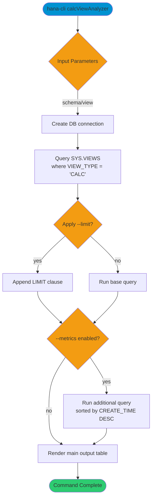

# calcViewAnalyzer

> Command: `calcViewAnalyzer`  
> Category: **Analysis Tools**  
> Status: Early Access

## Description

Analyze calculation view performance, providing detailed metrics about calculation views in your SAP HANA database. It helps identify performance bottlenecks and understand calculation view configurations.

### What is a Calculation View?

A **calculation view** is a virtual object in SAP HANA that defines how to combine and transform data from multiple sources. It's a powerful tool for creating reusable data models without creating physical tables.

Calculation views contain:

- **Data Source Nodes**: Read data from tables or other views
- **Join Nodes**: Combine data from multiple sources
- **Aggregation Nodes**: Group and summarize data
- **Union Nodes**: Combine data from disparate structures
- **SQL Script Nodes**: Execute complex logic
- **Output**: Final structure exposed to applications

Think of them as "smart queries" that you define once and reuse everywhere.

### How Are Calculation Views Used?

**Business Intelligence & Analytics:**

- **Data Warehousing**: Create data marts and dimensional models
- **Star Schema Implementation**: Combine facts with dimensions for reporting
- **KPI Calculation**: Define complex business metrics that users need
- **Aggregated Data**: Pre-aggregate high-volume data for faster reporting
- **Data Marts**: Create subject-specific views for different teams

**Application Integration:**

- **Application Views**: Provide applications only the data they need
- **Master Data Management**: Create single source of truth for customer, product, vendor data
- **Unified Views**: Present consistent data regardless of physical storage
- **API Layer**: Expose data through well-defined interfaces
- **Semantic Layer**: Add business logic and metadata on top of raw tables

**Cross-Functional Usage:**

- Finance teams use calc views to define GL balances, profit & loss, cash flow
- Sales teams use calc views for pipeline, forecast, quota calculations
- HR teams use calc views for headcount, compensation, turnover metrics
- Supply Chain teams use calc views for inventory, demand, fulfillment data

### Real-World Example

Without Calculation Views:

```text
Every analyst writes individual queries to:
  - Join CUSTOMERS, ORDERS, ORDER_ITEMS, PRODUCTS
  - Apply business rules (filter inactive customers, exclude test orders)
  - Aggregate to get sales per customer

Result: Inconsistent definitions, maintenance nightmare, performance issues
```

With Calculation Views:

```text
Define once: ORDER_SUMMARY view that:
  - Joins all necessary tables
  - Applies consistent business rules
  - Pre-aggregates data

Benefit: Analysts use the view, guaranteed consistency, better performance
```

### What Will calcViewAnalyzer Tell You?

The `calcViewAnalyzer` command provides insights into calculation view structure, performance, and issues:

#### View Metadata

- **Schema & Name**: Location of the view
- **View Type**: GRAPHICAL (visual designer) or SQL SCRIPT (code-based)
- **Description**: Purpose and usage documentation
- **Creation Date**: When the view was created
- **Last Modified**: When it was last changed

#### Validity & Status

- **IS_VALID**: Whether the view is valid (dependencies still exist)
- **Invalid References**: Which objects (tables, views) it depends on
- **Circular Dependencies**: If this view references something that references it
- **Build Status**: Whether the view needs to be recompiled

#### Structure & Components

- **Data Sources**: Which tables/views does it read from
- **Join Count**: How many tables are being joined
- **Union Count**: If it combines data from different structures
- **Aggregation Level**: What data is being grouped
- **SQL Script Complexity**: For script-based views

#### Performance Metrics

- **Execution Time**: How long queries using this view take
- **Cache Status**: Whether results are cached
- **Memory Usage**: How much RAM the view consumes
- **Row Count**: How many rows does it return
- **Join Effectiveness**: How many rows are filtered/aggregated

#### Potential Issues

- **Unused Views**: Views that nothing is using
- **Cyclic References**: Views that reference themselves indirectly
- **Missing Dependencies**: Tables deleted but view still references
- **Excessive Joins**: Too many tables joined together
- **Performance Bottlenecks**: Expensive operations in the view
- **Documentation Issues**: Missing descriptions or comments

### Why You'd Want This Analysis

**Performance Optimization:**

```bash
# Find slow-performing calculation views
hana-cli calcViewAnalyzer --schema ANALYTICS --metrics
```

Identify views taking too long to execute so you can:

- Add aggregation levels
- Push filters down to data sources
- Pre-aggregate frequently-used calculations
- Add indexes to underlying tables
- Denormalize if needed

**Maintenance & Cleanup:**

```bash
# Understand view dependencies before deletion
hana-cli calcViewAnalyzer --view OLD_REVENUE_VIEW
```

Before deleting a view, know:

- Which applications use it
- Which other views depend on it
- What data it provides

**Documentation & Governance:**

```bash
# Document all views and their structure
hana-cli calcViewAnalyzer --schema PRODUCTION
```

Create:

- Data dictionary
- Data lineage documentation
- Impact analysis before schema changes
- Compliance mapping for data governance

**Problem Investigation:**

```bash
# Understand why a report is slow
hana-cli calcViewAnalyzer --view SALES_SUMMARY --metrics
```

Find:

- Missing filters causing full scans
- Excessive joins slowing queries
- Aggregations causing memory issues
- Inefficient SQL logic

**Migration Planning:**

```bash
# Assess complexity before system migration
hana-cli calcViewAnalyzer --schema SOURCE_SYSTEM
```

Understand:

- How many views need to be migrated
- Dependencies between views
- Complexity of each view
- Which views are critical vs. optional

### Key Metrics Explained

#### Valid vs. Invalid

- Valid = All dependencies exist, view will work
- Invalid = Missing tables/views, view won't work

#### Complexity Score

- Simple (1-3 nodes) = Easy to understand and maintain
- Medium (4-6 nodes) = Moderate complexity
- Complex (7+ nodes) = May need refactoring

#### Execution Time

- < 1 second = Fast
- 1-5 seconds = Acceptable
- > 5 seconds = Slow, needs optimization

#### Join Count

- 2-3 joins = Good
- 4-6 joins = Moderate
- 7+ joins = Complex, potential performance issue

### Benefits by Role

**BI Developers**: Understand view structure and identify optimization opportunities

**Database Administrators**: Monitor view validity, dependencies, and performance

**Data Architects**: Plan data models and migration strategies

**Performance Engineers**: Identify bottlenecks and optimization targets

**Compliance Officers**: Document data lineage and access paths

**Business Analysts**: Understand what data is available through which views

## Syntax

```bash
hana-cli calcViewAnalyzer [schema] [view]
```

## Aliases

- `cva`
- `analyzeCalcView`
- `calcview`

## Command Diagram



## Parameters

### Positional Arguments

| Parameter | Type   | Description                                  |
|-----------|--------|----------------------------------------------|
| `schema`  | string | Schema filter. Default: `**CURRENT_SCHEMA**` |
| `view`    | string | View filter. Default: `*`                    |

### Options

| Option      | Alias | Type    | Default              | Description                          |
|-------------|-------|---------|----------------------|--------------------------------------|
| `--view`    | `-v`  | string  | `*`                  | Database view                        |
| `--schema`  | `-s`  | string  | `**CURRENT_SCHEMA**` | Schema                               |
| `--metrics` | `-m`  | boolean | `false`              | Include detailed performance metrics |
| `--limit`   | `-l`  | number  | `100`                | Limit results                        |
| `--profile` | `-p`  | string  | -                    | CDS Profile                          |

### Connection Parameters

| Option    | Alias | Type    | Default | Description                                      |
|-----------|-------|---------|---------|--------------------------------------------------|
| `--admin` | `-a`  | boolean | `false` | Connect via admin (default-env-admin.json)       |
| `--conn`  | -     | string  | -       | Connection filename to override default-env.json |

### Troubleshooting

| Option             | Alias     | Type    | Default | Description            |
|--------------------|-----------|---------|---------|------------------------|
| `--disableVerbose` | `--quiet` | boolean | `false` | Disable verbose output |
| `--debug`          | `-d`      | boolean | `false` | Enable debug output    |

For the runtime-generated option list, run:

```bash
hana-cli calcViewAnalyzer --help
```

## Examples

### Basic Usage

```bash
hana-cli calcViewAnalyzer
```

List calculation views in the current schema.

### Filter by Schema and View Pattern

```bash
hana-cli calcViewAnalyzer --schema MYSCHEMA --view SALES_%
```

Return calculation views in `MYSCHEMA` that match `SALES_%`.

### Use Alias with Limit

```bash
hana-cli cva -s SYS -v "*" -l 50
```

Use the short alias and cap result rows.

### Include Metrics Output

```bash
hana-cli analyzeCalcView --schema ANALYTICS --metrics
```

Run the additional metrics result set along with the base output.

## Related Commands

- `views` - List database views
- `erdDiagram` - Generate schema relationship diagrams

See the [Commands Reference](../all-commands.md) for other commands in this category.

## See Also

- [Category: Analysis Tools](..)
- [All Commands A-Z](../all-commands.md)
