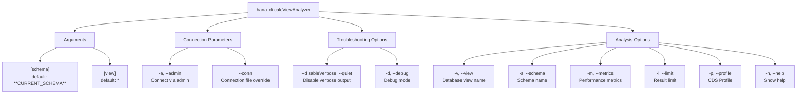

# calcViewAnalyzer

> Command: `calcViewAnalyzer`  
> Category: **Object Inspection**  
> Status: Early Access

## Description

Analyze calculation view performance, providing detailed metrics about calculation views in your SAP HANA database. It helps identify performance bottlenecks and understand calculation view configurations.

## Syntax

```bash
hana-cli calcViewAnalyzer [schema] [view] [options]
```

## Aliases

- `cva`
- `analyzeCalcView`
- `calcview`

## Command Diagram



## Parameters

### Positional Parameters

- **schema** (string): Schema name containing the calculation view
  - Default: `**CURRENT_SCHEMA**`
  - Alias: `-s, --Schema`

- **view** (string): Calculation view name (supports wildcards)
  - Default: `*`
  - Alias: `-v, --View`

### Optional Parameters

- **--metrics, -m** (boolean): Include detailed performance metrics
  - Default: `false`
  - Alias: `--Metrics`

- **--limit, -l** (number): Maximum number of results to return
  - Default: `100`
  - Alias: `--Limit`

For a complete list of parameters and options, use:

```bash
hana-cli calcViewAnalyzer --help
```

## Output

Returns calculation view metadata including:

- Schema name
- View name
- View type
- Comments
- Validity status (IS_VALID)
- Creation time (CREATE_TIME)

When `--metrics` flag is enabled, includes performance-sorted results for analysis.

## Examples

### 1. List All Calculation Views in Current Schema

```bash
hana-cli calcViewAnalyzer
```

### 2. Analyze Specific Calculation View

```bash
hana-cli cva -s MYSCHEMA -v MY_CALC_VIEW
```

### 3. Get Performance Metrics

```bash
hana-cli calcViewAnalyzer --schema PRODUCTION --metrics
```

### 4. List Calculation Views with Limit

```bash
hana-cli analyzeCalcView -s SYS --limit 50
```

## Use Cases

- **Performance Troubleshooting**: Identify slow or inefficient calculation views
- **Capacity Planning**: Understand calculation view resource usage
- **Maintenance**: Track calculation view creation and modification history
- **Migration**: Verify calculation views have been migrated correctly

## Notes

- Calculation views may require specific privileges to analyze
- Performance metrics may not be available for all views
- This command provides metadata analysis, not runtime profiling

## Related Commands

- `views` - List all database views
- `evaluatePerformance` - General database performance analysis
- `inspectView` - Get detailed view metadata

See the [Commands Reference](../all-commands.md) for other commands in this category.

## See Also

- [Category: Object Inspection](..)
- [All Commands A-Z](../all-commands.md)
