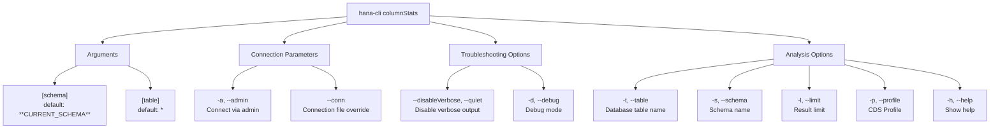

# columnStats

> Command: `columnStats`  
> Category: **Analysis Tools**  
> Status: Production Ready

## Description

Analyze column store statistics in SAP HANA tables. Provides detailed metrics about how data is stored in the column store format, including compression information, memory usage, and data distribution characteristics.

### What is Column Store Statistics?

In SAP HANA, column-store tables organize data by column rather than by row. **Column statistics** reveal how HANA is storing and managing your data:

- **Storage Efficiency**: How well data is compressed and stored
- **Memory Usage**: How much RAM is consumed by the table
- **Data Distribution**: How data is distributed across columns and partitions
- **Compression Ratios**: How effectively compression is working
- **Fragmentation**: How much data is in optimized main store vs. unoptimized delta store
- **Type Information**: Data types and their storage implications

### Types of Statistics You'll See

#### Storage Metrics

- **Uncompressed Size**: Total size if all data was stored uncompressed
- **Compressed/Main Store Size**: Actual size after HANA compression
- **Delta Store Size**: Temporary uncompressed data awaiting merge
- **Total Memory Usage**: RAM consumed including indexes and metadata
- **Compression Ratio**: Percentage of original size (lower is better)

Example: A table might be 1GB uncompressed but only 150MB compressed (15% ratio = very efficient)

#### Column-Level Metrics

- **Column Name**: Name of the column
- **Data Type**: VARCHAR, INTEGER, DECIMAL, DATE, etc.
- **Distinct Values**: How many unique values exist (cardinality)
- **NULL Count**: How many NULL values exist
- **Min/Max Values**: Range of values in the column
- **Average Size**: Average bytes per value
- **Main Store %**: Percentage in optimized store vs. delta

#### Partition Information

- **Partition ID**: Partition number
- **Partition Size**: Storage used by this partition
- **Row Count**: Number of rows in partition
- **Memory Usage**: RAM for this partition
- **Compression Level**: How well this partition compresses

### Why Column Statistics Matter

**Performance Optimization:**

- **Index Decisions**: High-cardinality columns benefit from indexes
- **Partitioning Strategy**: Non-uniform distribution suggests partitioning candidates
- **Compression Tuning**: Identify columns that don't compress well
- **Query Optimization**: Understand data distribution for query planning
- **Memory Management**: Right-size memory allocation based on actual usage

**Storage Management:**

- **Disk Space Planning**: Understand actual storage needs vs. theoretical
- **Backup Sizing**: Estimate backup sizes accurately
- **Archive Decisions**: Identify large columns for potential archiving
- **Compression Assessment**: Verify compression is working effectively
- **Growth Tracking**: Monitor storage growth over time

**Problem Investigation:**

- **Memory Pressure**: Find tables consuming excessive memory
- **Performance Issues**: Identify skewed data distributions causing slow queries
- **Fragmentation**: Find tables with high delta store ratios needing merges
- **Data Quality**: Discover columns with unexpected high NULL counts
- **Type Mismatches**: Find string columns storing numeric data

**Business Insights:**

- **Data Coverage**: Understand NULL percentage (data completeness)
- **Data Distinctness**: Know how many unique customers, products, dates, etc.
- **Data Range**: Understand value ranges for validation
- **Data Growth**: Track how fast data is growing
- **Data Characteristics**: Understand data patterns for analytics

### What Can You Do With Column Statistics?

#### 1. Optimize Compression

```bash
# Check which columns compress poorly
hana-cli columnStats --table LARGE_TABLE --schema PRODUCTION
```

Find columns with high compression ratios (bad compression) and consider:

- Changing data type (shorter/more efficient)
- Archiving old data
- Splitting into separate tables

#### 2. Identify Index Candidates

```bash
# Analysis shows CUSTOMER_ID has 50,000 distinct values out of 1M rows
hana-cli columnStats --table ORDERS
```

High-cardinality columns (many unique values) benefit most from indexes. Create indexes on columns with high distinctness.

#### 3. Plan Partitioning Strategy

```bash
# Check if data is evenly distributed across date ranges
hana-cli columnStats --table TRANSACTIONS
```

If one partition is much larger than others, consider range partitioning by date or other column.

#### 4. Investigate Memory Issues

```bash
# Find tables consuming most memory
hana-cli columnStats --schema PRODUCTION --limit 500
```

Sort by memory usage to find resource hogs. Tables with high memory usage may need:

- Archiving of old data
- Partitioning to reduce memory per partition
- Compression optimization
- Column selection (drop unused columns)

#### 5. Monitor Data Quality

```bash
# Check NULL percentages in critical columns
hana-cli columnStats --table CUSTOMERS
```

High NULL percentages indicate:

- Data entry issues
- Integration failures
- Data quality problems requiring investigation

#### 6. Fragmentation Assessment

```bash
# Check delta store percentage (fragmentation level)
hana-cli columnStats --table FREQUENTLY_UPDATED_TABLE
```

High delta store % means:

- Schedule a merge operation
- Poor query performance due to fragmentation
- Wasted memory on uncompressed data

#### 7. Capacity Planning

```bash
# Understand actual storage efficiency
hana-cli columnStats --schema PRODUCTION_DATA
```

Use compression ratios to:

- Plan future storage needs
- Estimate backup sizes
- Right-size hardware
- Budget for storage growth

#### 8. Data Type Validation

```bash
# Verify columns have appropriate data types
hana-cli columnStats --table PRODUCTS
```

Discover:

- Numeric columns stored as VARCHAR (inefficient)
- String columns that could be shorter
- Date columns stored incorrectly
- Type mismatches causing performance issues

### Interpreting Key Metrics

#### Compression Ratio: 20%

- Very good! Data compresses to 20% of original
- Typical for string-heavy tables
- No action needed

#### Compression Ratio: 80%

- Poor compression
- Consider data type changes or archiving
- Investigate why compression isn't effective

#### Distinct Values: 1M out of 1M rows

- Almost every value is unique
- Column is good for indexing
- Cardinality is very high

#### Distinct Values: 5 out of 1M rows

- Very few unique values
- Column is good for partitioning
- Index would be inefficient

#### NULL Count: 50% of rows

- Half the data is missing
- Data quality issue or column not needed
- Investigate why so many NULLs

#### Delta Store: 60%

- 60% of data is uncompressed
- Fragmentation is high
- Schedule merge operation soon

### Benefits by Role

**Database Administrators**: Monitor storage, compression, and memory efficiency

**Performance Engineers**: Optimize indexes and partitioning strategies

**Data Engineers**: Understand data characteristics for pipeline design

**Capacity Planners**: Estimate storage and hardware needs

**Data Quality Teams**: Identify NULL values and data quality issues

**Finance Team**: Right-size storage budgets based on actual metrics

## Syntax

```bash
hana-cli columnStats [schema] [table] [options]
```

## Command Diagram



## Parameters

| Option | Alias | Type | Default | Description |
| --- | --- | --- | --- | --- |
| `--schema` | `-s` | string | **CURRENT_SCHEMA** | Schema name containing the table |
| `--table` | `-t` | string | * | Table name (supports wildcards) |
| `--limit` | `-l` | number | 200 | Maximum number of results to return |
| `--profile` | `-p` | string | optional | CDS Profile to use for the connection |
| `--admin` | `-a` | boolean | false | Connect via admin user using `default-env-admin.json` |
| `--conn` | - | string | optional | Connection filename to override `default-env.json` |
| `--disableVerbose` | `--quiet` | boolean | false | Disable verbose output - removes extra output for scripting |
| `--debug` | `-d` | boolean | false | Debug mode - adds detailed output of intermediate steps |
| `--help` | `-h` | boolean | - | Show help message |

For a complete list of parameters and options, use:

```bash
hana-cli columnStats --help
```

## Examples

### Basic Usage

```bash
hana-cli columnStats --table myTable --schema MYSCHEMA --limit 200
```

### List All Tables in Current Schema

```bash
hana-cli columnStats
```

### Analyze Specific Table with Full Context

```bash
hana-cli columnStats -s MYSCHEMA -t MY_TABLE
```

### Get Statistics for Multiple Tables (Wildcard)

```bash
hana-cli columnStats --schema PRODUCTION --table "FACT_*" --limit 500
```

### Debug Column Statistics

```bash
hana-cli columnStats --schema MYSCHEMA --table myTable --debug
```

### Export Results for Scripting

```bash
hana-cli columnStats --schema MYSCHEMA --quiet --limit 1000
```

## Use Cases

- **Performance Analysis**: Analyze column store statistics to identify optimization opportunities
- **Capacity Planning**: Understand column storage usage and growth patterns
- **Troubleshooting**: Investigate storage-related performance issues
- **Auditing**: Track and monitor table and column statistics across schemas
- **Maintenance**: Identify tables that may need optimization or compression

## Notes

- The command analyzes SAP HANA column store statistics
- Wildcard patterns are supported for schema and table names
- Results are limited to 200 rows by default but can be adjusted with `--limit`
- Some columns may require specific database privileges to view

## Related Commands

- `tables` - List all tables in a schema
- `inspect-table` - Get detailed table metadata and statistics
- `table-hotspots` - Identify frequently accessed tables
- `fragmentation-check` - Check for table fragmentation

See the [Commands Reference](../all-commands.md) for other commands in this category.

## See Also

- [Category: Analysis Tools](..)
- [All Commands A-Z](../all-commands.md)
