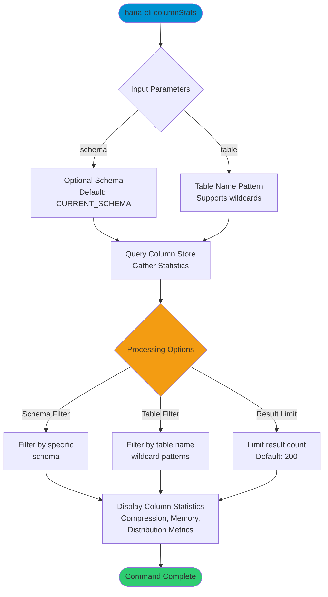

# columnStats

> Command: `columnStats`  
> Category: **Performance Monitoring**  
> Status: Production Ready

## Description

Analyze column store statistics in SAP HANA tables. Provides detailed metrics about how data is stored in the column store format, including compression information, memory usage, and data distribution characteristics.

Column statistics reveal how HANA is storing and managing your data, including storage efficiency, memory usage, data distribution, compression ratios, fragmentation levels, and type information. This enables performance optimization, capacity planning, troubleshooting, and data quality monitoring.

## Syntax

```bash
hana-cli columnStats [schema] [table] [options]
```

## Command Diagram



## Parameters

### Positional Arguments

| Parameter | Type   | Description                        |
|-----------|--------|------------------------------------|
| `schema`  | string | Schema name (default: current)     |
| `table`   | string | Table name pattern (default: `*`)  |

### Options

| Option      | Alias | Type   | Default  | Description              |
|-------------|-------|--------|----------|--------------------------|
| `--schema`  | `-s`  | string | current  | Schema to analyze        |
| `--table`   | `-t`  | string | `*`      | Table pattern (wildcard) |
| `--limit`   | `-l`  | number | `200`    | Limit results            |
| `--profile` | `-p`  | string | -        | CDS profile              |

### Connection Parameters

| Option    | Alias | Type    | Default | Description              |
|-----------|-------|---------|---------|--------------------------|
| `--admin` | `-a`  | boolean | `false` | Admin user connection    |
| `--conn`  | -     | string  | -       | Connection filename      |

### Troubleshooting

| Option             | Alias     | Type    | Default | Description             |
|--------------------|-----------|---------|---------|-------------------------|
| `--disableVerbose` | `--quiet` | boolean | `false` | Disable verbose output  |
| `--debug`          | `-d`      | boolean | `false` | Enable debug output     |
| `--help`           | `-h`      | boolean | -       | Show help message       |

For a complete list of parameters and options, use:

```bash
hana-cli columnStats --help
```

## Examples

### Basic Usage

```bash
hana-cli columnStats
```

Analyze column store statistics for all tables in the current schema.

### Analyze Specific Table

```bash
hana-cli columnStats --table myTable --schema MYSCHEMA --limit 200
```

Get detailed statistics for a specific table showing up to 200 results.

### Using Wildcard Patterns

```bash
hana-cli columnStats --schema PRODUCTION --table "FACT_*" --limit 500
```

Analyze all tables matching the wildcard pattern in the PRODUCTION schema.

### Debug Mode

```bash
hana-cli columnStats --schema MYSCHEMA --table myTable --debug
```

Run with debug output to see detailed intermediate processing steps.

### Scripting Mode

```bash
hana-cli columnStats --schema MYSCHEMA --quiet --limit 1000
```

Run with verbose output disabled for use in scripts and automation.

## Related Commands

Related commands from Performance Monitoring:

- `tables` - List all tables in a schema
- `inspectTable` - Detailed table metadata
- `tableHotspots` - Frequently accessed tables

See the [Commands Reference](../all-commands.md) for all available commands.
