# dataDiff

> Command: `dataDiff`  
> Category: **Analysis Tools**  
> Status: Production Ready

## Description

Performs detailed row-level comparison between two datasets, identifying specific columns that differ. This is useful for data validation, change tracking, and identifying discrepancies at the cell level.

### What is Data Diff?

**Data diff** is a row-by-row comparison of two datasets (tables, schemas, or even different databases) that shows:

- **Which rows match**: Identical rows in both datasets
- **Which rows are different**: Rows that exist in both but have different values
- **Column-level differences**: Exactly which columns differ and how
- **Missing rows**: Rows in source but not in target, or vice versa
- **Summary statistics**: Counts of matches, differences, and missing records

Think of it as a detailed "diff" tool like you use in code comparison—but for data.

### Why Would You Want Data Diff?

Data diff solves critical problems across your organization:

**Data Migration & Integration:**

- **Migration Validation**: Verify that data migrated correctly to a new system (row counts match, values are identical)
- **Integration Testing**: Compare data before/after integration to ensure no loss or corruption
- **System Cutover**: Validate that old and new systems have identical data before switching over
- **Database Replication**: Verify that replica databases are perfectly in sync
- **ETL Validation**: Confirm that data imported/transformed matches expected results

**Data Reconciliation:**

- **Cross-system Reconciliation**: Find discrepancies between operational system and data warehouse
- **Financial Reconciliation**: Ensure accounting records match between systems (GL, subledger, reports)
- **Inventory Accuracy**: Compare physical inventory against system records
- **Account Balancing**: Verify account balances match between source and reporting systems
- **Transaction Matching**: Match orders between sales system and fulfillment system

**Quality Assurance & Testing:**

- **Production vs. Test**: Compare production data with test environment (anonymized) to verify test data completeness
- **Regression Testing**: Verify that code changes haven't affected data correctness
- **Release Validation**: Confirm that data-related changes in a release work correctly
- **Snapshot Validation**: Compare current state against known-good snapshots
- **Bug Verification**: Confirm that bugs are fixed by comparing before/after data

**Troubleshooting & Debugging:**

- **Data Discrepancy Investigation**: Find exactly what's different when reports show wrong numbers
- **Timeline Tracking**: Compare data snapshots at different points in time to find when data changed
- **Source of Truth**: Determine which system has correct data when sources disagree
- **Audit Issues**: Track down exactly which records differ from audit trail
- **Performance Impact**: Find if schema changes or migration affected data correctness

**Compliance & Audit:**

- **Regulatory Required Reconciliations**: Document data matching between systems for compliance
- **Audit Trail**: Prove that data is accurately synchronized between systems
- **Change Documentation**: Record exactly what changed in a data update
- **Change Audit**: Verify that only authorized changes were made
- **Regulatory Reporting**: Ensure source data matches regulatory reports

### What Can You Do With Data Diff?

#### 1. Validate Database Migration

```bash
# Compare old and new database schemas after migration
hana-cli dataDiff \
  --table1 CUSTOMERS \
  --table2 CUSTOMERS \
  --schema1 LEGACY_DB \
  --schema2 NEW_DB \
  --keyColumns CUSTOMER_ID \
  --format json \
  --output migration-validation.json
```

Verify that all customer records migrated correctly and no data was lost or corrupted.

#### 2. ETL Process Validation

```bash
# Verify data imported correctly into warehouse
hana-cli dataDiff \
  --table1 SALES \
  --table2 SALES_FACT \
  --schema1 SOURCE_SYSTEM \
  --schema2 DATA_WAREHOUSE \
  --keyColumns SALE_ID \
  --compareColumns AMOUNT,CUSTOMER_ID,PRODUCT_ID \
  --showValues
```

Confirm that source data matches transformed data in warehouse.

#### 3. Financial Reconciliation

```bash
# Reconcile GL accounts between operational and reporting systems
hana-cli dataDiff \
  --table1 GENERAL_LEDGER \
  --table2 GL_REPORTING \
  --keyColumns ACCOUNT_ID,POSTING_DATE \
  --compareColumns DEBIT_AMOUNT,CREDIT_AMOUNT,BALANCE \
  --format csv \
  --output daily-reconciliation.csv
```

Find accounting discrepancies that need investigation before closing books.

#### 4. Replication Verification

```bash
# Verify database replication is working correctly
hana-cli dataDiff \
  --table1 CRITICAL_TABLE \
  --table2 CRITICAL_TABLE \
  --schema1 PRIMARY_DB \
  --schema2 REPLICA_DB \
  --limit 100000 \
  --timeout 1800
```

Confirm replica database is perfectly synchronized with primary.

#### 5. System Integration Testing

```bash
# Compare order data between order system and fulfillment system
hana-cli dataDiff \
  --table1 ORDERS \
  --table2 FULFILLMENT_ORDERS \
  --keyColumns ORDER_ID \
  --compareColumns ORDER_DATE,CUSTOMER_ID,TOTAL_AMOUNT,STATUS \
  --showValues \
  --format json
```

Ensure both systems have matching order information.

#### 6. Data Quality Checkpoint

```bash
# Compare current state with known-good snapshot
hana-cli dataDiff \
  --table1 PRODUCTS \
  --table2 PRODUCTS_SNAPSHOT_2026_02_00 \
  --keyColumns PRODUCT_ID \
  --limit 50000
```

Verify that recent changes didn't corrupt data.

#### 7. Audit Trail Comparison

```bash
# Track exactly what changed in a production update
hana-cli dataDiff \
  --table1 CUSTOMER_BACKUP_BEFORE_IMPORT \
  --table2 CUSTOMERS \
  --keyColumns CUSTOMER_ID \
  --format csv \
  --output import-changes.csv
```

Document exactly which customer records changed and how.

### Comparison Modes

#### Full Comparison

- Compares all columns between tables
- Shows every difference
- Slowest but most thorough

#### Selective Comparison

- Compare only specific columns
- Reduces output and execution time
- Use when you only care about certain fields

#### Key-based Comparison

- Groups rows by key columns
- Shows which rows exist in both/either dataset
- Find missing records quickly

### Benefits by Role

**Data Engineers**: Validate data pipelines and transformations

**Database Administrators**: Verify replication, backups, and migrations

**QA Teams**: Confirm that schema changes don't affect data correctness

**Finance Teams**: Reconcile accounts and journal entries

**Compliance Officers**: Document data synchronization for audit

**Business Analysts**: Investigate data discrepancies in systems

## Syntax

```bash
hana-cli dataDiff [options]
```

## Aliases

- `ddiff`
- `diffData`
- `dataCompare`

## Command Diagram

```mermaid
graph TD
    A["🔷 hana-cli dataDiff"]
    A --> B["📋 Required Parameters"]
    B --> B1["--table1, --t1: First table"]
    B1 --> B2["--table2, --t2: Second table"]
    B2 --> B3["-k, --keyColumns: Key columns"]
    B3 --> C["📍 Schema Parameters"]
    C --> C1["-s1, --schema1: First table schema"]
    C1 --> C2["-s2, --schema2: Second table schema"]
    C2 --> D["🔌 Connection Parameters"]
    D --> D1["-a, --admin: Connect via admin"]
    D1 --> D2["--conn: Connection file override"]
    D2 --> E["⚙️ Comparison Options"]
    E --> E1["-c, --compareColumns: Columns to compare"]
    E1 --> E2["-l, --limit: Max rows"]
    E2 --> E3["--showValues, --sv: Show values"]
    E3 --> E4["--timeout, --to: Timeout"]
    E4 --> F["🔢 Output & Format"]
    F --> F1["-o, --output: Report file"]
    F1 --> F2["-f, --format: Report format"]
    F2 --> F3["-p, --profile: CDS Profile"]
    F3 --> F4["--dryRun, --dr: Preview mode"]
    F4 --> G["🔍 Troubleshooting"]
    G --> G1["--disableVerbose, --quiet"]
    G1 --> G2["-d, --debug: Debug mode"]
    G2 --> H["✅ Help: -h, --help"]
    
    style A fill:#0070C0,color:#fff,stroke:#fff,stroke-width:2px
    style H fill:#51CF66,color:#fff,stroke:#fff,stroke-width:2px
```



## Parameters

### Positional Arguments

This command has no positional arguments.

### Required Parameters

| Parameter      | Alias | Type   | Description                                                             |
|----------------|-------|--------|-------------------------------------------------------------------------|
| `--table1`     | `-t1` | string | First table to compare                                                  |
| `--table2`     | `-t2` | string | Second table to compare                                                 |
| `--keyColumns` | `-k`  | string | Comma-separated columns for row matching (must uniquely identify rows) |

### Schema Parameters

| Option       | Alias | Type   | Default                | Description                 |
|--------------|-------|--------|------------------------|-----------------------------|
| `--schema1`  | `-s1` | string | `**CURRENT_SCHEMA**`   | Schema for first table      |
| `--schema2`  | `-s2` | string | `**CURRENT_SCHEMA**`   | Schema for second table     |

### Comparison Options

| Option              | Alias  | Type    | Default | Description                                        |
|---------------------|--------|---------|---------|----------------------------------------------------|
| `--compareColumns`  | `-c`   | string  | -       | Specific columns to compare (comma-separated)      |
| `--showValues`      | `--sv` | boolean | `false` | Include actual values in report                    |
| `--limit`           | `-l`   | number  | `10000` | Maximum rows to compare                            |
| `--timeout`         | `--to` | number  | `3600`  | Operation timeout in seconds                       |

### Output Options

| Option      | Alias               | Type    | Default     | Description                                                   |
|-------------|---------------------|---------|-------------|---------------------------------------------------------------|
| `--output`  | `-o`                | string  | -           | File path for diff report                                     |
| `--format`  | `-f`                | string  | `summary`   | Report output format. Choices: `json`, `csv`, `summary`       |
| `--dryRun`  | `--dr`, `--preview` | boolean | `false`     | Dry run mode (show what would happen)                         |

### Additional Options

| Option      | Alias | Type   | Default | Description                   |
|-------------|-------|--------|---------|-------------------------------|
| `--profile` | `-p`  | string | -       | CDS profile for connections   |

### Connection Parameters

| Option     | Alias | Type    | Default | Description                                              |
|------------|-------|---------|---------|----------------------------------------------------------|
| `--admin`  | `-a`  | boolean | `false` | Connect via admin (default-env-admin.json)               |
| `--conn`   | -     | string  | -       | Connection filename to override default-env.json         |

### Troubleshooting

| Option              | Alias     | Type    | Default | Description                                                                                              |
|---------------------|-----------|---------|---------|----------------------------------------------------------------------------------------------------------|
| `--disableVerbose`  | `--quiet` | boolean | `false` | Disable verbose output - removes all extra output that is only helpful to human readable interface       |
| `--debug`           | `-d`      | boolean | `false` | Debug hana-cli itself by adding output of LOTS of intermediate details                                   |

## Special Default Values

| Token | Resolves To | Description |
|-------|-------------|-------------|
| `**CURRENT_SCHEMA**` | Current user's schema | Used as default for schema1 and schema2 parameters |

### Usage

When `--schema1` or `--schema2` is not specified, the command automatically uses the current user's default schema. This allows for simplified commands:

```bash
# Compare tables in current schema
hana-cli dataDiff -t1 CUSTOMERS -t2 CUSTOMERS_BACKUP -k CUSTOMER_ID

# Explicit schema specification
hana-cli dataDiff -t1 CUSTOMERS -s1 PRODUCTION -t2 CUSTOMERS -s2 STAGING -k CUSTOMER_ID
```

## Output Formats

### Summary Format (Default)

Console-friendly overview:

```text
Identical: 950
Different: 45
OnlyInTable1: 3
OnlyInTable2: 2
```

### JSON Format

Structured format with detailed differences:

```json
{
  "identical": 950,
  "different": 45,
  "onlyInTable1": [...],
  "onlyInTable2": [...],
  "differences": [
    {
      "key": "12345",
      "changes": [
        {"column": "PRICE", "table1Value": 99.99, "table2Value": 89.99}
      ]
    }
  ]
}
```

### CSV Format

Tabular format for analysis:

```csv
type,key,column,table1Value,table2Value
difference,12345,PRICE,99.99,89.99
onlyInTable1,67890,,
onlyInTable2,11111,,
```

## Examples

### 1. Basic Data Diff

Find differences between two tables:

```bash
hana-cli dataDiff -t1 EMPLOYEES -t2 EMPLOYEES_UPDATED -k EMPLOYEE_ID
```

### 2. Diff across Schemas

Compare same table in different environments:

```bash
hana-cli dataDiff \
  -t1 CUSTOMERS -s1 PRODUCTION \
  -t2 CUSTOMERS -s2 STAGING \
  -k CUSTOMER_ID
```

### 3. Detailed Value Comparison

Show actual values that differ:

```bash
hana-cli dataDiff \
  -t1 PRODUCTS -t2 PRODUCTS_UPDATED \
  -k PRODUCT_ID \
  --showValues true
```

### 4. Compare Specific Columns

Focus on particular columns:

```bash
hana-cli dataDiff \
  -t1 ORDERS -t2 ORDERS_COPY \
  -k ORDER_ID \
  -c TOTAL_AMOUNT,STATUS,SHIPPING_DATE
```

### 5. JSON Report Export

Export detailed diff in JSON format:

```bash
hana-cli dataDiff \
  -t1 DATA -t2 DATA_BACKUP \
  -k ID \
  -f json \
  -o ./reports/data_differences.json
```

### 6. CSV Report for Spreadsheet Analysis

Export as CSV for Excel analysis:

```bash
hana-cli dataDiff \
  -t1 SALES -t2 SALES_ARCHIVE \
  -k TRANSACTION_ID \
  -f csv \
  -o ./reports/sales_diff.csv
```

### 7. Multi-Column Key Matching

Use composite key for row matching:

```bash
hana-cli dataDiff \
  -t1 TRANSACTIONS -t2 TRANSACTIONS_REFERENCE \
  -k ORDER_ID,LINE_ITEM,STORE_ID
```

## Use Cases

### Quality Assurance Testing

Verify test data matches expected state:

```bash
hana-cli dataDiff \
  -t1 TEST_DATA_INPUT \
  -t2 TEST_DATA_EXPECTED \
  -k TEST_ID \
  --showValues true
```

### Migration Validation

Ensure all data migrated correctly:

```bash
hana-cli dataDiff \
  -t1 SOURCE_TABLE -s1 LEGACY_SYSTEM \
  -t2 SOURCE_TABLE -s2 NEW_SYSTEM \
  -k RECORD_ID \
  -f json \
  -o ./migration_validation.json
```

### Data Integrity Monitoring

Check for unexpected changes:

```bash
hana-cli dataDiff \
  -t1 MASTER_DATA \
  -t2 MASTER_DATA_SNAPSHOT \
  -k ID \
  -o ./integrity_check.json
```

### Sync Verification

Verify two systems are in sync:

```bash
hana-cli dataDiff \
  -t1 PRODUCTS -s1 SYSTEM_A \
  -t2 PRODUCTS -s2 SYSTEM_B \
  -k SKU
```

## Performance Tips

- **Limit rows**: Use `--limit` to sample large tables first
- **Selective columns**: Compare only relevant columns
- **Composite keys**: Use multi-column keys when available for performance
- **Filter with WHERE**: Apply database-level filtering if possible

## Tips and Best Practices

1. **Test with limit first**: Use `--limit 100` before full comparison
2. **Choose correct keys**: Primary or unique keys work best
3. **One issue at a time**: Focus on specific column groups
4. **Archive reports**: Keep historical diff reports for tracking changes
5. **Share reports**: Review diff results with teammates to discuss discrepancies

## Related Commands

See the [Commands Reference](../all-commands.md) for other commands in this category.

### Primary Related Commands

- **[compareData](../data-tools/compare-data.md)** - High-level data comparison by matching rows and identifying differences
- **[dataValidator](../data-tools/data-validator.md)** - Validate data quality and integrity with rule-based validation

### Additional Related Commands

- **[export](../data-tools/export.md)** - Export data for external analysis
- **[compareSchema](../schema-tools/compare-schema.md)** - Compare schema structures between databases

## See Also

- [Category: Analysis Tools](..)
- [Category: Data Tools](../data-tools/)
- [All Commands A-Z](../all-commands.md)
