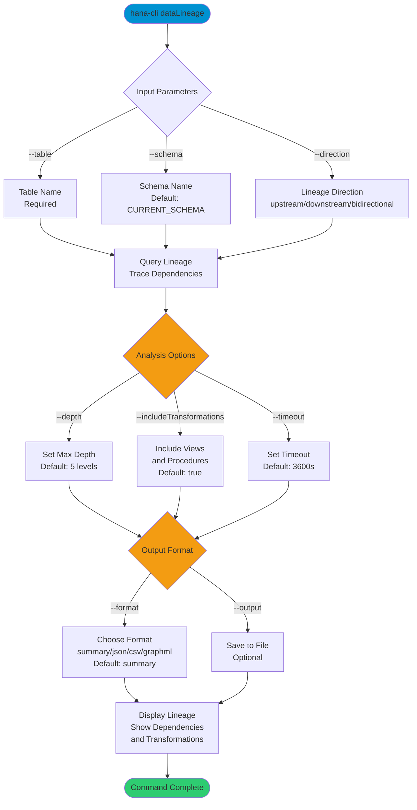

# dataLineage

> Command: `dataLineage`  
> Category: **Analysis Tools**  
> Status: Production Ready

## Description

Traces data lineage and transformations across tables. It helps visualize data flow from source tables through transformations to target tables, supporting upstream, downstream, and bidirectional lineage analysis.

### What is Data Lineage?

**Data lineage** is the complete journey of data from its origin through the system to its final destination. It documents:

- **Source Tables**: Where data originally comes from
- **Transformations**: How data is modified (joins, calculations, filters)
- **Intermediate Tables**: Views, staging tables, and temporary transformations
- **Target Tables**: Where data ends up
- **Lineage Direction**:
  - **Upstream**: All sources that feed into a table
  - **Downstream**: All tables that consume a table's data
  - **Bidirectional**: The complete flow in both directions

Think of it as tracing the DNA of your data through your system.

### Why Should You Care About Data Lineage?

Data lineage provides critical insights for managing, auditing, and troubleshooting your data:

**Troubleshooting & Problem Resolution:**

- **Root Cause Analysis**: Track down where bad data originated (wrong input source, broken transformation)
- **Impact Analysis**: Understand which downstream tables/reports are affected when a source table changes
- **Bug Identification**: Find which transformation introduced data quality issues
- **Performance Issues**: Identify expensive transformations in the data pipeline
- **Dependency Detection**: Understand what breaks when you modify or delete a table

**Data Governance & Compliance:**

- **Regulatory Requirements**: Trace data to prove compliance with GDPR, CCPA (right to know data origin)
- **Audit Trails**: Document complete data history for audit and accountability
- **Data Stewardship**: Understand data ownership chain and responsibilities
- **Privacy Protection**: Identify where personal data flows through the system
- **Risk Assessment**: Understand which critical systems depend on which data sources
- **Policy Enforcement**: Validate that sensitive data flows through appropriate channels

**Development & Maintenance:**

- **Schema Changes**: Know which downstream tables are affected before modifying a source table
- **Refactoring Safety**: Understand dependencies before consolidating or splitting tables
- **Testing Strategy**: Know which tests to run when a source table changes
- **Documentation**: Create accurate data flow diagrams for new team members
- **Integration Planning**: Understand data pipeline complexity before system integration

**Business Intelligence & Analytics:**

- **Report Debugging**: Understand why a metric is wrong by tracing it to its source
- **Data Reliability**: Understand how many transformations data goes through before appearing in reports
- **Quality Assurance**: Identify where data validation happens in the pipeline
- **Metric Definition**: Document the "recipe" for calculating key business metrics
- **Business Rules**: Trace where business logic is applied to data

**Real-World Scenarios:**

1. **Finance**: Customer reports revenue is wrong → trace which source tables feed the revenue calculation → discover customer dimension table has duplicates

2. **CRM**: Sales rep sees wrong commission amount → trace commission calculation rule → find transformation that applies discount incorrectly

3. **Healthcare**: Patient safety alert → trace medication allergies through data system → identify integration issue with pharmacy system

4. **E-commerce**: Inventory is always inaccurate → trace inventory movements through warehouse systems → find missing transformation between order system and inventory

### How to Use Data Lineage

#### 1. Root Cause Analysis

```bash
# Find where a customer table's duplicate problem originated
hana-cli dataLineage --table CUSTOMERS --direction upstream --depth 3
```

Trace upstream to find all source tables feeding into CUSTOMERS. Discover that CUSTOMER_IMPORTS table has bad data.

#### 2. Impact Analysis Before Changes

```bash
# Understand impact of changing ORDERS table
hana-cli dataLineage --table ORDERS --direction downstream --depth 5
```

See that ORDERS feeds into ORDER_SUMMARY, REVENUE_REPORT, SALES_DASHBOARD, and CUSTOMER_LIFETIME_VALUE. Know to test all these.

#### 3. Debugging Report Issues

```bash
# Trace the complete data path for a revenue report
hana-cli dataLineage --table REVENUE_REPORT --direction bidirectional --includeTransformations
```

Visualize the complete flow: SOURCE_SALES → SALES_STAGING → SALES_FACT → REVENUE_SUMMARY → REVENUE_REPORT. Identify which transformation introduces the discrepancy.

#### 4. Compliance & Audit Documentation

```bash
# Document all places where customer personal data flows
hana-cli dataLineage --table CUSTOMERS \
  --direction downstream \
  --includeTransformations \
  --format json \
  --output customer-data-flow.json
```

Generate compliance report showing where personal data is used.

#### 5. Migration Planning

```bash
# Understand dependencies before migrating dimension tables
hana-cli dataLineage --table PRODUCT_DIM \
  --direction downstream \
  --depth 10
```

Know all dependent tables that must be migrated or adjusted.

#### 6. Performance Investigation

```bash
# Identify expensive transformations in data pipeline
hana-cli dataLineage --table SALES_REPORT \
  --direction upstream \
  --includeTransformations
```

See all transformations and identify which ones are computationally expensive.

### Understanding Lineage Types

**Upstream Lineage** (Source → You)

- Shows all data sources and transformations feeding your table
- Used for: Root cause analysis, understanding data quality
- Question answered: "Where does this data come from?"

**Downstream Lineage** (You → Consumers)

- Shows all tables that consume your table's data
- Used for: Impact analysis, dependency tracking
- Question answered: "What breaks if I change this?"

**Bidirectional Lineage** (Complete Flow)

- Shows the complete data journey in both directions
- Used for: Comprehensive understanding, end-to-end debugging
- Question answered: "How does data flow through our system?"

### Benefits by Role

**Data Engineers**: Understand data pipeline dependencies and transformation logic

**Data Analysts**: Debug report issues by tracing data sources

**Database Administrators**: Know impact of schema changes before making them

**Business Analysts**: Understand data reliability and transformation rules

**Compliance Officers**: Document data flows for regulatory requirements

**IT Leadership**: Understand system interdependencies and integration points

## Syntax

```bash
hana-cli dataLineage [options]
```

## Aliases

- `lineage`
- `dataFlow`
- `traceLineage`

## Command Diagram



## Parameters

### Positional Arguments

This command has no positional arguments.

### Options

| Option                     | Alias   | Type    | Default              | Description                                                           |
|----------------------------|---------|---------|----------------------|-----------------------------------------------------------------------|
| `--table`                  | `-t`    | string  | -                    | Name of the table to trace lineage for                               |
| `--schema`                 | `-s`    | string  | `**CURRENT_SCHEMA**` | Schema name containing the table                                      |
| `--direction`              | `--dir` | string  | `upstream`           | Lineage direction. Choices: `upstream`, `downstream`, `bidirectional` |
| `--depth`                  | `--dp`  | number  | `5`                  | Maximum lineage depth to trace                                        |
| `--includeTransformations` | `--it`  | boolean | `true`               | Include views, procedures, and transformations in lineage             |
| `--output`                 | `-o`    | string  | -                    | Output file path for the lineage report                               |
| `--format`                 | `-f`    | string  | `summary`            | Output format. Choices: `summary`, `json`, `csv`, `graphml`           |
| `--timeout`                | `--to`  | number  | `3600`               | Operation timeout in seconds                                          |
| `--profile`                | `-p`    | string  | -                    | Connection profile to use                                             |

### Connection Parameters

| Option    | Alias | Type    | Default | Description                                          |
|-----------|-------|---------|---------|------------------------------------------------------|
| `--admin` | `-a`  | boolean | `false` | Connect via admin (default-env-admin.json)           |
| `--conn`  | -     | string  | -       | Connection filename to override default-env.json     |

### Troubleshooting

| Option              | Alias     | Type    | Default | Description                                                                                              |
|---------------------|-----------|---------|---------|----------------------------------------------------------------------------------------------------------|
| `--disableVerbose`  | `--quiet` | boolean | `false` | Disable verbose output - removes all extra output that is only helpful to human readable interface       |
| `--debug`           | `-d`      | boolean | `false` | Debug hana-cli itself by adding output of LOTS of intermediate details                                   |
| `--help`            | `-h`      | boolean | -       | Show help message                                                                                        |

For a complete list of parameters and options, use:

```bash
hana-cli dataLineage --help
```

## Lineage Directions

- **upstream** (default) - Trace source tables and data origins
- **downstream** - Trace dependent tables that use this table
- **bidirectional** - Trace both upstream sources and downstream dependents

## Output Formats

### Summary (default)

```bash
Data Lineage Report
===================

Root Table: SALES_ORDERS
Direction: upstream
Depth: 5

Source Tables: 3
Target Tables: 2
Transformations: 4

Nodes:
  SALES_ORDERS (Level 0)
  ORDERS (Level 1)
  CUSTOMERS (Level 1)
  PRODUCTS (Level 1)
  PRODUCT_CATEGORIES (Level 2)
  ... and 5 more nodes

Transformations:
  VIEW: V_SALES_SUMMARY
  VIEW: V_ORDER_DETAILS
  ... and 2 more transformations
```

### JSON

```json
{
  "rootTable": "SALES_ORDERS",
  "direction": "upstream",
  "depth": 5,
  "sourceCount": 3,
  "targetCount": 2,
  "transformationCount": 4,
  "nodes": [
    {
      "id": "SALES.SALES_ORDERS",
      "name": "SALES_ORDERS",
      "schema": "SALES",
      "type": "table",
      "level": 0
    },
    {
      "id": "SALES.ORDERS",
      "name": "ORDERS",
      "schema": "SALES",
      "type": "table",
      "level": 1
    }
  ],
  "edges": [
    {
      "source": "SALES.ORDERS",
      "target": "SALES.SALES_ORDERS",
      "type": "data_flow",
      "label": "join"
    }
  ],
  "transformations": [
    {
      "source": "ORDERS",
      "transformation": "V_SALES_SUMMARY",
      "type": "VIEW",
      "definition": "SELECT order_id, SUM(amount)..."
    }
  ]
}
```

### GraphML (for visualization tools)

GraphML is an XML format that can be imported into graph visualization tools like yEd, Gephi, or Cytoscape.

```xml
<?xml version="1.0" encoding="UTF-8"?>
<graphml xmlns="http://graphml.graphdrawing.org/xmlns">
  <graph edgedefault="directed">
    <node id="SALES.SALES_ORDERS" label="SALES_ORDERS"/>
    <node id="SALES.ORDERS" label="ORDERS"/>
    <edge source="SALES.ORDERS" target="SALES.SALES_ORDERS" label="data_flow"/>
  </graph>
</graphml>
```

### CSV

```csv
Source,Target,Type,Label
"SALES.ORDERS","SALES.SALES_ORDERS","data_flow","join"
"SALES.CUSTOMERS","SALES.ORDERS","data_flow","reference"
"SALES.PRODUCTS","SALES.ORDERS","data_flow","reference"
```

## Understanding Lineage

### Nodes

Represent database objects (tables, views, transformations) at different levels of the lineage graph.

### Edges

Represent data flow relationships between nodes.

### Transformations

Views, stored procedures, functions, or other objects that transform data from source to target.

### Levels

- Level 0: Your root table
- Level 1: Direct dependencies
- Level 2+: Indirect dependencies based on specified depth

## Examples

### Upstream lineage (data sources)

```bash
hana-cli dataLineage --table SALES_ORDERS \
  --direction upstream \
  --depth 3
```

### Downstream lineage (data consumers)

```bash
hana-cli dataLineage --table SALES_ORDERS \
  --direction downstream \
  --depth 5
```

### Bidirectional with GraphML export

```bash
hana-cli dataLineage --table SALES_ORDERS \
  --direction bidirectional \
  --format graphml \
  --output lineage.graphml
```

### Detailed JSON lineage including transformations

```bash
hana-cli dataLineage --table CUSTOMER_ANALYTICS \
  --direction upstream \
  --includeTransformations true \
  --format json \
  --output customer-lineage.json
```

## Use Cases

### Impact Analysis

Understand what tables and dashboards will be affected by changes to a source table.

```bash
# Find all downstream consumers of a table
hana-cli dataLineage --table CUSTOMER_MASTER \
  --direction downstream \
  --depth 10 \
  --format json \
  --output impact-analysis.json
```

### Data Quality Audits

Trace data from source systems to identify where quality issues originate.

```bash
# Trace data from raw tables to final analytical views
hana-cli dataLineage --table RAW_CUSTOMER_DATA \
  --direction downstream \
  --includeTransformations true
```

### Compliance and Audit Trail

Document data transformations and flows for compliance purposes.

```bash
# Export complete lineage for sensitive data
hana-cli dataLineage --table CUSTOMER_PII \
  --direction bidirectional \
  --format graphml \
  --output compliance-lineage.graphml
```

## Advanced Scenarios

### Multi-Schema Tracing

```bash
hana-cli dataLineage --table SALES_ORDERS \
  --schema OPERATIONAL \
  --direction upstream
```

### Deep Lineage for Complex ETL

```bash
hana-cli dataLineage --table FINAL_ANALYTICS_TABLE \
  --direction upstream \
  --depth 20 \
  --includeTransformations true \
  --format json \
  --output deep-lineage.json
```

## Return Codes

- `0` - Lineage trace completed successfully
- `1` - Trace failed or database connection issue

## Performance Tips

1. Limit `--depth` for large, interconnected schemas
2. Use `--includeTransformations false` if transformations aren't needed
3. Export to file for large lineage graphs
4. Use GraphML format for visualization in external tools

## Visualizing Lineage

### With GraphML

```bash
# Generate GraphML
hana-cli dataLineage --table SALES_ORDERS \
  --direction bidirectional \
  --format graphml \
  --output sales-lineage.graphml

# Open in visualization tool (e.g., Cytoscape, Gephi)
```

### With JSON

```bash
# Generate JSON
hana-cli dataLineage --table SALES_ORDERS \
  --format json \
  --output sales-lineage.json

# Create custom visualization using your preferred tool
```

## Related Commands

- `dataProfile` - Generate statistical profiles
- `compareData` - Compare table data with configurable matching and reporting

See the [Commands Reference](../all-commands.md) for other commands in this category.

## See Also

- [Category: Analysis Tools](..)
- [All Commands A-Z](../all-commands.md)
