# dataProfile

> Command: `dataProfile`  
> Category: **Analysis Tools**  
> Status: Early Access

## Description

Generates comprehensive data quality metrics and statistical analysis for database tables. It analyzes NULL values, data distribution, uniqueness, and string patterns—useful for data quality assessment, understanding data characteristics, and identifying potential data issues.

### What is Data Profiling?

**Data profiling** is the process of examining actual data in your database to understand its characteristics, quality, and structure. It goes beyond table schema to analyze:

- **Data Distribution**: How data values are spread across the column
- **Data Quality**: Presence of NULL values, duplicates, invalid formats
- **Statistical Patterns**: Min/max values, averages, standard deviations
- **Uniqueness**: How many distinct values exist (cardinality)
- **Format Patterns**: String lengths, patterns, and data type compliance

Think of it as an X-ray of your data that reveals what's actually there, not just what the schema says should be there.

### Why is Data Profiling Important?

Data profiling provides critical insights that go beyond basic table structure:

**Data Quality Assessment:**

- **Hidden Issues**: Discover NULL values, invalid formats, or unexpected data types that violate assumptions
- **Data Validity**: Identify strings where numbers should be, or negative values where only positives are expected
- **Format Violations**: Find phone numbers, dates, or codes that don't match the expected format
- **Range Violations**: Discover values outside acceptable ranges (age > 150, prices < 0)
- **Completeness**: Understand what percentage of data is missing (NULL)

**Understanding Your Data:**

- **Cardinality Analysis**: Know how many unique values exist (is this really a "unique ID"?)
- **Distribution Patterns**: Understand if data is evenly distributed or has hot spots
- **Real-World Constraints**: Discover actual business rules vs. documented rules
- **Data Type Reality**: Confirm that columns actually contain the data type they claim
- **Time-Based Patterns**: Identify trends over time in data values

**Business Impact:**

- **Correct Reporting**: Base decisions on accurate understanding of data
- **Risk Identification**: Uncover data quality issues before they cause problems
- **Better Queries**: Write more efficient queries once you understand data distribution
- **Integration Planning**: Know data quality requirements for system integrations
- **Regulatory Compliance**: Document and validate data governance requirements
- **Root Cause Analysis**: Understand why reports differ from expectations

**Operational Benefits:**

- **Migration Planning**: Understand data complexity before migrating to new systems
- **Index Strategy**: Know which columns benefit most from indexing based on cardinality
- **Performance Tuning**: Identify columns with skewed distributions (partitioning candidates)
- **Data Cleanup**: Prioritize data quality improvements based on impact areas
- **Documentation**: Create accurate data dictionaries with real statistics

### Use Cases for Data Profiling

#### 1. New Project Kickoff

```bash
# Profile all tables in a new schema
hana-cli dataProfile --schema LEGACY_SYSTEM --cardinalityAnalysis --statisticalAnalysis
```

Understand the data you've inherited or integrated.

#### 2. Data Quality Initiative

```bash
# Identify columns with data quality issues
hana-cli dataProfile --table CUSTOMERS \
  --nullAnalysis \
  --patternAnalysis \
  --format json \
  --output customer-quality-report.json
```

Find specific columns that need data cleansing.

#### 3. Performance Tuning

```bash
# Analyze cardinality for indexing decisions
hana-cli dataProfile --table ORDERS \
  --cardinalityAnalysis \
  --columns ORDER_ID,CUSTOMER_ID,STATUS,ORDER_DATE
```

Identify which columns have high selectivity for indexes.

#### 4. Data Governance Documentation

```bash
# Generate statistical profile for data dictionary
hana-cli dataProfile --table PRODUCTS \
  --statisticalAnalysis \
  --format csv \
  --output products-statistics.csv
```

Create accurate documentation of real data characteristics.

#### 5. Pre-Migration Validation

```bash
# Compare profiles before and after migration
hana-cli dataProfile --schema PRODUCTION --limit 1000000
```

Verify data integrity after system migration.

#### 6. Report Accuracy Verification

```bash
# Debug why summary report shows 0 customers
hana-cli dataProfile --table CUSTOMERS --nullAnalysis --cardinalityAnalysis
```

Verify that key columns contain expected data.

## Syntax

```bash
hana-cli dataProfile [options]
```

## Aliases

- `prof`
- `profileData`
- `dataStats`

## Command Diagram

```mermaid
graph TD
    A["hana-cli dataProfile"] --> B["Required Parameters"]
    A --> C["Schema & Connection"]
    A --> D["Troubleshooting Options"]
    A --> E["Column Selection"]
    A --> F["Analysis Options"]
    A --> G["Performance Options"]
    A --> H["Output & Format"]
    
    B --> B1["-t, --table<br/>Target table name"]
    
    C --> C1["-s, --schema<br/>Target schema name"]
    C --> C2["-a, --admin<br/>Connect via admin"]
    C --> C3["--conn<br/>Connection file override"]
    
    D --> D1["--disableVerbose, --quiet<br/>Disable verbose output"]
    D --> D2["-d, --debug<br/>Debug mode"]
    
    E --> E1["-c, --columns<br/>Columns to profile"]
    
    F --> F1["--nullAnalysis, --na<br/>NULL value analysis"]
    F --> F2["--cardinalityAnalysis, --ca<br/>Distinct value analysis"]
    F --> F3["--statisticalAnalysis, --sa<br/>Min/Max/Avg analysis"]
    F --> F4["--patternAnalysis, --pa<br/>String length patterns"]
    
    G --> G1["--sampleSize, --ss<br/>Max rows to analyze"]
    G --> G2["--timeout, --to<br/>Operation timeout"]
    
    H --> H1["-o, --output<br/>Report file path"]
    H --> H2["-f, --format<br/>Report format"]
    H --> H3["-p, --profile<br/>CDS Profile"]
    H --> H4["-h, --help<br/>Show help"]
```



## Parameters

| Option | Alias | Type | Default | Description |
| --- | --- | --- | --- | --- |
| `--table` | `-t` | string | required | Table to profile |
| `--schema` | `-s` | string | **CURRENT_SCHEMA** | Schema containing the table |
| `--columns` | `-c` | string | optional | Specific columns to profile (comma-separated) |
| `--nullAnalysis` | `--na` | boolean | true | Include NULL value analysis |
| `--cardinalityAnalysis` | `--ca` | boolean | true | Include distinct value count |
| `--statisticalAnalysis` | `--sa` | boolean | true | Include min/max/avg analysis |
| `--patternAnalysis` | `--pa` | boolean | false | Include string length analysis |
| `--sampleSize` | `--ss` | number | 10000 | Maximum rows to analyze |
| `--timeout` | `--to` | number | 3600 | Operation timeout in seconds |
| `--output` | `-o` | string | optional | File path to save profile report |
| `--format` | `-f` | string | summary | Report output format (json, csv, summary) |
| `--profile` | `-p` | string | optional | CDS profile for connections |
| `--admin` | `-a` | boolean | false | Connect via admin (default-env-admin.json) |
| `--conn` | - | string | optional | Connection filename override |
| `--disableVerbose` | `--quiet` | boolean | false | Disable verbose output |
| `--debug` | `-d` | boolean | false | Debug mode - adds detailed output |
| `--help` | `-h` | boolean | - | Show help message |

For a complete list of parameters and options, use:

```bash
hana-cli dataProfile --help
```

## Output Metrics

### NULL Analysis

- NULL count per column
- NULL percentage
- Completeness ratio (1 - NULL%)

### Cardinality Analysis

- Distinct value count
- Cardinality ratio (distinct / total)
- Data uniqueness assessment

### Statistical Analysis

- Minimum value
- Maximum value
- Average value
- Applicable to numeric columns

### Pattern Analysis

- Minimum string length
- Maximum string length
- Average string length
- Useful for identifying data format issues

### Value Distribution

- Top 5 most frequent values
- Value frequency counts

## Output Formats

### Summary Format (Default)

Console-friendly overview showing key metrics per column.

### JSON Format

Structured format with complete metrics and metadata:

```json
{
  "table": "EMPLOYEES",
  "rowCount": 10000,
  "columnCount": 15,
  "columns": {
    "SALARY": {
      "nullCount": 5,
      "distinctCount": 8942,
      "minValue": 25000,
      "maxValue": 250000,
      "avgValue": 85432.50,
      "topValues": [...]
    }
  }
}
```

### CSV Format

Tabular format for analysis and comparison.

## Examples

### 1. Basic Table Profile

Quick overview of table data:

```bash
hana-cli dataProfile -t EMPLOYEES
```

### 2. Profile Specific Columns

Analyze selected columns only:

```bash
hana-cli dataProfile -t CUSTOMERS -c NAME,EMAIL,PHONE,ADDRESS
```

### 3. Detailed JSON Report

Export comprehensive profile:

```bash
hana-cli dataProfile \
  -t SALES_DATA \
  -f json \
  -o ./analysis/sales_profile.json
```

### 4. Include Pattern Analysis

Analyze string properties:

```bash
hana-cli dataProfile \
  -t PRODUCTS \
  --patternAnalysis true \
  -o ./analysis/product_patterns.json
```

### 5. Schema-Specific Profile

Profile table in non-default schema:

```bash
hana-cli dataProfile -t CUSTOMERS -s BUSINESS_UNIT_1
```

### 6. CSV Format for Spreadsheet

Export profile in CSV format:

```bash
hana-cli dataProfile \
  -t DATA \
  -f csv \
  -o ./analysis/data_profile.csv
```

## Use Cases

### Data Quality Assessment

Check overall quality of imported data:

```bash
hana-cli dataProfile \
  -t IMPORTED_DATA \
  -f json \
  -o ./quality_assessment.json
```

### Data Discovery

Understand new dataset characteristics:

```bash
hana-cli dataProfile \
  -t NEW_CUSTOMER_DATA \
  -c CUSTOMER_ID,NAME,EMAIL,PHONE,ZIP_CODE
```

### Identify Data Issues

Find columns that might have problems:

```bash
hana-cli dataProfile \
  -t PRODUCTS \
  --patternAnalysis true
```

### Performance Analysis

Understand data volume before optimization:

```bash
hana-cli dataProfile -t LARGE_TABLE --sampleSize 50000
```

### Data Governance

Document data characteristics for compliance:

```bash
hana-cli dataProfile \
  -t PROTECTED_DATA \
  -f json \
  -o ./governance/data_profile.json
```

## Performance Considerations

- **Sample size**: Reduce `--sampleSize` for faster profiling of huge tables
- **Pattern analysis**: Only use `--patternAnalysis` when needed (string analysis is slower)
- **Column filtering**: Profile only necessary columns
- **Timeout**: Increase for large datasets with complex analysis

## Quality Assessment Matrix

Use profile results to assess data quality:

| Metric | Good | Warning | Bad |
| --- | --- | --- | --- |
| NULL % | < 5% | 5-20% | > 20% |
| Cardinality | Near 100% | 50-100% | < 50% |
| Min/Max Range | Reasonable | Extreme range | Outliers present |
| Top values | Well distributed | Few dominant values | Single value dominates |

## Data Quality Red Flags

- High NULL percentage (> 20%)
- Unexpected NULL values in key columns
- Extremely low cardinality (few distinct values)
- Min/max values with obvious outliers
- Single value dominating distribution
- Empty strings mixed with NULLs

## Tips and Best Practices

1. **Profile before importing**: Understand source data quality
2. **Regular profiling**: Schedule periodic profiles for monitoring
3. **Compare profiles**: Run profiles on backup to identify changes
4. **Document findings**: Keep profile reports for reference
5. **Focus on key columns**: Profile business-critical columns first
6. **Use patterns**: Identify string format issues (zip codes, emails)
7. **Set appropriate samples**: Balance accuracy with performance

## Related Commands

- **`compareData`** - Compare data between tables
- **`dataDiff`** - Show detailed row differences
- **`compareSchema`** - Compare schema structures
- **`export`** - Export data for external analysis
- **`querySimple`** - Run custom analytical queries

See the [Commands Reference](../all-commands.md) for other commands in this category.

## See Also

- [Category: Analysis Tools](..)
- [All Commands A-Z](../all-commands.md)
