# duplicateDetection

> Command: `duplicateDetection`  
> Category: **System Tools**  
> Status: Production Ready

## Description

Finds duplicate records in HANA tables using various matching strategies. It supports exact matching, fuzzy matching with similarity thresholds, and partial key matching to identify near-duplicates.

### What Are Duplicate Records?

**Duplicate records** are multiple entries in a table that represent the same real-world entity but were entered separately. Common examples:

- Same customer entered twice with slightly different names (John Smith vs. Jon Smith)
- Same product created multiple times due to system errors
- Duplicate transactions from failed batch retries
- Data imported twice due to incomplete cleanup

### Why Is Duplicate Detection Critical?

Duplicate data creates significant problems across your organization:

**Data Quality Issues:**

- **False Uniqueness**: Records that should be unique (customers, products) appear multiple times
- **Skewed Metrics**: Counts, aggregations, and statistics become inaccurate
- **Broken Relationships**: Foreign key references may point to wrong duplicate copies
- **Data Inconsistency**: Updates to one copy don't reflect in other duplicates

**Business Impact:**

- **Incorrect Revenue**: Duplicate customer records inflate customer counts and revenue figures
- **Invalid Analytics**: Reports show wrong trends, patterns, and insights
- **Marketing Waste**: Marketing campaigns target duplicate customer records unnecessarily
- **Compliance Risk**: Regulations (GDPR, CCPA) require accurate, non-redundant personal data
- **Loss of Trust**: Duplicate billing or communications damage customer relationships
- **Decision Errors**: Leadership makes decisions based on inflated or inaccurate data

**Operational & Financial Impact:**

- **Processing Waste**: Systems process duplicate records unnecessarily (storage, memory, CPU)
- **Storage Growth**: Database grows unnecessarily with redundant data
- **Manual Cleanup Costs**: Requires time-consuming manual review and merging
- **Integration Failures**: Other systems reject or duplicate data when integrating duplicates
- **Customer Support Issues**: Customers report receiving duplicate communications or bills
- **System Performance**: More records mean slower queries and reports

**Common Real-World Scenarios:**

1. **E-commerce**: Customer "John Smith" entered as "Jon Smith" and "John Smyth" → duplicate orders and shipping
2. **Healthcare**: Patient registered twice under slightly different spellings → medication overdose risk
3. **CRM**: Company "ABC Corp" and "ABC Corporation" tracked as different accounts → lost sales tracking
4. **Finance**: Same invoice processed twice → double-counting revenue
5. **Manufacturing**: Part number "A001" and "A-001" treated as different items → inventory mismatch

### How Duplicate Detection Helps

#### 1. Data Quality Assurance

```bash
# Identify duplicate customers by key columns
hana-cli duplicateDetection \
  --table CUSTOMERS \
  --keyColumns CUSTOMER_EMAIL \
  --mode exact
```

Find exact duplicates so you can decide which record to keep.

#### 2. Fuzzy Matching for Near-Duplicates

```bash
# Find similar customer names (typos, variations)
hana-cli duplicateDetection \
  --table CUSTOMERS \
  --keyColumns FIRST_NAME,LAST_NAME \
  --mode fuzzy \
  --threshold 85
```

Discover records that are similar but not identical (85% match threshold).

#### 3. Post-Migration Validation

```bash
# Ensure migration didn't create duplicates
hana-cli duplicateDetection \
  --table PRODUCTS \
  --checkColumns PRODUCT_SKU,PRODUCT_NAME \
  --limit 100000
```

Verify data integrity after system migration or import.

#### 4. Merge Strategy Planning

```bash
# Generate detailed duplicate report for analysis
hana-cli duplicateDetection \
  --table SUPPLIERS \
  --keyColumns SUPPLIER_NAME,COUNTRY \
  --mode fuzzy \
  --threshold 90 \
  --format json \
  --output duplicates-analysis.json
```

Export duplicates for review and decision-making before merging.

#### 5. Ongoing Monitoring

```bash
# Regular duplicate checks as part of data governance
hana-cli duplicateDetection \
  --table vendor_contracts \
  --checkColumns vendor_id,contract_number \
  --mode exact \
  --output daily-dups.csv
```

Monitor for new duplicates introduced by ongoing operations.

## Syntax

```bash
hana-cli duplicateDetection [options]
```

## Aliases

- `dupdetect`
- `findDuplicates`
- `duplicates`

## Command Diagram

```mermaid
graph TD
    A["🔷 hana-cli duplicateDetection"]
    A --> B["📋 Required Parameters"]
    B --> B1["-t, --table: Table to check"]
    B1 --> B2["-k, --keyColumns: Key columns"]
    B2 --> C["📍 Schema & Connection"]
    C --> C1["-s, --schema: Schema for table"]
    C1 --> C2["-a, --admin: Connect via admin"]
    C2 --> C3["--conn: Connection file override"]
    C3 --> D["📊 Column Selection"]
    D --> D1["-c, --checkColumns: Columns to check"]
    D1 --> D2["-e, --excludeColumns: Exclude columns"]
    D2 --> E["🔬 Detection Options"]
    E --> E1["-m, --mode: exact/fuzzy/partial"]
    E1 --> E2["--threshold, --th: Match threshold"]
    E2 --> E3["-l, --limit: Max rows to check"]
    E3 --> E4["--timeout, --to: Timeout"]
    E4 --> F["🔢 Output & Format"]
    F --> F1["-o, --output: Report file"]
    F1 --> F2["-f, --format: Report format"]
    F2 --> F3["-p, --profile: CDS Profile"]
    F3 --> G["🔍 Troubleshooting"]
    G --> G1["--disableVerbose, --quiet"]
    G1 --> G2["-d, --debug: Debug mode"]
    G2 --> H["✅ Help: -h, --help"]
    
    style A fill:#0070C0,color:#fff,stroke:#fff,stroke-width:2px
    style H fill:#51CF66,color:#fff,stroke:#fff,stroke-width:2px
```



| Option | Alias | Type | Default | Description |
| --- | --- | --- | --- | --- |
| `--table` | `-t` | string | required | Name of the table to check |
| `--schema` | `-s` | string | optional | Schema name (uses current if omitted) |
| `--keyColumns` | `-k` | string | required | Comma-separated key columns for matching |
| `--checkColumns` | `-c` | string | optional | Specific columns to compare (if omitted, all are used) |
| `--excludeColumns` | `-e` | string | optional | Columns to skip during duplicate detection |
| `--mode` | `-m` | string | exact | Detection mode: `exact`, `fuzzy`, `partial` |
| `--threshold` | `-th` | number | 0.95 | Similarity threshold for fuzzy matching (0-1) |
| `--output` | `-o` | string | optional | Output file path for the report |
| `--format` | `-f` | string | summary | Report format: `json`, `csv`, `summary` |
| `--limit` | `-l` | number | 10000 | Maximum rows to check |
| `--timeout` | `-to` | number | 3600 | Operation timeout in seconds |
| `--profile` | `-p` | string | optional | Connection profile to use |

For a complete list of parameters and options, use:

```bash
hana-cli duplicateDetection --help
```

## Detection Modes

- **exact** (default) - Find identical values in key columns
- **fuzzy** - Find similar values using Levenshtein distance and similarity threshold
- **partial** - Find duplicates using only first key column

## Similarity Threshold

The threshold determines what counts as a match in fuzzy mode:

- `1.0` (100%) - Exact match only
- `0.95` (95%) - Allow 1-2 character differences per field
- `0.90` (90%) - Allow 3-4 character differences per field
- `0.85` (85%) - More lenient matching

## Output Examples

### Summary (default)

```bash
Duplicate Detection Report
==========================

Total Rows: 10000
Unique Rows: 9850
Duplicate Groups: 75
Total Duplicates: 150

Duplicate Groups:
  Group: John||Smith, Records: 2, Match: 100%
  Group: John||Smyth, Records: 3, Match: 95%
  Group: Jane||Doe, Records: 2, Match: 100%
  ...
```

### JSON

```json
{
  "totalRows": 10000,
  "uniqueRows": 9850,
  "duplicateGroups": 75,
  "totalDuplicates": 150,
  "duplicates": [
    {
      "matchKey": "John||Smith",
      "matchPercentage": 100,
      "count": 2,
      "records": [
        {
          "rowNumber": 5,
          "data": { "FIRST_NAME": "John", "LAST_NAME": "Smith", ... }
        },
        {
          "rowNumber": 1250,
          "data": { "FIRST_NAME": "John", "LAST_NAME": "Smith", ... }
        }
      ]
    }
  ]
}
```

### CSV

```csv
Group,Rows,Similarity
"John||Smith",2,100%
"John||Smyth",3,95%
"Jane||Doe",2,100%
```

## Understanding Results

### Exact Matches

All values in key columns are identical. These are definite duplicates.

### Fuzzy Matches

Values are similar but not identical. The similarity percentage indicates how close they are.

### Partial Matches

Duplicates identified based on a subset of key columns.

## Examples

### Exact duplicate detection

```bash
hana-cli duplicateDetection --table CUSTOMERS \
  --keyColumns "FIRST_NAME,LAST_NAME" \
  --mode exact
```

### Fuzzy duplicate detection with threshold

```bash
hana-cli duplicateDetection --table CUSTOMERS \
  --keyColumns "FIRST_NAME,LAST_NAME" \
  --mode fuzzy \
  --threshold 0.90 \
  --format json \
  --output duplicates.json
```

### Exclude specific columns

```bash
hana-cli duplicateDetection --table PRODUCTS \
  --keyColumns "SKU" \
  --excludeColumns "CREATED_DATE,MODIFIED_DATE" \
  --limit 50000
```

### Partial matching

```bash
hana-cli duplicateDetection --table SUPPLIERS \
  --keyColumns "COMPANY_NAME" \
  --mode partial
```

## Handling Duplicates

After identifying duplicates, you can:

1. **Report Only** - Generate report and review manually
2. **Tag Records** - Add a flag/status column to mark duplicates
3. **Merge Records** - Combine duplicate records into one
4. **Delete Duplicates** - Remove duplicate entries (keep first occurrence)
5. **Review Process** - Use data steward process to determine action

Example workflow:

```bash
# Step 1: Identify fuzzy duplicates
hana-cli duplicateDetection --table CUSTOMERS \
  --keyColumns "FIRST_NAME,LAST_NAME,EMAIL" \
  --mode fuzzy --threshold 0.92 \
  --format json --output duplicates.json

# Step 2: Review and manually validate
# (Review duplicates.json and create merge/delete list)

# Step 3: Execute cleanup
# (Use data governance process or scripts)
```

## Return Codes

- `0` - Detection completed successfully
- `1` - Detection error or database connection issue

## Performance Tips

1. Use `exact` mode for better performance on large tables
2. Use `--limit` to test on a subset first
3. Specify key columns prudently
4. Use `--excludeColumns` to skip irrelevant columns
5. Increase `--threshold` for faster fuzzy matching

## Related Commands

- `dataValidator` - Validate data against business rules
- `referentialCheck` - Verify referential integrity
- `dataLineage` - Trace data lineage and transformations
- `dataProfile` - Generate statistical profiles

See the [Commands Reference](../all-commands.md) for other commands in this category.

## See Also

- [Category: System Tools](..)
- [All Commands A-Z](../all-commands.md)
