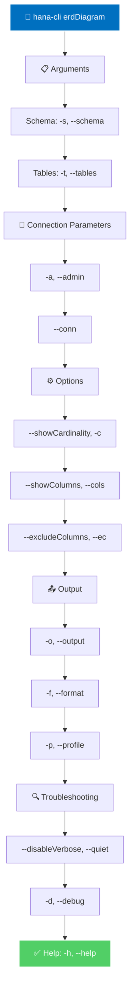
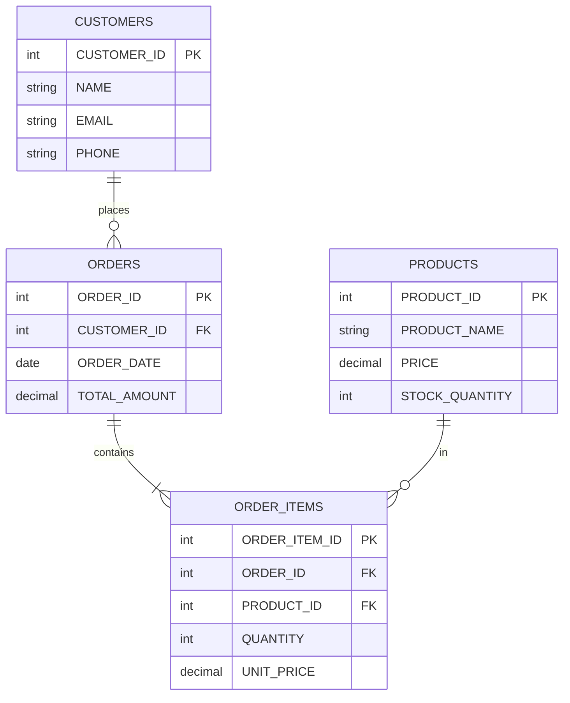

# erdDiagram

> Command: `erdDiagram`  
> Category: **Analysis Tools**  
> Status: Early Access

## Description

Generate Entity Relationship (ER) diagrams from your database schema. ER diagrams provide a visual representation of your data structure, showing how tables relate to each other and what data they contain.

### What is an ER Diagram (ERD)?

An **Entity Relationship Diagram (ERD)** is a visual representation of database structure that shows:

- **Entities**: Tables/objects in the database, drawn as rectangles
- **Attributes**: Columns/fields within each entity
- **Relationships**: Connections between entities showing how they relate
- **Cardinality**: The nature of relationships (one-to-one, one-to-many, many-to-many)

Example structure:

```text
CUSTOMERS ──────┐ (one customer)
                │ can place many
                ├─── ORDERS ──────┐ (one order)
                │                 │ contains many
                │                 └─── ORDER_ITEMS ──── PRODUCTS
                │
            Places          Contains
```

### What Do You Use ERD Diagrams For?

#### 1. System Understanding & Documentation

- Visualize the complete database structure at a glance
- Communicate data model to team members and stakeholders
- Create documentation for new developers joining the project
- Maintain up-to-date architecture diagrams as schemas evolve

#### 2. Database Design & Planning

- Plan new database schemas before implementation
- Validate relationships between entities
- Identify missing relationships or anomalies
- Ensure proper normalization and structure
- Design views for common data combinations

#### 3. Application Development

- Helps developers understand data structure when writing queries
- Clarifies which tables to join for specific data requirements
- Identifies potential performance issues (too many joins)
- Guides ORM model design (Entity Framework, Hibernate, etc.)
- Prevents mistakes in query development

#### 4. Data Migration & Integration

- Map source and target schemas during data migration
- Identify equivalent tables and fields when integrating systems
- Validate data transformation logic
- Plan extraction queries for ETL processes
- Compare schemas between environments (dev, test, prod)

#### 5. Performance & Optimization

- Identifies tables with many relationships (potential bottlenecks)
- Helps spot unnecessary complexity in data model
- Reveals missing denormalization opportunities
- Shows which tables are joined frequently (candidates for indexing)
- Guides partitioning strategy for large tables

#### 6. Data Governance & Quality

- Documents data lineage and relationships
- Identifies critical data dependencies
- Shows impact analysis when modifying schemas
- Helps implement data quality rules
- Supports compliance documentation requirements

#### 7. Troubleshooting & Analysis

- Quickly understand relationships when investigating data issues
- Trace problems through related tables
- Identify data consistency violations
- Review foreign key constraints
- Debug query performance issues by visualizing join paths

### Key Components in an ERD

**Entities** - Represent tables:

```text
┌──────────────┐
│   CUSTOMERS  │
├──────────────┤
│ CUSTOMER_ID  │
│ NAME         │
│ EMAIL        │
└──────────────┘
```

**Relationships** - Show how entities connect:

- `1:1` - One-to-one relationship
- `1:N` - One-to-many relationship (most common)
- `M:N` - Many-to-many relationship

**Cardinality Notation**:

- `||` - One (mandatory)
- `o|` - Zero or one
- `||` - Many
- `|o` - Zero or many

### Common Use Cases

#### Scenario 1: New Developer Onboarding

```bash
# Generate a diagram for new developer to understand the schema
hana-cli erdDiagram --schema SALES --format mermaid --output sales-schema.md
```

#### Scenario 2: Migration Planning

```bash
# Export current schema structure as reference
hana-cli erdDiagram --schema LEGACY_SYSTEM --output legacy-schema.json --format json
```

#### Scenario 3: Documentation Update

```bash
# Generate PlantUML diagram for inclusion in architecture docs
hana-cli erdDiagram --schema PRODUCTION --showColumns --format plantuml --output arch-diagram.puml
```

#### Scenario 4: Specific Subsystem

```bash
# Diagram only billing-related tables
hana-cli erdDiagram -s ACCOUNTING -t INVOICES,INVOICE_ITEMS,CUSTOMERS,PAYMENTS
```

## Syntax

```bash
hana-cli erdDiagram [options]
```

## Aliases

- `erd`
- `er`
- `schema-diagram`
- `entityrelation`

## Command Diagram



## Parameters

| Option | Alias | Type | Default | Description |
| --- | --- | --- | --- | --- |
| `--schema` | `-s` | string | **CURRENT_SCHEMA** | Schema to diagram |
| `--tables` | `-t` | string | optional | Comma-separated list of tables (empty for all) |
| `--output` | `-o` | string | optional | Output file for diagram |
| `--format` | `-f` | string | mermaid | Diagram format (mermaid, plantuml, graphviz, json) |
| `--showCardinality` | `-c` | boolean | true | Show relationship cardinality |
| `--showColumns` | `--cols` | boolean | true | Show table columns in diagram |
| `--excludeColumns` | `--ec` | string | optional | Comma-separated columns to exclude |
| `--profile` | `-p` | string | optional | CDS Profile |
| `--admin` | `-a` | boolean | false | Connect via admin (default-env-admin.json) |
| `--conn` | - | string | optional | Connection filename override |
| `--disableVerbose` | `--quiet` | boolean | false | Disable verbose output |
| `--debug` | `-d` | boolean | false | Debug mode - adds detailed output |
| `--help` | `-h` | boolean | - | Show help message |

For a complete list of parameters and options, use:

```bash
hana-cli erdDiagram --help
```

## Output Formats

### Mermaid Format (Default)

Generates a Mermaid ER diagram in markdown format:



### PlantUML Format

Generates PlantUML diagram code:

```text
@startuml
entity CUSTOMERS {
    * CUSTOMER_ID : int <<generated>>
    --
    NAME : string
    EMAIL : string
    PHONE : string
}

entity ORDERS {
    * ORDER_ID : int <<generated>>
    --
    CUSTOMER_ID : int <<FK>>
    ORDER_DATE : date
    TOTAL_AMOUNT : decimal
}

entity ORDER_ITEMS {
    * ORDER_ITEM_ID : int <<generated>>
    --
    ORDER_ID : int <<FK>>
    PRODUCT_ID : int <<FK>>
    QUANTITY : int
    UNIT_PRICE : decimal
}

CUSTOMERS ||--o{ ORDERS : places
ORDERS ||--|{ ORDER_ITEMS : contains
@enduml
```

### GraphViz Format

Generates GraphViz DOT format for visualization:

```text
digraph schema {
    rankdir=LR;
    
    CUSTOMERS [label="CUSTOMERS|CUSTOMER_ID|NAME|EMAIL|PHONE"];
    ORDERS [label="ORDERS|ORDER_ID|CUSTOMER_ID|ORDER_DATE|TOTAL_AMOUNT"];
    ORDER_ITEMS [label="ORDER_ITEMS|ORDER_ITEM_ID|ORDER_ID|PRODUCT_ID|QUANTITY|UNIT_PRICE"];
    PRODUCTS [label="PRODUCTS|PRODUCT_ID|PRODUCT_NAME|PRICE|STOCK_QUANTITY"];
    
    CUSTOMERS -> ORDERS [label="1..n"];
    ORDERS -> ORDER_ITEMS [label="1..n"];
    PRODUCTS -> ORDER_ITEMS [label="1..n"];
}
```

### JSON Format

Generates structured JSON with table and relationship metadata:

```json
{
  "schema": "MYSCHEMA",
  "tables": [
    {
      "name": "CUSTOMERS",
      "columns": [
        {"name": "CUSTOMER_ID", "type": "INT", "isPrimaryKey": true},
        {"name": "NAME", "type": "VARCHAR", "isPrimaryKey": false},
        {"name": "EMAIL", "type": "VARCHAR", "isPrimaryKey": false}
      ]
    }
  ],
  "relationships": [
    {
      "from": "CUSTOMERS",
      "to": "ORDERS",
      "foreignKey": "CUSTOMER_ID",
      "cardinality": "1..n"
    }
  ]
}
```

## Examples

### Basic Usage

```bash
hana-cli erdDiagram --schema MYSCHEMA --format mermaid --output erd.md
```

## Related Commands

See the [Commands Reference](../all-commands.md) for other commands in this category.

## See Also

- [Category: Analysis Tools](..)
- [All Commands A-Z](../all-commands.md)
