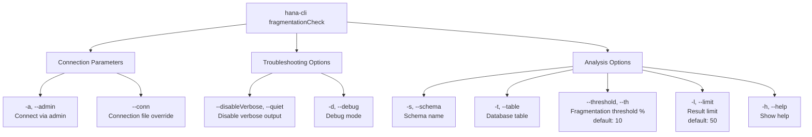

# fragmentationCheck

> Command: `fragmentationCheck`  
> Category: **Analysis Tools**  
> Status: Production Ready

## Description

Analyze table fragmentation levels in your SAP HANA database. Identifies tables with excessive data fragmentation that may impact performance and require optimization.

### What is Table Fragmentation?

In SAP HANA column-store tables, each column is stored separately. Fragmentation occurs when data modifications (inserts, updates, deletes) create:

- **Main Store**: The primary compressed column data structure
- **Delta Store**: A temporary in-memory buffer for recent changes
- **Fragmented Data**: Multiple smaller data segments that should ideally be merged

The **fragmentation percentage** measures the ratio of delta store size to total table size. A 30% fragmentation means 30% of the table's data is in the unoptimized delta store rather than the efficient main store.

### Why is Fragmentation Bad?

High fragmentation degrades performance and increases resource consumption:

**Performance Impact:**

- **Slower Queries**: Queries must scan both main store and delta store, doubling the search space
- **Increased I/O**: More data segments mean more disk reads and memory access
- **Memory Overhead**: Delta stores consume memory that could serve active data
- **CPU Inefficiency**: Column-store compression benefits are lost for fragmented data
- **Poor Caching**: Cache effectiveness decreases with fragmented data layouts

**Resource Consumption:**

- **Memory Usage**: Uncompressed delta stores consume 5-10x more memory than compressed main store
- **Storage Growth**: Fragmented tables grow faster without yielding performance improvements
- **Processing Cost**: Database must manage multiple data segments instead of consolidated structures

**Business Impact:**

- **Report Latency**: Analytics and reporting queries become slower
- **Transaction Slowdowns**: Frequent queries experience degraded response times
- **System Load**: CPU usage increases, affecting other database operations
- **Scalability Issues**: Performance degradation accelerates as fragmentation increases

### What Should You Do About It?

#### 1. Monitor Fragmentation Regularly

```bash
# Daily check for high fragmentation
hana-cli fragmentationCheck --threshold 25
```

#### 2. Set Appropriate Thresholds

- **< 10%**: Healthy - no action needed
- **10-25%**: Monitor - consider merging if performance degrades
- **25-50%**: Warning - schedule a merge operation
- **> 50%**: Critical - merge immediately during maintenance window

#### 3. Perform Delta Merges

Merge fragmented data back into the optimized main store:

```sql
-- Merge a specific table
MERGE DELTA OF "SCHEMA_NAME"."TABLE_NAME";

-- Merge all tables in a schema
ALTER SYSTEM RECLAIM SPACE;

-- Merge specific partitions
MERGE DELTA OF "SCHEMA_NAME"."TABLE_NAME" PARTITION 1;
```

#### 4. Optimize Your Approach

- **Merge During Off-Peak**: Merges require significant CPU and I/O
- **Target High-Impact Tables**: Prioritize frequently accessed tables
- **Batch Operations**: Merge several tables together if possible
- **Monitor Progress**: Check fragmentation after merges to track improvement

#### 5. Prevent Excessive Fragmentation

- **Batch Inserts**: Use bulk insert operations instead of row-by-row inserts
- **Consolidate Updates**: Group updates into larger transactions
- **Archive Old Data**: Move historical data to separate tables or archives
- **Schedule Maintenance**: Include merge operations in regular maintenance plans
- **Review Compression**: Consider compression policies for frequently modified tables

#### 6. Use Report Mode for Analysis

Get detailed insights into fragmentation patterns:

```bash
# Analyze fragmentation across your schema
hana-cli fragmentationCheck --schema PRODUCTION --limit 200

# Check specific table in detail
hana-cli fragmentationCheck --table LARGE_TABLE --threshold 5
```

## Syntax

```bash
hana-cli fragmentationCheck [options]
```

## Aliases

- `frag`
- `fc`

## Command Diagram



## Parameters

| Option | Alias | Type | Default | Description |
| --- | --- | --- | --- | --- |
| `--schema` | `-s` | string | **CURRENT_SCHEMA** | Schema name |
| `--table` | `-t` | string | null | Database table |
| `--threshold` | `--th` | number | 10 | Fragmentation threshold percentage |
| `--limit` | `-l` | number | 50 | Limit results |
| `--admin` | `-a` | boolean | false | Connect via admin (default-env-admin.json) |
| `--conn` | - | string | optional | Connection filename override |
| `--disableVerbose` | `--quiet` | boolean | false | Disable verbose output |
| `--debug` | `-d` | boolean | false | Debug mode - adds detailed output |
| `--help` | `-h` | boolean | - | Show help |

**Note on CURRENT_SCHEMA:**

When `--schema` is not specified, the command uses `CURRENT_SCHEMA`, which resolves to:

- The schema defined in your database connection configuration (from default-env.json or connection file)
- If no schema is configured, it defaults to the `public` schema

For a complete list of parameters and options, use:

```bash
hana-cli fragmentationCheck --help
```

## Examples

### Basic Usage

```bash
hana-cli fragmentationCheck --schema MYSCHEMA --threshold 10
```

### Check Specific Table

```bash
hana-cli fragmentationCheck --schema MYSCHEMA --table EMPLOYEES --threshold 15
```

### Get More Results

```bash
hana-cli frag -s MYSCHEMA --limit 100
```

## Output Example

The command returns a report of tables with fragmentation levels exceeding the specified threshold:

```text
Schema          Table              Fragmentation %    Size (MB)    Compressed (MB)
-----           -----              ---------------    ---------    ---------------
MYSCHEMA        EMPLOYEES          28.5               156.4        110.2
MYSCHEMA        ORDERS             42.1               892.3        510.1
MYSCHEMA        CUSTOMERS          15.2               324.6        290.4
MYSCHEMA        TRANSACTIONS       35.7               1245.8       820.3
```

The report shows:

- **Schema**: Schema containing the table
- **Table**: Table name
- **Fragmentation %**: Percentage of fragmented space
- **Size (MB)**: Uncompressed table size
- **Compressed (MB)**: Compressed table size

## Related Commands

See the [Commands Reference](../all-commands.md) for other commands in this category.

## See Also

- [Category: Analysis Tools](..)
- [All Commands A-Z](../all-commands.md)
