# referentialCheck

> Command: `referentialCheck`  
> Category: **Analysis Tools**  
> Status: Production Ready

## Description

Verifies referential integrity and validates foreign key constraints in HANA tables. It identifies orphaned records and constraint violations that could indicate data quality issues.

### What is Referential Integrity?

**Referential integrity** is a database concept that ensures relationships between tables are valid and consistent. It enforces that:

- Foreign key values in a child table must exist as primary key values in the parent table
- When parent records are modified or deleted, related child records are handled appropriately
- Data relationships remain logically consistent across the database

### Why is Referential Integrity Critical?

Understanding and maintaining referential integrity is essential for database health and business operations:

**Data Quality Issues:**

- **Orphaned Records**: Records that reference non-existent parent records, creating data inconsistencies
- **Broken Relationships**: Invalid foreign key references that break application logic
- **Silent Data Loss**: Child records may exist without their parent context, creating "zombie" data
- **Cascading Problems**: Violations compound over time as more invalid relationships are created

**Business Impact:**

- **Incorrect Reporting**: Analytics and reports may include orphaned records, producing misleading insights
- **Financial Inaccuracy**: Revenue, inventory, or accounting data may be understated or overstated
- **Customer Data Corruption**: Customer relationships and history become unreliable
- **Compliance Violations**: Regulations (GDPR, SOX, etc.) may require data integrity validation
- **Application Failures**: Applications may crash or behave unexpectedly when encountering orphaned records

**Operational Risks:**

- **Data Migration Issues**: Violations prevent clean migration to other systems
- **Backup Integrity**: Corrupted relationships mean backups restore invalid data
- **Query Performance**: Orphaned records can distort indexing and query optimization
- **Audit Trails**: Impossible to track complete audit trails when relationships are broken

### Common Causes of Violations

- Disabled foreign key constraints during bulk operations without proper re-validation
- Data imports without constraint checking
- Manual deletions without cascading deletes
- System crashes or incomplete transactions
- Direct SQL updates bypassing application logic

## Syntax

```bash
hana-cli referentialCheck [options]
```

## Aliases

- `refcheck`
- `checkReferential`
- `fkcheck`

## Command Diagram

```mermaid
graph TD
    A["hana-cli referentialCheck"] --> B["Connection Parameters"]
    A --> C["Troubleshooting Options"]
    A --> D["Analysis Options"]
    A --> E["Report Options"]
    
    B --> B1["-a, --admin<br/>Connect via admin"]
    B --> B2["--conn<br/>Connection file override"]
    
    C --> C1["--disableVerbose, --quiet<br/>Disable verbose output"]
    C --> C2["-d, --debug<br/>Debug mode"]
    
    D --> D1["-t, --table<br/>Table name to check"]
    D --> D2["-s, --schema<br/>Schema name<br/>default: CURRENT_SCHEMA"]
    D --> D3["-c, --constraints<br/>Specific constraints<br/>comma-separated"]
    D --> D4["-m, --mode<br/>check|report|repair|detailed<br/>default: check"]
    D --> D5["-l, --limit<br/>Max rows to check<br/>default: 10000"]
    D --> D6["--timeout, --to<br/>Operation timeout<br/>default: 3600s"]
    
    E --> E1["-o, --output<br/>Report file path"]
    E --> E2["-f, --format<br/>json|csv|summary<br/>default: summary"]
    E --> E3["-p, --profile<br/>CDS Profile"]
    E --> E4["-h, --help<br/>Show help"]
```



## Parameters

| Option | Alias | Type | Default | Description |
| --- | --- | --- | --- | --- |
| `--table` | `-t` | string | required | Table name to check |
| `--schema` | `-s` | string | **CURRENT_SCHEMA** | Schema name |
| `--constraints` | `-c` | string | optional | Specific constraints to check (comma-separated) |
| `--mode` | `-m` | string | check | Check mode: `check`, `report`, `repair`, `detailed` |
| `--output` | `-o` | string | optional | Output report file path |
| `--format` | `-f` | string | summary | Report format: `json`, `csv`, `summary` |
| `--limit` | `-l` | number | 10000 | Maximum rows to check |
| `--timeout` | `--to` | number | 3600 | Operation timeout in seconds |
| `--profile` | `-p` | string | optional | CDS profile for connections |
| `--admin` | `-a` | boolean | false | Connect via admin (default-env-admin.json) |
| `--conn` | - | string | optional | Connection filename override |
| `--disableVerbose` | `--quiet` | boolean | false | Disable verbose output |
| `--debug` | `-d` | boolean | false | Debug mode - adds detailed output |
| `--help` | `-h` | boolean | - | Show help |

**Note on CURRENT_SCHEMA:**

When `--schema` is not specified, the command uses `CURRENT_SCHEMA`, which resolves to:

- The schema defined in your database connection configuration (from default-env.json or connection file)
- If no schema is configured, it defaults to the `public` schema

For a complete list of parameters and options, use:

```bash
hana-cli referentialCheck --help
```

## Check Modes

- **check** (default) - Identify foreign key violations and orphaned records
- **report** - Generate a comprehensive report of all constraints
- **repair** - Attempt to fix violations (deletes or flags orphaned records)
- **detailed** - Full analysis with detailed constraint information

## Output Examples

### Summary (default)

```bash
Referential Integrity Check Report
===================================

Total Foreign Keys: 3
Valid Constraints:  2
Violated Constraints: 1
Total Orphaned Records: 5

Violations:
  FK_ORDERS_CUSTOMERS: VIOLATED
    Orphaned Records: 3
  FK_ORDERS_PRODUCTS: OK
  FK_ORDERS_WAREHOUSES: VIOLATED
    Orphaned Records: 2
```

### JSON

```json
{
  "totalForeignKeys": 3,
  "validConstraints": 2,
  "violatedConstraints": 1,
  "totalOrphanedRecords": 5,
  "violations": [
    {
      "constraintName": "FK_ORDERS_CUSTOMERS",
      "column": "CUSTOMER_ID",
      "referencesTable": "CUSTOMERS",
      "status": "VIOLATED",
      "orphanedRecords": [
        {
          "CUSTOMER_ID": 12345,
          "count": 3
        }
      ]
    }
  ],
  "details": [
    {
      "constraintName": "FK_ORDERS_PRODUCTS",
      "column": "PRODUCT_ID",
      "referencesTable": "PRODUCTS",
      "status": "OK"
    }
  ]
}
```

## Understanding Results

### Valid Constraint

All foreign key values in the primary table exist in the referenced table. Data integrity is maintained.

### Violated Constraint

Some foreign key values in the primary table do not exist in the referenced table. These are orphaned records.

### Orphaned Records

Records with foreign key values that reference non-existent parent records. This can happen when:

- Parent records are deleted without cascading deletes
- Foreign key constraints are disabled
- Data is imported without validation

## Examples

### Check all foreign keys

```bash
hana-cli referentialCheck --table ORDERS --schema SALES
```

### Check specific constraints

```bash
hana-cli referentialCheck --table ORDERS \
  --constraints FK_ORDERS_CUSTOMERS,FK_ORDERS_PRODUCTS
```

### Detailed analysis with JSON output

```bash
hana-cli referentialCheck --table ORDERS \
  --mode detailed \
  --format json \
  --output referential-check.json
```

### Attempt repair mode (use with caution)

```bash
hana-cli referentialCheck --table ORDERS --mode repair --limit 50000
```

## Repair Mode

**Warning**: Use with caution. The repair mode attempts to fix violations:

- Flags orphaned records
- May delete orphaned records (if configured)
- Always backup your database before using repair mode

## Return Codes

- `0` - Check completed successfully
- `1` - Check failed or database connection issue

## Performance Tips

1. Use `--limit` to check a subset first
2. Specify constraint names to check only needed constraints
3. Use `--timeout` to prevent long-running checks
4. Run during off-peak hours for production databases

## Database-Specific Notes

### HANA

- Uses `SYS.REFERENTIAL_CONSTRAINTS` system view
- Supports foreign key constraints across schemas

### PostgreSQL

- Uses `information_schema.table_constraints`
- Supports multiple foreign key types

## Integration with Data Governance

Use referential checks as part of data quality processes:

```bash
# Daily data quality check
hana-cli referentialCheck --table ORDERS --schema SALES \
  --format json --output daily-check.json

# Alert if violations found
if grep -q "VIOLATED" daily-check.json; then
  # Send alert
  echo "Referential integrity violations detected!"
fi
```

## Related Commands

- `dataValidator` - Validate data against business rules
- `duplicateDetection` - Find duplicate records
- `dataLineage` - Trace data lineage and transformations
- `dataProfile` - Generate statistical profiles

See the [Commands Reference](../all-commands.md) for other commands in this category.

## See Also

- [Category: Analysis Tools](..)
- [All Commands A-Z](../all-commands.md)
