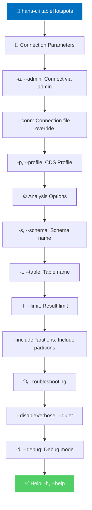

# tableHotspots

> Command: `tableHotspots`  
> Category: **Analysis Tools**  
> Status: Production Ready

## Description

The `tableHotspots` command identifies tables and partitions that experience high access frequency. It analyzes access patterns and statistics to help optimize performance and resource allocation.

### What is a Table Hotspot?

A **table hotspot** is a table (or partition) that receives a disproportionately high volume of read/write operations compared to other tables. These tables are accessed frequently by queries and applications, making them critical to overall system performance.

### Why Should You Care?

Understanding table hotspots is crucial for database performance management:

- **Performance Bottlenecks**: Hotspots often become performance bottlenecks if not properly indexed or optimized, as contention increases with access frequency
- **Resource Planning**: Identifying hotspots helps you allocate resources (CPU, memory, cache) to high-impact tables
- **Optimization Priority**: Focus optimization efforts on tables that provide the greatest performance improvement
- **Capacity Planning**: Plan for growth and scaling based on which tables are driving load
- **Partition Strategy**: Determines if horizontal partitioning would help distribute load across multiple partitions
- **Index Design**: Hotspots are candidates for specialized indexing strategies (composite indexes, covering indexes)
- **Query Tuning**: Hotspot tables often benefit most from query optimization efforts

## Syntax

```bash
hana-cli tableHotspots [schema] [table]
```

## Aliases

- `th`
- `hotspots`

## Command Diagram



## Parameters

### Positional Arguments

| Parameter | Type | Description |
| --- | --- | --- |
| `schema` | string | Schema filter. Default: `**CURRENT_SCHEMA**` |
| `table` | string | Table filter. Default: `*` |

### Options

| Option | Alias | Type | Default | Description |
| --- | --- | --- | --- | --- |
| `--schema` | `-s` | string | **CURRENT_SCHEMA** | Schema name |
| `--table` | `-t` | string | * | Table name (supports wildcards) |
| `--includePartitions` | `-p`, `--Partitions` | boolean | true | Include partition-level statistics |
| `--limit` | `-l`, `--Limit` | number | 200 | Limit results |
| `--profile` | `-p` | string | optional | CDS profile for connections |
| `--admin` | `-a` | boolean | false | Connect via admin (default-env-admin.json) |
| `--conn` | - | string | optional | Connection filename override |
| `--disableVerbose` | `--quiet` | boolean | false | Disable verbose output |
| `--debug` | `-d` | boolean | false | Debug mode - adds detailed output |
| `--help` | `-h` | boolean | - | Show help |

For a complete list of parameters and options, use:

```bash
hana-cli tableHotspots --help
```

## Examples

### Basic Usage

```bash
hana-cli tableHotspots
```

### Check Specific Schema

```bash
hana-cli th --schema PRODUCTION
```

### Check Specific Table with Partitions

```bash
hana-cli tableHotspots --table CUSTOMERS --includePartitions
```

### Get More Results

```bash
hana-cli hotspots --limit 500
```

## Output Example

The command returns a report of the most frequently accessed tables:

```text
SCHEMA_NAME      TABLE_NAME           TOTAL_ACCESS_COUNT    RECORD_COUNT    ACCESS_RANK
---              ---                  ---                   ---             ---
PRODUCTION       ORDERS               1524385               285643          1
PRODUCTION       CUSTOMERS            982156                156427          2
PRODUCTION       ORDER_ITEMS          876432                524986          3
PRODUCTION       PRODUCTS             643521                28976           4
PRODUCTION       TRANSACTIONS         521847                186534          5
```

When partition information is included (default), you also get partition-level statistics:

```text
SCHEMA_NAME      TABLE_NAME           PART_ID    TOTAL_ACCESS_COUNT    RECORD_COUNT
---              ---                  ---        ---                   ---
PRODUCTION       ORDERS               1          1524385               285643
PRODUCTION       ORDERS               2          892156                187354
PRODUCTION       CUSTOMERS            1          982156                156427
```

The output shows:

- **SCHEMA_NAME**: Schema containing the table
- **TABLE_NAME**: Table name
- **TOTAL_ACCESS_COUNT**: Total number of accesses to the table
- **RECORD_COUNT**: Number of records in the table
- **PART_ID**: Partition ID (when partition information is included)

## Documentation

For detailed command documentation, parameters, and examples, use:

```bash
hana-cli tableHotspots --help
```

## Related Commands

- `columnStats` - Analyze column-store statistics for tables/columns
- `indexes` - Inspect index metadata and usage patterns
- `inspectTable` - Inspect table structure and metadata in detail

See the [Commands Reference](../all-commands.md) for other commands in this category.

## See Also

- [Category: Analysis Tools](..)
- [All Commands A-Z](../all-commands.md)
