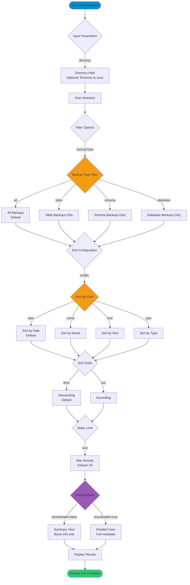

# backupList

> Command: `backupList`  
> Category: **Backup & Recovery**  
> Status: Production Ready

## Description

List available backups

## Syntax

```bash
hana-cli backupList [directory] [options]
```

## Aliases

- `blist`
- `listBackups`
- `backups`

## Command Diagram



## Parameters

### Positional Arguments

| Parameter   | Type   | Description                                                    |
|-------------|--------|----------------------------------------------------------------|
| `directory` | string | Directory to scan for backups (optional)                       |

### Options

| Option           | Alias      | Type    | Default  | Description                                                                 |
|------------------|------------|---------|----------|-----------------------------------------------------------------------------|
| `--directory`    | `--dir`    | string  | -        | Directory to scan for backups                                               |
| `--backupType`   | `--type`   | string  | `"all"`  | Type of backup. Choices: `table`, `schema`, `database`, `all`               |
| `--sortBy`       | `--sort`   | string  | `"date"` | Sort backups by field. Choices: `name`, `date`, `size`, `type`              |
| `--order`        | `-o`       | string  | `"desc"` | Sort order. Choices: `asc`, `desc`                                          |
| `--limit`        | `-l`       | number  | `50`     | Limit number of results                                                     |
| `--showDetails`  | `--details`| boolean | `false`  | Show detailed backup information including metadata                         |
| `--help`         | `-h`       | boolean | -        | Show help                                                                   |

### Connection Parameters

| Option    | Alias | Type    | Default | Description                                          |
|-----------|-------|---------|---------|------------------------------------------------------|
| `--admin` | `-a`  | boolean | `false` | Connect via admin (default-env-admin.json)           |
| `--conn`  | -     | string  | -       | Connection filename to override default-env.json     |

### Troubleshooting

| Option              | Alias     | Type    | Default | Description                                                                                              |
|---------------------|-----------|---------|---------|----------------------------------------------------------------------------------------------------------|
| `--disableVerbose`  | `--quiet` | boolean | `false` | Disable verbose output - removes all extra output that is only helpful to human readable interface       |
| `--debug`           | `-d`      | boolean | `false` | Debug hana-cli itself by adding output of LOTS of intermediate details                                   |

## Examples

### Basic Usage

```bash
hana-cli hana-cli backupList --backupPath /backups
```

Execute the command

## Related Commands

See the [Commands Reference](../all-commands.md) for other commands in this category.

## See Also

- [Category: Backup & Recovery](..)
- [All Commands A-Z](../all-commands.md)
