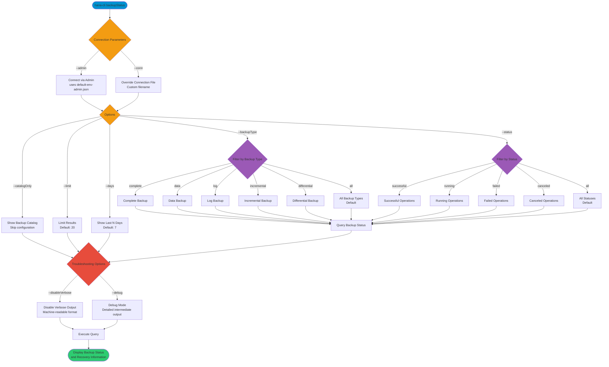

# backupStatus

> Command: `backupStatus`  
> Category: **Backup & Recovery**  
> Status: Production Ready

## Description

Check backup/recovery operation status

## Syntax

```bash
hana-cli backupStatus [options]
```

## Aliases

- `bstatus`
- `backupstate`
- `bkpstatus`

## Command Diagram



## Parameters

### Connection Parameters

| Option | Alias | Type | Default | Description |
| -------- | ------- | ------ | --------- | ------------- |
| `--admin` | `-a` | boolean | `false` | Connect via admin (default-env-admin.json) |
| `--conn` | - | string | - | Connection filename to override default-env.json |

### Options

| Option | Alias | Type | Default | Description |
| -------- | ------- | ------ | --------- | ------------- |
| `--catalogOnly` | `--co` | boolean | `false` | Show only backup catalog (skip configuration) |
| `--limit` | `-l` | number | `20` | Limit number of results returned |
| `--backupType` | `--type` | string | `"all"` | Filter by backup type. Choices: `complete`, `data`, `log`, `incremental`, `differential`, `all` |
| `--status` | `--st` | string | `"all"` | Filter by backup status. Choices: `successful`, `running`, `failed`, `canceled`, `all` |
| `--days` | `-d` | number | `7` | Show backups from the last N days |

### Troubleshooting

| Option              | Alias     | Type    | Default | Description                                                                                              |
|---------------------|-----------|---------|---------|----------------------------------------------------------------------------------------------------------|
| `--disableVerbose`  | `--quiet` | boolean | `false` | Disable verbose output - removes all extra output that is only helpful to human readable interface       |
| `--debug`           | `-d`      | boolean | `false` | Debug hana-cli itself by adding output of LOTS of intermediate details                                   |

### Backup Types

- **complete**: Full database backup
- **data**: Data backup only
- **log**: Transaction log backup
- **incremental**: Incremental backup (only changes since last backup)
- **differential**: Differential backup (only changes since last complete backup)
- **all**: All backup types (default)

### Backup Status

- **successful**: Completed successfully
- **running**: Currently in progress
- **failed**: Failed to complete
- **canceled**: Manually canceled
- **all**: All backup statuses (default)

For a complete list of parameters and options, use:

```bash
hana-cli backupStatus --help
```

## Notes

- **Privileges**: Some backup information requires system privileges. Use `--admin` flag for full access to all backup details.
- **Time Range**: The default look-back period is 7 days. Use `--days` to adjust (e.g., `--days 30` for 30 days).
- **Filtering**: You can combine multiple filters like `--backupType complete --status successful` to narrow results.

## Examples

### Basic Usage - Show recent backups (last 7 days)

```bash
hana-cli backupStatus
```

Displays backup status for the last 7 days

### View backups from last 30 days

```bash
hana-cli backupStatus --days 30
```

Extends the look-back period to 30 days

### Filter by backup type

```bash
hana-cli backupStatus --backupType complete --limit 10
```

Shows only complete backups, limited to 10 results

### Filter by status

```bash
hana-cli backupStatus --status successful
```

Shows only successful backups

### View with admin privileges

```bash
hana-cli backupStatus --admin
```

Connects with admin user (default-env-admin.json) for full access to backup information (recommended for viewing all backup details and progress)

### Show only catalog (skip configuration)

```bash
hana-cli backupStatus --catalogOnly
```

Displays backup catalog without configuration information

## Related Commands

See the [Commands Reference](../all-commands.md) for other commands in this category.

## See Also

- [Category: Backup & Recovery](..)
- [All Commands A-Z](../all-commands.md)
