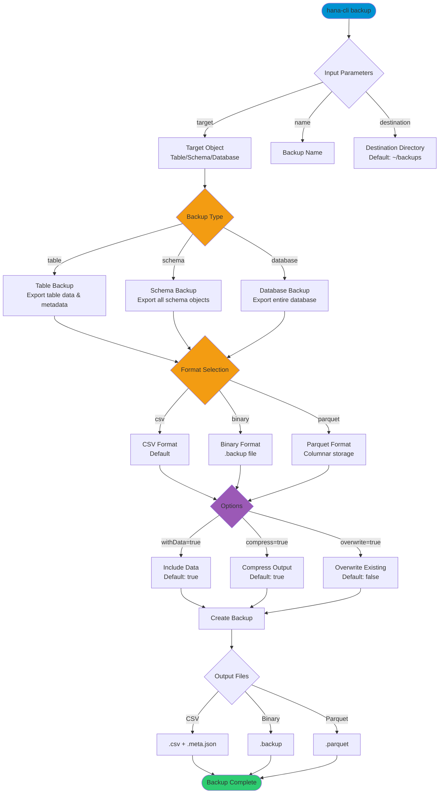

# backup

> Command: `backup`  
> Category: **Backup & Recovery**  
> Status: Production Ready

## Description

Create backups of tables, schemas, or databases

## Syntax

```bash
hana-cli backup [target] [name] [options]
```

## Aliases

- `bkp`
- `createBackup`

## Command Diagram



## Parameters

### Positional Arguments

| Parameter | Type   | Description                                                       |
|-----------|--------|-------------------------------------------------------------------|
| `target`  | string | Target object to backup (table name, schema name, or database)    |
| `name`    | string | Backup name for the output file                                   |

### Options

| Option | Alias | Type | Default | Description |
| -------- | ------- | ------ | --------- | ------------- |
| `--target` | `--tgt` | string | - | Target object to backup (table name, schema name, or database) |
| `--name` | `-n` | string | - | Backup name for the output file |
| `--backupType` | `--type` | string | `"table"` | Type of backup. Choices: `table`, `schema`, `database` |
| `--format` | `-f` | string | `"csv"` | Backup file format. Choices: `csv`, `binary`, `parquet` |
| `--destination` | `--dest` | string | - | Backup destination directory |
| `--compress` | `-c` | boolean | `true` | Compress backup files (gzip) |
| `--schema` | `-s` | string | Current schema | Schema to use for the backup operation |
| `--withData` | `--wd` | boolean | `true` | Include data in backup (not just metadata) |
| `--overwrite` | `--ow` | boolean | `false` | Overwrite existing backup file if it exists |

### Connection Parameters

| Option | Alias | Type | Default | Description |
| -------- | ------- | ------ | --------- | ------------- |
| `--admin` | `-a` | boolean | `false` | Connect via admin (default-env-admin.json) |
| `--conn` | - | string | - | Connection filename to override default-env.json |

### Troubleshooting Options

| Option | Alias | Type | Default | Description |
| -------- | ------- | ------ | --------- | ------------- |
| `--disableVerbose` | `--quiet` | boolean | `false` | Disable verbose output - useful for scripting |
| `--debug` | `-d` | boolean | `false` | Debug hana-cli with detailed intermediate output |
| `--help` | `-h` | boolean | - | Show help information |

### Backup Types

- **table**: Backs up a single table with data and metadata
- **schema**: Backs up all objects within a schema
- **database**: Backs up the entire database (all schemas)

### Output Formats

- **csv**: Comma-separated values (human-readable, with .meta.json)
- **binary**: Binary format (.backup file)
- **parquet**: Columnar storage format (efficient for large datasets)

## Examples

### Backup a Table (Interactive)

```bash
hana-cli backup
```

The command will prompt you for:

- Target object (table name)
- Backup name
- Destination directory

### Backup a Table to CSV

```bash
hana-cli backup STAR_WARS_FILM mybackup --format csv --destination ./backups
```

Creates a compressed CSV backup with metadata

### Backup an Entire Schema

```bash
hana-cli backup --target MY_SCHEMA --type schema --name schema_backup
```

Backs up all objects in the specified schema

### Backup Without Compression

```bash
hana-cli backup PRODUCTS product_backup --compress false
```

Creates an uncompressed backup file

### Backup to Parquet Format

```bash
hana-cli backup LARGE_TABLE big_data_backup --format parquet --destination /data/backups
```

Uses columnar Parquet format for efficient storage

### Backup Database (All Schemas)

```bash
hana-cli backup --type database --name full_db_backup --destination /backups/database
```

Creates a complete database backup

### Overwrite Existing Backup

```bash
hana-cli backup ORDERS orders_backup --overwrite
```

Replaces existing backup file with the same name

## Related Commands

See the [Commands Reference](../all-commands.md) for other commands in this category.

## See Also

- [Category: Backup & Recovery](..)
- [All Commands A-Z](../all-commands.md)
