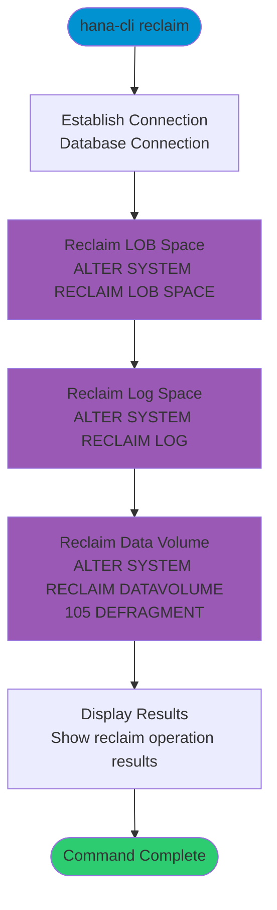

# reclaim

> Command: `reclaim`  
> Category: **Backup & Recovery**  
> Status: Production Ready

## Description

Reclaim LOB, Log, and Data Volume space

## Syntax

```bash
hana-cli reclaim [options]
```

## Aliases

- `re`

## Command Diagram



## Parameters

### Connection Parameters

| Option    | Alias | Type    | Default | Description                                          |
|-----------|-------|---------|---------|------------------------------------------------------|
| `--admin` | `-a`  | boolean | `false` | Connect via admin (default-env-admin.json)           |
| `--conn`  | -     | string  | -       | Connection filename to override default-env.json     |

### Troubleshooting

| Option              | Alias     | Type    | Default | Description                                                                                              |
|---------------------|-----------|---------|---------|----------------------------------------------------------------------------------------------------------|
| `--disableVerbose`  | `--quiet` | boolean | `false` | Disable verbose output - removes all extra output that is only helpful to human readable interface       |
| `--debug`           | `-d`      | boolean | `false` | Debug hana-cli itself by adding output of LOTS of intermediate details                                   |

## What Does This Command Do?

The `reclaim` command performs three cleanup operations to free up disk space in your HANA database:

1. **LOB Space Reclamation**: Frees up unused space in LOB (Large Object) storage
2. **Log Reclamation**: Reclaims space from transaction logs that are no longer needed
3. **Data Volume Defragmentation**: Defragments data volume 105 to optimize storage

This command is particularly useful after large delete operations or when disk space is running low.

## Examples

### Basic Usage

```bash
hana-cli reclaim
```

Execute all three reclaim operations with default connection.

### Using Admin Connection

```bash
hana-cli reclaim --admin
```

Execute reclaim operations using admin credentials for full system access.

### With Custom Connection

```bash
hana-cli reclaim --conn my-db-connection.json
```

Execute reclaim operations using a custom connection file.

### Quiet Mode for Scripting

```bash
hana-cli reclaim --quiet
```

Run reclaim operations with minimal output for use in scripts.

## Related Commands

See the [Commands Reference](../all-commands.md) for other commands in this category.

## See Also

- [Category: Backup & Recovery](..)
- [All Commands A-Z](../all-commands.md)
