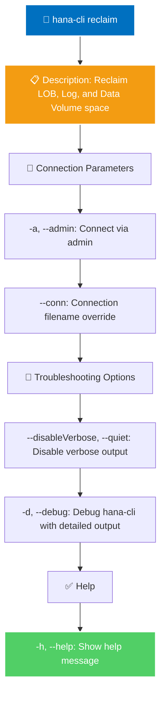

# reclaim

> Command: `reclaim`  
> Category: **Backup & Recovery**  
> Status: Production Ready

## Description

Reclaim LOB, Log, and Data Volume space

## Syntax

```bash
hana-cli reclaim [options]
```

## Aliases

- No aliases

## Command Diagram



## Parameters

### Connection Parameters

| Option | Alias | Type | Default | Description |
| --- | --- | --- | --- | --- |
| `--admin` | `-a` | boolean | `false` | Connect via admin (default-env-admin.json) |
| `--conn` | | string | | Connection filename to override default-env.json |

### Troubleshooting Options

| Option | Alias | Type | Default | Description |
| --- | --- | --- | --- | --- |
| `--disableVerbose` | `--quiet` | boolean | `false` | Disable verbose output - removes all extra output that is only helpful to human-readable interface. Useful for scripting commands. |
| `--debug` | `-d` | boolean | `false` | Debug hana-cli itself by adding output of LOTS of intermediate details |

### General Options

| Option | Alias | Type | Description |
| --- | --- | --- | --- |
| `--help` | `-h` | boolean | Show help message |

For a complete list of parameters and options, use:

```bash
hana-cli reclaim --help
```

## Examples

### Basic Usage

```bash
hana-cli reclaim
```

Execute the command

## Related Commands

See the [Commands Reference](../all-commands.md) for other commands in this category.

## See Also

- [Category: Backup & Recovery](..)
- [All Commands A-Z](../all-commands.md)
