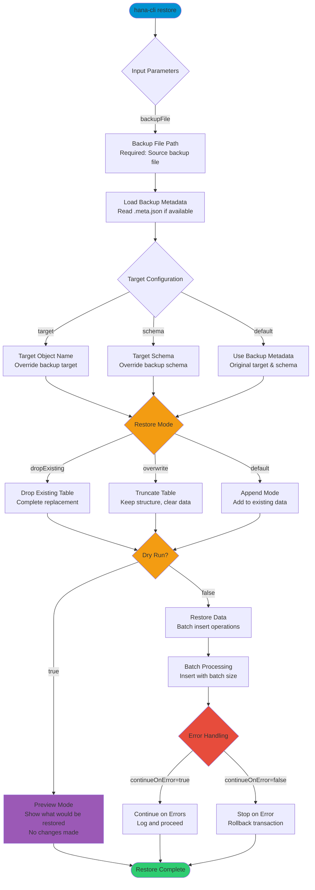

# restore

> Command: `restore`  
> Category: **Backup & Recovery**  
> Status: Production Ready

## Description

Restore database object(s) from backup

## Syntax

```bash
hana-cli restore [backupFile] [options]
```

## Aliases

- `rst`
- `restoreBackup`

## Command Diagram



## Parameters

### Positional Arguments

| Parameter    | Type   | Description                                          |
|--------------|--------|------------------------------------------------------|
| `backupFile` | string | Path to backup file (optional, can use --backupFile)|

### Options

| Option             | Alias               | Type    | Default | Description                                              |
|--------------------|---------------------|---------|---------|----------------------------------------------------------|
| `--backupFile`     | `--bf`, `--file`    | string  | -       | Path to backup file                                      |
| `--target`         | `--tgt`             | string  | -       | Target object name (table/schema/database)               |
| `--schema`         | `-s`                | string  | -       | Target schema name                                       |
| `--overwrite`      | `--ow`              | boolean | `false` | Overwrite existing data (truncate before restore)        |
| `--dropExisting`   | `--de`              | boolean | `false` | Drop existing table before restore                       |
| `--continueOnError`| `--coe`             | boolean | `false` | Continue restore even if errors occur                    |
| `--batchSize`      | `-b`, `--batch`     | number  | `1000`  | Batch size for insert operations                         |
| `--dryRun`         | `--dr`, `--preview` | boolean | `false` | Preview restore without making changes                   |

### Connection Parameters

| Option    | Alias | Type    | Default | Description                                          |
|-----------|-------|---------|---------|------------------------------------------------------|
| `--admin` | `-a`  | boolean | `false` | Connect via admin (default-env-admin.json)           |
| `--conn`  | -     | string  | -       | Connection filename to override default-env.json     |

### Troubleshooting

| Option              | Alias     | Type    | Default | Description                                                                                              |
|---------------------|-----------|---------|---------|----------------------------------------------------------------------------------------------------------|
| `--disableVerbose`  | `--quiet` | boolean | `false` | Disable verbose output - removes all extra output that is only helpful to human readable interface       |
| `--debug`           | `-d`      | boolean | `false` | Debug hana-cli itself by adding output of LOTS of intermediate details                                   |

## Examples

### Basic Usage

```bash
hana-cli restore --backupFile backup.db
```

Restore from a backup file using default settings.

### Preview Restore (Dry Run)

```bash
hana-cli restore --backupFile my_table_backup.backup --dryRun
```

Preview what would be restored without making any changes.

### Restore to Different Schema

```bash
hana-cli restore --backupFile data_backup.backup --schema TARGET_SCHEMA
```

Restore backup to a different schema than the original.

### Restore with Overwrite

```bash
hana-cli restore --backupFile orders.backup --overwrite
```

Truncate existing table and restore data from backup.

### Drop and Recreate Table

```bash
hana-cli restore --backupFile customers.backup --dropExisting
```

Drop the existing table completely and recreate from backup.

### Restore with Custom Batch Size

```bash
hana-cli restore --backupFile large_table.backup --batchSize 5000
```

Use larger batch size for better performance with large datasets.

### Continue on Errors

```bash
hana-cli restore --backupFile partial_data.backup --continueOnError
```

Continue restoring even if some rows fail to insert.

### Restore to Different Target

```bash
hana-cli restore --backupFile backup.backup --target NEW_TABLE_NAME --schema PROD
```

Restore to a different table name in a different schema.

### Full Path Restore with Admin

```bash
hana-cli restore --backupFile /data/backups/critical_data.backup --admin --overwrite
```

Restore using admin connection with overwrite mode.

## Related Commands

See the [Commands Reference](../all-commands.md) for other commands in this category.

## See Also

- [Category: Backup & Recovery](..)
- [All Commands A-Z](../all-commands.md)
