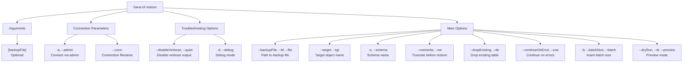

# restore

> Command: `restore`  
> Category: **Backup & Recovery**  
> Status: Production Ready

## Description

Restore database object(s) from backup

## Syntax

```bash
hana-cli restore [backupFile] [options]
```

## Aliases

- `rst`
- `restoreBackup`

## Command Diagram



## Parameters

### Connection Parameters

| Parameter | Aliases | Description | Type | Default |
| --- | --- | --- | --- | --- |
| `--admin` | `-a` | Connect via admin (using default-env-admin.json) | boolean | `false` |
| `--conn` | | Connection filename to override default-env.json | string | |

### Troubleshooting Options

| Parameter | Aliases | Description | Type | Default |
| --- | --- | --- | --- | --- |
| `--disableVerbose` | `--quiet` | Disable verbose output - removes all extra output that is only helpful for human-readable interface. Useful for scripting commands. | boolean | `false` |
| `--debug` | `-d` | Debug hana-cli itself by adding output of many intermediate details | boolean | `false` |

### Main Options

| Parameter | Aliases | Description | Type | Default |
| --- | --- | --- | --- | --- |
| `--backupFile` | `--bf`, `--file` | Path to backup file | string | |
| `--target` | `--tgt` | Target object name (table/schema/database) | string | |
| `--schema` | `-s` | Target schema name | string | |
| `--overwrite` | `--ow` | Overwrite existing data (truncate before restore) | boolean | `false` |
| `--dropExisting` | `--de` | Drop existing table before restore | boolean | `false` |
| `--continueOnError` | `--coe` | Continue restore even if errors occur | boolean | `false` |
| `--batchSize` | `-b`, `--batch` | Batch size for insert operations | number | `1000` |
| `--dryRun` | `--dr`, `--preview` | Preview restore without making changes | boolean | `false` |
| `--help` | `-h` | Show help | boolean | |

For a complete list of parameters and options, use:

```bash
hana-cli restore --help
```

## Examples

### Basic Usage

```bash
hana-cli restore --backupFile backup.db
```

Execute the command

## Related Commands

See the [Commands Reference](../all-commands.md) for other commands in this category.

## See Also

- [Category: Backup & Recovery](..)
- [All Commands A-Z](../all-commands.md)
