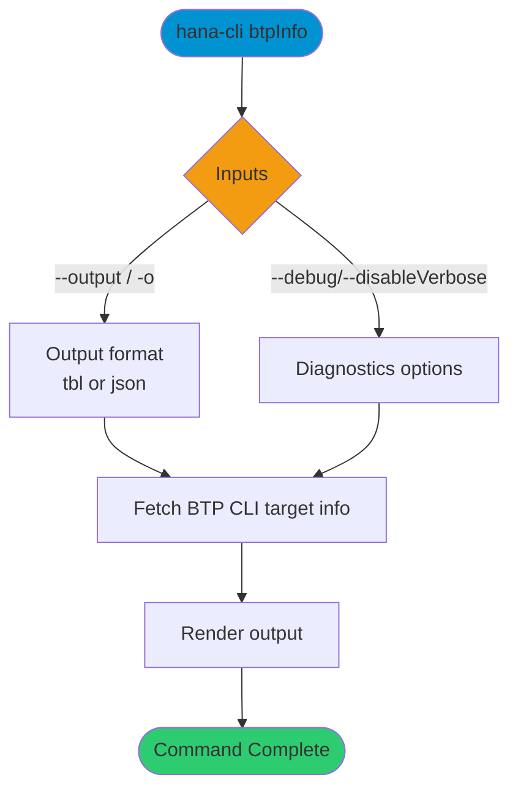
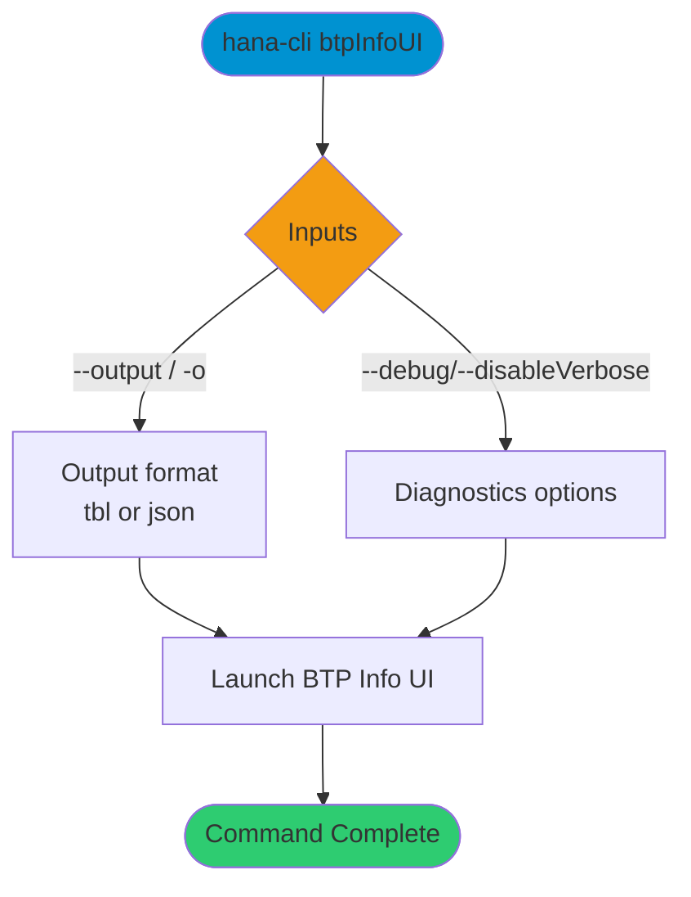

# btpInfo

> Command: `btpInfo`  
> Category: **BTP Integration**  
> Status: Production Ready

## Description

Detailed Information about btp CLI target

## Syntax

```bash
hana-cli btpInfo [options]
```

## Aliases

- `btpinfo`

## Command Diagram



## Parameters

### Positional Arguments

None.

### Options

| Option | Alias | Type | Default | Description |
| --- | --- | --- | --- | --- |
| `--output` | `-o` | string | `tbl` | Output format. Choices: `tbl`, `json`. |

### Troubleshooting

| Option | Alias | Type | Default | Description |
| --- | --- | --- | --- | --- |
| `--disableVerbose` | `--quiet` | boolean | `false` | Disable Verbose output - removes all extra output that is only helpful to human readable interface. Useful for scripting commands. |
| `--debug` | `-d` | boolean | `false` | Debug hana-cli itself by adding output of LOTS of intermediate details. |

## Examples

### Basic Usage

```bash
hana-cli btpInfo --output json
```

Output the current BTP target information in JSON format.

---

## btpInfoUI (UI Variant)

> Command: `btpInfoUI`  
> Category: **BTP Integration**  
> Status: Production Ready

### UI Description

Execute btpInfoUI command - UI version of BTP information display

### UI Syntax

```bash
hana-cli btpInfoUI [options]
```

### UI Aliases

- `btpinfoUI`
- `btpui`
- `btpInfoui`

### UI Command Diagram



### UI Parameters

#### UI Positional Arguments

None.

#### UI Options

| Option | Alias | Type | Default | Description |
| --- | --- | --- | --- | --- |
| `--output` | `-o` | string | `tbl` | Output format. Choices: `tbl`, `json`. |

#### UI Troubleshooting

| Option | Alias | Type | Default | Description |
| --- | --- | --- | --- | --- |
| `--disableVerbose` | `--quiet` | boolean | `false` | Disable Verbose output - removes all extra output that is only helpful to human readable interface. Useful for scripting commands. |
| `--debug` | `-d` | boolean | `false` | Debug hana-cli itself by adding output of LOTS of intermediate details. |

### UI Examples

```bash
hana-cli btpInfoUI
```

Launch the UI for BTP configuration details.

## Related Commands

- [btp](btp.md)
- [btpTarget](btp-target.md)
- [btpSubs](btp-subs.md)

## See Also

- [Category: BTP Integration](..)
- [All Commands A-Z](../all-commands.md)
