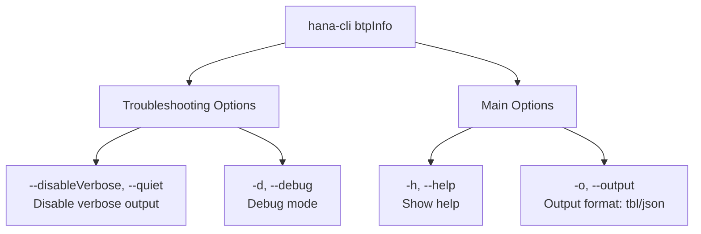

# btpInfo

> Command: `btpInfo`  
> Category: **BTP Integration**  
> Status: Production Ready

## Description

Detailed Information about btp CLI target

## Syntax

```bash
hana-cli btpInfo [options]
```

## Aliases

- `btpinfo`

## Command Diagram



## Parameters

### Troubleshooting Options

| Parameter | Aliases | Description | Type | Default |
| --- | --- | --- | --- | --- |
| `--disableVerbose` | `--quiet` | Disable verbose output - removes all extra output that is only helpful for human-readable interface. Useful for scripting commands. | boolean | `false` |
| `--debug` | `-d` | Debug hana-cli itself by adding output of many intermediate details | boolean | `false` |

### Main Options

| Parameter | Aliases | Description | Type | Default |
| --- | --- | --- | --- | --- |
| `--output` | `-o` | Output format for inspection. Available formats: `tbl` (table), `json` | string | `tbl` |
| `--help` | `-h` | Show help | boolean | |

For a complete list of parameters and options, use:

```bash
hana-cli btpInfo --help
```

## Examples

### Basic Usage

```bash
hana-cli btpInfo --output json
```

Execute the command

---

## btpInfoUI (UI Variant)

> Command: `btpInfoUI`  
> Status: Production Ready

**Description:** Execute btpInfoUI command - UI version of BTP information display

**Syntax:**

```bash
hana-cli btpInfoUI [options]
```

**Aliases:**

- `btpinfoUI`
- `btpui`
- `btpInfoui`

**Parameters:**

For a complete list of parameters and options, use:

```bash
hana-cli btpInfoUI --help
```

**Example Usage:**

```bash
hana-cli btpInfoUI
```

Execute the command

## Related Commands

See the [Commands Reference](../all-commands.md) for other commands in this category.

## See Also

- [Category: BTP Integration](..)
- [All Commands A-Z](../all-commands.md)
