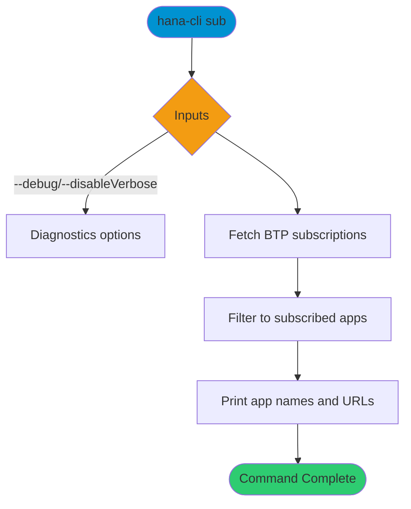

# sub

> Command: `sub`  
> Category: **BTP Integration**  
> Status: Production Ready

## Description

BTP Active Subscriptions and their URL

## Syntax

```bash
hana-cli sub [options]
```

## Aliases

- `subs`
- `Sub`
- `Subs`
- `btpsub`
- `btpsubs`
- `btpSub`
- `btpSubs`
- `btpsubscriptions`
- `btpSubscriptions`

## Command Diagram



## Parameters

### Positional Arguments

None.

### Options

None.

### Connection Parameters

None.

### Troubleshooting

| Option | Alias | Type | Default | Description |
| --- | --- | --- | --- | --- |
| `--disableVerbose` | `--quiet` | boolean | `false` | Disable Verbose output - removes all extra output that is only helpful to human readable interface. Useful for scripting commands. |
| `--debug` | `-d` | boolean | `false` | Debug hana-cli itself by adding output of LOTS of intermediate details. |

## Examples

### Basic Usage

```bash
hana-cli sub
```

List active BTP subscriptions and their URLs.

## Related Commands

- [btp](btp.md)
- [btpInfo](btp-info.md)
- [hanaCloudInstances](../hana-cloud/hana-cloud-instances.md)

## See Also

- [Category: BTP Integration](..)
- [All Commands A-Z](../all-commands.md)
