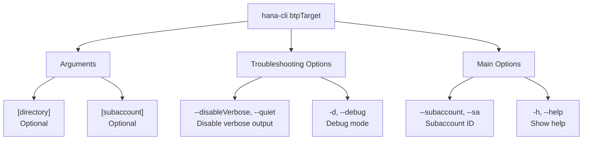

# btpTarget

> Command: `btpTarget`  
> Category: **BTP Integration**  
> Status: Production Ready

## Description

Set BTP target subaccount from hierarchy

## Syntax

```bash
hana-cli btpTarget [options]
```

## Aliases

- `btp-ui`

## Command Diagram



## Parameters

### Troubleshooting Options

| Parameter | Aliases | Description | Type | Default |
| --- | --- | --- | --- | --- |
| `--disableVerbose` | `--quiet` | Disable verbose output - removes all extra output that is only helpful for human-readable interface. Useful for scripting commands. | boolean | `false` |
| `--debug` | `-d` | Debug hana-cli itself by adding output of many intermediate details | boolean | `false` |

### Main Options

| Parameter | Aliases | Description | Type | Default |
| --- | --- | --- | --- | --- |
| `--subaccount` | `--sa` | The ID of the subaccount to be targeted | string | |
| `--help` | `-h` | Show help | boolean | |

For a complete list of parameters and options, use:

```bash
hana-cli btpTarget --help
```

## Examples

### Basic Usage

```bash
hana-cli btpTarget
```

Execute the command

## Related Commands

See the [Commands Reference](../all-commands.md) for other commands in this category.

## See Also

- [Category: BTP Integration](..)
- [All Commands A-Z](../all-commands.md)
