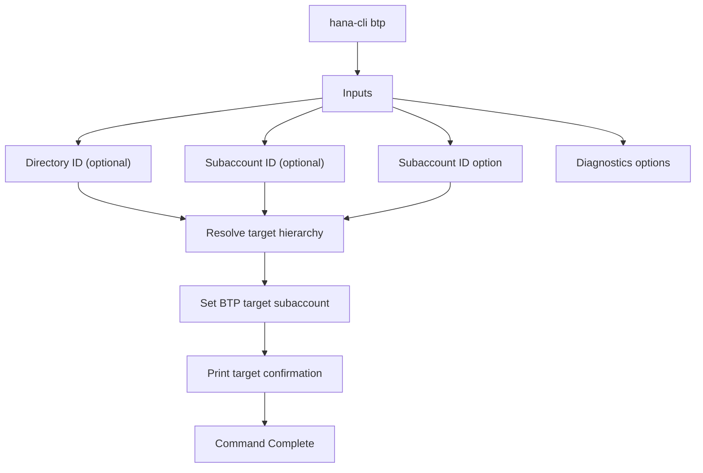

# btp

> Command: `btp`  
> Category: **BTP Integration**  
> Status: Production Ready

## Description

Set the target for commands for the btp CLI to the global account, a directory, or a subaccount. Commands are executed in the specified target, unless you override it using a parameter. If the specified target is part of an account hierarchy, its parents are also targeted, so that if a command is only available on a higher level, it will be executed there.

## Syntax

```bash
hana-cli btp [directory] [subaccount] [options]
```

## Aliases

- `btpTarget`
- `btptarget`
- `btp`

## Command Diagram



## Parameters

### Positional Arguments

| Parameter | Type | Description |
| --- | --- | --- |
| `directory` | string | Directory ID to target in the BTP hierarchy (optional). |
| `subaccount` | string | Subaccount ID to target in the BTP hierarchy (optional). |

### Options

| Option | Alias | Type | Default | Description |
| --- | --- | --- | --- | --- |
| `--subaccount` | `--sa` | string | - | The ID of the subaccount to be targeted. |

### Troubleshooting

| Option | Alias | Type | Default | Description |
| --- | --- | --- | --- | --- |
| `--disableVerbose` | `--quiet` | boolean | `false` | Disable Verbose output - removes all extra output that is only helpful to human readable interface. Useful for scripting commands. |
| `--debug` | `-d` | boolean | `false` | Debug hana-cli itself by adding output of LOTS of intermediate details. |

## Examples

### Basic Usage

```bash
hana-cli btp --subaccount mySubaccount
```

Set the active BTP target to the specified subaccount.

## Related Commands

- [btpInfo](btp-info.md)
- [btpTarget](btp-target.md)
- [btpSubs](btp-subs.md)
- [hanaCloudInstances](../hana-cloud/hana-cloud-instances.md)

## See Also

- [Category: BTP Integration](..)
- [All Commands A-Z](../all-commands.md)
