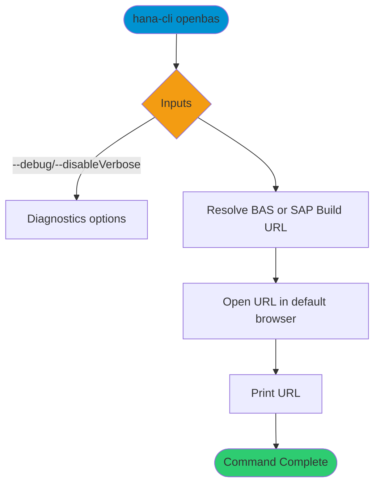

# openbas

> Command: `openbas`  
> Category: **BTP Integration**  
> Status: Production Ready

## Description

Open SAP Business Appplication Studio. If your account has SAP Build configured, this command will open the SAP Build launch page instead.

## Syntax

```bash
hana-cli openbas [options]
```

## Aliases

- `openBAS`
- `openBas`
- `build`
- `openBuild`
- `openbuild`
- `openBusinessApplicationStudio`
- `bas`
- `BAS`

## Command Diagram



## Parameters

### Positional Arguments

None.

### Options

None.

### Connection Parameters

None.

### Troubleshooting

| Option | Alias | Type | Default | Description |
| --- | --- | --- | --- | --- |
| `--disableVerbose` | `--quiet` | boolean | `false` | Disable Verbose output - removes all extra output that is only helpful to human readable interface. Useful for scripting commands. |
| `--debug` | `-d` | boolean | `false` | Debug hana-cli itself by adding output of LOTS of intermediate details. |

## Examples

### Basic Usage

```bash
hana-cli openBAS
```

Open Business Application Studio (or SAP Build) in your browser.

## Related Commands

- [cds](../developer-tools/cds.md)
- [activateHDI](../hdi-management/activate-h-d-i.md)

## See Also

- [Category: BTP Integration](..)
- [All Commands A-Z](../all-commands.md)
