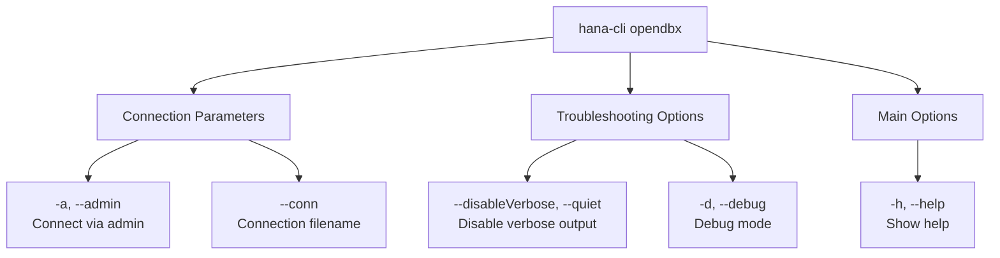

# openDBExplorer

> Command: `openDBExplorer`  
> Category: **BTP Integration**  
> Status: Production Ready

## Description

Open DB Explorer - a web-based tool for exploring and managing SAP HANA databases. This command opens the DB Explorer in your default web browser, allowing you to interact with your SAP HANA database through a user-friendly interface. You can view database schemas, run SQL queries, and manage database objects directly from the DB Explorer.

### How DB Explorer URL is Determined

The command uses an intelligent two-tier lookup mechanism to find the DB Explorer URL:

1. **HANA Cloud (BTP) Lookup** - First, it attempts to retrieve HANA Cloud service instances from your current BTP subaccount using the SAP BTP CLI. If a HANA Cloud instance is found, the command extracts the DB Explorer URL from the instance's dashboard URL. This approach works even when you're logged into a development space with a remote HANA instance mapping.

2. **On-Premise XSA Fallback** - If the BTP lookup fails or no HANA Cloud instances are found, the command falls back to querying your connected HANA database directly. It retrieves the API URL from the `M_INIFILE_CONTENTS` system view (specifically from `xscontroller.ini`) and uses this to construct the DB Explorer URL. This approach is necessary for on-premise XSA-based HANA systems.

This dual approach ensures compatibility with both SAP HANA Cloud deployments and on-premise HANA instances running on SAP Application Server ABAP (XSA).

## Syntax

```bash
hana-cli opendbx [options]
```

## Aliases

- `open`
- `openDBX`
- `opendb`
- `openDBExplorer`
- `opendbexplorer`
- `dbx`
- `DBX`

## Command Diagram



## Parameters

### Connection Parameters

| Parameter | Aliases | Description | Type | Default |
| --- | --- | --- | --- | --- |
| `--admin` | `-a` | Connect via admin (using default-env-admin.json) | boolean | `false` |
| `--conn` | | Connection filename to override default-env.json | string | |

### Troubleshooting Options

| Parameter | Aliases | Description | Type | Default |
| --- | --- | --- | --- | --- |
| `--disableVerbose` | `--quiet` | Disable verbose output - removes all extra output that is only helpful for human-readable interface. Useful for scripting commands. | boolean | `false` |
| `--debug` | `-d` | Debug hana-cli itself by adding output of many intermediate details | boolean | `false` |

### Main Options

| Parameter | Aliases | Description | Type | Default |
| --- | --- | --- | --- | --- |
| `--help` | `-h` | Show help | boolean | |

For a complete list of parameters and options, use:

```bash
hana-cli openDBExplorer --help
```

## Examples

### Basic Usage

```bash
hana-cli openDBExplorer
```

Execute the command

## Related Commands

See the [Commands Reference](../all-commands.md) for other commands in this category.

## See Also

- [Category: BTP Integration](..)
- [All Commands A-Z](../all-commands.md)
