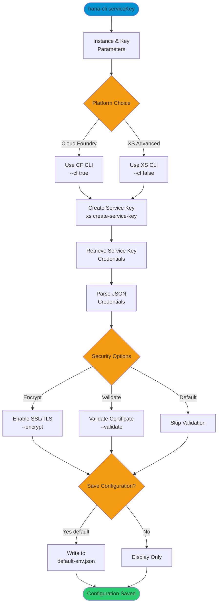

# serviceKey

> Command: `serviceKey`  
> Category: **Connection & Auth**  
> Status: Production Ready

## Description

Connect to SAP HANA and write connection configuration to default-env.json via Cloud Foundry or XS Advanced HANA service key. This command retrieves service key credentials from Cloud Foundry (or XS) and automatically configures your local development environment.

## Syntax

```bash
hana-cli serviceKey [instance] [key] [options]
```

## Aliases

- `key`
- `servicekey`
- `service-key`

## Command Diagram



## Parameters

### Positional Arguments

| Parameter  | Type   | Description                                           |
|------------|--------|-------------------------------------------------------|
| `instance` | string | Cloud Foundry or XS Advanced service instance name    |
| `key`      | string | Service key name to create or retrieve               |

### Options

| Option        | Alias              | Type    | Default | Description                                                                           |
|---------------|--------------------|---------|---------|---------------------------------------------------------------------------------------|
| `--instance`  | `-i`               | string  | -       | Service instance name                                                                 |
| `--key`       | `-k`, `--key`      | string  | -       | Service key name                                                                      |
| `--encrypt`   | `-e`, `--ssl`      | boolean | `true`  | Enable SSL/TLS encryption for connections                                             |
| `--validate`  | `-v`, `--validatecertificate` | boolean | `false` | Enable SSL certificate validation (recommended for production)            |
| `--cf`        | `-c`, `--cmd`      | boolean | `true`  | Use Cloud Foundry CLI (cf). Set to false to use XS Advanced CLI (xs)                 |
| `--save`      | `-s`               | boolean | `true`  | Save configuration to default-env.json file                                           |

### Troubleshooting

| Option              | Alias     | Type    | Default | Description                                                                                              |
|---------------------|-----------|---------|---------|----------------------------------------------------------------------------------------------------------|
| `--disableVerbose`  | `--quiet` | boolean | `false` | Disable verbose output - removes all extra output that is only helpful to human readable interface       |
| `--debug`           | `-d`      | boolean | `false` | Debug hana-cli itself by adding output of LOTS of intermediate details                                   |

For a complete list of parameters and options, use:

```bash
hana-cli connectViaServiceKey --help
```

## Examples

### Basic Usage (Cloud Foundry)

```bash
hana-cli serviceKey myInstance myKey
```

Create a service key named "myKey" for instance "myInstance" using Cloud Foundry CLI, and save the configuration to default-env.json.

### Using Named Parameters

```bash
hana-cli serviceKey --instance myHanaService --key dev-key
```

Explicitly specify the instance and key names.

### Using XS Advanced CLI

```bash
hana-cli serviceKey myInstance myKey --cf false
```

Use XS Advanced CLI instead of Cloud Foundry CLI.

### With Certificate Validation

```bash
hana-cli serviceKey myInstance myKey --validate
```

Enable SSL certificate validation for enhanced security in production environments.

### Without Saving Configuration

```bash
hana-cli serviceKey myInstance myKey --save false
```

Retrieve and display service key credentials without saving to default-env.json.

## Related Commands

See the [Commands Reference](../all-commands.md) for other commands in this category.

## See Also

- [Category: Connection & Auth](..)
- [All Commands A-Z](../all-commands.md)
