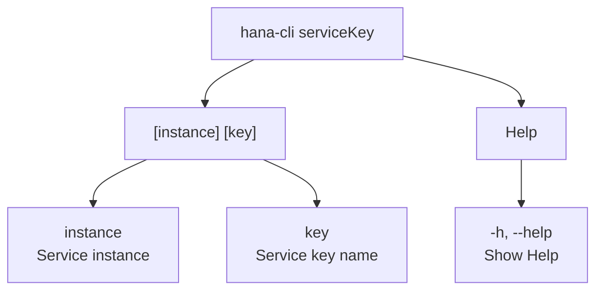

# connectViaServiceKey

> Command: `connectViaServiceKey`  
> Category: **Connection & Auth**  
> Status: Production Ready

## Description

Connect and write default-env.json via Cloud Foundry HANA service key

## Syntax

```bash
hana-cli serviceKey [instance] [key] [options]
```

## Aliases

- `key`
- `servicekey`
- `service-key`

## Command Diagram



## Parameters

| Parameter | Type | Description |
| --- | --- | --- |
| `instance` | string | Cloud Foundry service instance name |
| `key` | string | Service key name |
| `--help`, `-h` | boolean | Show help information |

For a complete list of parameters and options, use:

```bash
hana-cli connectViaServiceKey --help
```

## Examples

### Basic Usage

```bash
hana-cli hana-cli serviceKey --instance myInstance --key myKey
```

Execute the command

## Related Commands

See the [Commands Reference](../all-commands.md) for other commands in this category.

## See Also

- [Category: Connection & Auth](..)
- [All Commands A-Z](../all-commands.md)
