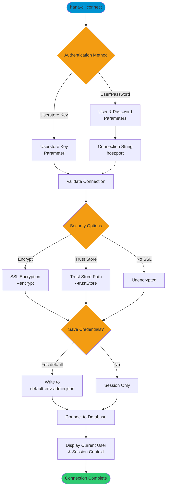

# connect

> Command: `connect`  
> Category: **Connection & Auth**  
> Status: Production Ready

## Description

Connects to an SAP HANA DB and writes connection information to a default-env-admin.json

## Syntax

```bash
hana-cli connect [user] [password] [options]
```

## Aliases

- `c`
- `login`

## Command Diagram



## Parameters

### Positional Arguments

| Parameter  | Type   | Description                                    |
|------------|--------|------------------------------------------------|
| `user`     | string | Database user (optional if using userstorekey) |
| `password` | string | Database password (optional if using userstorekey) |

### Options

| Option           | Alias                      | Type    | Default | Description                                                                                    |
|------------------|----------------------------|---------|---------|------------------------------------------------------------------------------------------------|
| `--connection`   | `-n`                       | string  | -       | Connection String in format `<host>[:<port>]` (e.g., localhost:30015)                        |
| `--user`         | `-u`                       | string  | -       | Database user                                                                                  |
| `--password`     | `-p`                       | string  | -       | Database password                                                                              |
| `--userstorekey` | `--uk`, `--userstore`      | string  | -       | HDB User Store Key - Overrides all other connection parameters                                |
| `--save`         | `-s`                       | boolean | `true`  | Save credentials to default-env-admin.json file                                                |
| `--encrypt`      | `-e`, `--ssl`              | boolean | `false` | Encrypt connections using SSL/TLS (required for SAP HANA Cloud and SAP BTP)                   |
| `--trustStore`   | `-t`, `--trust`, `--truststore` | string  | -       | Path to SSL Trust Store file for certificate validation                                       |

### Troubleshooting

| Option              | Alias     | Type    | Default | Description                                                                                              |
|---------------------|-----------|---------|---------|----------------------------------------------------------------------------------------------------------|
| `--disableVerbose`  | `--quiet` | boolean | `false` | Disable verbose output - removes all extra output that is only helpful to human readable interface       |
| `--debug`           | `-d`      | boolean | `false` | Debug hana-cli itself by adding output of LOTS of intermediate details                                   |

For a complete list of parameters and options, use:

```bash
hana-cli connect --help
```

## Examples

### Basic Usage

```bash
hana-cli connect --connection localhost:30015 --user DBUSER
```

Connect to a local HANA database on port 30015. You will be prompted for the password.

### Using Userstore Key

```bash
hana-cli connect --userstorekey MYKEY
```

Connect using a pre-configured HDB Userstore key. This method is secure and doesn't require entering credentials.

### Connect with SSL/TLS Encryption

```bash
hana-cli connect --connection myserver.hana.ondemand.com:443 --user DBUSER --encrypt
```

Connect to SAP HANA Cloud or SAP BTP with SSL encryption enabled (required for cloud environments).

### Connect Without Saving Credentials

```bash
hana-cli connect --connection localhost:30015 --user DBUSER --save false
```

Connect for a single session without saving credentials to default-env-admin.json.

### Using Custom Trust Store

```bash
hana-cli connect --connection myserver.com:443 --user DBUSER --encrypt --trustStore /path/to/truststore.pem
```

Connect with SSL and specify a custom trust store for certificate validation.

## Related Commands

See the [Commands Reference](../all-commands.md) for other commands in this category.

## See Also

- [Category: Connection & Auth](..)
- [All Commands A-Z](../all-commands.md)
