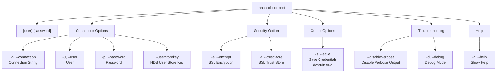

# connect

> Command: `connect`  
> Category: **Connection & Auth**  
> Status: Production Ready

## Description

Connects to an SAP HANA DB and writes connection information to a default-env-admin.json

## Syntax

```bash
hana-cli connect [user] [password] [options]
```

## Aliases

- `c`
- `login`

## Command Diagram



## Parameters

| Option | Alias | Type | Default | Description |
| --- | --- | --- | --- | --- |
| `--connection` | `-n` | string | - | Connection String in format `<host>[:<port>]` |
| `--user` | `-u` | string | - | Database user |
| `--password` | `-p` | string | - | Database password |
| `--userstorekey` | `--uk`, `--userstore` | string | - | HDB User Store Key - Overrides all other connection parameters |
| `--save` | `-s` | boolean | `true` | Save credentials to default-env-admin.json |
| `--encrypt` | `-e`, `--ssl` | boolean | `false` | Encrypt connections (required for SAP HANA service on SAP BTP or SAP HANA Cloud) |
| `--trustStore` | `-t`, `--trust`, `--truststore` | string | - | SSL Trust Store path |
| `--disableVerbose` | `--quiet` | boolean | `false` | Disable verbose output - useful for scripting |
| `--debug` | `-d` | boolean | `false` | Debug hana-cli itself with detailed intermediate output |
| `--help` | `-h` | boolean | - | Show help information |

For a complete list of parameters and options, use:

```bash
hana-cli connect --help
```

## Examples

### Basic Usage

```bash
hana-cli hana-cli connect --connection localhost:30015 --user DBUSER
```

Execute the command

## Related Commands

See the [Commands Reference](../all-commands.md) for other commands in this category.

## See Also

- [Category: Connection & Auth](..)
- [All Commands A-Z](../all-commands.md)
