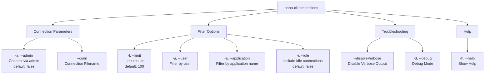

# connections

> Command: `connections`  
> Category: **Connection & Auth**  
> Status: Production Ready

## Description

Active connection details and statistics. This command requires access to system session monitoring views (M_SESSIONS) which are not available in HDI container schemas. Connect to the SYSTEMDB to view active connections.

## Syntax

```bash
hana-cli connections [options]
```

## Aliases

- `conn`
- `c`

## Command Diagram



## Parameters

| Option | Alias | Type | Default | Description |
| --- | --- | --- | --- | --- |
| `--admin` | `-a` | boolean | `false` | Connect via admin (default-env-admin.json) |
| `--conn` | - | string | - | Connection filename to override default-env.json |
| `--limit` | `-l` | number | `100` | Limit number of results |
| `--user` | `-u` | string | - | Filter connections by user |
| `--application` | `-a` | string | - | Filter connections by application name |
| `--idle` | `-i` | boolean | `false` | Include idle connections |
| `--disableVerbose` | `--quiet` | boolean | `false` | Disable verbose output - useful for scripting |
| `--debug` | `-d` | boolean | `false` | Debug hana-cli itself with detailed intermediate output |
| `--help` | `-h` | boolean | - | Show help information |

For a complete list of parameters and options, use:

```bash
hana-cli connections --help
```

## Examples

### Basic Usage

```bash
hana-cli connections
```

Execute the command

## Related Commands

See the [Commands Reference](../all-commands.md) for other commands in this category.

## See Also

- [Category: Connection & Auth](..)
- [All Commands A-Z](../all-commands.md)
