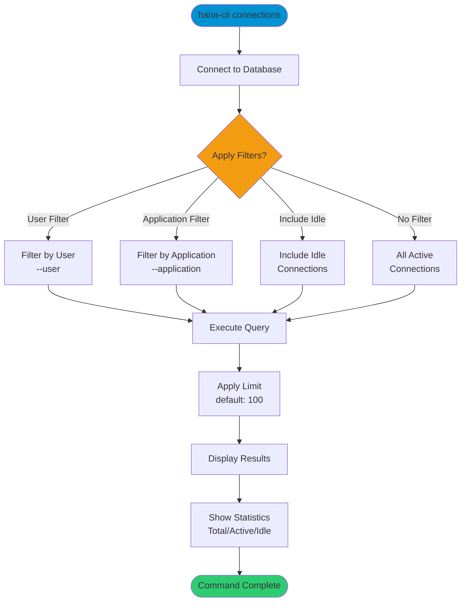

# connections

> Command: `connections`  
> Category: **Connection & Auth**  
> Status: Production Ready

## Description

Active connection details and statistics. This command requires access to system session monitoring views (M_SESSIONS) which are not available in HDI container schemas. Connect to the SYSTEMDB to view active connections.

## Syntax

```bash
hana-cli connections [options]
```

## Aliases

- `conn`
- `c`

## Command Diagram



## Parameters

### Filter Options

| Option          | Alias | Type    | Default | Description                                                              |
|-----------------|-------|---------|---------|--------------------------------------------------------------------------|
| `--limit`       | `-l`  | number  | `100`   | Maximum number of connections to display                                 |
| `--user`        | `-u`  | string  | -       | Filter connections by user name (supports SQL LIKE patterns)             |
| `--application` | `-a`  | string  | -       | Filter connections by application name (supports SQL LIKE patterns)      |
| `--idle`        | `-i`  | boolean | `false` | Include idle connections in results (by default only active are shown)   |

### Connection Parameters

| Option    | Alias | Type    | Default | Description                                          |
|-----------|-------|---------|---------|------------------------------------------------------|
| `--admin` | `-a`  | boolean | `false` | Connect via admin (default-env-admin.json)           |
| `--conn`  | -     | string  | -       | Connection filename to override default-env.json     |

### Troubleshooting

| Option              | Alias     | Type    | Default | Description                                                                                              |
|---------------------|-----------|---------|---------|----------------------------------------------------------------------------------------------------------|
| `--disableVerbose`  | `--quiet` | boolean | `false` | Disable verbose output - removes all extra output that is only helpful to human readable interface       |
| `--debug`           | `-d`      | boolean | `false` | Debug hana-cli itself by adding output of LOTS of intermediate details                                   |

For a complete list of parameters and options, use:

```bash
hana-cli connections --help
```

## Examples

### Basic Usage

```bash
hana-cli connections
```

Display all active database connections with default limit of 100 connections. Shows connection details including user, application, status, and idle time.

### List Connections for Specific User

```bash
hana-cli connections --user DBADMIN
```

Show all active connections for a specific user.

### Filter by Application Name

```bash
hana-cli connections --application "SAP HANA Studio"
```

Display connections from a specific application.

### Include Idle Connections

```bash
hana-cli connections --idle --limit 200
```

Show both active and idle connections, with increased limit to 200.

### Using Pattern Matching

```bash
hana-cli connections --user "USER_%" --application "%Studio%"
```

Filter connections using SQL LIKE patterns to match multiple users or applications.

## Related Commands

See the [Commands Reference](../all-commands.md) for other commands in this category.

## See Also

- [Category: Connection & Auth](..)
- [All Commands A-Z](../all-commands.md)
