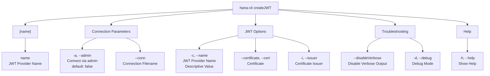

# createJWT

> Command: `createJWT`  
> Category: **Connection & Auth**  
> Status: Production Ready

## Description

Create JWT Token and Import Certificate (To obtain the certificate and issuer used in the SQL you need to use the xsuaa service key credentials.url element which should look like this: https://&lt;subdomain&gt;.authentication.&lt;region&gt;.hana.ondemand.com then add /sap/trust/jwt path to it in a browser)

## Syntax

```bash
hana-cli createJWT [name] [options]
```

## Aliases

- `cJWT`
- `cjwt`
- `cJwt`

## Command Diagram



## Parameters

| Option | Alias | Type | Default | Description |
| --- | --- | --- | --- | --- |
| `--admin` | `-a` | boolean | `false` | Connect via admin (default-env-admin.json) |
| `--conn` | - | string | - | Connection filename to override default-env.json |
| `--name` | `-c` | string | - | JWT Provider Name (any descriptive value) |
| `--certificate` | `--cert` | string | - | Certificate |
| `--issuer` | `-i` | string | - | Certificate Issuer |
| `--disableVerbose` | `--quiet` | boolean | `false` | Disable verbose output - useful for scripting |
| `--debug` | `-d` | boolean | `false` | Debug hana-cli itself with detailed intermediate output |
| `--help` | `-h` | boolean | - | Show help information |

For a complete list of parameters and options, use:

```bash
hana-cli createJWT --help
```

## Examples

### Basic Usage

```bash
hana-cli hana-cli createJWT --name myJWT --issuer https://example.com
```

Execute the command

## Related Commands

See the [Commands Reference](../all-commands.md) for other commands in this category.

## See Also

- [Category: Connection & Auth](..)
- [All Commands A-Z](../all-commands.md)
