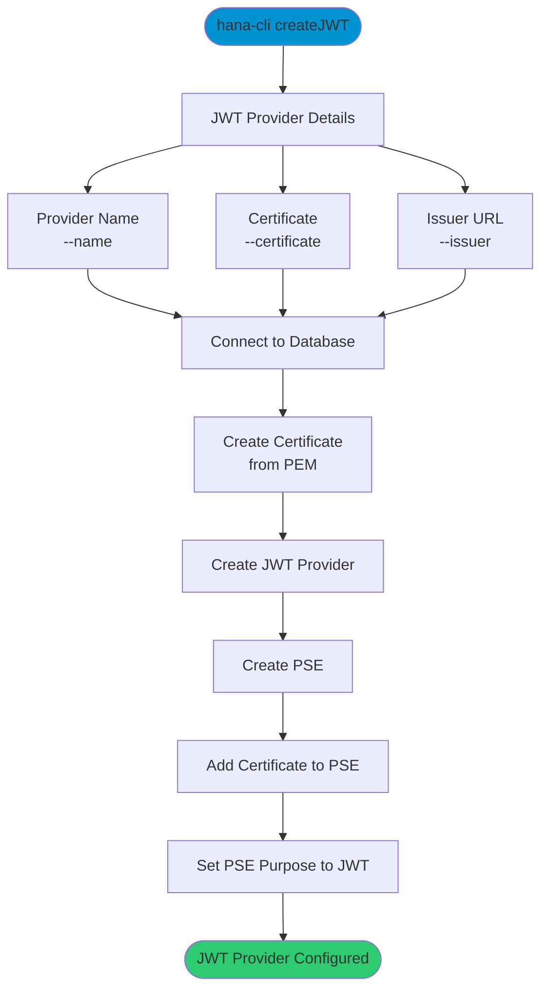

# createJWT

> Command: `createJWT`  
> Category: **Connection & Auth**  
> Status: Production Ready

## Description

Create a JWT (JSON Web Token) provider and import its certificate into SAP HANA. This command configures JWT-based authentication by creating the provider, importing the certificate, creating a PSE (Personal Security Environment), and associating them.

### What is JWT Authentication?

JWT (JSON Web Token) is a standard for securely transmitting information between parties. In SAP HANA, JWT authentication allows external identity providers (like XSUAA) to authenticate users without managing passwords in the database.

### How to Get Certificate and Issuer

To obtain the certificate and issuer:

1. Get your XSUAA service key credentials
2. Find the `credentials.url` element (e.g., `https://<subdomain>.authentication.<region>.hana.ondemand.com`)
3. Add `/sap/trust/jwt` to the URL
4. Open in a browser to retrieve the certificate and issuer information

## Syntax

```bash
hana-cli createJWT [name] [options]
```

## Aliases

- `cJWT`
- `cjwt`
- `cJwt`

## Command Diagram



## Parameters

### Positional Arguments

| Parameter | Type   | Description                                          |
|-----------|--------|------------------------------------------------------|
| `name`    | string | JWT Provider name (any descriptive value)            |

### Options

| Option          | Alias    | Type   | Default | Description                                                                       |
|-----------------|----------|--------|---------|-----------------------------------------------------------------------------------|
| `--name`        | `-c`     | string | -       | JWT Provider name (any descriptive value, e.g., "MyApp_JWT")                      |
| `--certificate` | `--cert` | string | -       | Certificate in PEM format (can be multi-line string)                              |
| `--issuer`      | `-i`     | string | -       | Certificate issuer URL (e.g., `https://subdomain.authentication.region.hana.ondemand.com`) |

### Connection Parameters

| Option    | Alias | Type    | Default | Description                                          |
|-----------|-------|---------|---------|------------------------------------------------------|
| `--admin` | `-a`  | boolean | `false` | Connect via admin (default-env-admin.json)           |
| `--conn`  | -     | string  | -       | Connection filename to override default-env.json     |

### Troubleshooting

| Option              | Alias     | Type    | Default | Description                                                                                              |
|---------------------|-----------|---------|---------|----------------------------------------------------------------------------------------------------------|
| `--disableVerbose`  | `--quiet` | boolean | `false` | Disable verbose output - removes all extra output that is only helpful to human readable interface       |
| `--debug`           | `-d`      | boolean | `false` | Debug hana-cli itself by adding output of LOTS of intermediate details                                   |

For a complete list of parameters and options, use:

```bash
hana-cli createJWT --help
```

## Examples

### Basic Usage

```bash
hana-cli createJWT --name MyApp_JWT --issuer https://mytenant.authentication.us10.hana.ondemand.com --certificate "-----BEGIN CERTIFICATE-----\nMIIC...\n-----END CERTIFICATE-----"
```

Create a JWT provider with a name, issuer URL, and certificate. The certificate should be in PEM format.

### Using Certificate from File

First, save your certificate to a file, then use command substitution:

```bash
hana-cli createJWT --name MyApp_JWT --issuer https://mytenant.authentication.us10.hana.ondemand.com --certificate "$(cat mycert.pem)"
```

Load certificate content from a file.

### Interactive Mode

```bash
hana-cli createJWT
```

Run without parameters to be prompted for each required value (name, certificate, issuer).

## Related Commands

See the [Commands Reference](../all-commands.md) for other commands in this category.

## See Also

- [Category: Connection & Auth](..)
- [All Commands A-Z](../all-commands.md)
