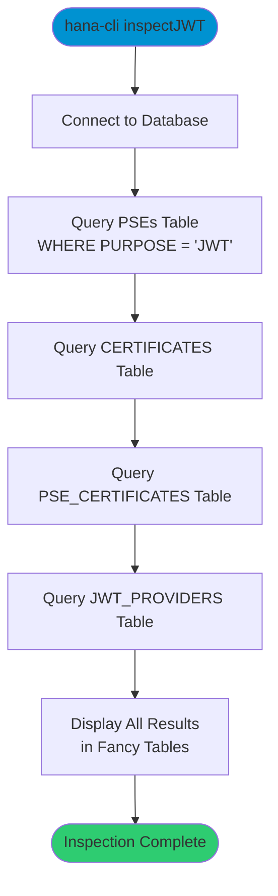

# inspectJWT

> Command: `inspectJWT`  
> Category: **Connection & Auth**  
> Status: Production Ready

## Description

Inspect JWT (JSON Web Token) provider configuration in SAP HANA. This command displays information about JWT providers, certificates, PSEs (Personal Security Environments), and their associations. Use this to verify JWT authentication setup and troubleshoot configuration issues.

## Syntax

```bash
hana-cli inspectJWT [options]
```

## Aliases

- `jwt`
- `ijwt`
- `iJWT`
- `iJwt`

## Command Diagram



## Parameters

### Connection Parameters

| Option    | Alias | Type    | Default | Description                                          |
|-----------|-------|---------|---------|------------------------------------------------------|
| `--admin` | `-a`  | boolean | `false` | Connect via admin (default-env-admin.json)           |
| `--conn`  | -     | string  | -       | Connection filename to override default-env.json     |

### Troubleshooting

| Option              | Alias     | Type    | Default | Description                                                                                              |
|---------------------|-----------|---------|---------|----------------------------------------------------------------------------------------------------------|
| `--disableVerbose`  | `--quiet` | boolean | `false` | Disable verbose output - removes all extra output that is only helpful to human readable interface       |
| `--debug`           | `-d`      | boolean | `false` | Debug hana-cli itself by adding output of LOTS of intermediate details                                   |

For a complete list of parameters and options, use:

```bash
hana-cli inspectJWT --help
```

## Examples

### Basic Usage

```bash
hana-cli inspectJWT
```

Display all JWT-related configuration in SAP HANA, including:

- PSEs (Personal Security Environments) with JWT purpose
- All certificates in the system
- Certificate associations with PSEs
- JWT provider configurations

## Output Information

The command displays four result tables:

1. **PSES Table**: Shows all Personal Security Environments configured for JWT authentication
2. **CERTIFICATES Table**: Lists all certificates in the system
3. **PSE_CERTIFICATES Table**: Shows which certificates are associated with which PSEs
4. **JWT_PROVIDERS Table**: Displays all JWT provider configurations including names and issuers

## Related Commands

See the [Commands Reference](../all-commands.md) for other commands in this category.

## See Also

- [Category: Connection & Auth](..)
- [All Commands A-Z](../all-commands.md)
