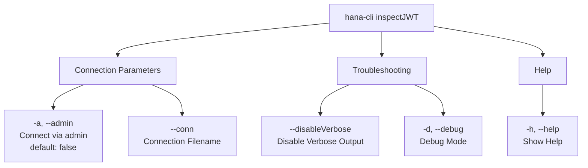

# inspectJWT

> Command: `inspectJWT`  
> Category: **System Tools**  
> Status: Production Ready

## Description

Inspect JWT Token Configuration

## Syntax

```bash
hana-cli inspectJWT [options]
```

## Aliases

- `jwt`
- `ijwt`
- `iJWT`
- `iJwt`

## Command Diagram



## Parameters

| Option | Alias | Type | Default | Description |
| --- | --- | --- | --- | --- |
| `--admin` | `-a` | boolean | `false` | Connect via admin (default-env-admin.json) |
| `--conn` | - | string | - | Connection filename to override default-env.json |
| `--disableVerbose` | `--quiet` | boolean | `false` | Disable verbose output - useful for scripting |
| `--debug` | `-d` | boolean | `false` | Debug hana-cli itself with detailed intermediate output |
| `--help` | `-h` | boolean | - | Show help information |

For a complete list of parameters and options, use:

```bash
hana-cli inspectJWT --help
```

## Examples

### Basic Usage

```bash
hana-cli inspectJWT
```

Execute the command

## Related Commands

See the [Commands Reference](../all-commands.md) for other commands in this category.

## See Also

- [Category: System Tools](..)
- [All Commands A-Z](../all-commands.md)
