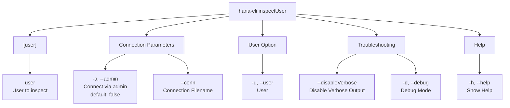

# inspectUser

> Command: `inspectUser`  
> Category: **Connection & Auth**  
> Status: Production Ready

## Description

Return metadata about a User

## Syntax

```bash
hana-cli inspectUser [user] [options]
```

## Aliases

- `iu`
- `user`
- `insUser`
- `inspectuser`

## Command Diagram



## Parameters

| Option | Alias | Type | Default | Description |
| --- | --- | --- | --- | --- |
| `--admin` | `-a` | boolean | `false` | Connect via admin (default-env-admin.json) |
| `--conn` | - | string | - | Connection filename to override default-env.json |
| `--user` | `-u` | string | - | User to inspect |
| `--disableVerbose` | `--quiet` | boolean | `false` | Disable verbose output - useful for scripting |
| `--debug` | `-d` | boolean | `false` | Debug hana-cli itself with detailed intermediate output |
| `--help` | `-h` | boolean | - | Show help information |

For a complete list of parameters and options, use:

```bash
hana-cli inspectUser --help
```

## Examples

### Basic Usage

```bash
hana-cli inspectUser --user SYSTEM
```

**Output:**

```text
Using Connection Configuration loaded via default-env.json

User: SYSTEM

╭─────────────────────────────────────────────────────────────────────────────────────────╮
│ USER_NAME: SYSTEM                                                                       │
│ USER_ID: 131074                                                                         │
│ USERGROUP_NAME: (empty)                                                                 │
│ USER_MODE: (empty)                                                                      │
│ EXTERNAL_IDENTITY: (empty)                                                              │
│ CREATOR: (empty)                                                                        │
│ CREATED_TIME: (empty)                                                                   │
│ VALID_ID_FROM: (empty)                                                                  │
│ VALID_ID_UNTIL: (empty)                                                                 │
│ LAST_SUCCESSFUL_CONNECT: (empty)                                                        │
│ LAST_INVALID_CONNECT_ATTEMPT: (empty)                                                   │
│ INVALID_CONNECT_ATTEMPTS: (empty)                                                       │
│ ADMIN_GIVEN_PASSWORD: (empty)                                                           │
│ LAST_PASSWORD_CHANGE_TIME: (empty)                                                      │
│ PASSWORD_CHANGE_NEEDED: (empty)                                                         │
│ IS_PASSWORD_LIFE_TIME_CHECK_ENABLED: (empty)                                            │
│ USER_DEACTIVATION_TIME: (empty)                                                         │
│ IS_PASSWORD_ENABLED: (empty)                                                            │
│ IS_KERBEROS_ENABLED: (empty)                                                            │
│ IS_SAML_ENABLED: (empty)                                                                │
╰─────────────────────────────────────────────────────────────────────────────────────────╯

📋 User Parameters
━━━━━━━━━━━━━━━━━━━━━━━━━━━━━━━━━━━━━━━━━━━━━━━━━━━━━━━━━━━━━━━━━━━━━━━━━━━━━━━━━━━━━━
No data found for this query

🔐 Roles Granted to the Current User
━━━━━━━━━━━━━━━━━━━━━━━━━━━━━━━━━━━━━━━━━━━━━━━━━━━━━━━━━━━━━━━━━━━━━━━━━━━━━━━━━━━━━━
No data found for this query

⚡ Privileges Granted to the Current User
━━━━━━━━━━━━━━━━━━━━━━━━━━━━━━━━━━━━━━━━━━━━━━━━━━━━━━━━━━━━━━━━━━━━━━━━━━━━━━━━━━━━━━
No data found for this query
```

Execute the command

## Related Commands

See the [Commands Reference](../all-commands.md) for other commands in this category.

## See Also

- [Category: Connection & Auth](..)
- [All Commands A-Z](../all-commands.md)
