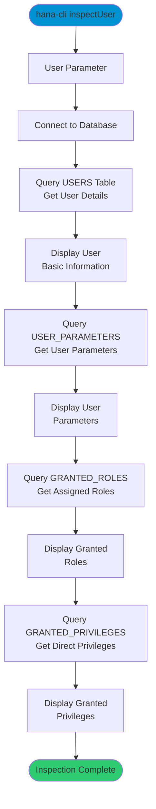

# inspectUser

> Command: `inspectUser`  
> Category: **Connection & Auth**  
> Status: Production Ready

## Description

Return comprehensive metadata about a database user including user details, parameters, granted roles, and privileges. This command is useful for security audits, troubleshooting access issues, and understanding user configurations.

## Syntax

```bash
hana-cli inspectUser [user] [options]
```

## Aliases

- `iu`
- `user`
- `insUser`
- `inspectuser`

## Command Diagram



## Parameters

### Positional Arguments

| Parameter | Type   | Description                  |
|-----------|--------|------------------------------|
| `user`    | string | Database user name to inspect |

### Options

| Option   | Alias | Type   | Default | Description                  |
|----------|-------|--------|---------|------------------------------|
| `--user` | `-u`  | string | -       | Database user name to inspect |

### Connection Parameters

| Option    | Alias | Type    | Default | Description                                          |
|-----------|-------|---------|---------|------------------------------------------------------|
| `--admin` | `-a`  | boolean | `false` | Connect via admin (default-env-admin.json)           |
| `--conn`  | -     | string  | -       | Connection filename to override default-env.json     |

### Troubleshooting

| Option              | Alias     | Type    | Default | Description                                                                                              |
|---------------------|-----------|---------|---------|----------------------------------------------------------------------------------------------------------|
| `--disableVerbose`  | `--quiet` | boolean | `false` | Disable verbose output - removes all extra output that is only helpful to human readable interface       |
| `--debug`           | `-d`      | boolean | `false` | Debug hana-cli itself by adding output of LOTS of intermediate details                                   |

For a complete list of parameters and options, use:

```bash
hana-cli inspectUser --help
```

## Examples

### Basic Usage

```bash
hana-cli inspectUser --user SYSTEM
```

Inspect the SYSTEM user and display comprehensive information including basic user details, parameters, granted roles, and privileges.

### Using Positional Argument

```bash
hana-cli inspectUser DBADMIN
```

Inspect a user by providing the username as a positional argument.

### Inspect Current User

```bash
hana-cli inspectUser --user $(whoami)
```

Inspect the currently connected user's configuration.

## Output Sections

The command displays four sections of information:

1. **User Basic Information**: USER_NAME, USER_ID, USERGROUP_NAME, CREATE_TIME, etc.
2. **User Parameters**: Configuration parameters specific to the user
3. **Granted Roles**: All roles assigned to the user with grantor information
4. **Granted Privileges**: Direct privileges assigned to the user

For a complete list of parameters and options, use:

```bash
hana-cli inspectUser --help
```

## Related Commands

See the [Commands Reference](../all-commands.md) for other commands in this category.

## See Also

- [Category: Connection & Auth](..)
- [All Commands A-Z](../all-commands.md)
