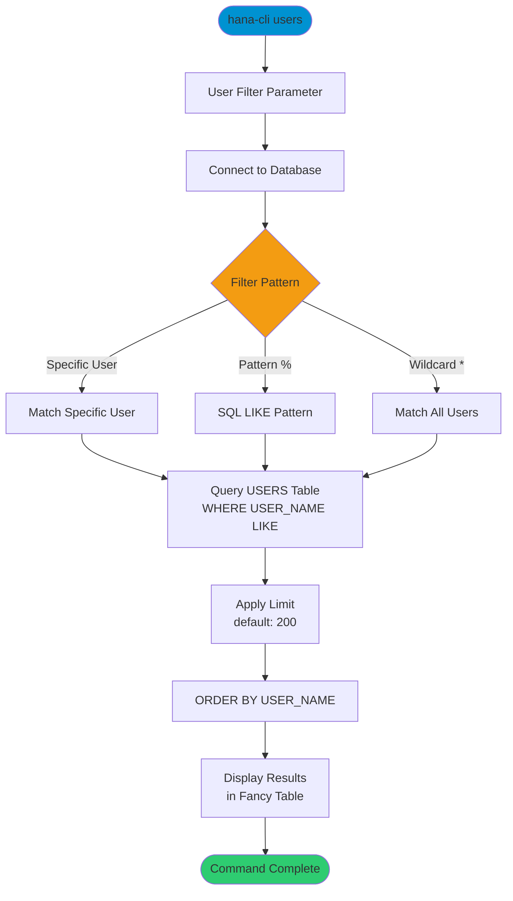

# users

> Command: `users`  
> Category: **Connection & Auth**  
> Status: Production Ready

## Description

Get a list of all database users with basic information including username, usergroup, creator, and creation time. Use this command to discover available users, audit user accounts, or find users matching specific patterns.

## Syntax

```bash
hana-cli users [user] [options]
```

## Aliases

- `u`
- `listUsers`
- `listusers`

## Command Diagram



## Parameters

### Positional Arguments

| Parameter | Type   | Description                                              |
|-----------|--------|----------------------------------------------------------|
| `user`    | string | User filter pattern (supports SQL LIKE wildcards)         |

### Filter Options

| Option   | Alias | Type   | Default | Description                                                                    |
|----------|-------|--------|---------|--------------------------------------------------------------------------------|
| `--user` | `-u`  | string | `*`     | Filter by user name pattern (supports SQL LIKE wildcards like `%` and `_`)      |
| `--limit` | `-l`  | number | `200`   | Maximum number of users to return                                              |

### Connection Parameters

| Option    | Alias | Type    | Default | Description                                          |
|-----------|-------|---------|---------|------------------------------------------------------|
| `--admin` | `-a`  | boolean | `false` | Connect via admin (default-env-admin.json)           |
| `--conn`  | -     | string  | -       | Connection filename to override default-env.json     |

### Troubleshooting

| Option              | Alias     | Type    | Default | Description                                                                                              |
|---------------------|-----------|---------|---------|----------------------------------------------------------------------------------------------------------|
| `--disableVerbose`  | `--quiet` | boolean | `false` | Disable verbose output - removes all extra output that is only helpful to human readable interface       |
| `--debug`           | `-d`      | boolean | `false` | Debug hana-cli itself by adding output of LOTS of intermediate details                                   |

For a complete list of parameters and options, use:

```bash
hana-cli users --help
```

## Examples

### Basic Usage

```bash
hana-cli users
```

List all users in the database (up to 200 users by default). Displays username, usergroup, creator, and creation time.

### Filter by Specific User

```bash
hana-cli users --user SYSTEM
```

Display information for a specific user.

### Using Pattern Matching

```bash
hana-cli users --user "DB%"
```

Find all users whose names start with "DB" using SQL LIKE pattern matching.

### List Users with Higher Limit

```bash
hana-cli users --user "*" --limit 500
```

List up to 500 users.

### Find Technical Users

```bash
hana-cli users --user "%_SYS_%"
```

Find all system/technical users containing "_SYS_" in their name.

## Wildcard Patterns

This command supports SQL LIKE patterns:

- `%` - Matches any sequence of characters (zero or more)
- `_` - Matches exactly one character
- `*` - Default wildcard, matches all users

### Pattern Examples

- `SYSTEM` - Exact match
- `DB%` - Starts with "DB"
- `%ADMIN` - Ends with "ADMIN"
- `%USER%` - Contains "USER"
- `DEV_____` - Starts with "DEV" followed by exactly 5 characters

## Related Commands

See the [Commands Reference](../all-commands.md) for other commands in this category.

## See Also

- [Category: Connection & Auth](..)
- [All Commands A-Z](../all-commands.md)
