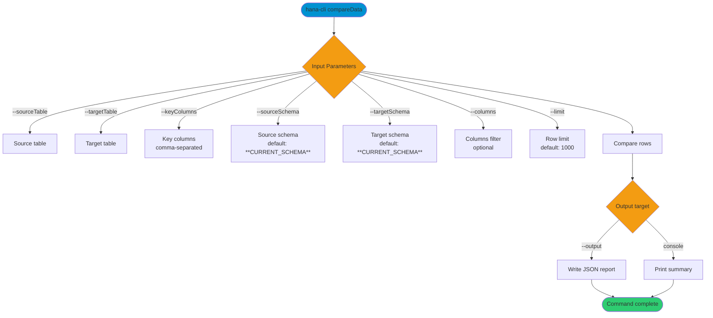

# compareData

> Command: `compareData`  
> Category: **Data Tools**  
> Status: Production Ready

## Description

Compare data between two tables (optionally across schemas) and surface matches, differences, and rows that exist only on one side. You provide the key columns used to align rows, and you can optionally filter the comparison to specific columns.

## Syntax

```bash
hana-cli compareData [options]
```

## Aliases

- `cmpdata`
- `compardata`
- `dataCompare`

## Command Diagram



## Parameters

### Positional Arguments

None.

### Options

| Option | Alias | Type | Default | Description |
| --- | --- | --- | --- | --- |
| `--sourceTable` | `--st` | string | - | Source table name to compare. |
| `--sourceSchema` | `--ss` | string | `**CURRENT_SCHEMA**` | Schema containing the source table. |
| `--targetTable` | `--tt` | string | - | Target table name to compare. |
| `--targetSchema` | `--ts` | string | `**CURRENT_SCHEMA**` | Schema containing the target table. |
| `--keyColumns` | `-k` | string | - | Key columns for matching rows (comma-separated). |
| `--columns` | `-c` | string | - | Specific columns to compare (comma-separated). |
| `--showMatches` | `--sm` | boolean | `false` | Include matching rows in console output. |
| `--output` | `-o` | string | - | Write a JSON report to a file path instead of console output. |
| `--limit` | `-l` | number | `1000` | Maximum rows to compare from each table. |
| `--timeout` | `--to` | number | `3600` | Operation timeout in seconds. |
| `--profile` | `-p` | string | - | CDS profile for connections. |

### Connection Parameters

| Option | Alias | Type | Default | Description |
| --- | --- | --- | --- | --- |
| `--admin` | `-a` | boolean | `false` | Connect via admin (default-env-admin.json). |
| `--conn` | - | string | - | Connection filename to override default-env.json. |

### Troubleshooting

| Option | Alias | Type | Default | Description |
| --- | --- | --- | --- | --- |
| `--disableVerbose` | `--quiet` | boolean | `false` | Disable verbose output for scripting. |
| `--debug` | `-d` | boolean | `false` | Debug hana-cli with detailed intermediate output. |

### Special Default Values

| Token | Resolves To | Description |
| --- | --- | --- |
| `**CURRENT_SCHEMA**` | Current user's schema | Used as default for `--sourceSchema` and `--targetSchema`. |

## Output

When `--output` is provided, the command writes a JSON report with a summary and three arrays: `differences`, `sourceOnly`, and `targetOnly`. When `--output` is not set, the command prints a summary to the console (and optionally matching rows when `--showMatches` is true).

## Interactive Mode

In interactive mode, you are prompted for:

| Parameter | Required | Prompted | Notes |
| --- | --- | --- | --- |
| `sourceTable` | Yes | Always | Source table to compare. |
| `sourceSchema` | No | Always | Defaults to current schema if omitted. |
| `targetTable` | Yes | Always | Target table to compare. |
| `targetSchema` | No | Always | Defaults to current schema if omitted. |
| `keyColumns` | Yes | Always | Comma-separated key columns. |
| `output` | No | Skipped | Use `--output` to write a file. |
| `columns` | No | Skipped | Use `--columns` to limit comparison. |
| `showMatches` | No | Skipped | Use `--showMatches` to include matches. |
| `limit` | No | Skipped | Use `--limit` to cap rows. |
| `timeout` | No | Skipped | Use `--timeout` to cap runtime. |
| `profile` | No | Always | Optional CDS profile. |

## Examples

```bash
hana-cli compareData --sourceTable table1 --targetTable table2
```

## Related Commands

See the [Commands Reference](../all-commands.md) for other commands in this category.

## See Also

- [Category: Data Tools](..)
- [All Commands A-Z](../all-commands.md)
