# compareData

> Command: `compareData`  
> Category: **System Tools**  
> Status: Production Ready

## Description

Compares data between two tables or schemas to identify differences. This is useful for data validation, reconciliation, and identifying changes between systems.

## Syntax

```bash
hana-cli compareData [options]
```

## Aliases

- `cmpdata`
- `compardata`
- `dataCompare`

## Command Diagram

```mermaid
graph TD
    A["<b>hana-cli compareData</b><br/>Compare data between tables"]
    
    A --> B["<b>Connection Parameters</b>"]
    A --> C["<b>Troubleshooting Options</b>"]
    A --> D["<b>Comparison Options</b>"]
    A --> E["<b>Output & Control</b>"]
    
    B --> B1["-a, --admin<br/>Connect via admin"]
    B --> B2["--conn<br/>Override default-env.json"]
    
    C --> C1["--disableVerbose, --quiet<br/>Disable verbose output"]
    C --> C2["-d, --debug<br/>Debug output"]
    
    D --> D1["-st, --sourceTable<br/>Source table name"]
    D --> D2["-ss, --sourceSchema<br/>DEFAULT: **CURRENT_SCHEMA**"]
    D --> D3["-tt, --targetTable<br/>Target table name"]
    D --> D4["-ts, --targetSchema<br/>DEFAULT: **CURRENT_SCHEMA**"]
    D --> D5["-k, --keyColumns<br/>Key columns for matching<br/>comma-separated"]
    D --> D6["-c, --columns<br/>Specific columns to compare<br/>comma-separated"]
    D --> D7["--showMatches, --sm<br/>Show matching rows"]
    
    E --> E1["-o, --output<br/>Report file path"]
    E --> E2["-l, --limit<br/>Max rows: 1000"]
    E --> E3["--timeout, --to<br/>Timeout in sec: 3600"]
    E --> E4["-p, --profile<br/>CDS Profile"]
    E --> E5["-h, --help<br/>Show help"]
    
    style A fill:#4CAF50,stroke:#2E7D32,color:#fff,stroke-width:3px
    style B fill:#2196F3,stroke:#1565C0,color:#fff
    style C fill:#FF9800,stroke:#E65100,color:#fff
    style D fill:#9C27B0,stroke:#6A1B9A,color:#fff
    style E fill:#F44336,stroke:#C62828,color:#fff
```



## Parameters

| Parameter | Type | Required | Default | Description |
| --------- | ---- | -------- | ------- | ----------- |
| **-st, --sourceTable** | string | Yes | - | Source table name to compare |
| **-tt, --targetTable** | string | Yes | - | Target table name to compare |
| **-k, --keyColumns** | string | Yes | - | Key columns for matching rows (comma-separated) |
| **-ss, --sourceSchema** | string | No | `**CURRENT_SCHEMA**` | Schema containing the source table |
| **-ts, --targetSchema** | string | No | `**CURRENT_SCHEMA**` | Schema containing the target table |
| **-c, --columns** | string | No | All common columns | Specific columns to compare (comma-separated) |
| **-o, --output** | string | No | - | Output report file path |
| **--showMatches, --sm** | boolean | No | `false` | Show matching row details in report |
| **-l, --limit** | number | No | `1000` | Maximum rows to compare from each table |
| **--timeout, --to** | number | No | `3600` | Operation timeout in seconds |
| **-p, --profile** | string | No | - | CDS profile for connections |
| **-a, --admin** | boolean | No | `false` | Connect via admin (default-env-admin.json) |
| **--conn** | string | No | - | Connection filename to override default-env.json |
| **--disableVerbose, --quiet** | boolean | No | `false` | Disable verbose output for scripting |
| **-d, --debug** | boolean | No | `false` | Debug hana-cli with detailed intermediate output |
| **-h, --help** | boolean | No | - | Show help information |

### Parameter Notes

- **Key columns must uniquely identify rows** for accurate matching
- **Schemas default to current schema** if not specified
- **Column filtering** includes only specified columns and their common columns
- **Timeout** applies to the entire comparison operation
- **Admin connection** requires default-env-admin.json file in current directory

For a complete list of parameters and options, use:

```bash
hana-cli compareData --help
```

## Output Format

The comparison report includes:

- **Matching rows**: Row count where key matches and all values are identical
- **Differences**: Rows with matching keys but different values, showing both versions
- **Source-only rows**: Rows present in source but not in target
- **Target-only rows**: Rows present in target but not in source
- **Summary statistics**: Total rows in each table, difference count

### Example Output

```json
{
  "comparison_summary": {
    "source_table": "EMPLOYEES",
    "source_schema": "PRODUCTION",
    "target_table": "EMPLOYEES",
    "target_schema": "STAGING",
    "key_columns": ["EMPLOYEE_ID"],
    "comparison_timestamp": "2026-03-02T14:35:22Z",
    "total_rows_source": 1250,
    "total_rows_target": 1248,
    "matching_rows": 1240,
    "rows_with_differences": 8,
    "source_only_rows": 2,
    "target_only_rows": 0
  },
  "matching_rows": {
    "count": 1240,
    "sample": [
      {
        "EMPLOYEE_ID": "E001",
        "status": "exact_match"
      },
      {
        "EMPLOYEE_ID": "E002",
        "status": "exact_match"
      }
    ]
  },
  "rows_with_differences": [
    {
      "key": {
        "EMPLOYEE_ID": "E003"
      },
      "source_values": {
        "EMPLOYEE_ID": "E003",
        "NAME": "John Smith",
        "SALARY": 85000,
        "DEPARTMENT": "Engineering",
        "HIRE_DATE": "2020-01-15"
      },
      "target_values": {
        "EMPLOYEE_ID": "E003",
        "NAME": "John Smith",
        "SALARY": 87500,
        "DEPARTMENT": "Engineering",
        "HIRE_DATE": "2020-01-15"
      },
      "differences": [
        {
          "column": "SALARY",
          "source": 85000,
          "target": 87500
        }
      ]
    },
    {
      "key": {
        "EMPLOYEE_ID": "E045"
      },
      "source_values": {
        "EMPLOYEE_ID": "E045",
        "NAME": "Jane Doe",
        "SALARY": 92000,
        "DEPARTMENT": "Marketing",
        "HIRE_DATE": "2019-06-20"
      },
      "target_values": {
        "EMPLOYEE_ID": "E045",
        "NAME": "Jane Doe",
        "SALARY": 92000,
        "DEPARTMENT": "Product Marketing",
        "HIRE_DATE": "2019-06-20"
      },
      "differences": [
        {
          "column": "DEPARTMENT",
          "source": "Marketing",
          "target": "Product Marketing"
        }
      ]
    }
  ],
  "source_only_rows": [
    {
      "key": {
        "EMPLOYEE_ID": "E210"
      },
      "values": {
        "EMPLOYEE_ID": "E210",
        "NAME": "Michael Brown",
        "SALARY": 78000,
        "DEPARTMENT": "Sales",
        "HIRE_DATE": "2021-03-10"
      }
    },
    {
      "key": {
        "EMPLOYEE_ID": "E211"
      },
      "values": {
        "EMPLOYEE_ID": "E211",
        "NAME": "Sarah Wilson",
        "SALARY": 81000,
        "DEPARTMENT": "Operations",
        "HIRE_DATE": "2021-05-15"
      }
    }
  ],
  "target_only_rows": []
}


## Examples

### 1. Basic Table Comparison

Compare two tables in the same schema:

```bash
hana-cli compareData -st EMPLOYEES -tt EMPLOYEES_ARCHIVE -k EMPLOYEE_ID
```

### 2. Cross-Schema Comparison

Compare tables from different schemas:

```bash
hana-cli compareData \
  -st CUSTOMERS -ss PRODUCTION \
  -tt CUSTOMERS -ts STAGING \
  -k CUSTOMER_ID
```

### 3. Multi-Column Key Matching

Use multiple columns to match rows:

```bash
hana-cli compareData \
  -st ORDERS -tt ORDERS_NEW \
  -k ORDER_ID,ORDER_DATE
```

### 4. Selective Column Comparison

Compare only specific columns:

```bash
hana-cli compareData \
  -st EMPLOYEES -tt EMPLOYEES_UPDATED \
  -k EMPLOYEE_ID \
  -c NAME,SALARY,DEPARTMENT
```

### 5. Comparison with Report Export

Save comparison results to file:

```bash
hana-cli compareData \
  -st SALES_DATA -tt SALES_DATA_BACKUP \
  -k TRANSACTION_ID \
  -o ./reports/sales_comparison.json
```

### 6. Show All Matching Rows

Include details of matching rows in report:

```bash
hana-cli compareData \
  -st DATA -tt DATA_COPY \
  -k ID \
  --showMatches true
```

### 7. Limited Scope Comparison

Compare only first 100 rows:

```bash
hana-cli compareData \
  -st BIG_TABLE -tt BIG_TABLE_NEW \
  -k ID \
  -l 100
```

## Use Cases

### Data Reconciliation

Verify that data migrated correctly to a new system:

```bash
hana-cli compareData \
  -st CUSTOMER_MASTER -ss LEGACY_SYSTEM \
  -tt CUSTOMER_MASTER -ts NEW_SYSTEM \
  -k CUSTOMER_ID \
  -o ./reports/reconciliation.json
```

### Change Detection

Identify what changed between two snapshots:

```bash
hana-cli compareData \
  -st PRODUCTS -tt PRODUCTS_SNAPSHOT \
  -k PRODUCT_ID \
  -c NAME,PRICE,STOCK_LEVEL
```

### Data Quality Checks

Compare current data with a known good version:

```bash
hana-cli compareData \
  -st TRANSACTIONS -tt TRANSACTIONS_VALIDATED \
  -k TRANSACTION_ID
```

## Performance Considerations

- **Use key columns wisely**: Choose columns that efficiently identify rows
- **Row limit**: Use `--limit` to restrict comparison scope for large tables
- **Column filtering**: Compare only necessary columns to reduce processing time
- **Timeout**: Increase for large dataset comparisons

## Tips and Best Practices

1. **Choose correct key columns**: Ensure key columns uniquely identify each row
2. **Start with limited scope**: Use `--limit` to test before full comparison
3. **Export results**: Save comparison reports for documentation and audit trails
4. **Regular reconciliation**: Schedule periodic comparisons for data integrity monitoring
5. **Multi-column keys**: Use composite keys when single column isn't unique

## Related Commands

- **`dataDiff`** - Show detailed row-level differences
- **`compareSchema`** - Compare database schema structures
- **`tables`** - List available tables
- **`inspectTable`** - View table structure

See the [Commands Reference](../all-commands.md) for other commands in this category.

## See Also

- [Category: System Tools](..)
- [All Commands A-Z](../all-commands.md)
