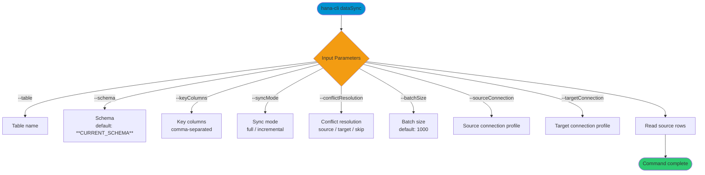

# dataSync

> Command: `dataSync`  
> Category: **Data Tools**  
> Status: Production Ready

## Description

Synchronize data between systems or tables by reading rows from a source table and applying a sync strategy. You supply key columns to match rows and can select a sync mode and conflict resolution strategy.

## Syntax

```bash
hana-cli dataSync [options]
```

## Aliases

- `datasync`
- `syncData`
- `sync`

## Command Diagram



## Parameters

### Positional Arguments

None.

### Options

| Option | Alias | Type | Default | Description |
| --- | --- | --- | --- | --- |
| `--sourceConnection` | `--sc` | string | - | Source connection profile. |
| `--targetConnection` | `--tc` | string | - | Target connection profile. |
| `--schema` | `-s` | string | `**CURRENT_SCHEMA**` | Schema name containing the table. |
| `--table` | `-t` | string | - | Table name to synchronize. |
| `--syncMode` | `-m` | string | `full` | Synchronization mode. Choices: `full`, `incremental`. |
| `--batchSize` | `-b` | number | `1000` | Number of rows to process in each batch. |
| `--conflictResolution` | `--cr` | string | `source` | Conflict resolution strategy. Choices: `source`, `target`, `skip`. |
| `--keyColumns` | `-k` | string | - | Key columns for row matching (comma-separated). |
| `--timeout` | `--to` | number | `3600` | Operation timeout in seconds. |
| `--profile` | `-p` | string | - | CDS profile for connections. |

### Connection Parameters

| Option | Alias | Type | Default | Description |
| --- | --- | --- | --- | --- |
| `--admin` | `-a` | boolean | `false` | Connect via admin (default-env-admin.json). |
| `--conn` | - | string | - | Connection filename to override default-env.json. |

### Troubleshooting

| Option | Alias | Type | Default | Description |
| --- | --- | --- | --- | --- |
| `--disableVerbose` | `--quiet` | boolean | `false` | Disable verbose output for scripting. |
| `--debug` | `-d` | boolean | `false` | Debug hana-cli with detailed intermediate output. |

### Special Default Values

| Token | Resolves To | Description |
| --- | --- | --- |
| `**CURRENT_SCHEMA**` | Current user's schema | Used as default for `--schema`. |

## Output

The command reports rows read and a summary table showing sync mode, rows synced, batch size, and conflict resolution strategy.

## Interactive Mode

In interactive mode, you are prompted for:

| Parameter | Required | Prompted | Notes |
| --- | --- | --- | --- |
| `schema` | No | Always | Defaults to current schema if omitted. |
| `table` | Yes | Always | Target table to synchronize. |
| `keyColumns` | Yes | Always | Comma-separated key columns. |
| `sourceConnection` | No | Skipped | Use `--sourceConnection` when needed. |
| `targetConnection` | No | Skipped | Use `--targetConnection` when needed. |
| `syncMode` | No | Skipped | Use `--syncMode` to switch modes. |
| `timeout` | No | Skipped | Use `--timeout` to cap runtime. |
| `profile` | No | Always | Optional CDS profile. |

## Examples

```bash
hana-cli dataSync --sourceConnection conn1 --targetConnection conn2 --table myTable
```

## Current Behavior Notes

The current implementation reads data from the source table and reports sync progress but does not yet apply changes to a target system. Options like `--targetConnection`, `--syncMode`, and `--conflictResolution` are accepted and reported in output but are not currently used to apply updates.

## Related Commands

See the [Commands Reference](../all-commands.md) for other commands in this category.

## See Also

- [Category: Data Tools](..)
- [All Commands A-Z](../all-commands.md)
