# dataSync

> Command: `dataSync`  
> Category: **Data Tools**  
> Status: Production Ready

## Description

Synchronizes data between systems or tables. This is useful for keeping development and production environments in sync, replicating data changes, and maintaining data consistency across systems.

## Syntax

```bash
hana-cli dataSync [options]
```

## Aliases

- `datasync`
- `syncData`
- `sync`

## Command Diagram

```mermaid
graph TD
    A["hana-cli dataSync<br/>(Synchronize data between systems or tables)"] --> B["Connection Parameters"]
    A --> C["Troubleshooting Options"]
    A --> D["Sync Configuration"]
    
    B --> B1["-a, --admin<br/>Connect via admin<br/>(default: false)"]
    B --> B2["--conn<br/>Connection Filename<br/>(override default-env.json)"]
    
    C --> C1["--disableVerbose, --quiet<br/>Disable verbose output<br/>(default: false)"]
    C --> C2["-d, --debug<br/>Debug output with details<br/>(default: false)"]
    
    D --> D1["--sourceConnection, --sc<br/>Source connection profile<br/>(string)"]
    D --> D2["--targetConnection, --tc<br/>Target connection profile<br/>(string)"]
    D --> D3["-s, --schema<br/>Schema name<br/>(default: **CURRENT_SCHEMA**)"]
    D --> D4["-t, --table<br/>Table name to synchronize<br/>(string)"]
    D --> D5["-m, --syncMode<br/>full | incremental<br/>(default: full)"]
    D --> D6["-b, --batchSize<br/>Batch size for processing<br/>(default: 1000)"]
    D --> D7["--conflictResolution, --cr<br/>source | target | skip<br/>(default: source)"]
    D --> D8["-k, --keyColumns<br/>Key columns for row matching<br/>(string)"]
    D --> D9["--timeout, --to<br/>Operation timeout (seconds)<br/>(default: 3600)"]
    D --> D10["-p, --profile<br/>CDS Profile<br/>(string)"]
    
    style A fill:#4a90e2,stroke:#2c5aa0,color:#fff
    style B fill:#7b68ee,stroke:#5a4a8a,color:#fff
    style C fill:#ff6b6b,stroke:#cc5555,color:#fff
    style D fill:#51cf66,stroke:#3d9b4a,color:#fff
```



## Parameters

| Flag | Long Form | Type | Description | Choices | Default | Required |
| --- | --- | --- | --- | --- | --- | --- |
| `-a` | `--admin` | boolean | Connect via admin (uses default-env-admin.json) | - | `false` | No |
| `-t` | `--table` | string | Table name to synchronize | - | - | **Yes** |
| `-k` | `--keyColumns` | string | Comma-separated key columns for row matching | - | - | **Yes** |
| `-sc` | `--sourceConnection` | string | Source connection profile or connection string | - | Current connection | No |
| `-tc` | `--targetConnection` | string | Target connection profile or connection string | - | Current connection | No |
| `-s` | `--schema` | string | Schema name containing the table | - | `**CURRENT_SCHEMA**` | No |
| `-m` | `--syncMode` | string | Synchronization mode | `full`, `incremental` | `full` | No |
| `-b` | `--batchSize` | number | Number of rows to process in each batch | - | `1000` | No |
| `-cr` | `--conflictResolution` | string | How to resolve conflicts | `source`, `target`, `skip` | `source` | No |
| `--to` | `--timeout` | number | Operation timeout in seconds | - | `3600` | No |
| `-p` | `--profile` | string | CDS connection profile | - | - | No |
| `-d` | `--debug` | boolean | Debug hana-cli with detailed output | - | `false` | No |
| `-h` | `--help` | boolean | Show help information | - | - | No |
| - | `--conn` | string | Connection filename to override default-env.json | - | - | No |
| - | `--disableVerbose` / `--quiet` | boolean | Disable verbose output for scripting | - | `false` | No |

For a complete list of parameters and options, use:

```bash
hana-cli dataSync --help
```

## Output Format

The command displays:

- Number of rows read from source
- Synchronization mode used
- Number of rows synchronized
- Batch size and conflict resolution strategy

Example output:

```bash
Starting data synchronization for PRODUCTION.CUSTOMERS
Read 15,432 rows from source table
Using full synchronization mode
Synchronization complete. 15,432 rows synced to table CUSTOMERS

┌──────────┬────────────────┬───────────┬─────────────┬────────────┬─────────────────────┐
│ TABLE    │ SCHEMA         │ SYNC_MODE │ ROWS_SYNCED │ BATCH_SIZE │ CONFLICT_RESOLUTION │
├──────────┼────────────────┼───────────┼─────────────┼────────────┼─────────────────────┤
│ CUSTOMERS│ PRODUCTION     │ full      │ 15432       │ 1000       │ source              │
└──────────┴────────────────┴───────────┴─────────────┴────────────┴─────────────────────┘
```

## Examples

### 1. Basic Full Synchronization

Synchronize all data in a table:

```bash
hana-cli dataSync -t CUSTOMERS -k CUSTOMER_ID
```

### 2. Incremental Synchronization

Sync only changes since last sync:

```bash
hana-cli dataSync \
  -t ORDERS \
  -k ORDER_ID \
  -m incremental
```

### 3. Cross-System Synchronization

Sync data between different systems:

```bash
hana-cli dataSync \
  -sc DEV_PROFILE \
  -tc PROD_PROFILE \
  -t PRODUCTS \
  -k PRODUCT_ID
```

### 4. Batch Processing

Process large tables in smaller batches:

```bash
hana-cli dataSync \
  -t TRANSACTIONS \
  -k TRANSACTION_ID \
  -b 5000
```

### 5. Conflict Resolution Strategy

Handle conflicts by preferring target values:

```bash
hana-cli dataSync \
  -t INVENTORY \
  -k ITEM_ID \
  -cr target
```

### 6. Schema-Specific Sync

Sync table in specific schema:

```bash
hana-cli dataSync \
  -s SALES_SCHEMA \
  -t MONTHLY_SALES \
  -k MONTH,REGION
```

## Use Cases

1. **Environment Synchronization**: Keep development environments in sync with production data
2. **Data Replication**: Replicate data changes between systems
3. **Disaster Recovery**: Sync data for backup and recovery purposes
4. **Testing**: Copy production data to test environments
5. **Data Migration**: Move data between different HANA instances
6. **Multi-Region Sync**: Maintain data consistency across geographical regions

## Notes

- Use `incremental` mode for better performance on large tables with timestamp columns
- Adjust `batchSize` based on table size and network performance
- Key columns must uniquely identify rows for proper matching
- Conflict resolution applies when same row exists in both source and target
- Consider using timeout parameter for very large synchronizations

## Related Commands

See the [Commands Reference](../all-commands.md) for other commands in this category.

## See Also

- [Category: Data Tools](..)
- [All Commands A-Z](../all-commands.md)
