# dataValidator

> Command: `dataValidator`  
> Category: **Data Tools**  
> Status: Production Ready

## Description

Validates data in HANA tables against business rules and constraints. It helps identify data quality issues by applying various validation rules to specified columns.

## Syntax

```bash
hana-cli dataValidator [options]
```

## Aliases

- `dval`
- `validateData`
- `dataValidation`

## Command Diagram

```mermaid
graph TD
    A["<b>hana-cli dataValidator</b><br/>Validate data against business rules and constraints"]
    
    A --> B["<b>Connection Parameters</b>"]
    A --> C["<b>Troubleshooting Options</b>"]
    A --> D["<b>Validation Configuration</b>"]
    A --> E["<b>Output & Control</b>"]
    
    B --> B1["-a, --admin<br/>Connect via admin<br/>(default: false)"]
    B --> B2["--conn<br/>Connection Filename<br/>(override default-env.json)"]
    
    C --> C1["--disableVerbose, --quiet<br/>Disable verbose output<br/>(default: false)"]
    C --> C2["-d, --debug<br/>Debug output with details<br/>(default: false)"]
    
    D --> D1["-t, --table<br/>Table Name to Validate<br/>(string)"]
    D --> D2["-s, --schema<br/>Schema for Table<br/>(default: **CURRENT_SCHEMA**)"]
    D --> D3["-r, --rules<br/>Validation Rules<br/>(column:rule format)"]
    D --> D4["--rulesFile, --rf<br/>Path to Validation Rules File<br/>(string)"]
    D --> D5["-c, --columns<br/>Columns to Validate<br/>(comma-separated, optional)"]
    
    E --> E1["-o, --output<br/>Output Report File Path<br/>(string)"]
    E --> E2["-f, --format<br/>Report Format<br/>(json, csv, summary, detailed)<br/>(default: json)"]
    E --> E3["-l, --limit<br/>Maximum Rows to Validate<br/>(default: 10000)"]
    E --> E4["--stopOnFirstError, --sfe<br/>Stop After First Error<br/>(default: false)"]
    E --> E5["--timeout, --to<br/>Operation Timeout (seconds)<br/>(default: 3600)"]
    E --> E6["-p, --profile<br/>CDS Profile<br/>(string)"]
    
    style A fill:#4a90e2,stroke:#2c5aa0,color:#fff,stroke-width:3px
    style B fill:#2196F3,stroke:#1565C0,color:#fff
    style C fill:#FF9800,stroke:#E65100,color:#fff
    style D fill:#9C27B0,stroke:#6A1B9A,color:#fff
    style E fill:#F44336,stroke:#C62828,color:#fff
```



## Parameters

| Option | Alias | Type | Default | Description |
| -------- | ------- | -------- | --------- | ------------- |
| `--table` | `-t` | string | required | Name of the table to validate |
| `--schema` | `-s` | string | optional | Schema name (uses current if omitted) |
| `--rules` | `-r` | string | auto (default preset) | Validation rules in format: `column:rule1,rule2;column2:rule3` |
| `--rulesFile` | `-rf` | string | optional | Path to file containing validation rules |
| `--columns` | `-c` | string | optional | Comma-separated list of specific columns to validate |
| `--output` | `-o` | string | optional | Output file path for the report |
| `--format` | `-f` | string | summary | Report format: `json`, `csv`, `summary`, `detailed` |
| `--limit` | `-l` | number | 10000 | Maximum number of rows to validate |
| `--stopOnFirstError` | `-sfe` | boolean | false | Stop validation after first error |
| `--timeout` | `-to` | number | 3600 | Operation timeout in seconds |
| `--profile` | `-p` | string | optional | Connection profile to use |

For a complete list of parameters and options, use:

```bash
hana-cli dataValidator --help
```

## Validation Rules

Rules are specified in the format: `column:rule1,rule2;column2:rule3`

Supported rules:

- `required` - Column must not be null or empty
- `numeric` - Column must contain numeric values
- `email` - Column must contain valid email addresses
- `date` - Column must contain valid dates
- `length:min:max` - Column value length must be between min and max
- `pattern:regex` - Column must match the specified regex pattern
- `range:min:max` - Numeric column must be between min and max

### Default rules preset

If you omit both `--rules` and `--rulesFile`, the command generates a default rules preset based on column names:

- Columns ending with `ID` or `_ID` → `required`
- Columns containing `EMAIL` → `email`
- Columns ending with `DATE`, `_AT`, or `_ON` → `date`
- Columns ending with `AMOUNT`, `PRICE`, `TOTAL`, `COUNT`, `QTY`, or `QUANTITY` → `numeric`

If no columns match these patterns, the first column is validated as `required`.

## Rules File Format

Create a text file with validation rules, one rule per line or use semicolons to separate:

```bash
email:required,email
firstName:required,length:1:50
lastName:required,length:1:50
age:numeric,range:18:120
zipcode:pattern:^\d{5}(-\d{4})?$
```

## Output Formats

### Summary (default)

```bash
Data Validation Report
=======================

Total Rows:  1000
Valid Rows:  950
Invalid Rows: 50
Total Errors: 75

Errors:
  Row 15, Column email: Column email must be valid email
  Row 27, Column name: Column name is required
  ...
```

### JSON

```json
{
  "totalRows": 1000,
  "validRows": 950,
  "invalidRows": 50,
  "totalErrors": 75,
  "errors": [
    {
      "rowNumber": 15,
      "column": "email",
      "value": "invalid-email",
      "rule": "email",
      "error": "Column email must be valid email"
    }
  ]
}
```

### CSV

```csv
Row,Column,Value,Rule,Error
15,"email","invalid@email","email","Column email must be valid email"
27,"name","","required","Column name is required"
```

## Examples

### Simple validation

```bash
hana-cli dataValidator --table EMPLOYEES --schema HR --rules "name:required;salary:numeric"
```

### Complex validation with multiple rules

```bash
hana-cli dataValidator --table CUSTOMERS \
  --rules "email:required,email;firstName:required,length:1:50;age:numeric,range:18:120" \
  --format json \
  --output validation-report.json
```

### Validation from file

```bash
hana-cli dataValidator --table ORDERS --rulesFile ./validation-rules.txt --limit 50000
```

### Use default rules preset

```bash
hana-cli dataValidator --table CUSTOMERS --schema SALES
```

### Stop on first error

```bash
hana-cli dataValidator --table PRODUCTS --rules "sku:required;price:numeric" --stopOnFirstError
```

## Return Codes

- `0` - Validation completed successfully
- `1` - Validation error or database connection issue

## Performance Tips

1. Use `--limit` parameter to validate a subset of rows first
2. Use `--stopOnFirstError` to quickly identify issues
3. Specify only required columns with `--columns` to reduce processing
4. Use `--timeout` to prevent long-running validations

## Integration with CI/CD

Use the JSON format output for automated validation in pipelines:

```bash
hana-cli dataValidator --table EMPLOYEES \
  --rules "email:email" \
  --format json \
  --output validation.json

# Check result
if [ -s validation.json ]; then
  echo "Validation errors found"
  exit 1
fi
```

## Related Commands

- `dataProfile` - Generate statistical profiles of table data
- `dataDiff` - Compare data between two tables
- `duplicateDetection` - Find duplicate records

See the [Commands Reference](../all-commands.md) for other commands in this category.

## See Also

- [Category: Data Tools](..)
- [All Commands A-Z](../all-commands.md)
